Core Schema Generation is the foundational system in Pydantic that converts Python type annotations into schema representations that can be used for validation, serialization, and documentation. This process is essential for Pydantic's type validation capabilities and forms the bridge between Python's type system and Pydantic's runtime validation logic. For information about how these schemas are then converted to JSON Schema, see [JSON Schema Generation](#5.2).

## Overview

At its heart, Core Schema Generation takes Python type annotations and transforms them into a structured schema representation that pydantic-core (Pydantic's underlying validation engine written in Rust) can understand and use for validation. This transformation enables Pydantic to perform efficient validation while maintaining Python's type hinting semantics.

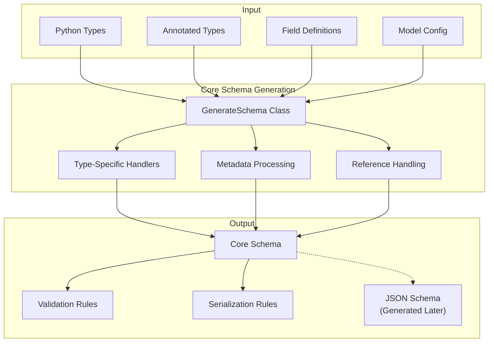

Sources: 
- [pydantic/_internal/_generate_schema.py:318-342]()
- [pydantic/_internal/_generate_schema.py:679-716]()

## The GenerateSchema Class

The `GenerateSchema` class is the central component responsible for transforming Python types into core schemas. It provides methods for handling different Python types and constructing appropriate schema representations.

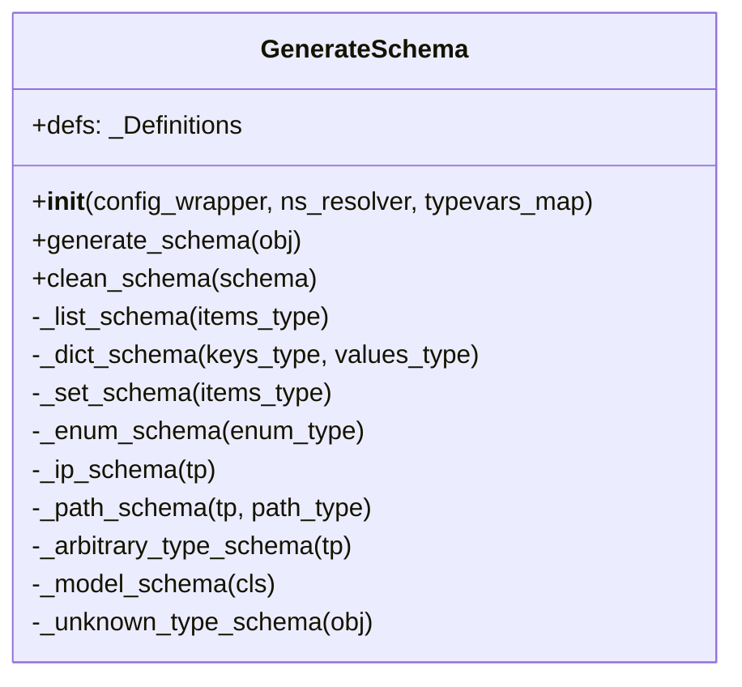

The `generate_schema` method is the main entry point that dispatches to type-specific handlers based on the input object. The class also maintains state such as a stack of models being processed (to handle recursive references) and definitions being generated.

Sources:
- [pydantic/_internal/_generate_schema.py:318-342]()
- [pydantic/_internal/_generate_schema.py:679-716]()
- [pydantic/_internal/_generate_schema.py:366-377]()

## Schema Generation Process

The schema generation process follows several steps to convert Python types into a complete core schema:

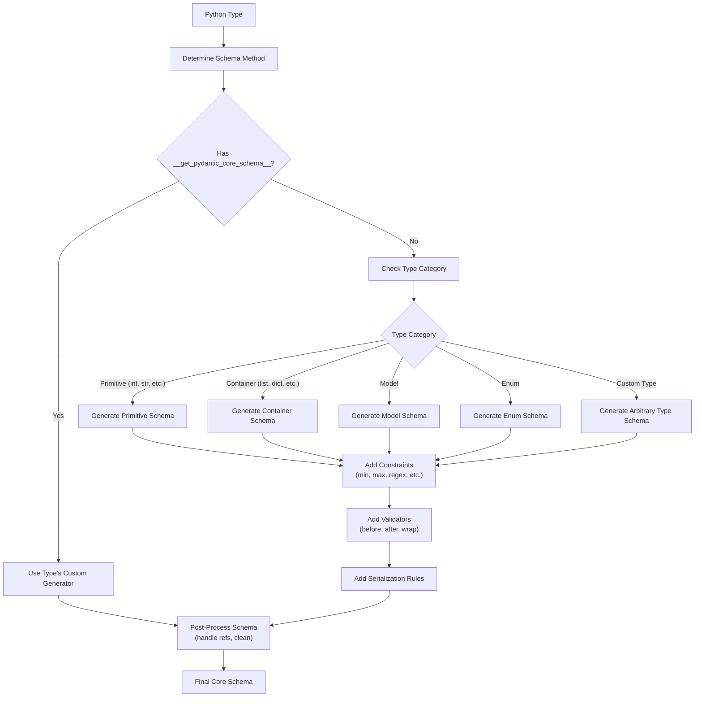

Sources:
- [pydantic/_internal/_generate_schema.py:679-716]()
- [pydantic/_internal/_generate_schema.py:843-889]()
- [pydantic/_internal/_generate_schema.py:718-843]()

## Core Schema Types

Pydantic uses a variety of schema types to represent different Python types and validation rules. These schemas form a hierarchy with specialized validations for each type.

```mermaid
flowchart TB
    CoreSchema["Core Schema"] --> PrimitiveSchemas["Primitive Schemas"]
    CoreSchema --> ContainerSchemas["Container Schemas"]
    CoreSchema --> ModelSchemas["Model Schemas"]
    CoreSchema --> UtilitySchemas["Utility Schemas"]
    
    PrimitiveSchemas --> StrSchema["str_schema"]
    PrimitiveSchemas --> IntSchema["int_schema"]
    PrimitiveSchemas --> FloatSchema["float_schema"]
    PrimitiveSchemas --> BoolSchema["bool_schema"]
    PrimitiveSchemas --> DateSchema["date_schema"]
    PrimitiveSchemas --> TimeSchema["time_schema"]
    
    ContainerSchemas --> ListSchema["list_schema"]
    ContainerSchemas --> TupleSchema["tuple_schema"]
    ContainerSchemas --> SetSchema["set_schema"]
    ContainerSchemas --> DictSchema["dict_schema"]
    
    ModelSchemas --> ModelFieldsSchema["model_fields_schema"]
    ModelSchemas --> ModelSchema["model_schema"]
    
    UtilitySchemas --> UnionSchema["union_schema"]
    UtilitySchemas --> TaggedUnionSchema["tagged_union_schema"]
    UtilitySchemas --> NullableSchema["nullable_schema"]
    UtilitySchemas --> FunctionSchema["function_schema"]
    UtilitySchemas --> RefSchema["definition_reference_schema"]
```

Sources:
- [pydantic/_internal/_generate_schema.py:366-419]()
- [pydantic/_internal/_generate_schema.py:449-482]()
- [pydantic/_internal/_generate_schema.py:565-602]()

## Type-Specific Schema Generation

Different Python types require specialized schema generation logic. Here are some key schema generation methods:

### Primitive Types

For primitive types like strings, integers, and floats, the schema generation is relatively straightforward, with additions for constraints like minimum/maximum values or string patterns.

### Container Types

For container types like lists, dictionaries, and sets, the schema generation recursively processes the contained types:

```python
def _list_schema(self, items_type: Any) -> CoreSchema:
    return core_schema.list_schema(self.generate_schema(items_type))

def _dict_schema(self, keys_type: Any, values_type: Any) -> CoreSchema:
    return core_schema.dict_schema(self.generate_schema(keys_type), self.generate_schema(values_type))
```

Sources: 
- [pydantic/_internal/_generate_schema.py:366-377]()

### Special Types

Special types like IP addresses, paths, and fractions have custom schema generation logic:

```python
def _ip_schema(self, tp: Any) -> CoreSchema:
    # Custom schema for IP types with appropriate serialization
    # ...
```

Sources:
- [pydantic/_internal/_generate_schema.py:450-481]()
- [pydantic/_internal/_generate_schema.py:482-539]()
- [pydantic/_internal/_generate_schema.py:604-619]()

### Models

For Pydantic models, the schema generation process is more complex, involving:
1. Collecting field information
2. Processing validators and serializers
3. Handling inheritance and generics
4. Creating the appropriate model schema

```python
def _model_schema(self, cls: type[BaseModel]) -> core_schema.CoreSchema:
    # Complex logic for generating model schema
    # ...
```

Sources:
- [pydantic/_internal/_generate_schema.py:718-842]()

## Handling Discriminated Unions

Pydantic supports discriminated unions, which are unions of models that can be distinguished by a "discriminator" field. This enables more efficient validation and better error messages.

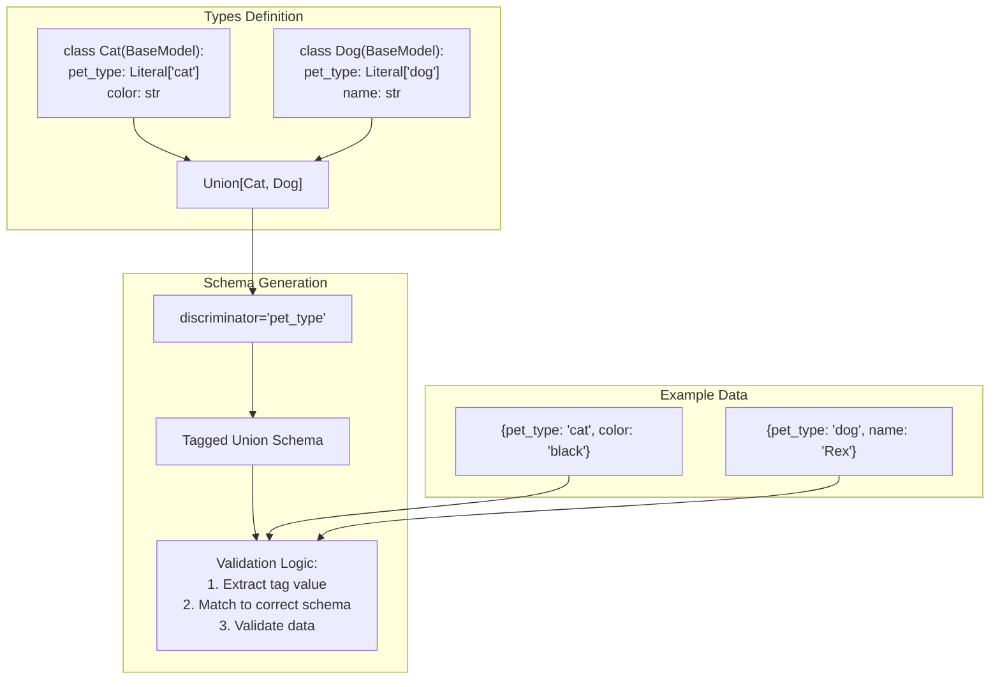

Sources:
- [pydantic/_internal/_discriminated_union.py:34-68]()
- [pydantic/_internal/_discriminated_union.py:140-168]()
- [tests/test_discriminated_union.py:94-141]()

## Metadata Processing

Type annotations can include metadata that affects schema generation. This is particularly relevant for `Annotated` types and field constraints.

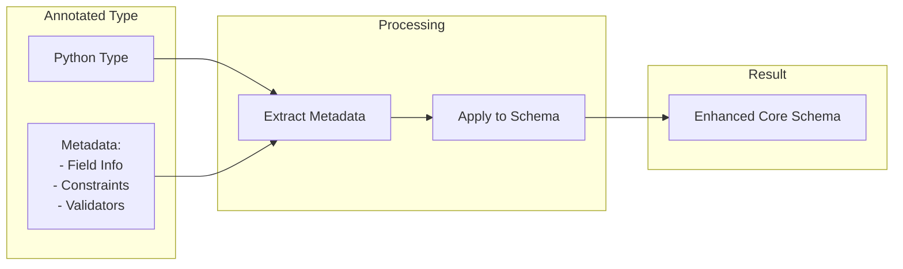

Metadata can come from various sources:
- Field constraints (min_length, max_length, etc.)
- Validators (before, after, wrap validators)
- Field descriptions and examples
- Custom schema transformations

Sources:
- [pydantic/_internal/_known_annotated_metadata.py:168-329]()
- [tests/test_annotated.py:28-134]()

## Reference Handling

Core schema generation deals with references between types, which is especially important for recursive or self-referential models.

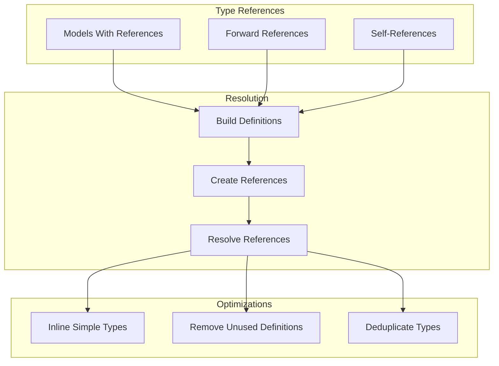

Sources:
- [pydantic/_internal/_core_utils.py:67-102]()
- [pydantic/_internal/_generate_schema.py:722-736]()
- [tests/test_internal.py:23-139]()

## Schema Cleaning and Finalization

Before the schema is used, it undergoes cleaning and finalization processes:

1. Resolving definition references
2. Validating the schema structure
3. Removing unnecessary complexities
4. Optimizing for performance

```python
def clean_schema(self, schema: CoreSchema) -> CoreSchema:
    schema = self.defs.finalize_schema(schema)
    schema = validate_core_schema(schema)
    return schema
```

Sources:
- [pydantic/_internal/_generate_schema.py:664-666]()
- [pydantic/_internal/_core_utils.py:112-115]()

## Integration with JSON Schema Generation

Once a core schema is generated, it can be used to create a JSON Schema representation. This is a separate process handled by the `GenerateJsonSchema` class and is covered in [JSON Schema Generation](#5.2).

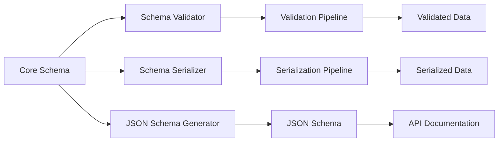

Sources:
- [pydantic/json_schema.py:216-426]()
- [pydantic/_internal/_generate_schema.py:706-716]()

## Customizing Core Schema Generation

Types can customize their core schema generation by implementing the `__get_pydantic_core_schema__` method, which allows for complete control over how a type is validated and serialized.

```python
@classmethod
def __get_pydantic_core_schema__(
    cls, 
    source_type: Any, 
    handler: GetCoreSchemaHandler
) -> core_schema.CoreSchema:
    # Custom schema generation logic
    # ...
```

Sources:
- [tests/test_annotated.py:198-249]()
- [pydantic/_internal/_generate_schema.py:843-889]()

## Conclusion

Core Schema Generation is the fundamental process that enables Pydantic's validation capabilities. By converting Python types into a structured schema representation, it creates a bridge between Python's static type system and runtime validation logic. This system is highly extensible, allowing for custom validation rules, serialization behaviors, and schema transformations.

The generated core schemas are used throughout Pydantic for validation, serialization, and documentation generation, making this system central to Pydantic's functionality.

# JSON Schema Generation


This document explains how Pydantic generates JSON Schema from models and types. JSON Schema is a vocabulary that allows you to annotate and validate JSON documents, which is useful for API documentation, client code generation, and validation in different environments. For information about internal core schema generation, see [Core Schema Generation](#5.1).

## Overview

Pydantic provides built-in JSON Schema generation capabilities for its models and types. The generated JSON Schema documents describe the expected structure, types, constraints, and other metadata for validation and serialization purposes.

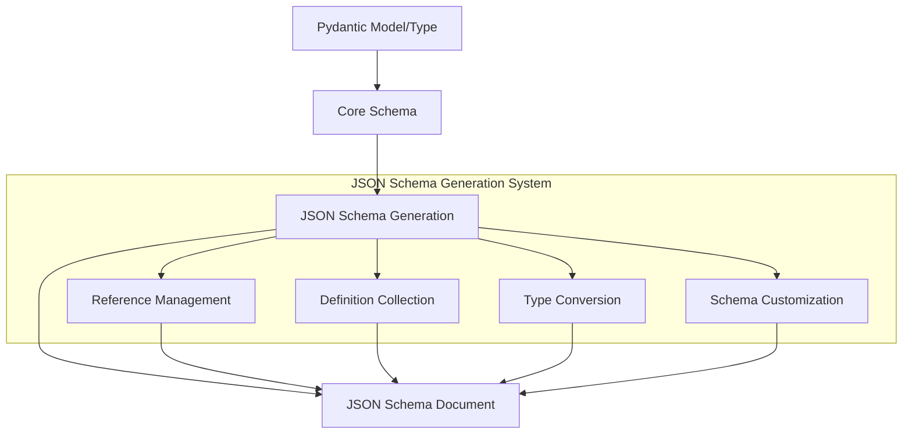

Sources: [pydantic/json_schema.py:216-427](pydantic/json_schema.py)

## Architecture

The JSON Schema generation system centers around the `GenerateJsonSchema` class, which handles the entire process of converting Pydantic core schemas into standard JSON Schema documents.

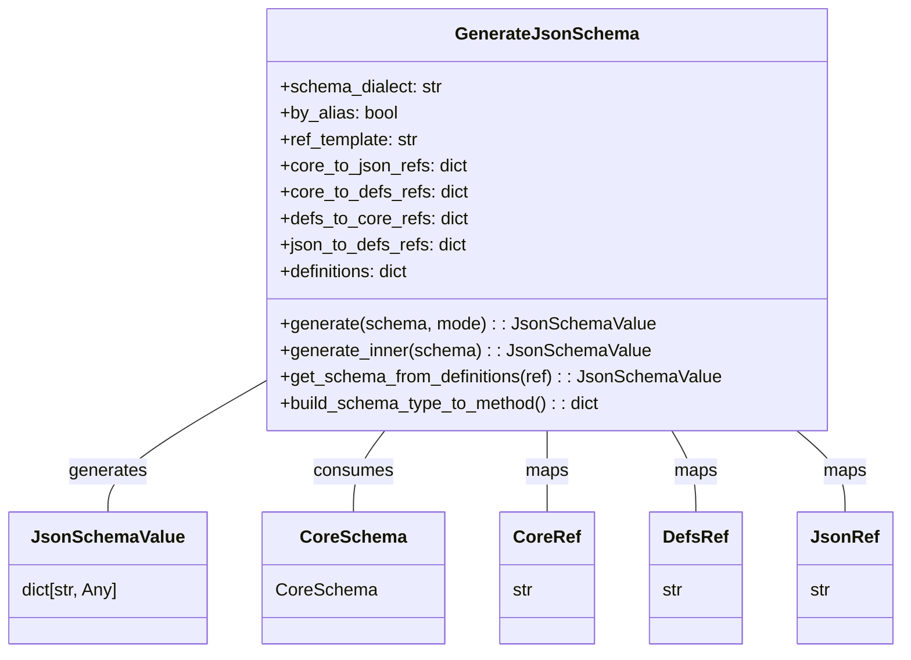

Sources: [pydantic/json_schema.py:216-390](pydantic/json_schema.py)

### Key Components

1. **GenerateJsonSchema**: The main class responsible for converting core schemas to JSON Schema documents
2. **Reference Management System**: Handles schema references to avoid duplication and circular dependencies
3. **Schema Mode Handling**: Supports both 'validation' and 'serialization' modes
4. **Type Mapping**: Converts Pydantic types to their JSON Schema equivalents

### JSON Schema Generation Flow

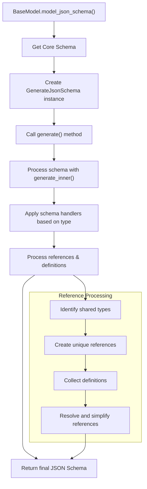

Sources: [pydantic/json_schema.py:378-425](pydantic/json_schema.py)

## Reference System

The JSON Schema generator uses a sophisticated reference system to handle complex type references, avoid duplication, and manage circular dependencies.

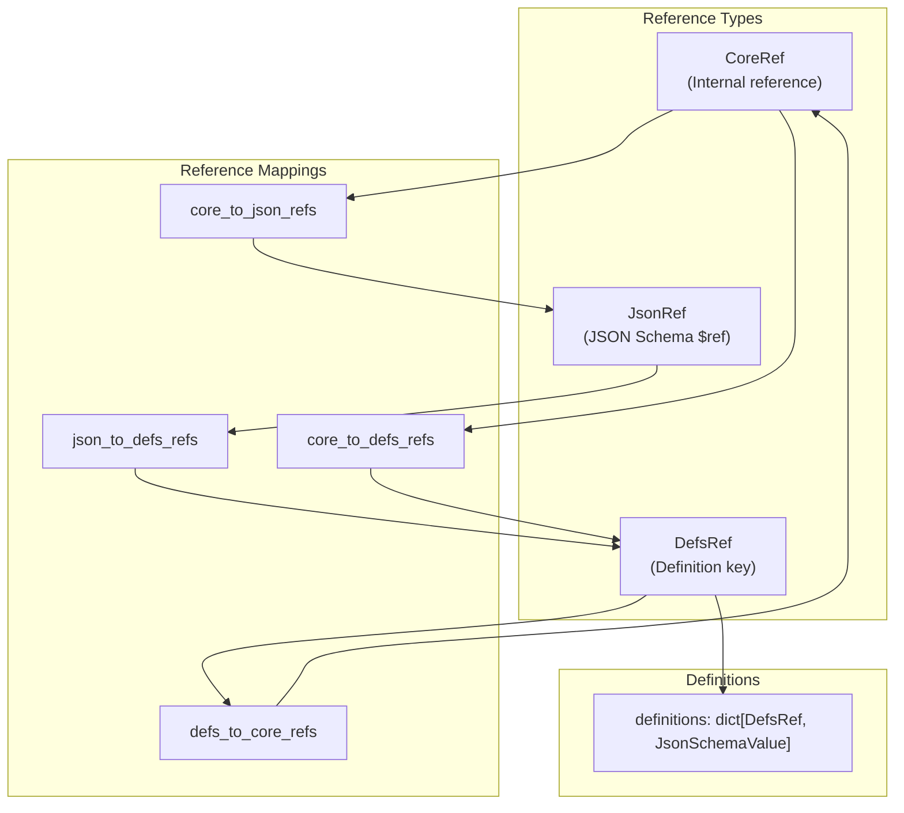

Sources: [pydantic/json_schema.py:119-139](pydantic/json_schema.py), [pydantic/json_schema.py:258-264](pydantic/json_schema.py)

When Pydantic encounters the same type multiple times (such as a model used in different places), it creates a schema definition and uses references to avoid duplication:

1. **CoreRef**: Internal identifier for a core schema
2. **DefsRef**: Name of the type in the definitions dictionary
3. **JsonRef**: JSON Schema `$ref` value (e.g., `#/$defs/User`)

### Reference Template

By default, references use the format `#/$defs/{model}`, but this can be customized with the `ref_template` parameter:

```python
schema = User.model_json_schema(ref_template="https://example.com/schemas/{model}.json")
```

Sources: [pydantic/json_schema.py:116-117](pydantic/json_schema.py), [tests/test_json_schema.py:143-178](tests/test_json_schema.py)

## Schema Modes

Pydantic supports two modes for JSON Schema generation:

| Mode | Description | Use Case |
|------|-------------|----------|
| `validation` | Schema for input validation | Describes what input data should look like |
| `serialization` | Schema for serialized output | Describes what model.model_dump() produces |

The modes are important because some types have different representations for validation vs. serialization:

```python
model_json_schema_validation = Model.model_json_schema(mode='validation')
model_json_schema_serialization = Model.model_json_schema(mode='serialization')
```

Sources: [pydantic/json_schema.py:79-87](pydantic/json_schema.py), [tests/test_json_schema.py:524-542](tests/test_json_schema.py)

## Customizing JSON Schema Generation

Pydantic offers several ways to customize the generated JSON Schema:

### Model Configuration

Use the `model_config` with `json_schema_extra` to add custom attributes to the schema:

```python
class User(BaseModel):
    model_config = {"json_schema_extra": {"examples": [{"name": "John"}]}}
```

Sources: [tests/test_json_schema.py:448-457](tests/test_json_schema.py)

### Field Customization

Fields support various JSON Schema attributes directly:

```python
class User(BaseModel):
    name: str = Field(
        title="Full Name",
        description="User's full name",
        min_length=1,
        examples=["John Doe"]
    )
```

Sources: [tests/test_json_schema.py:226-245](tests/test_json_schema.py)

### Type-Level Customization

Custom types can implement `__get_pydantic_json_schema__` to control their schema representation:

```python
class MyType:
    @classmethod
    def __get_pydantic_json_schema__(
        cls, core_schema: CoreSchema, handler: GetJsonSchemaHandler
    ) -> JsonSchemaValue:
        json_schema = handler(core_schema)
        json_schema.update({"format": "my-special-format"})
        return json_schema
```

Sources: [tests/test_json_schema.py:292-330](tests/test_json_schema.py)

## Common JSON Schema Features

### Field Aliases

When using field aliases, schemas can be generated by alias or by attribute name:

```python
class Model(BaseModel):
    field_name: str = Field(alias="fieldName")