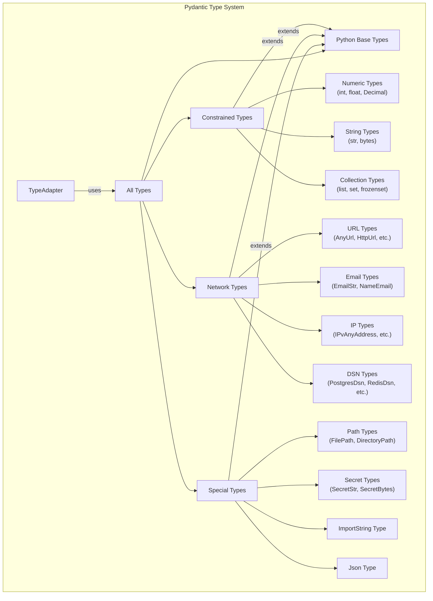
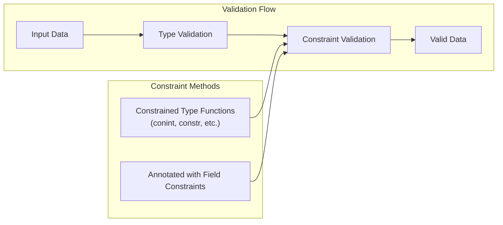

config_defaults = {
    'title': None,
    'str_to_lower': False,
    'str_to_upper': False,
    'str_strip_whitespace': False,
    'extra': None,
    'frozen': False,
    'validate_assignment': False,
    'arbitrary_types_allowed': False,
    'from_attributes': False,
    # And many more...
}
```

Sources: [pydantic/_internal/_config.py:261-307]()

The full list of configuration options and their default values can be found in the `config_defaults` dictionary in [pydantic/_internal/_config.py:261-307]().

## Configuring Non-BaseModel Types

In addition to configuring `BaseModel` subclasses, you can also apply Pydantic configurations to other types:

### TypedDict

```python
from typing_extensions import TypedDict
from pydantic import TypeAdapter, with_config, ConfigDict

@with_config(ConfigDict(str_to_lower=True))
class UserDict(TypedDict):
    name: str

# Configuration is used when validating
adapter = TypeAdapter(UserDict)
result = adapter.validate_python({'name': 'JOHN'})
assert result['name'] == 'john'  # Converted to lowercase
```

Sources: [pydantic/config.py:1157-1182]()

### Dataclasses

```python
from pydantic.dataclasses import dataclass
from pydantic import ConfigDict

@dataclass(config=ConfigDict(validate_assignment=True))
class User:
    name: str
    age: int
```

Sources: [tests/test_config.py:738-760]()

By effectively using Pydantic's configuration system, you can fine-tune validation, serialization, and schema generation to meet your application's specific requirements.

# Type System


Pydantic's type system provides specialized types for data validation, offers constrainable versions of standard Python types, and implements network-related and other utility types. This document explains the architecture and components of Pydantic's type system, how to use built-in types, and how to extend the system with custom types.

For information about validation and serialization using these types, see [Validation and Serialization](#4). For details about the schema generation process, see [Schema Generation](#5).

## Type System Architecture

Pydantic's type system extends Python's built-in type system to provide additional validation capabilities. It consists of several key components:



Sources: [pydantic/types.py:1-110]()</small>, [pydantic/networks.py:1-67]()

## Core Type Concepts

### Constrained Types and Annotations

Pydantic supports two approaches for adding constraints to types:

1. **Constrained Type Functions**: Functions like `conint()`, `constr()`, etc.
2. **Annotated with Field Constraints**: Using Python's `Annotated` with field constraints



Sources: [pydantic/types.py:111-146](), [pydantic/types.py:147-219](), [pydantic/types.py:661-685]()

The two approaches serve the same purpose with different syntax:

```