FormattedInt = Annotated[int, PlainSerializer(lambda x: f"{x:,}", return_type=str)]

class MyModel(BaseModel):
    count: FormattedInt
```

The `PlainSerializer` class accepts:

- `func`: The serializer function
- `return_type`: The return type of the serializer (optional)
- `when_used`: When the serializer should be applied (optional)

Sources:
- [tests/test_serialize.py:82-102](tests/test_serialize.py:82-102)
- [pydantic/functional_serializers.py:18-86](pydantic/functional_serializers.py:18-86)

### WrapSerializer

```python
from typing import Annotated
from pydantic import BaseModel, WrapSerializer

def wrap_serialize(value: int, handler: SerializerFunctionWrapHandler) -> str:
    # Process the value, then let the handler handle it
    new_value = value + 1
    return f"{handler(new_value):,}"

ModifiedInt = Annotated[int, WrapSerializer(wrap_serialize)]

class MyModel(BaseModel):
    count: ModifiedInt
```

The `WrapSerializer` class accepts:

- `func`: The serializer function (which receives both a value and a handler)
- `return_type`: The return type of the serializer (optional)
- `when_used`: When the serializer should be applied (optional)

Sources:
- [tests/test_serialize.py:104-129](tests/test_serialize.py:104-129)
- [pydantic/functional_serializers.py:89-247](pydantic/functional_serializers.py:89-247)

## Model Serializers

Model serializers allow you to customize the serialization of an entire model. This is useful when you need complete control over the serialization process.

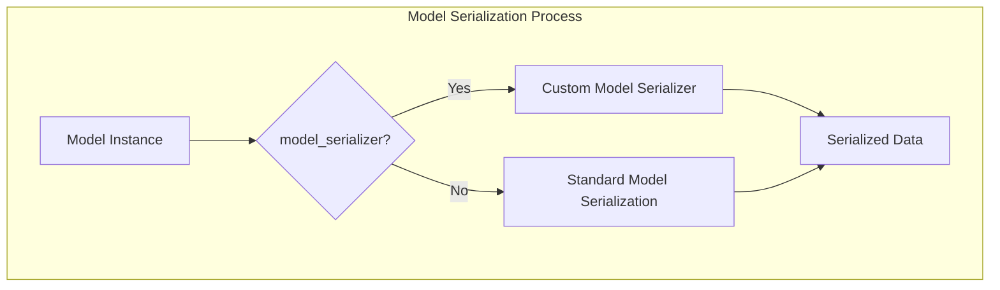

### Using the model_serializer Decorator

The `@model_serializer` decorator is used to define custom serialization logic for an entire model:

```python
class MyModel(BaseModel):
    a: int
    b: str
    
    @model_serializer
    def serialize_model(self) -> dict:
        return {
            'a': self.a * 2,
            'b': self.b.upper()
        }
```

The decorator accepts:

- `mode`: Serialization mode (`"plain"` or `"wrap"`)
- `when_used`: When the serializer should be applied
- `return_type`: The return type of the serializer function (optional)

Sources:
- [tests/test_serialize.py:374-464](tests/test_serialize.py:374-464)
- [pydantic/_internal/_decorators.py:113-130](pydantic/_internal/_decorators.py:113-130)

### Model Serializer Modes

Model serializers can operate in two modes:

1. **Plain mode**: The serializer has complete control over the serialization process
   ```python
   @model_serializer
   def serialize_model(self) -> dict:
       return {'custom': 'output'}
   ```

2. **Wrap mode**: The serializer receives the standard serialized output and can modify it
   ```python
   @model_serializer(mode='wrap')
   def serialize_model(self, handler) -> dict:
       data = handler(self)
       data['extra'] = 'value'
       return data
   ```

In wrap mode, the handler function performs the standard serialization, allowing you to modify the result before returning it.

Sources:
- [tests/test_serialize.py:374-422](tests/test_serialize.py:374-422)
- [tests/test_serialize.py:423-464](tests/test_serialize.py:423-464)

## Serialization Process

The serialization process in Pydantic involves converting model instances to Python dictionaries or JSON strings. This is handled by the `model_dump()` and `model_dump_json()` methods.

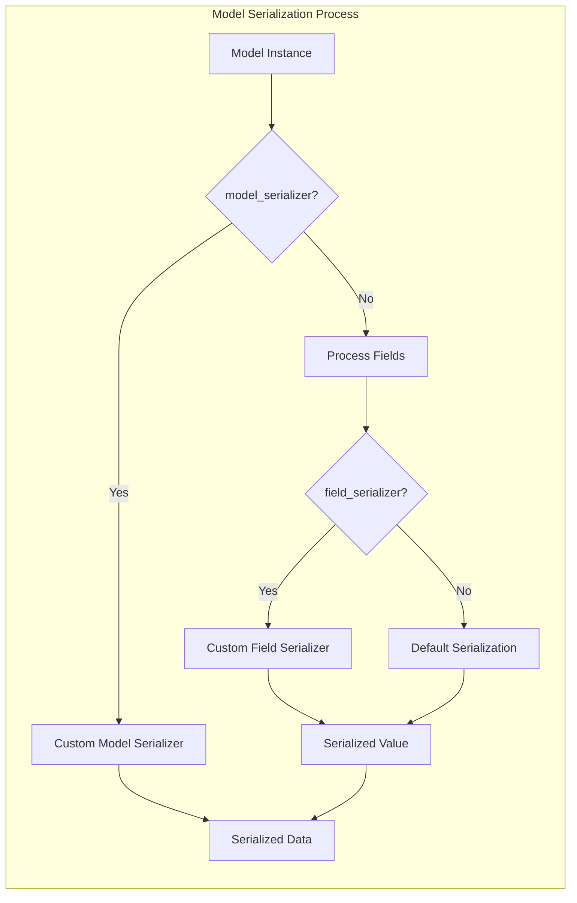

### Core Serialization Methods

Pydantic models provide two main methods for serialization:

1. **model_dump()**: Converts a model instance to a Python dictionary
2. **model_dump_json()**: Converts a model instance to a JSON string

These methods accept various parameters:

- `mode`: Serialization mode (`"python"` or `"json"`)
- `include`: Fields to include in the output
- `exclude`: Fields to exclude from the output
- `by_alias`: Whether to use field aliases
- `exclude_unset`: Whether to exclude unset fields
- `exclude_defaults`: Whether to exclude fields with default values
- `exclude_none`: Whether to exclude None values
- `round_trip`: Whether to preserve exact types for round-trip conversions

Sources:
- [tests/test_serialize.py:33-79](tests/test_serialize.py:33-79)
- [pydantic/type_adapter.py:376-535](pydantic/type_adapter.py:376-535)

### Serialization in TypeAdapter

The `TypeAdapter` class provides similar serialization functionality for arbitrary types:

- `dump_python()`: Serializes a value to a Python object
- `dump_json()`: Serializes a value to a JSON string

These methods have similar parameters to the model serialization methods.

Sources:
- [pydantic/type_adapter.py:519-584](pydantic/type_adapter.py:519-584)

### Serialization with Computed Fields

Computed fields (defined using the `@computed_field` decorator) are included in serialization by default:

```python
class Rectangle(BaseModel):
    width: int
    length: int
    
    @computed_field
    def area(self) -> int:
        return self.width * self.length
```

When serializing a `Rectangle` instance, the `area` field will be included in the output.

Sources:
- [tests/test_computed_fields.py:27-66](tests/test_computed_fields.py:27-66)

## Advanced Serialization Techniques

### Conditional Serialization

You can conditionally apply serializers based on the serialization mode:

```python
class MyModel(BaseModel):
    x: int
    
    @field_serializer('x', when_used='json')
    def format_x_for_json(self, value: int) -> str:
        return f"{value:,}"
```

In this example, the serializer is only applied when serializing to JSON.

Sources:
- [tests/test_serialize.py:171-182](tests/test_serialize.py:171-182)

### Serialization in Dataclasses

Pydantic's dataclasses support the same serialization features as models:

```python
@pydantic_dataclass
class MyDataclass:
    x: int
    
    @field_serializer('x')
    def serialize_x(self, value: int) -> str:
        return f"{value:,}"
```

Sources:
- [pydantic/dataclasses.py:170-180](pydantic/dataclasses.py:170-180)
- [tests/test_dataclasses.py:1220-1272](tests/test_dataclasses.py:1220-1272)

### Root Model Serialization

`RootModel` instances are serialized to their root value rather than a dictionary:

```python
class MyRootModel(RootModel[dict[str, int]]):
    @model_serializer
    def serialize_model(self) -> dict[str, str]:
        return {k: f"{v:,}" for k, v in self.root.items()}
```

Sources:
- [pydantic/root_model.py:119-146](pydantic/root_model.py:119-146)

## Integration with pydantic-core

Pydantic uses `pydantic-core` for the actual serialization logic. The `SchemaSerializer` class from `pydantic-core` handles the serialization process.

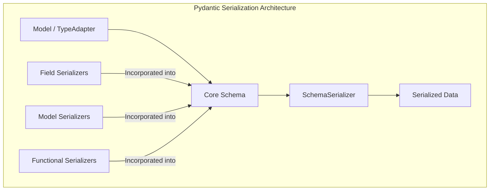

During model definition, Pydantic generates a serialization schema that incorporates all custom serializers. This schema is then used by `pydantic-core` to perform the actual serialization.

Sources:
- [pydantic/_internal/_schema_generation_shared.py:1-142](pydantic/_internal/_schema_generation_shared.py:1-142)
- [pydantic/_internal/_mock_val_ser.py:1-69](pydantic/_internal/_mock_val_ser.py:1-69)

### Deferred Building and Mocking

Pydantic supports deferred building of serializers. When `defer_build=True` is set in the config, Pydantic creates mock serializers that are replaced with real serializers when needed.

This allows for forward references and circular dependencies in models:

```python
class Model(BaseModel):
    model_config = ConfigDict(defer_build=True)
    circular: Optional['Model'] = None

Model.model_rebuild()  # Rebuild the model when all types are defined
```

Sources:
- [pydantic/_internal/_mock_val_ser.py:70-110](pydantic/_internal/_mock_val_ser.py:70-110)
- [pydantic/_internal/_dataclasses.py:128-134](pydantic/_internal/_dataclasses.py:128-134)

## Best Practices for Serializers

1. **Choose the right serializer type**:
   - Use field serializers for customizing individual fields
   - Use model serializers for complex model-level serialization
   - Use functional serializers for reusable serialization logic

2. **Respect the serialization mode**:
   - Use the `info.mode` parameter to adjust behavior based on the serialization mode
   - Use `when_used` to apply serializers only in specific scenarios

3. **Be mindful of performance**:
   - Use plain serializers for simple transformations
   - Use wrap serializers when you need to modify the default serialization behavior

4. **Handle None values appropriately**:
   - Use `when_used='unless-none'` to skip serialization of None values
   - Explicitly handle None values in your serializers to avoid errors

5. **Provide return types**:
   - Specify the `return_type` parameter to ensure correct JSON schema generation
   - Use type annotations in your serializer functions for better IDE support

Sources:
- [tests/test_serialize.py:171-197](tests/test_serialize.py:171-197)
- [pydantic/functional_serializers.py:18-52](pydantic/functional_serializers.py:18-52)

# JSON Conversion


## Purpose and Scope

This document details how Pydantic handles the conversion of Python objects to and from JSON. It covers both the serialization (Python → JSON) and deserialization (JSON → Python) processes, including the core architecture, built-in serialization behavior for various data types, and customization options.

For information about validators, see [Validators](#4.1).
For information about the broader serialization system including Python dict serialization, see [Serializers](#4.2).

## Serialization and Deserialization Architecture

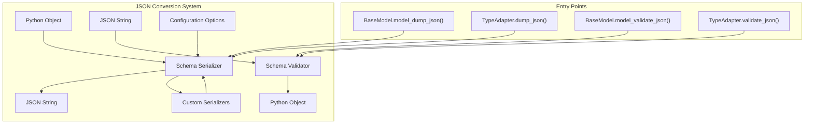

Sources: [tests/test_json.py:92-94](), [tests/test_json.py:134-137](), [tests/test_json.py:234-236]()

## JSON Serialization Methods

Pydantic provides two primary ways to serialize objects to JSON:

1. `BaseModel.model_dump_json()` - For serializing model instances
2. `TypeAdapter.dump_json()` - For serializing arbitrary types

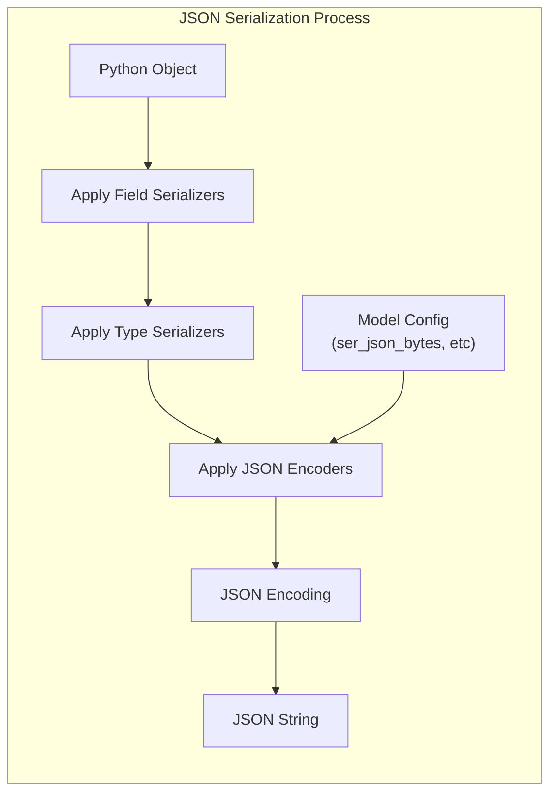

Sources: [tests/test_json.py:134-137](), [tests/test_json.py:92-94]()

### BaseModel Serialization

The `model_dump_json()` method converts a model instance to a JSON string:

```python
json_string = model.model_dump_json(exclude_none=True)
```

The method accepts the same parameters as `model_dump()`, plus JSON-specific parameters:

| Parameter | Type | Description |
|-----------|------|-------------|
| `indent` | `int` | Number of spaces for indentation |
| `exclude` | `set[str]` | Fields to exclude |
| `include` | `set[str]` | Fields to include (excluding others) |
| `by_alias` | `bool` | Whether to use field aliases |
| `exclude_unset` | `bool` | Exclude fields not explicitly set |
| `exclude_defaults` | `bool` | Exclude fields with default values |
| `exclude_none` | `bool` | Exclude None fields |

Sources: [tests/test_json.py:134-137](), [tests/test_json.py:226](), [tests/test_json.py:368-369]()

### TypeAdapter Serialization

The `TypeAdapter` class provides a way to serialize arbitrary types to JSON:

```python
ta = TypeAdapter(SomeType)
json_string = ta.dump_json(instance)
```

Sources: [tests/test_json.py:92-94]()

## JSON Deserialization Methods

Pydantic provides corresponding methods for deserializing JSON:

1. `BaseModel.model_validate_json()` - For deserializing to model instances
2. `TypeAdapter.validate_json()` - For deserializing to arbitrary types

```python
# Deserialize to a model
model = MyModel.model_validate_json('{"field": "value"}')

# Deserialize using a TypeAdapter
ta = TypeAdapter(SomeType)
instance = ta.validate_json('{"field": "value"}')
```

Sources: [tests/test_json.py:234-236](), [tests/test_json.py:251]()

## Type Handling in JSON Serialization

Pydantic provides special handling for various Python types when serializing to JSON:

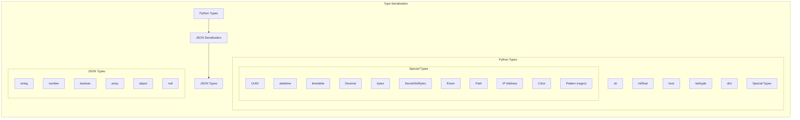

Sources: [tests/test_json.py:61-91]()

### Built-in Type Serialization

| Python Type | JSON Representation | Example |
|-------------|---------------------|---------|
| `str` | string | `"text"` |
| `int`/`float` | number | `123`, `3.14` |
| `bool` | boolean | `true`, `false` |
| `None` | null | `null` |
| `list`/`tuple`/`set` | array | `[1, 2, 3]` |
| `dict` | object | `{"key": "value"}` |
| `UUID` | string | `"ebcdab58-6eb8-46fb-a190-d07a33e9eac8"` |
| `datetime` | string (ISO 8601) | `"2032-01-01T01:01:00"` |
| `date` | string (ISO 8601) | `"2032-01-01"` |
| `time` | string (ISO 8601) | `"12:34:56"` |
| `timedelta` | string (ISO 8601 duration) | `"P12DT34.000056S"` |
| `bytes` | string (UTF-8) | `"this is bytes"` |
| `Decimal` | string | `"12.34"` |
| `Enum` | string/number | `"bar"` |
| `Pattern` | string | `"^regex$"` |
| `SecretStr`/`SecretBytes` | string (masked) | `"**********"` |
| `IPv4Address`/`IPv6Address` | string | `"192.168.0.1"` |
| `Path`/`FilePath`/`DirectoryPath` | string | `"/path/to/file"` |

Sources: [tests/test_json.py:61-91](), [tests/test_json.py:107-120]()

### Special Cases

#### Infinity and NaN

By default, `float('inf')`, `float('-inf')`, and `float('nan')` values raise errors in JSON serialization. You can configure how they are handled:

```python
class Model(BaseModel):
    value: float
    model_config = ConfigDict(ser_json_inf_nan='strings')
```

With this configuration, these values become `"Infinity"`, `"-Infinity"`, and `"NaN"` in JSON.

Sources: [tests/test_json.py:508-538]()

#### Bytes

You can configure how bytes are serialized to JSON:

```python
class Model(BaseModel):
    data: bytes
    model_config = ConfigDict(ser_json_bytes='base64')  # or 'hex'
```

Options:
- `'utf8'` (default): Decode bytes as UTF-8
- `'base64'`: Encode bytes as base64
- `'hex'`: Encode bytes as hexadecimal

Sources: [tests/test_json.py:541-576]()

## Customizing JSON Serialization

Pydantic offers multiple ways to customize how types are serialized to JSON.

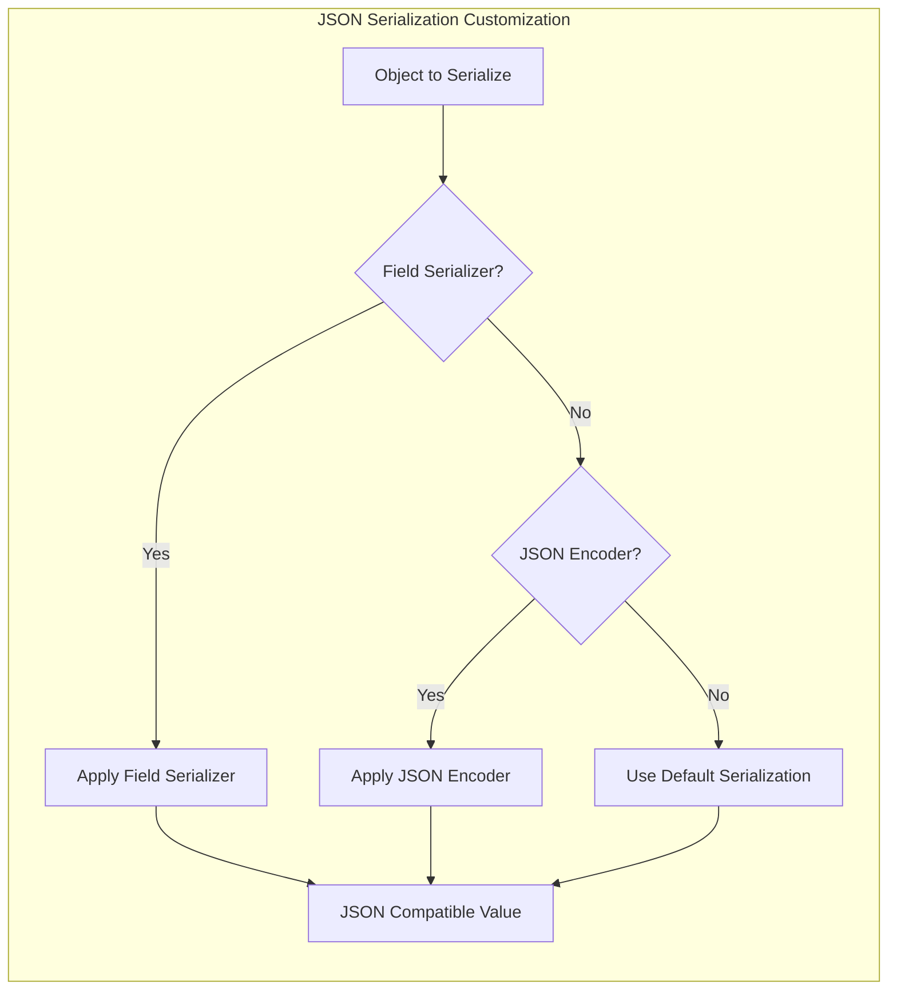

Sources: [tests/test_json.py:212-226](), [tests/test_json.py:400-414](), [tests/test_json.py:426-439]()

### Field Serializers

Field serializers allow customizing serialization for specific fields in a model:

```python
class User(BaseModel):
    name: str
    birthday: datetime
    
    @field_serializer('birthday', when_used='json')
    def serialize_birthday(self, v: datetime, _info):
        return v.timestamp()
```

The `when_used` parameter can be:
- `'always'` (default): Apply the serializer for all serializations
- `'json'`: Apply only when serializing to JSON
- `'unless-none'`: Apply only for non-None values

Sources: [tests/test_json.py:212-226](), [tests/test_json.py:292-332]()

### JSON Encoders

You can use the `json_encoders` configuration option to customize serialization for specific types:

```python
class Model(BaseModel):
    dt: datetime
    td: timedelta
    
    model_config = ConfigDict(
        json_encoders={
            datetime: lambda v: v.strftime('%Y-%m-%d'),
            timedelta: lambda v: f"{v.total_seconds()}s"
        }
    )
```

JSON encoders are applied when serializing to JSON, not when creating Python dictionaries.

Sources: [tests/test_json.py:400-414](), [tests/test_json.py:426-439](), [tests/test_json.py:480-488]()

### Annotated Serializers

You can attach serializers to specific type annotations using `Annotated` and `PlainSerializer`:

```python
class Model(BaseModel):
    x: Annotated[timedelta, PlainSerializer(lambda td: f"{td.total_seconds()}s")]
```

Sources: [tests/test_json.py:442-450]()

## Integration with Standard JSON Module

Pydantic provides a compatibility function for use with the standard `json` module:

```python
import json
from pydantic.deprecated.json import pydantic_encoder

json_string = json.dumps(model, default=pydantic_encoder)
```

This allows serializing models and other Pydantic types using the standard `json` module.

Sources: [tests/test_json.py:120](), [tests/test_json.py:278-288]()

## Inheritance and JSON Serialization

In class inheritance, field serializers from parent classes are used, unless the child class provides its own serializer for the same field:

```python
class Parent(BaseModel):
    dt: datetime
    
    @field_serializer('dt')
    def serialize_dt(self, v, _info):
        return "parent_serializer"

class Child(Parent):
    # Uses Parent's serializer for dt
    pass
```

Note that `json_encoders` configurations are not inherited; child models must define their own.

Sources: [tests/test_json.py:254-268](), [tests/test_json.py:426-439]()

## JSON Schema and Conversion

For information about generating JSON Schema from Pydantic models, see [JSON Schema Generation](#5.2).

Sources: [tests/test_json.py:372-397]()

# Schema Generation


Schema generation is the process that converts Python types and annotations into Pydantic's internal schema representation and JSON Schema. This page focuses on how Pydantic transforms type annotations into both core schemas (used internally for validation and serialization) and JSON schemas (for external documentation and compatibility).

For information about how to use JSON Schema with Pydantic models, see the relevant documentation section.

## Schema Generation Architecture

Pydantic's schema generation involves two main phases: core schema generation and JSON schema generation. The core schema is an internal representation used for validation and serialization, while the JSON schema follows the standard JSON Schema specification for external use.

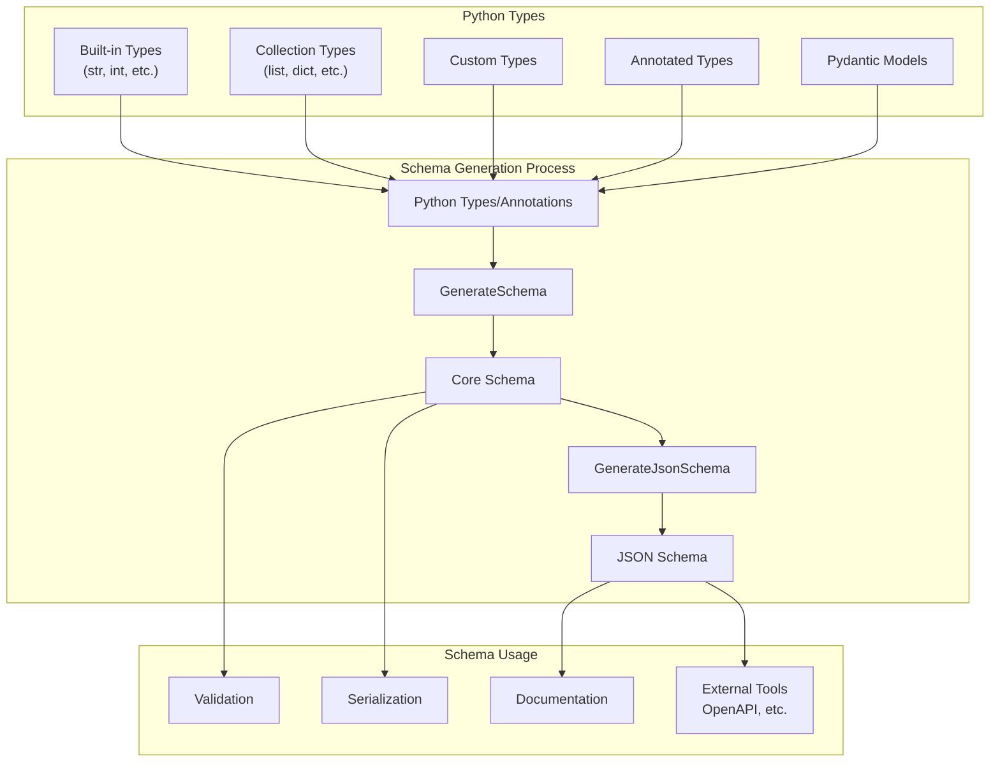

Sources: [pydantic/_internal/_generate_schema.py:318-319](https://github.com/pydantic/pydantic/blob/main/pydantic/_internal/_generate_schema.py#L318-L319), [pydantic/json_schema.py:216-249](https://github.com/pydantic/pydantic/blob/main/pydantic/json_schema.py#L216-L249)

## Core Schema Generation

The core schema generation is handled by the `GenerateSchema` class, which converts Python types to pydantic-core schemas. It's a comprehensive system that supports a wide variety of Python types and provides the foundation for Pydantic's validation and serialization capabilities.

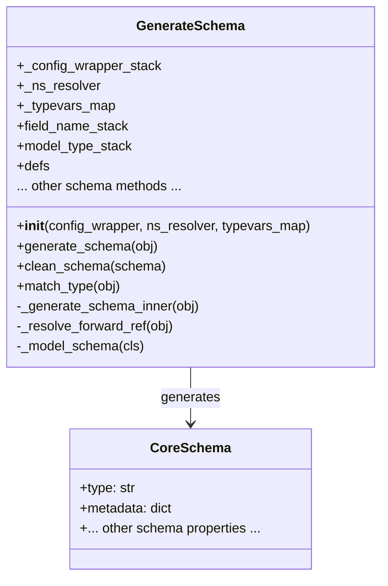

Sources: [pydantic/_internal/_generate_schema.py:318-343](https://github.com/pydantic/pydantic/blob/main/pydantic/_internal/_generate_schema.py#L318-L343), [pydantic/_internal/_generate_schema.py:679-702](https://github.com/pydantic/pydantic/blob/main/pydantic/_internal/_generate_schema.py#L679-L702)

### Type Matching and Schema Mapping

The core schema generation uses a type matching system to map Python types to appropriate schema generation methods. The `match_type` method contains the primary mapping logic:

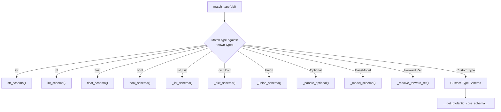

Sources: [pydantic/_internal/_generate_schema.py:991-1042](https://github.com/pydantic/pydantic/blob/main/pydantic/_internal/_generate_schema.py#L991-L1042)

### Schema Generation Process

The main entry point for generating a core schema is the `generate_schema` method. The process involves:

1. Checking if the type implements `__get_pydantic_core_schema__` for custom handling
2. Resolving forward references and type variables
3. Mapping the type to an appropriate schema generation method
4. Recursively processing nested types
5. Adding metadata and customizations to the schema

Sources: [pydantic/_internal/_generate_schema.py:679-716](https://github.com/pydantic/pydantic/blob/main/pydantic/_internal/_generate_schema.py#L679-L716)

## JSON Schema Generation

Once the core schema is created, it can be converted to a JSON Schema using the `GenerateJsonSchema` class. This transformation enables compatibility with external tools and provides a standardized format for documentation.

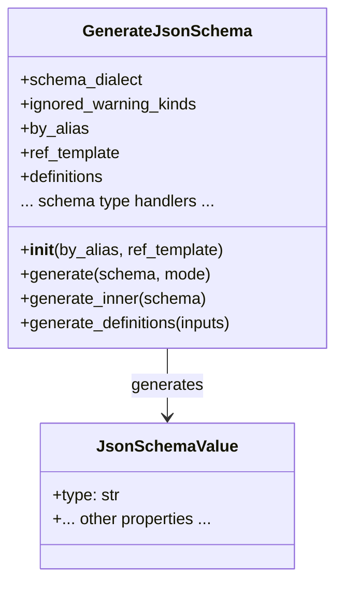

Sources: [pydantic/json_schema.py:216-426](https://github.com/pydantic/pydantic/blob/main/pydantic/json_schema.py#L216-L426)

### JSON Schema Modes

The JSON schema generation supports two modes:
- **Validation**: Defines the schema for input validation, including constraints and requirements
- **Serialization**: Defines the schema for output serialization, potentially with different rules

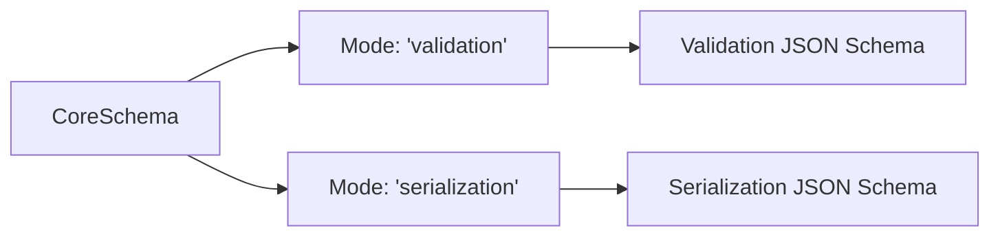

Sources: [pydantic/json_schema.py:79-87](https://github.com/pydantic/pydantic/blob/main/pydantic/json_schema.py#L79-L87), [pydantic/json_schema.py:378-425](https://github.com/pydantic/pydantic/blob/main/pydantic/json_schema.py#L378-L425)

### JSON Schema Type Handlers

Similar to the core schema generation, the JSON schema generation maps different core schema types to appropriate JSON schema handlers:

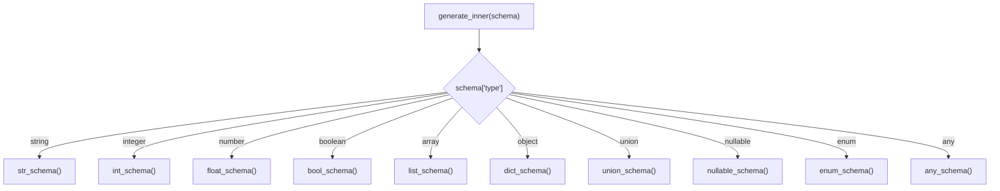

Sources: [pydantic/json_schema.py:427-566](https://github.com/pydantic/pydantic/blob/main/pydantic/json_schema.py#L427-L566)

## Custom Schema Generation

Both the core schema generation and JSON schema generation support customization through various mechanisms:

### Custom Core Schema Generation

Custom types can define how they're converted to core schemas by implementing the `__get_pydantic_core_schema__` method:

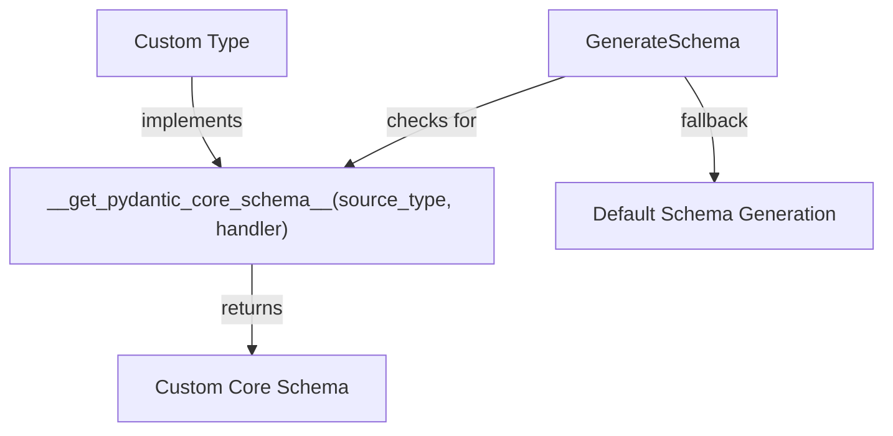

Sources: [pydantic/_internal/_generate_schema.py:850-890](https://github.com/pydantic/pydantic/blob/main/pydantic/_internal/_generate_schema.py#L850-L890)

### Custom JSON Schema Generation

Similarly, custom types can define their JSON Schema representation by using core schema metadata or implementing custom hooks:

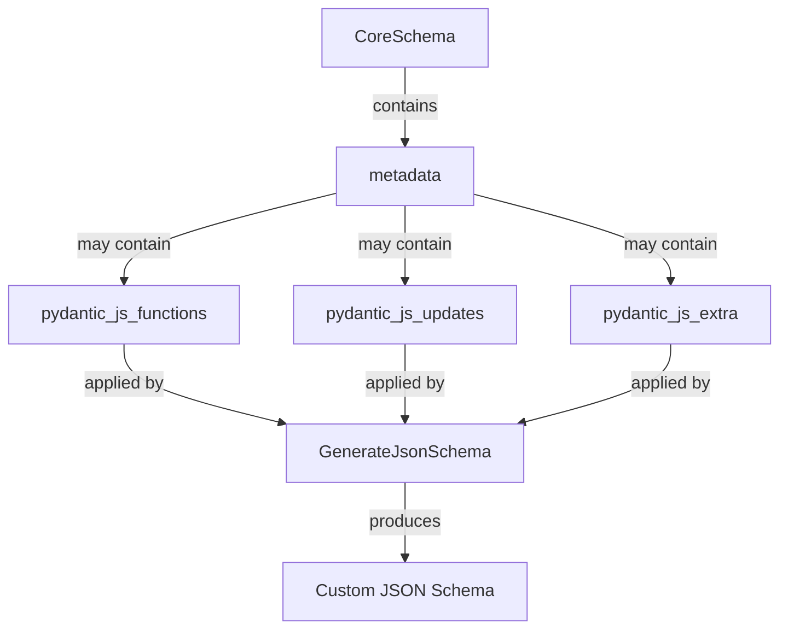

Sources: [pydantic/_internal/_core_metadata.py:13-45](https://github.com/pydantic/pydantic/blob/main/pydantic/_internal/_core_metadata.py#L13-L45), [pydantic/json_schema.py:504-565](https://github.com/pydantic/pydantic/blob/main/pydantic/json_schema.py#L504-L565)

## Schema Reference Handling

Both schema generation systems handle references to avoid duplicating schemas for the same types. The core schema uses a definition registry, while JSON Schema uses standard `$ref` references:

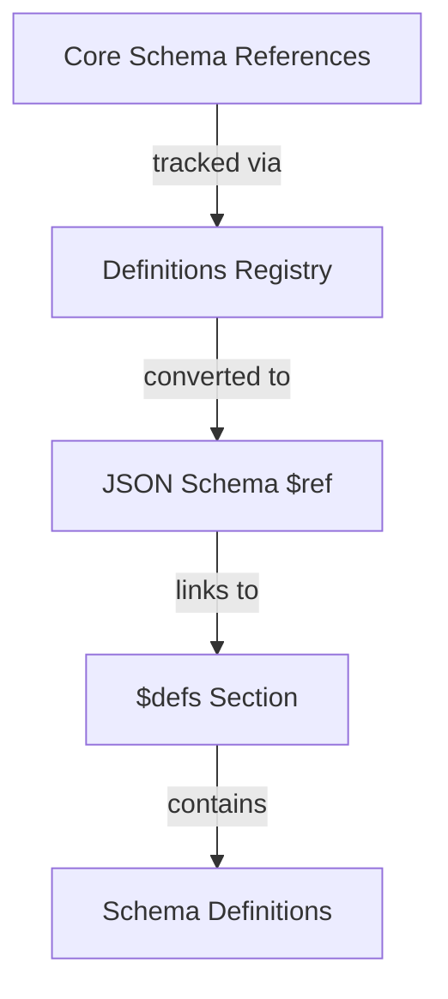

The reference handling ensures efficient schema representation and prevents circular references from causing infinite recursion.

Sources: [pydantic/_internal/_generate_schema.py:723-736](https://github.com/pydantic/pydantic/blob/main/pydantic/_internal/_generate_schema.py#L723-L736), [pydantic/json_schema.py:140-214](https://github.com/pydantic/pydantic/blob/main/pydantic/json_schema.py#L140-L214)

## Working with Schema Generation

Schema generation is typically handled automatically by Pydantic, but understanding its mechanisms helps when:

1. Implementing custom types with specific validation or serialization behavior
2. Creating advanced validation rules that combine multiple types
3. Working with tools that consume JSON Schema (like API documentation tools)
4. Debugging validation and serialization issues

To directly access the schema generation functionality:

- **Core Schema**: Use `model.__pydantic_core_schema__` to access the core schema of a model
- **JSON Schema**: Use `model.model_json_schema()` to generate a JSON schema for a model

Sources: [pydantic/_internal/_generate_schema.py:679-716](https://github.com/pydantic/pydantic/blob/main/pydantic/_internal/_generate_schema.py#L679-L716), [pydantic/json_schema.py:378-425](https://github.com/pydantic/pydantic/blob/main/pydantic/json_schema.py#L378-L425)

## Schema Validation and Serialization

The generated schemas are used for both validation and serialization:

| Purpose | Schema Type | Description |
|---------|-------------|-------------|
| Validation | Core Schema | Used to create validators that check incoming data |
| Serialization | Core Schema | Used to create serializers that convert data to output format |
| Documentation | JSON Schema | Provides standardized documentation of the data model |
| External Tools | JSON Schema | Enables integration with tools that understand JSON Schema |

Sources: [pydantic/_internal/_generate_schema.py:318-319](https://github.com/pydantic/pydantic/blob/main/pydantic/_internal/_generate_schema.py#L318-L319), [pydantic/json_schema.py:79-87](https://github.com/pydantic/pydantic/blob/main/pydantic/json_schema.py#L79-L87)

Schema generation is a fundamental part of Pydantic's functionality, serving as the bridge between Python's type system and the validation, serialization, and documentation capabilities that make Pydantic powerful.