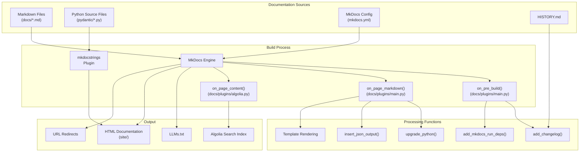
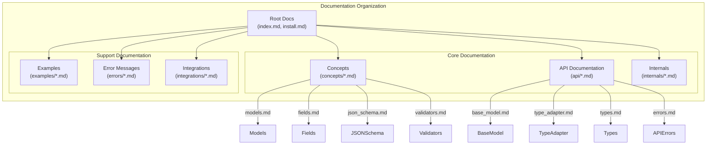
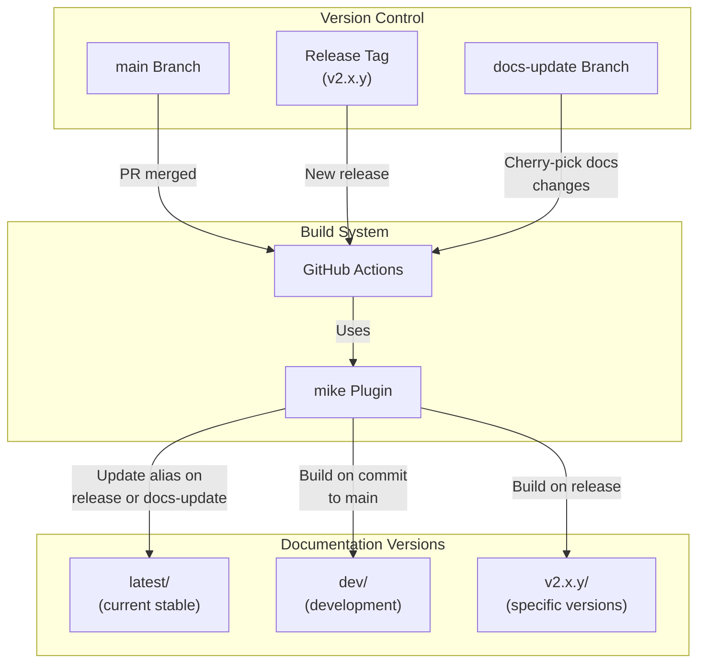
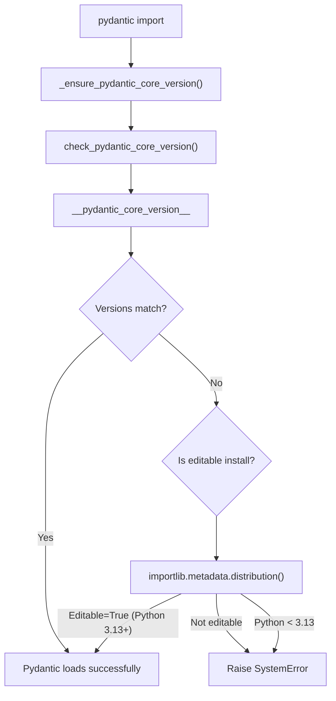
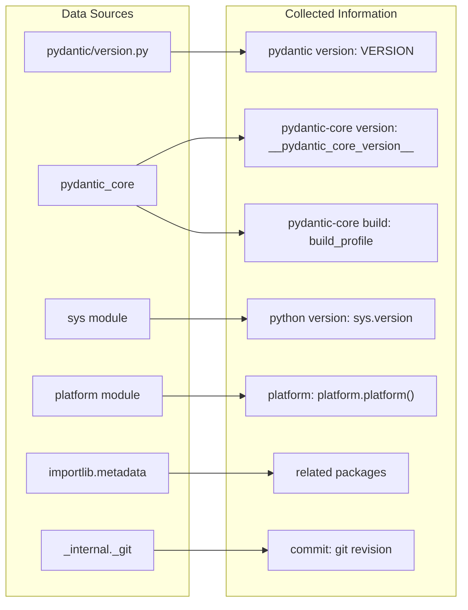
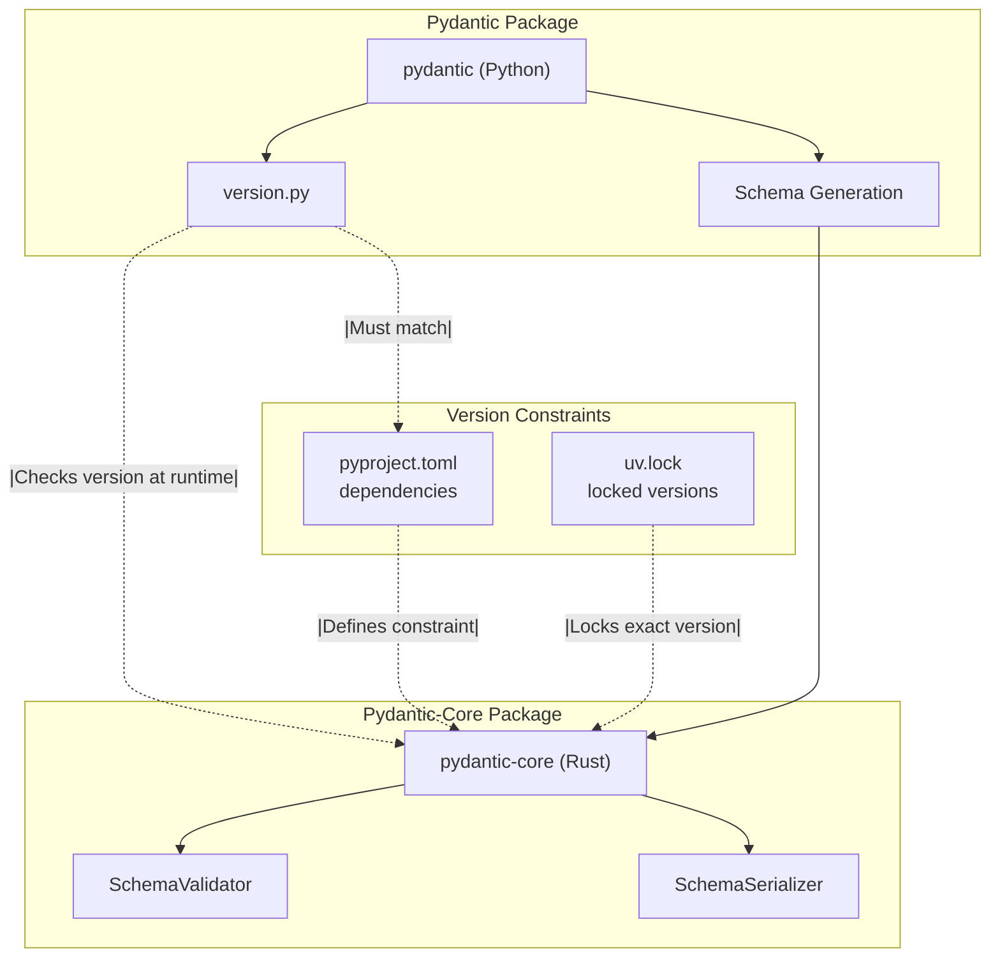
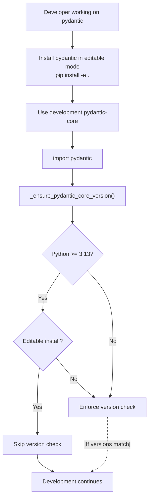
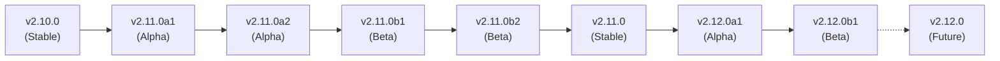

This document describes the documentation system used by Pydantic. It covers the technical infrastructure, build tools, customizations, and workflow for maintaining and generating the Pydantic documentation found at [docs.pydantic.dev](https://docs.pydantic.dev/).

## Overview

Pydantic's documentation system is built using MkDocs with the Material theme, enhanced with custom plugins and extensions. The system provides comprehensive documentation including conceptual guides, API references, examples, error messages, and integration information. 

The documentation system provides:

1. Versioned documentation (latest/stable release, development, and previous versions)
2. API documentation generated from docstrings
3. Integrated search with Algolia
4. Interactive code examples
5. Optimized presentation for both human readers and AI assistants

Sources: [mkdocs.yml:1-333](), [README.md:32-34]()

## Documentation Architecture

### Documentation Build System



Sources: [mkdocs.yml:189-211](), [docs/plugins/main.py:1-43](), [docs/plugins/algolia.py:1-50]()

### Documentation Structure



Sources: [mkdocs.yml:89-189]()

## Documentation Generation Process

The documentation generation process involves several stages:

1. **Pre-build preparation**:
   - Converting `HISTORY.md` to a format suitable for the docs
   - Setting up dependencies for interactive code examples

2. **Markdown processing**:
   - Upgrading Python code examples to be compatible with different Python versions
   - Formatting JSON output for code examples
   - Rendering templates for dynamic content

3. **API documentation generation**:
   - Extracting docstrings from Python source files
   - Formatting and organizing API reference pages

4. **Output generation**:
   - Creating HTML files for web viewing
   - Generating search indices for Algolia
   - Creating LLMs.txt for AI consumption
   - Setting up redirects for backward compatibility

### Hooks and Plugins

The documentation system uses several custom hooks in the MkDocs build process:

| Hook | Function | Description |
|------|----------|-------------|
| `on_pre_build` | `add_changelog()`, `add_mkdocs_run_deps()` | Prepares changelog and code example dependencies |
| `on_files` | - | Processes files after loading |
| `on_page_markdown` | `upgrade_python()`, `insert_json_output()`, etc. | Processes Markdown content before conversion to HTML |
| `on_page_content` | Processing for Algolia search | Processes HTML content for search indexing |
| `on_post_build` | Finalize Algolia records | Final processing after site generation |

Sources: [docs/plugins/main.py:37-75](), [docs/plugins/algolia.py:46-147]()

### Markdown Extensions and Customization

Pydantic's documentation uses several Markdown extensions to enhance the content:

```
markdown_extensions:
- tables
- toc
- admonition
- pymdownx.details
- pymdownx.superfences
- pymdownx.highlight
- pymdownx.extra
- pymdownx.emoji
- pymdownx.tabbed
```

These extensions enable features like tables, code highlighting, tabs, admonitions, and more.

Sources: [mkdocs.yml:190-205]()

## Documentation Versioning

Pydantic maintains versioned documentation using the `mike` plugin. This allows for multiple versions of the documentation to be available simultaneously.



The workflow for documentation updates involves:

1. Regular changes go through PRs to the `main` branch
2. On merge to `main`, the development docs are updated
3. On a new release, a new versioned docs path is created
4. Out-of-cycle documentation updates follow a special process:
   - PR against `main` with docs changes
   - Once merged, changes are cherry-picked to the `docs-update` branch
   - When merged to `docs-update`, the changes are reflected in the "latest" docs

Sources: [docs/contributing.md:125-136](), [mkdocs.yml:215-218]()

## Search Integration

Pydantic's documentation uses Algolia for enhanced search capabilities:

1. During the build process, content is processed and indexed for search
2. Search records are created with content, titles, and URLs
3. Records are uploaded to Algolia for fast, fuzzy searching
4. The search UI is customized to match the site design

The search system provides:
- Section-based search results
- Content snippets
- Highlighted search terms
- Keyboard navigation

Sources: [docs/plugins/algolia.py:1-197](), [docs/extra/algolia.js:1-108](), [docs/theme/partials/search.html:1-32]()

## LLMs Integration

Pydantic's documentation system includes a feature for generating AI-friendly documentation snapshots:

```yaml
llmstxt:
  enabled: !ENV [CI, false]
  full_output: llms-full.txt
  markdown_description: |-
    Pydantic is the most widely used data validation library for Python.
    Fast and extensible, Pydantic plays nicely with your linters/IDE/brain.
    Define how data should be in pure, canonical Python 3.9+; validate it with Pydantic.
  sections:
    Concepts documentation:
      - concepts/*.md
    API documentation:
      - api/*.md
    Internals:
      - internals/*.md
    Optional:
      - errors/*.md
      - examples/*.md
      - integrations/*.md
```

This generates an LLMs.txt file that provides a comprehensive, AI-friendly snapshot of the Pydantic documentation, making it easier for AI assistants to provide accurate information about Pydantic.

Sources: [mkdocs.yml:219-237](), [README.md:9-10]()

## Code Examples Processing

Pydantic's documentation includes interactive and consistently formatted code examples:

1. **Code Example Upgrading**: The `upgrade_python()` function in `main.py` uses `pyupgrade` to optimize Python code examples for different Python versions
2. **JSON Output Formatting**: The `insert_json_output()` function replaces JSON string outputs with formatted JSON
3. **Interactive Examples**: The documentation supports running code examples in the browser

Sources: [docs/plugins/main.py:133-207](), [mkdocs.yml:85-87]()

## Contributing to Documentation

Guidelines for contributing to Pydantic's documentation:

1. **Documentation Style**:
   - Written in Markdown
   - API documentation from Google-style docstrings
   - Code examples should be complete, self-contained, and runnable

2. **Testing Documentation**:
   - Code examples in documentation are tested
   - Use `pytest tests/test_docs.py --update-examples` to test and update code examples

3. **Building Documentation**:
   - Use `make docs` to build documentation
   - Use `uv run mkdocs serve` to serve documentation locally

4. **Documentation Updates**:
   - Regular updates through normal PR process
   - Out-of-cycle updates through the cherry-pick process to the `docs-update` branch

Sources: [docs/contributing.md:105-137](), [docs/contributing.md:147-212]()

## Styling and Theming

The documentation uses the Material for MkDocs theme with custom styling:

1. **Theme Customization**:
   - Custom directory: `docs/theme`
   - Custom color palette with light/dark mode support
   - Custom navigation and search features

2. **CSS Customizations**:
   - `docs/extra/terminal.css` for terminal-style displays
   - `docs/extra/tweaks.css` for general styling tweaks

3. **JavaScript Enhancements**:
   - `docs/extra/algolia.js` for search integration
   - `docs/extra/feedback.js` for user feedback
   - `docs/extra/fluff.js` for UI enhancements

The styling provides a consistent, readable experience with good support for code blocks, admonitions, and other technical content.

Sources: [mkdocs.yml:6-50](), [docs/extra/tweaks.css:1-196]()

## Redirects and URL Management

The documentation system includes extensive URL redirects to maintain backward compatibility:

```yaml
redirect_maps:
  'usage/mypy.md': 'integrations/mypy.md'
  'mypy_plugin.md': 'integrations/mypy.md'
  'usage/model_config.md': 'api/config.md'
  # Many more redirects...
```

This ensures that links to old documentation paths continue to work, providing a smoother experience for users transitioning from older documentation versions.

Sources: [mkdocs.yml:260-332]()

# Versioning and Dependencies


This document covers Pydantic's version management system, dependency compatibility checking, and version information utilities. It focuses on the tight coupling between `pydantic` and `pydantic-core`, the version enforcement mechanisms, and tools for debugging version-related issues.

For information about the overall development infrastructure and CI/CD, see [CI/CD Pipeline](#7.2). For release automation and documentation deployment, see [Documentation System](#7.3).

## Overview

Pydantic enforces strict version compatibility between the pure Python `pydantic` package and the Rust-based `pydantic-core` package. This ensures that the schema generation logic in Python remains synchronized with the validation engine in Rust.

The version management system includes:
- A single source of truth for the current version
- Runtime checks to prevent version mismatches
- Utilities for debugging version information
- Special handling for development environments

Sources: [pydantic/version.py:1-114]()

## Version Constants

### VERSION Constant

The `VERSION` constant in [pydantic/version.py:11]() holds the current version string and serves as the single source of truth for Pydantic's version:

```python
VERSION = '2.12.0b1+dev'
```

This string follows the [PEP 440](https://peps.python.org/pep-0440/) version specifier format, supporting:
- Release versions: `2.11.0`
- Pre-release versions: `2.12.0b1` (beta), `2.12.0a1` (alpha)
- Development versions: `2.12.0b1+dev`

The version constant is also synchronized with [CITATION.cff:47]() for academic citations.

Sources: [pydantic/version.py:11-19](), [CITATION.cff:47]()

### Compatible Pydantic-Core Version

The `_COMPATIBLE_PYDANTIC_CORE_VERSION` constant defines the exact `pydantic-core` version required:

```python
_COMPATIBLE_PYDANTIC_CORE_VERSION = '2.40.1'
```

This constant must be kept in sync with the dependency constraint in `pyproject.toml`.

Sources: [pydantic/version.py:21-22]()

## Version Compatibility System



Sources: [pydantic/version.py:77-99]()

### Runtime Version Checking

The `check_pydantic_core_version()` function performs a simple equality check:

```python
def check_pydantic_core_version() -> bool:
    """Check that the installed `pydantic-core` dependency is compatible."""
    return __pydantic_core_version__ == _COMPATIBLE_PYDANTIC_CORE_VERSION
```

This function is called by `_ensure_pydantic_core_version()` during module initialization to prevent Pydantic from loading with an incompatible `pydantic-core` version.

Sources: [pydantic/version.py:77-79]()

### Error Handling and Editable Installs

The `_ensure_pydantic_core_version()` function raises a `SystemError` if versions don't match, except for editable installs in development:

| Condition | Python Version | Behavior |
|-----------|---------------|----------|
| Versions match | Any | Load successfully |
| Editable install | 3.13+ | Skip check, load successfully |
| Version mismatch | < 3.13 | Raise `SystemError` |
| Version mismatch, not editable | 3.13+ | Raise `SystemError` |

The editable install detection uses Python 3.13's `origin.dir_info.editable` property from `importlib.metadata.distribution()`.

Sources: [pydantic/version.py:82-99]()

## Version Information Utilities

### version_short()

Returns the `major.minor` portion of the version string:

```python
def version_short() -> str:
    """Return the `major.minor` part of Pydantic version.
    
    It returns '2.1' if Pydantic version is '2.1.1'.
    """
    return '.'.join(VERSION.split('.')[:2])
```

Sources: [pydantic/version.py:25-30]()

### version_info()

The `version_info()` function collects comprehensive version information for debugging:



Sources: [pydantic/version.py:33-74]()

The function searches for related packages in the environment:

```python
package_names = {
    'email-validator',
    'fastapi',
    'mypy',
    'pydantic-extra-types',
    'pydantic-settings',
    'pyright',
    'typing_extensions',
}
```

Output format example:
```
               pydantic version: 2.12.0b1+dev
          pydantic-core version: 2.40.1
            pydantic-core build: release
                 python version: 3.11.5
                       platform: Linux-5.15.0-86-generic-x86_64
               related packages: fastapi-0.104.1 mypy-1.17.0 ...
                         commit: abc123def456
```

Sources: [pydantic/version.py:44-74]()

## Mypy Version Parsing

The `parse_mypy_version()` utility parses mypy version strings, handling development versions:

```python
def parse_mypy_version(version: str) -> tuple[int, int, int]:
    """Parse `mypy` string version to a 3-tuple of ints.
    
    It parses normal version like `1.11.0` and extra info followed by a `+` sign
    like `1.11.0+dev.d6d9d8cd4f27c52edac1f537e236ec48a01e54cb.dirty`.
    
    Args:
        version: The mypy version string.
    
    Returns:
        A triple of ints, e.g. `(1, 11, 0)`.
    """
    return tuple(map(int, version.partition('+')[0].split('.')))
```

This function is used by the mypy plugin to handle version-specific behavior.

Sources: [pydantic/version.py:101-114]()

## Dependency Management

### Core Dependencies



Sources: [pydantic/version.py:21-22](), [uv.lock:1-4]()

### Version Update Process

When updating `pydantic-core`:

1. **Update `_COMPATIBLE_PYDANTIC_CORE_VERSION`** in [pydantic/version.py:22]()
2. **Update dependency constraint** in `pyproject.toml`
3. **Lock dependencies** with `uv lock`
4. **Update HISTORY.md** with the version bump note

Example from [HISTORY.md:15]():
```markdown
* Bump `pydantic-core` to v2.40.1 by @Viicos in [#12314](...)
```

Sources: [pydantic/version.py:21-22](), [HISTORY.md:15]()

### Related Package Ecosystem

The version info system tracks these related packages:

| Package | Purpose |
|---------|---------|
| `email-validator` | Email validation support |
| `fastapi` | Web framework integration |
| `mypy` | Static type checking |
| `pydantic-extra-types` | Additional type validators |
| `pydantic-settings` | Settings management |
| `pyright` | Static type checking |
| `typing_extensions` | Backported typing features |

Sources: [pydantic/version.py:44-52]()

## Development Workflow

### Version Checking During Development



Sources: [pydantic/version.py:82-99]()

### Git Revision Tracking

The `version_info()` function attempts to determine the current git commit:

```python
pydantic_dir = Path(__file__).parents[1].resolve()
most_recent_commit = (
    git.git_revision(pydantic_dir) if git.is_git_repo(pydantic_dir) and git.have_git() else 'unknown'
)
```

This helps identify the exact code version during development and debugging.

Sources: [pydantic/version.py:60-63]()

## Release Version Management

### Version Evolution

The [HISTORY.md]() file documents version progression:



Sources: [HISTORY.md:1-125]()

### Pydantic-Core Synchronization

Each Pydantic release is paired with a specific pydantic-core version:

| Pydantic Version | Pydantic-Core Version | Release Date |
|------------------|----------------------|--------------|
| v2.12.0b1 | v2.40.1 | 2025-10-03 |
| v2.12.0a1 | v2.35.1 | 2025-07-26 |
| v2.11.0 | v2.33.0 | 2025-03-27 |
| v2.10.0 | v2.27.0 | 2024-11-20 |

Sources: [HISTORY.md:15](), [HISTORY.md:101](), [HISTORY.md:234](), [HISTORY.md:641]()

### Version Bump Process

Based on [HISTORY.md](), version bumps include:

1. **Update VERSION constant** in [pydantic/version.py:11]()
2. **Update CITATION.cff** with new version and date [CITATION.cff:47-48]()
3. **Bump pydantic-core dependency** [pydantic/version.py:22]()
4. **Document changes** in HISTORY.md
5. **Create GitHub release**

Sources: [pydantic/version.py:11](), [CITATION.cff:47-48](), [HISTORY.md:1-125]()