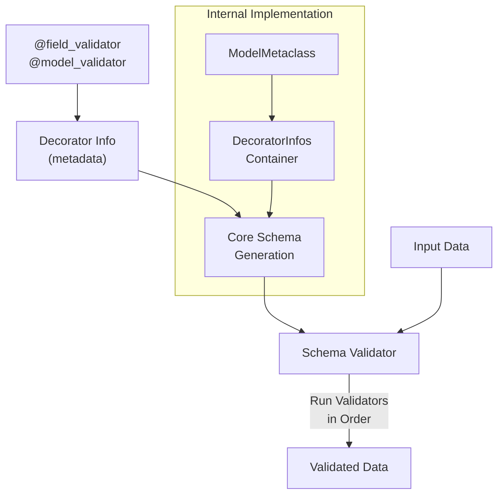

def sixties_validator(val: Any, handler: ValidatorFunctionWrapHandler, info: ValidationInfo) -> date:
    if val == 'epoch':
        return date.fromtimestamp(0)
    newval = handler(val)
    if not date.fromisoformat('1960-01-01') <= newval < date.fromisoformat('1970-01-01'):
        raise ValueError(f'{val} is not in the sixties!')
    return newval

SixtiesDateTime = Annotated[date, WrapValidator(sixties_validator)]
```

Sources:
- [tests/test_validators.py:51-166](https://github.com/pydantic/pydantic/blob/main/tests/test_validators.py#L51-L166)

## Root Validators (Deprecated)

The `@root_validator` decorator from Pydantic v1 has been deprecated in favor of `@model_validator`. Root validators still work but will emit deprecation warnings.

```python
class Model(BaseModel):
    a: list[str]
    
    @root_validator(skip_on_failure=True)
    def validate_values(cls, values: dict[str, Any]):
        values['a'].append('added by root validator')
        return values
```

Sources:
- [tests/test_validators.py:1046-1083](https://github.com/pydantic/pydantic/blob/main/tests/test_validators.py#L1046-L1083)
- [pydantic/_internal/_decorators.py:76-88](https://github.com/pydantic/pydantic/blob/main/pydantic/_internal/_decorators.py#L76-L88)

## Validator Inheritance

Validators are inherited when subclassing models. If a subclass defines a validator with the same name as a parent class validator, the subclass validator overrides the parent's.

```python
class Parent(BaseModel):
    a: str
    
    @field_validator('a')
    @classmethod
    def check_a(cls, v: Any):
        if 'foobar' not in v:
            raise ValueError('"foobar" not found in a')
        return v

class Child(Parent):
    # Inherits the check_a validator from Parent
    pass
```

Sources:
- [tests/test_validators.py:820-927](https://github.com/pydantic/pydantic/blob/main/tests/test_validators.py#L820-L927)
- [tests/test_validators.py:995-1037](https://github.com/pydantic/pydantic/blob/main/tests/test_validators.py#L995-L1037)

## Advanced Usage

### Validating Collections

For validating each item in collections, the classic approach of using `each_item=True` with the `@validator` decorator is deprecated. Instead, use validator functions directly with the collection's item type:

```python
# Instead of this (deprecated):
@validator('foobar', each_item=True)

# Use this:
class Model(BaseModel):
    # This validates each int in the list
    numbers: list[Annotated[int, AfterValidator(lambda x: x + 1)]]
```

Sources:
- [tests/test_validators.py:1086-1126](https://github.com/pydantic/pydantic/blob/main/tests/test_validators.py#L1086-L1126)

### Validation on Assignment

By default, validators only run during model initialization. To run them when values are assigned, set `validate_assignment=True` in model config:

```python
class ValidateAssignmentModel(BaseModel):
    a: int = 4
    b: str = ...
    c: int = 0
    
    @field_validator('b')
    @classmethod
    def b_length(cls, v, info):
        values = info.data
        if 'a' in values and len(v) < values['a']:
            raise ValueError('b too short')
        return v
        
    model_config = ConfigDict(validate_assignment=True)
```

Sources:
- [tests/test_validators.py:387-483](https://github.com/pydantic/pydantic/blob/main/tests/test_validators.py#L387-L483)

### Validators with Default Values

To validate default values, use `validate_default=True` in the field:

```python
class Model(BaseModel):
    a: str = Field(None, validate_default=True)
    
    @field_validator('a', mode='before')
    @classmethod
    def check_a(cls, v: Any):
        return v or 'default value'
```

Sources:
- [tests/test_validators.py:637-653](https://github.com/pydantic/pydantic/blob/main/tests/test_validators.py#L637-L653)
- [tests/test_validators.py:678-695](https://github.com/pydantic/pydantic/blob/main/tests/test_validators.py#L678-L695)

## Core Internals

Internally, validators are processed by the Pydantic Core engine, which converts them into a validation schema:



Field validators and model validators are stored in specialized container classes (`DecoratorInfos`) during model creation and used to build the final validation schema.

Sources:
- [pydantic/_internal/_decorators.py:412-515](https://github.com/pydantic/pydantic/blob/main/pydantic/_internal/_decorators.py#L412-L515)
- [pydantic/_internal/_core_utils.py:16-42](https://github.com/pydantic/pydantic/blob/main/pydantic/_internal/_core_utils.py#L16-L42)

## Combining Validators with Constrained Types

Validators can be combined with constrained types from `annotated_types` for powerful, reusable validation:

```python
from annotated_types import Gt, Lt

# Validate that an integer is between 0 and 100
PercentageInt = Annotated[int, Gt(0), Lt(100)]

# With a custom validator as well
PercentageInt = Annotated[
    int, 
    Gt(0), 
    Lt(100), 
    AfterValidator(lambda x, _: round(x))
]
```

Sources:
- [pydantic/_internal/_known_annotated_metadata.py:168-347](https://github.com/pydantic/pydantic/blob/main/pydantic/_internal/_known_annotated_metadata.py#L168-L347)
- [tests/test_annotated.py:51-62](https://github.com/pydantic/pydantic/blob/main/tests/test_annotated.py#L51-L62)

## Best Practices

1. Use `@field_validator` for field-specific validation
2. Use `@model_validator` for validations that involve multiple fields
3. Use functional validators with `Annotated` for reusable validation logic
4. Always use `@classmethod` when defining class-based validators
5. Return the value from validators to pass it to the next validator in the pipeline
6. Use `ValidationInfo` to access contextual information during validation

By combining these validator types, you can build complex validation rules while keeping your code modular and maintainable.