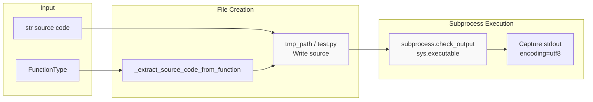
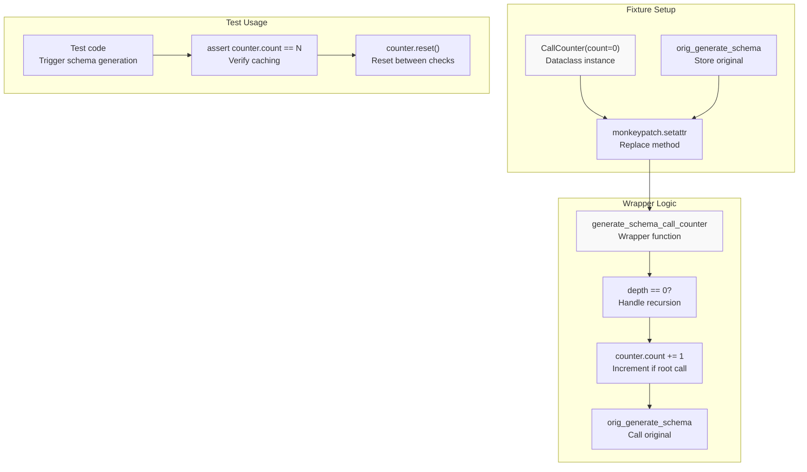
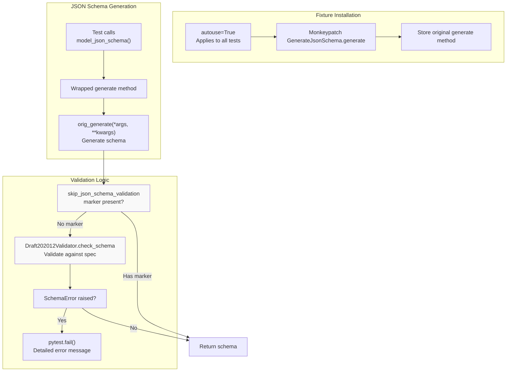
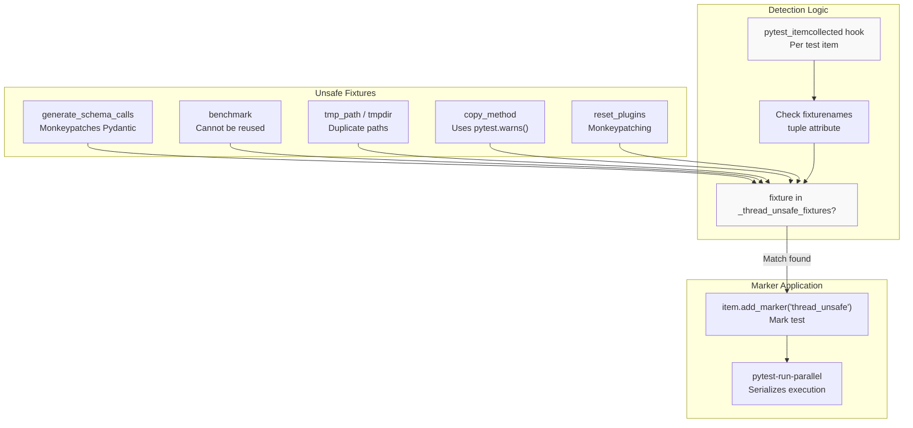
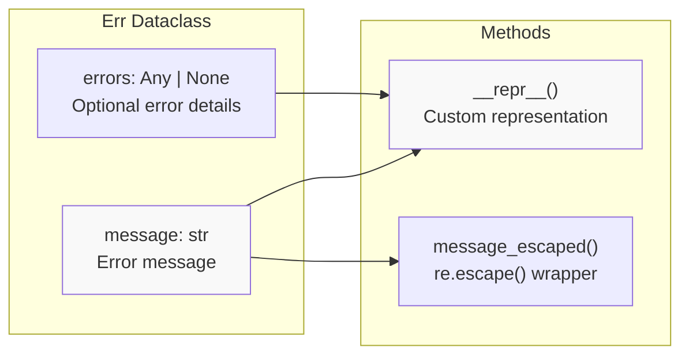
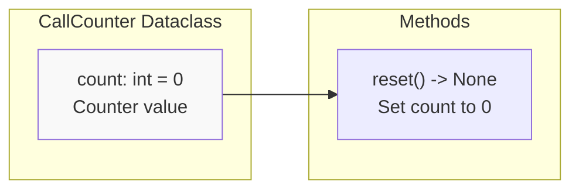

def test_something(create_module):
    def my_module():
        from pydantic import BaseModel
        
        class MyModel(BaseModel):
            x: int
    
    module = create_module(my_module)
    assert module.MyModel(x=1).x == 1
```

The function:
1. Validates that the function has no arguments ([tests/conftest.py:31-32]())
2. Uses `inspect.getsource()` to get source code ([tests/conftest.py:36]())
3. Skips the `def` line ([tests/conftest.py:37-39]())
4. Dedents and returns the body ([tests/conftest.py:43]())

**Sources:** [tests/conftest.py:30-44]()

### Module File Creation

The `_create_module_file` function handles platform-specific file creation:

| Concern | Implementation |
|---------|---------------|
| Path length limits | Maximum 240 characters on Windows ([tests/conftest.py:48]()) |
| Invalid characters | Sanitizes `<>:"/\|?*` characters ([tests/conftest.py:50]()) |
| Name collisions | Appends 5-byte random hex token ([tests/conftest.py:51]()) |
| File extension | Always uses `.py` extension ([tests/conftest.py:52]()) |

**Sources:** [tests/conftest.py:46-54]()

### Assertion Rewriting

When `rewrite_assertions=True` (default), the fixture uses pytest's `AssertionRewritingHook` to enable detailed assertion failure messages. This hook rewrites Python assert statements at import time to provide better debugging information.

**Sources:** [tests/conftest.py:91-96]()

---

## Subprocess Code Execution

The `subprocess_run_code` fixture provides process-isolated code execution, essential for testing import-time side effects, environment isolation, and subprocess-specific behaviors.



**Sources:** [tests/conftest.py:105-119]()

The fixture creates a temporary `test.py` file and executes it with `subprocess.check_output`, returning the captured stdout as a UTF-8 string. This ensures complete process isolation between test execution and the code being tested.

---

## Schema Generation Monitoring

The `generate_schema_calls` fixture tracks how many times schema generation occurs, useful for testing caching behaviors and performance optimizations.

### Call Counter Implementation



**Sources:** [tests/conftest.py:144-161]()

The fixture uses a depth counter to handle recursive `GenerateSchema.generate_schema` calls - only root-level calls increment the counter. This prevents double-counting when schema generation triggers nested schema generation.

**Data Structures:**
- `CallCounter` dataclass with `count` field and `reset()` method ([tests/conftest.py:136-142]())
- `depth` variable tracks recursion level ([tests/conftest.py:148]())

**Sources:** [tests/conftest.py:136-161]()

---

## JSON Schema Validation

The `validate_json_schemas` fixture automatically validates all generated JSON schemas against the Draft 2020-12 specification. This runs for every test unless explicitly disabled.

### Validation Flow



**Sources:** [tests/conftest.py:163-182]()

### Opting Out of Validation

Tests can disable automatic JSON schema validation using the `skip_json_schema_validation` marker:

```python
@pytest.mark.skip_json_schema_validation
def test_invalid_json_schema():
    # This test intentionally generates invalid JSON Schema
    pass
```

The marker is checked via `request.node.get_closest_marker()` ([tests/conftest.py:169]()), and validation is skipped if found.

**Sources:** [tests/conftest.py:169-177]()

---

## Thread Safety Management

The test framework includes sophisticated thread safety detection to prevent race conditions when running tests in parallel with `pytest-run-parallel`.

### Thread-Unsafe Fixtures



**Sources:** [tests/conftest.py:184-203]()

### Thread-Unsafe Fixture List

The following fixtures are marked as thread-unsafe:

| Fixture | Reason |
|---------|--------|
| `generate_schema_calls` | Monkeypatches global Pydantic code |
| `benchmark` | Fixture cannot be reused across threads |
| `tmp_path` / `tmpdir` | Risk of duplicate path creation |
| `copy_method` | Uses `pytest.warns()` which is not thread-safe |
| `reset_plugins` | Monkeypatches global state |

**Sources:** [tests/conftest.py:184-191]()

### Collection Hook Timing

The thread safety marker is added in `pytest_itemcollected`, which is critical because:
- `pytest-run-parallel` also implements this hook
- Pydantic's hook runs before the parallel plugin's hook
- Markers must be applied before the parallel plugin analyzes tests
- Using later hooks like `pytest_collection_modifyitems` would be too late

**Sources:** [tests/conftest.py:194-198]()

---

## Test Utility Classes

The testing framework provides utility dataclasses for common testing patterns.

### Err Dataclass



**Sources:** [tests/conftest.py:121-134]()

The `Err` dataclass represents expected validation errors in tests:

| Field | Type | Purpose |
|-------|------|---------|
| `message` | `str` | Expected error message text |
| `errors` | `Any \| None` | Optional detailed error information |

**Methods:**
- `__repr__()`: Custom string representation ([tests/conftest.py:126-130]())
- `message_escaped()`: Returns regex-escaped message for pattern matching ([tests/conftest.py:132-133]())

**Sources:** [tests/conftest.py:121-134]()

### CallCounter Dataclass



**Sources:** [tests/conftest.py:136-142]()

The `CallCounter` dataclass provides a simple mutable counter:

| Field | Type | Default | Purpose |
|-------|------|---------|---------|
| `count` | `int` | `0` | Number of calls recorded |

**Methods:**
- `reset()`: Resets count to zero ([tests/conftest.py:140-141]())

This is used by the `generate_schema_calls` fixture to track schema generation invocations.

**Sources:** [tests/conftest.py:136-142]()

---

## Summary

The Pydantic testing framework provides a comprehensive infrastructure for testing validation logic, schema generation, and type handling:

| Component | Purpose | Key Classes/Functions |
|-----------|---------|---------------------|
| pytest configuration | Command-line options and session setup | `pytest_addoption`, `disable_error_urls` |
| Module creation | Dynamic module import for testing | `create_module`, `_extract_source_code_from_function`, `_create_module_file` |
| Subprocess execution | Process-isolated code testing | `subprocess_run_code` |
| Schema monitoring | Track schema generation calls | `generate_schema_calls`, `CallCounter` |
| JSON validation | Automatic schema validation | `validate_json_schemas`, `Draft202012Validator` |
| Thread safety | Parallel test execution safety | `pytest_itemcollected`, `_thread_unsafe_fixtures` |
| Utilities | Common test patterns | `Err`, `CallCounter` |

**Sources:** [tests/conftest.py:1-203]()