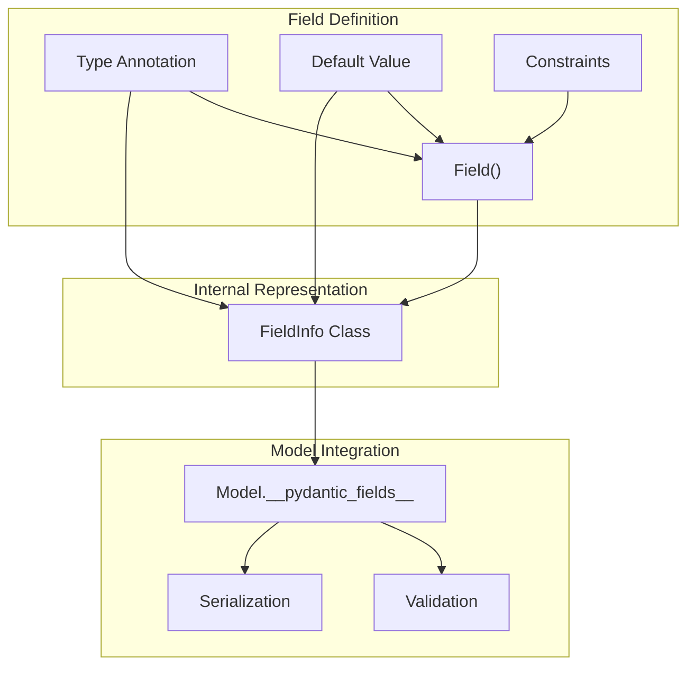
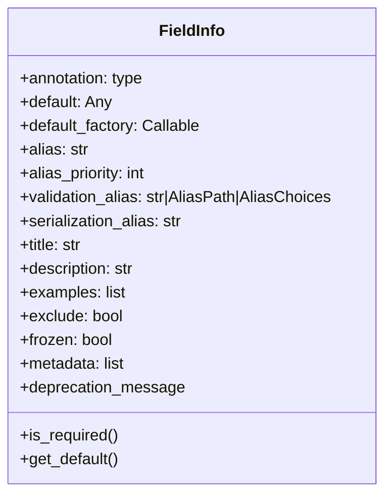

The Pydantic Field System provides the foundation for defining, validating, and customizing fields within Pydantic models. This page explains how fields are defined, their internal representation, and how they interact with the model validation and serialization processes. For information about validators that operate on fields, see [Validators](#4.1). For model configuration options affecting fields, see [Model Configuration](#2.3).

## Overview

The Field System consists of several key components:

1. **Field Definition**: How fields are declared in model classes using type annotations and the `Field()` function
2. **FieldInfo**: The internal class that stores field metadata and configuration
3. **Field Processing**: How declared fields are processed during model creation
4. **Field Lifecycle**: How fields behave during validation, access, and serialization



Sources: [pydantic/fields.py:99-206](). [pydantic/main.py:203-206]().

## Defining Fields

Fields in Pydantic models are defined through type annotations, with optional default values and field customizations.

### Basic Field Definition

The simplest way to define a field is with a type annotation:

```python
class Model(BaseModel):
    name: str             # Required field
    age: int = 30         # Field with default value
    tags: list[str] = []  # Field with default empty list
```

Fields without default values are **required** fields, while fields with default values are **optional**.

Sources: [tests/test_main.py:56-65](). [tests/test_main.py:519-533]().

### Field Customization with Field()

For more advanced field configuration, use the `Field()` function:

```python
from pydantic import BaseModel, Field

class User(BaseModel):
    name: str = Field(default="John Doe", max_length=50)
    age: int = Field(gt=0, description="User age in years")
    email: str = Field(pattern=r"^\S+@\S+\.\S+$")
    tags: list[str] = Field(default_factory=list)
```

The `Field()` function accepts numerous parameters to customize field behavior, including:

- **default**: Default value for the field
- **default_factory**: Callable that returns a default value
- **alias**: Alternative name for the field during parsing
- **validation_alias**: Alias used during validation
- **serialization_alias**: Alias used during serialization
- **title**, **description**: Documentation metadata
- **examples**: Example values for documentation
- **exclude**: Whether to exclude in serialization
- **Validation constraints**: gt, ge, lt, le, multiple_of, min_length, max_length, pattern, etc.

Sources: [pydantic/fields.py:209-290](). [tests/test_main.py:154-166]().

## Field Information (FieldInfo)

The `FieldInfo` class is the internal representation of field metadata in Pydantic. Each field defined in a model is represented by a `FieldInfo` instance.



Sources: [pydantic/fields.py:99-187](). [pydantic/fields.py:589-673]().

### Key FieldInfo Attributes

- **annotation**: The field's type annotation
- **default**: The default value for the field
- **default_factory**: Callable that returns a default value
- **alias**: Alternative name for the field (used for both validation and serialization)
- **validation_alias/serialization_alias**: Specific aliases for validation and serialization
- **metadata**: List of constraints and validation rules

### Accessing Field Information

Model fields can be accessed through the `model_fields` class attribute:

```python
class User(BaseModel):
    name: str = Field(description="User's full name")
    age: int