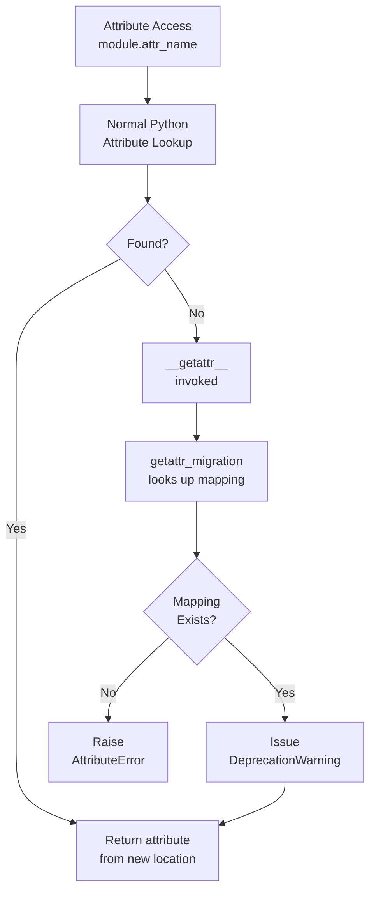

from pydantic_settings import BaseSettings
```

**Sources:** [pydantic/env_settings.py:1-5]()

---

### pydantic.decorator

The `decorator` module in V1 contained decorator utilities. In V2, the `@validate_call` decorator and related functionality are available directly from the main `pydantic` module.

**File Location:** [pydantic/decorator.py]()

**V1 Usage Example:**
```python
# V1 code that still works through backport
from pydantic.decorator import validate_arguments
```

**Sources:** [pydantic/decorator.py:1-5]()

---

## getattr_migration Mechanism

The `getattr_migration` function is the core of the backport system. It creates a custom `__getattr__` handler for a module that:

1. **Intercepts attribute access** when an attribute is not found in the module
2. **Issues deprecation warnings** to inform users that the import location is deprecated
3. **Resolves the new location** of the requested attribute in V2's structure
4. **Returns the attribute** from its new location

### Attribute Resolution Process



**Sources:** [pydantic/schema.py:3-5](), [pydantic/utils.py:3-5]()

---

## Usage Behavior

### Import Compatibility

When code attempts to import from a backported module location:

```python
# This still works in V2 but issues a deprecation warning
from pydantic.utils import some_utility
```

**Runtime Behavior:**

1. Python loads the backport module (e.g., `pydantic/utils.py`)
2. `some_utility` is not in the module's `__dict__`
3. Python calls `__getattr__('some_utility')`
4. `getattr_migration` is invoked
5. A `DeprecationWarning` is issued
6. The function resolves the new location
7. The attribute from the new location is returned

**Sources:** [pydantic/utils.py:1-5]()

---

### Deprecation Warnings

The backport system issues deprecation warnings to encourage migration to V2 patterns. These warnings:

- Identify the deprecated import path
- Suggest the new V2 import location
- Provide context for migration

This approach allows existing code to continue working while guiding users toward V2 best practices.

**Sources:** [pydantic/schema.py:1](), [pydantic/utils.py:1]()

---

## Migration Recommendations

### Short-term Strategy

For immediate V2 compatibility:

1. **Accept the warnings**: The backported modules allow code to run without immediate changes
2. **Plan migration**: Use deprecation warnings as a guide for what needs updating
3. **Prioritize changes**: Focus on frequently-used imports first

### Long-term Strategy

For sustainable V2 code:

1. **Remove backport dependencies**: Update imports to use V2 locations
2. **Install separate packages**: For `env_settings`, migrate to `pydantic-settings`
3. **Update to V2 APIs**: Use new V2 methods and patterns (see [V1 to V2 Migration](#8.1))
4. **Test thoroughly**: Ensure behavior matches expectations after migration

**Sources:** [pydantic/env_settings.py:1-5]()

---

## Testing Considerations

The test suite validates utility functions that were historically part of these backported modules:

### Utility Function Tests

The test file `tests/test_utils.py` covers various utilities that were part of the V1 `utils` module:

- **`import_string`**: Dynamic module/attribute importing ([tests/test_utils.py:35-46]())
- **`display_as_type`**: Type representation formatting ([tests/test_utils.py:60-102]())
- **`lenient_issubclass`**: Safe subclass checking ([tests/test_utils.py:105-120]())
- **`unique_list`**: Deduplication utilities ([tests/test_utils.py:123-133]())
- **`ValueItems`**: Include/exclude logic for nested data ([tests/test_utils.py:136-246]())
- **Alias generators**: `to_camel`, `to_pascal`, `to_snake` ([tests/test_utils.py:445-523]())

These utilities demonstrate the types of functions that were available through `pydantic.utils` in V1 and are now accessible through internal modules in V2.

**Sources:** [tests/test_utils.py:1-528]()

---

## Summary

The backported modules provide a compatibility layer that:

- **Enables gradual migration** from Pydantic V1 to V2
- **Maintains backwards compatibility** for existing import paths
- **Issues clear warnings** to guide users toward V2 patterns
- **Uses a consistent mechanism** across all five modules (`schema`, `utils`, `typing`, `env_settings`, `decorator`)

All backported modules rely on the `getattr_migration` function to intercept attribute access and redirect to new V2 locations, making the transition smoother for users with large existing codebases.

**Sources:** [pydantic/schema.py:1-5](), [pydantic/utils.py:1-5](), [pydantic/typing.py:1-5](), [pydantic/env_settings.py:1-5](), [pydantic/decorator.py:1-5]()