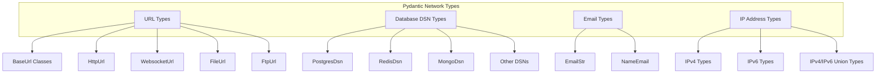
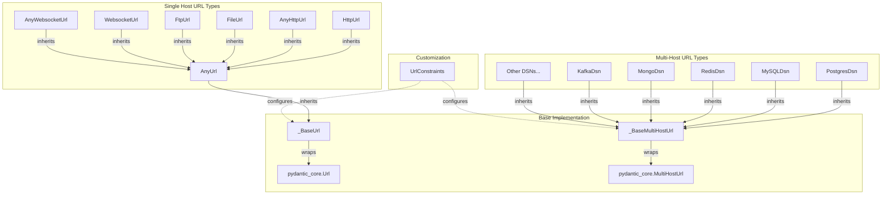

This page documents the network-related types in Pydantic, which provide specialized validation and handling for network data formats such as URLs, email addresses, IP addresses, and database connection strings. These types help ensure that network-related data is properly validated and structured for use in your applications.

## Core Network Types Overview

Pydantic offers several categories of network types that handle different types of network-related data:



Sources: [pydantic/networks.py:1-67]()(showing exported types), [pydantic/__init__.py:120-144]()

## URL Types Architecture

URL types in Pydantic are built on a hierarchical architecture with two base classes: `_BaseUrl` for single-host URLs and `_BaseMultiHostUrl` for URLs that can contain multiple hosts (commonly used in database connection strings).



Sources: [pydantic/networks.py:70-532]()

## Common URL Types

Pydantic provides several specialized URL types for different protocols:

| Type | Description | Constraints |
|------|-------------|------------|
| `AnyUrl` | Base type for all URLs | Any scheme allowed, TLD and host not required |
| `HttpUrl` | HTTP/HTTPS URLs | Only http/https schemes, max length 2083 |
| `AnyHttpUrl` | HTTP/HTTPS URLs with fewer constraints | Only http/https schemes |
| `FileUrl` | File URLs | Only file scheme |
| `FtpUrl` | FTP URLs | Only ftp scheme |
| `WebsocketUrl` | WebSocket URLs | Only ws/wss schemes, max length 2083 |
| `AnyWebsocketUrl` | WebSocket URLs with fewer constraints | Only ws/wss schemes |

Sources: [pydantic/networks.py:534-688]()

### URL Components and Properties

All URL types provide access to standard URL components:

```python