This document provides a high-level introduction to Pydantic's architecture, core concepts, and design philosophy. It explains what Pydantic is, its relationship with pydantic-core, and how the major systems interact.

For detailed information about specific subsystems, see:
- Model system details: [Core Model System](#2)
- Type system details: [Type System](#3)
- Validation and serialization: [Validation and Serialization](#4)
- Schema generation: [Schema Generation](#5)

## What is Pydantic

Pydantic is a data validation library for Python that uses Python type hints to validate, parse, and serialize data. It provides runtime type checking and data conversion, ensuring that data conforms to specified types and constraints.

The library's primary goal is to guarantee that the output data structure precisely conforms to the applied type hints, rather than simply checking input validity. This means Pydantic can coerce input data (e.g., converting string `"123"` to integer `123`) while ensuring the resulting instance meets all type requirements.

**Sources:** [pydantic/main.py:1-70](), [docs/concepts/models.md:1-52]()

## Core Architecture

Pydantic's architecture consists of three main layers: user-facing APIs, schema generation, and the validation/serialization engine.

### System Overview

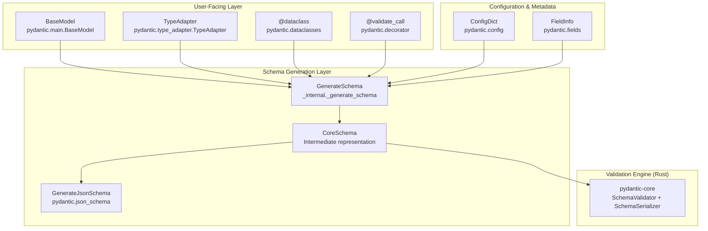

**Sources:** [pydantic/main.py:1-238](), [pydantic/type_adapter.py](), [pydantic/_internal/_generate_schema.py]()

### User-Facing APIs

Pydantic provides four primary entry points for validation:

| API | Purpose | Primary Use Case |
|-----|---------|------------------|
| `BaseModel` | Class-based models with fields | Domain models, API schemas, configuration |
| `TypeAdapter` | Validate arbitrary types | One-off validation, generic types, non-model scenarios |
| `@dataclass` | Enhanced dataclasses | Dataclass-style models with validation |
| `@validate_call` | Function argument validation | Validating function inputs and outputs |

All four APIs converge on the same schema generation and validation pipeline, ensuring consistent behavior across different usage patterns.

**Sources:** [pydantic/main.py:118-238](), [pydantic/type_adapter.py](), [pydantic/dataclasses.py](), [pydantic/decorator.py]()

### Pydantic-Core Integration

Pydantic's performance-critical validation and serialization logic is implemented in `pydantic-core`, a separate Rust library. The relationship is strictly versioned:

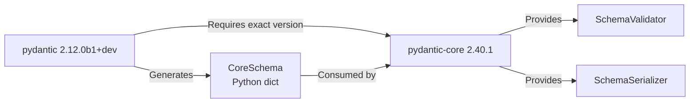

The version compatibility is enforced at import time:

- **Current Pydantic version:** `2.12.0b1+dev` [pydantic/version.py:11]()
- **Required pydantic-core version:** `2.40.1` [pydantic/version.py:22]()
- **Compatibility check:** `_ensure_pydantic_core_version()` [pydantic/version.py:82-98]()

**Sources:** [pydantic/version.py:1-114](), [pydantic/_internal/_generate_schema.py]()

## Main Workflows

### Validation Pipeline

The validation process transforms raw input data into validated model instances through multiple stages:

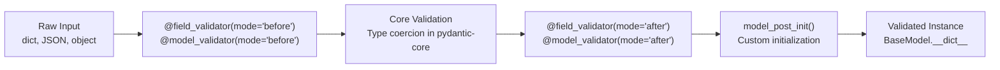

Key validation entry points:
- `BaseModel.__init__(self, **data)` [pydantic/main.py:240-257]()
- `BaseModel.model_validate(cls, obj)` [pydantic/main.py:653-699]()
- `BaseModel.model_validate_json(cls, json_data)` [pydantic/main.py:702-743]()
- `TypeAdapter.validate_python(obj)` and `TypeAdapter.validate_json(json_data)`

The actual validation is delegated to `SchemaValidator` from pydantic-core:
- Stored in `cls.__pydantic_validator__` [pydantic/main.py:197-198]()
- Called via `validate_python()`, `validate_json()`, or `validate_strings()` methods

**Sources:** [pydantic/main.py:240-781](), [docs/concepts/validators.md:1-50]()

### Serialization Pipeline

Serialization converts validated model instances into dictionaries or JSON strings:

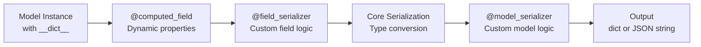

Key serialization methods:
- `model_dump(mode='python'|'json')` [pydantic/main.py:418-474]()
- `model_dump_json()` [pydantic/main.py:476-534]()

The serialization is handled by `SchemaSerializer` from pydantic-core:
- Stored in `cls.__pydantic_serializer__` [pydantic/main.py:194-195]()
- Called via `to_python()` or `to_json()` methods

**Sources:** [pydantic/main.py:418-534](), [docs/concepts/serialization.md:1-50]()

### Schema Generation Flow

Schema generation is a two-stage process: first generating CoreSchema for validation, then optionally generating JSON Schema for documentation:

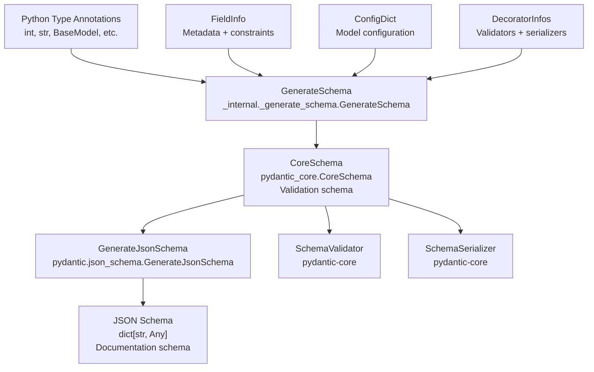

The schema generation process:

1. **Type Analysis:** Python type annotations are analyzed using `GenerateSchema` class [pydantic/_internal/_generate_schema.py]()
2. **CoreSchema Creation:** Types are converted to CoreSchema format understood by pydantic-core
3. **Validator/Serializer Creation:** CoreSchema is used to build `SchemaValidator` and `SchemaSerializer` instances
4. **JSON Schema Generation:** Optionally, CoreSchema is converted to JSON Schema for API documentation

**Sources:** [pydantic/_internal/_generate_schema.py](), [pydantic/json_schema.py](), [docs/concepts/json_schema.md:1-50]()

## Field and Configuration System

### Field Definition

Fields are defined using `FieldInfo` instances, which store metadata and constraints:

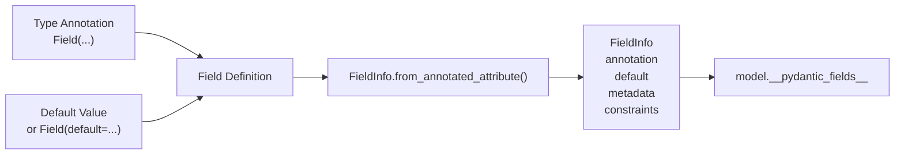

Fields can be defined in three ways:
1. Bare annotation: `field_name: int` [pydantic/fields.py:295-351]()
2. With default: `field_name: int = 10` [pydantic/fields.py:354-447]()
3. Using `Field()`: `field_name: int = Field(default=10, gt=0)` [pydantic/fields.py:267-292]()

**Sources:** [pydantic/fields.py:98-733](), [pydantic/_internal/_fields.py]()

### Configuration Hierarchy

Configuration can be specified at multiple levels:

| Level | Syntax | Priority |
|-------|--------|----------|
| Model | `model_config = ConfigDict(...)` | Lowest |
| Field | `Field(frozen=True, ...)` | Medium |
| Type | `Annotated[int, Strict()]` | Highest |

Configuration is processed by `ConfigWrapper` [pydantic/_internal/_config.py]() and merged during schema generation.

**Sources:** [pydantic/config.py](), [pydantic/_internal/_config.py](), [docs/concepts/config.md:1-50]()

## Model Lifecycle

The lifecycle of a Pydantic model class from definition to usage:

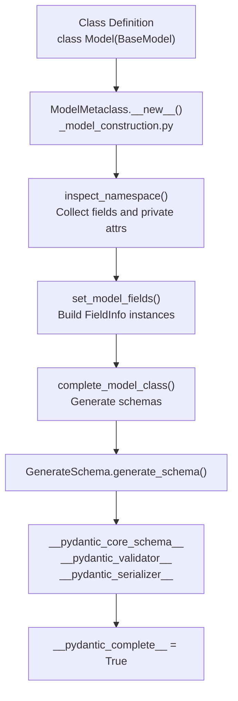

Key lifecycle steps:

1. **Metaclass invocation:** `ModelMetaclass.__new__()` [pydantic/_internal/_model_construction.py:80-276]()
2. **Namespace inspection:** `inspect_namespace()` identifies fields vs class vars [pydantic/_internal/_model_construction.py:520-642]()
3. **Field collection:** `set_model_fields()` creates `FieldInfo` instances [pydantic/_internal/_model_construction.py:299-331]()
4. **Schema generation:** `complete_model_class()` builds validation/serialization schemas [pydantic/_internal/_model_construction.py:387-518]()
5. **Completion:** Model marked as complete in `__pydantic_complete__` [pydantic/main.py:167-168]()

Models can be rebuilt after definition using `model_rebuild()` [pydantic/main.py:593-650]() if forward references need resolution.

**Sources:** [pydantic/_internal/_model_construction.py:79-277](), [pydantic/_internal/_model_construction.py:387-518](), [pydantic/main.py:593-650]()

## Class Attributes Reference

Every `BaseModel` subclass has these key class attributes:

| Attribute | Type | Description |
|-----------|------|-------------|
| `model_config` | `ConfigDict` | Configuration dictionary [pydantic/main.py:153-156]() |
| `__pydantic_core_schema__` | `CoreSchema` | Core validation schema [pydantic/main.py:170-171]() |
| `__pydantic_validator__` | `SchemaValidator` | Validation engine instance [pydantic/main.py:197-198]() |
| `__pydantic_serializer__` | `SchemaSerializer` | Serialization engine instance [pydantic/main.py:194-195]() |
| `__pydantic_fields__` | `dict[str, FieldInfo]` | Field definitions [pydantic/main.py:200-203]() |
| `__pydantic_computed_fields__` | `dict[str, ComputedFieldInfo]` | Computed field definitions [pydantic/main.py:208-209]() |
| `__pydantic_decorators__` | `DecoratorInfos` | Validator/serializer decorators [pydantic/main.py:177-179]() |
| `__pydantic_complete__` | `bool` | Whether model building is complete [pydantic/main.py:167-168]() |

**Sources:** [pydantic/main.py:118-238]()

## Instance Attributes Reference

Every `BaseModel` instance has these instance attributes:

| Attribute | Type | Description |
|-----------|------|-------------|
| `__dict__` | `dict[str, Any]` | Field values storage |
| `__pydantic_fields_set__` | `set[str]` | Fields explicitly set during init [pydantic/main.py:214-215]() |
| `__pydantic_extra__` | `dict[str, Any] \| None` | Extra fields when `extra='allow'` [pydantic/main.py:211-212]() |
| `__pydantic_private__` | `dict[str, Any] \| None` | Private attribute values [pydantic/main.py:217-218]() |

**Sources:** [pydantic/main.py:211-238]()

## Project Structure

The Pydantic codebase is organized into several key directories:

```
pydantic/
├── main.py              # BaseModel implementation
├── fields.py            # FieldInfo and Field() function
├── config.py            # ConfigDict definition
├── types.py             # Custom types (URL, Email, etc.)
├── type_adapter.py      # TypeAdapter implementation
├── dataclasses.py       # Enhanced dataclass support
├── json_schema.py       # JSON Schema generation
├── functional_validators.py    # Validator decorators
├── functional_serializers.py   # Serializer decorators
└── _internal/
    ├── _model_construction.py  # ModelMetaclass
    ├── _generate_schema.py     # GenerateSchema class
    ├── _fields.py              # Field collection logic
    ├── _decorators.py          # Decorator processing
    ├── _config.py              # ConfigWrapper
    └── _namespace_utils.py     # Type resolution
```

**Sources:** [pydantic/main.py:1](), [pydantic/fields.py:1](), [pydantic/_internal/_model_construction.py:1]()

## Migration from V1

Pydantic V2 represents a major rewrite with significant API changes. The key differences:

| V1 API | V2 API | Notes |
|--------|--------|-------|
| `parse_obj()` | `model_validate()` | Method renamed |
| `parse_raw()` | `model_validate_json()` | Specialized for JSON |
| `dict()` | `model_dump()` | Method renamed |
| `json()` | `model_dump_json()` | Method renamed |
| `__fields__` | `model_fields` | Now a property |
| `__validators__` | `__pydantic_decorators__` | Structure changed |

A V1 compatibility layer is available through `pydantic.v1` imports for gradual migration.

**Sources:** [docs/migration.md:1-150](), [pydantic/_migration.py]()

## Performance Considerations

Pydantic V2's performance characteristics:

1. **Rust-based validation:** Core validation logic runs in Rust for significant speedup
2. **Schema caching:** Validators and serializers are cached on the class [pydantic/_internal/_model_construction.py]()
3. **JSON parsing:** `model_validate_json()` is faster than `model_validate(json.loads())` [docs/concepts/performance.md:5-16]()
4. **Deferred building:** Models can defer schema generation with `defer_build=True` config

**Sources:** [docs/concepts/performance.md:1-50](), [pydantic/_internal/_model_construction.py:247-258]()

# Core Model System


## Purpose and Scope

This document covers the foundational model system that powers Pydantic's validation and serialization capabilities. The Core Model System encompasses `BaseModel` (the base class for all Pydantic models), the metaclass-based model construction pipeline, field collection and management, and the model lifecycle from instantiation through validation to serialization.

For information about specific field types and constraints, see [Type System](#3). For details on validators and serializers that customize the data transformation pipeline, see [Validation and Serialization](#4). For schema generation internals, see [Schema Generation](#5).

---

## System Overview

The Core Model System is built on three foundational components that work together to provide Pydantic's declarative validation framework:

**BaseModel Class Hierarchy**

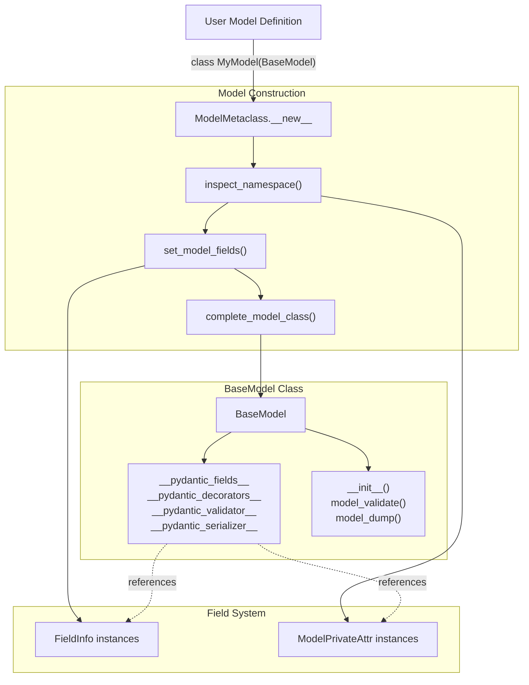

Sources: [pydantic/main.py:118-239](), [pydantic/_internal/_model_construction.py:79-277]()

---

## BaseModel Class

`BaseModel` is the foundational class that all Pydantic models inherit from. It provides the core validation, serialization, and model management capabilities.

### Class Attributes

The `BaseModel` class maintains several class-level attributes that define model structure and behavior:

| Attribute | Type | Purpose |
|-----------|------|---------|
| `model_config` | `ConfigDict` | Configuration dictionary controlling model behavior |
| `__pydantic_fields__` | `dict[str, FieldInfo]` | Field definitions and metadata |
| `__pydantic_computed_fields__` | `dict[str, ComputedFieldInfo]` | Computed field definitions |
| `__pydantic_decorators__` | `DecoratorInfos` | Collected validators and serializers |
| `__pydantic_validator__` | `SchemaValidator \| PluggableSchemaValidator` | pydantic-core validator instance |
| `__pydantic_serializer__` | `SchemaSerializer` | pydantic-core serializer instance |
| `__pydantic_core_schema__` | `CoreSchema` | Generated validation schema |
| `__private_attributes__` | `dict[str, ModelPrivateAttr]` | Private attribute definitions |
| `__class_vars__` | `set[str]` | Names of class variables |

Sources: [pydantic/main.py:151-219]()

### Instance Attributes

Each `BaseModel` instance maintains these attributes:

| Attribute | Type | Purpose |
|-----------|------|---------|
| `__dict__` | `dict[str, Any]` | Field values |
| `__pydantic_fields_set__` | `set[str]` | Names of fields explicitly set during initialization |
| `__pydantic_extra__` | `dict[str, Any] \| None` | Extra fields (when `extra='allow'`) |
| `__pydantic_private__` | `dict[str, Any] \| None` | Private attribute values |

Sources: [pydantic/main.py:211-218]()

### Core Methods

**BaseModel Method Mapping**

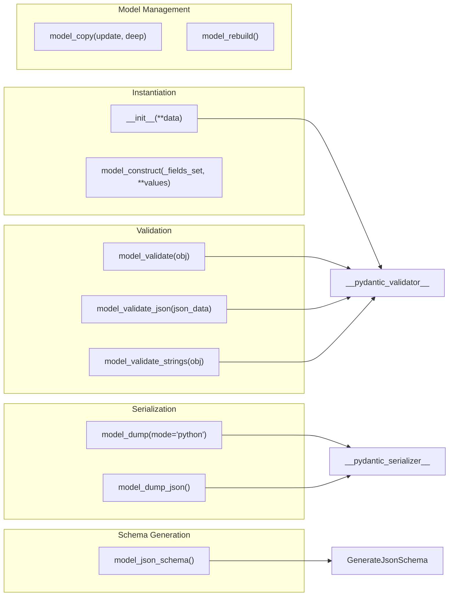

Sources: [pydantic/main.py:240-782]()

#### Initialization: `__init__`

The `__init__` method validates input data and creates a model instance:

```python
def __init__(self, /, **data: Any) -> None:
    __tracebackhide__ = True
    validated_self = self.__pydantic_validator__.validate_python(data, self_instance=self)
    if self is not validated_self:
        warnings.warn(...)
```

- Takes keyword arguments as input data
- Delegates to `__pydantic_validator__.validate_python()`
- Returns `self` after validation
- Raises `ValidationError` if validation fails

Sources: [pydantic/main.py:240-260]()

#### Construction Without Validation: `model_construct`

`model_construct` creates instances from trusted data without validation:

```python
@classmethod
def model_construct(cls, _fields_set: set[str] | None = None, **values: Any) -> Self:
```

- Respects `model_config.extra` setting
- Handles field aliases (both `alias` and `validation_alias`)
- Applies default values for missing fields
- Useful for creating instances from database records or API responses
- Calls `model_post_init()` if defined

Sources: [pydantic/main.py:304-382]()

#### Validation Methods

Three validation methods handle different input formats:

| Method | Input Type | Use Case |
|--------|------------|----------|
| `model_validate(obj)` | Python objects (dict, model instances) | General validation |
| `model_validate_json(json_data)` | JSON strings/bytes | API request parsing |
| `model_validate_strings(obj)` | String-valued dictionaries | URL query parameters, form data |

All support common parameters: `strict`, `extra`, `from_attributes`, `context`, `by_alias`, `by_name`.

Sources: [pydantic/main.py:652-781]()

#### Serialization Methods

| Method | Output Format | Parameters |
|--------|---------------|------------|
| `model_dump(mode='python')` | Python dict | `include`, `exclude`, `exclude_unset`, `exclude_defaults`, `exclude_none` |
| `model_dump_json()` | JSON string | Same as `model_dump` plus `indent`, `ensure_ascii` |

Both methods delegate to `__pydantic_serializer__` with configurable filtering and formatting options.

Sources: [pydantic/main.py:418-534]()

---

## Model Construction Pipeline

The model construction process is orchestrated by `ModelMetaclass`, which transforms a class definition into a fully-functional Pydantic model.

### ModelMetaclass Pipeline

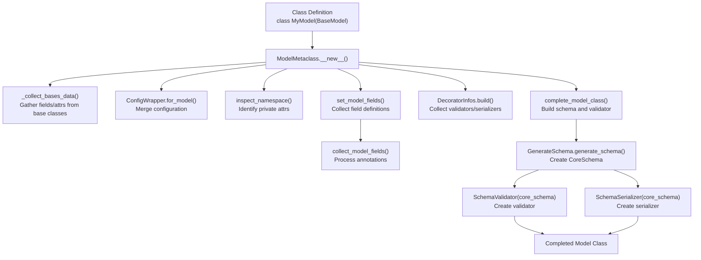

Sources: [pydantic/_internal/_model_construction.py:80-277]()

### Namespace Inspection

The `inspect_namespace` function processes the class namespace to identify and categorize attributes:

**Namespace Inspection Flow**

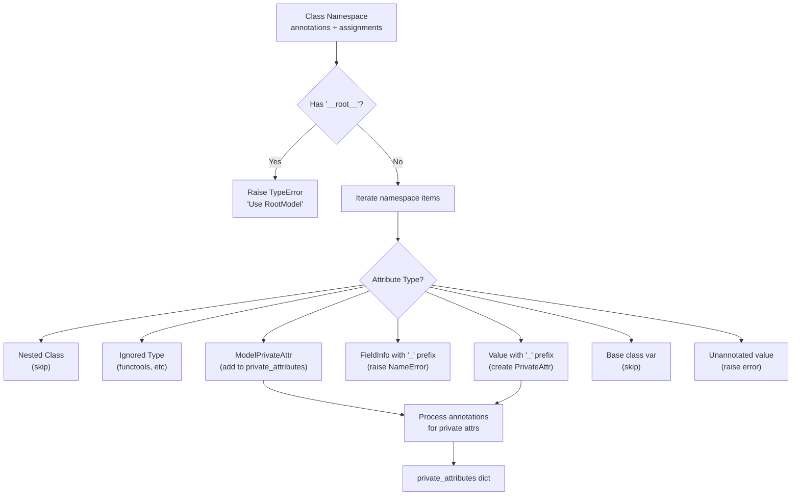

Sources: [pydantic/_internal/_model_construction.py:384-518]()

### Field Collection

The `collect_model_fields` function (in `_internal/_fields.py`) processes type annotations to build the field dictionary:

1. **Gather annotations** from the class and its bases
2. **Resolve forward references** using the namespace resolver
3. **Create FieldInfo instances** via `FieldInfo.from_annotation()` or `FieldInfo.from_annotated_attribute()`
4. **Apply type variable substitutions** for generic models
5. **Identify class variables** (annotated with `ClassVar`)
6. **Validate field names** (no leading underscores except for private attrs)

Sources: [pydantic/_internal/_fields.py:84-223]()

### Schema Building and Completion

The `complete_model_class` function finalizes the model by:

1. Generating the core schema via `GenerateSchema`
2. Creating the `SchemaValidator` from the core schema
3. Creating the `SchemaSerializer` from the core schema
4. Generating the `__signature__` for `__init__`
5. Setting up computed fields
6. Configuring `__setattr__` handlers

**Schema and Validator Creation**

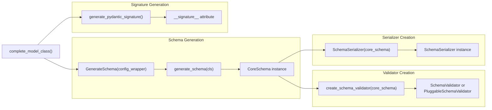

Sources: [pydantic/_internal/_model_construction.py:580-678]()

---

## Model Lifecycle

A model instance progresses through several stages from creation to serialization.

### Initialization Flow

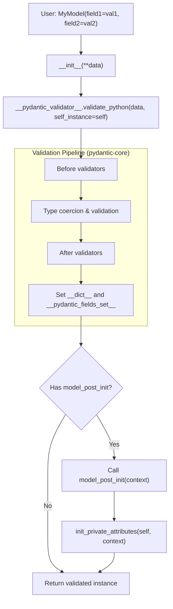

Sources: [pydantic/main.py:240-260](), [pydantic/_internal/_model_construction.py:354-370]()

### Attribute Access and Assignment

`BaseModel` customizes attribute access through `__setattr__` and `__delattr__`:

**Setattr Handler Selection**

The model maintains `__pydantic_setattr_handlers__` mapping field names to handler functions:

| Handler Type | Condition | Action |
|-------------|-----------|--------|
| `'model_field'` | Regular field, no validation | Set `__dict__[name] = val` and add to `__pydantic_fields_set__` |
| `'validate_assignment'` | `validate_assignment=True` | Call `__pydantic_validator__.validate_assignment(self, name, val)` |
| `'private'` | Private attribute (starts with `_`) | Set in `__pydantic_private__` dict |
| `'cached_property'` | `functools.cached_property` | Set in `__dict__` directly |
| `'extra_known'` | Extra field (when `extra='allow'`) | Use `object.__setattr__` |

The handler is selected and memoized in `__pydantic_setattr_handlers__` for performance.

Sources: [pydantic/main.py:837-933](), [pydantic/main.py:94-115]()

### Private Attributes

Private attributes (prefixed with `_`) are stored separately in `__pydantic_private__` and are not validated or serialized:

**Private Attribute Handling**

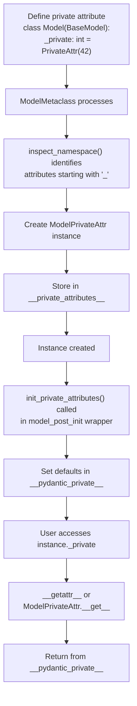

Sources: [pydantic/_internal/_model_construction.py:354-370](), [pydantic/main.py:994-1019]()

Private attributes support:
- Default values via `PrivateAttr(default=...)`
- Factory functions via `PrivateAttr(default_factory=...)`
- Descriptors implementing `__get__`, `__set__`, `__delete__`
- Type annotations without assignments

Sources: [pydantic/fields.py:1128-1237]()

---

## Configuration System

Model behavior is controlled through `model_config`, a `ConfigDict` instance.

### Configuration Inheritance

Configuration is inherited and merged through the model hierarchy:

**Config Wrapper Creation**

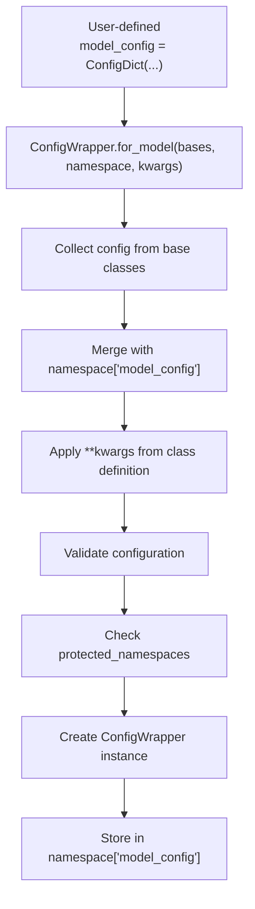

Sources: [pydantic/_internal/_config.py:71-121]()

### Key Configuration Options

| Option | Default | Effect on Model Construction |
|--------|---------|----------------------------|
| `strict` | `False` | Enables strict validation mode |
| `extra` | `'ignore'` | Controls handling of extra fields: `'allow'`, `'ignore'`, `'forbid'` |
| `frozen` | `False` | Makes instances immutable; raises `ValidationError` on attribute assignment |
| `validate_assignment` | `False` | Validates field values on attribute assignment |
| `validate_default` | `False` | Validates default values during model construction |
| `from_attributes` | `False` | Allows populating fields from object attributes (for ORM integration) |
| `defer_build` | `False` | Delays schema building until first use |
| `protected_namespaces` | `('model_',)` | Warns about field names conflicting with these prefixes |

Sources: [pydantic/config.py:31-286]()

---

## Model Field Management

### FieldInfo Structure

Each field is represented by a `FieldInfo` instance containing:

| Attribute | Purpose |
|-----------|---------|
| `annotation` | The field's type annotation |
| `default` | Default value (if not required) |
| `default_factory` | Callable to generate default value |
| `alias` | Alternative name for serialization |
| `validation_alias` | Alternative name(s) for validation input |
| `serialization_alias` | Alternative name for serialization output |
| `title` | Field title for JSON schema |
| `description` | Field description for JSON schema |
| `metadata` | List of metadata objects (constraints, validators) |
| `frozen` | Whether field is immutable |
| `validate_default` | Whether to validate the default value |

Sources: [pydantic/fields.py:98-265]()

### Field Creation Methods

`FieldInfo` instances are created through three factory methods:

**FieldInfo Factory Methods**

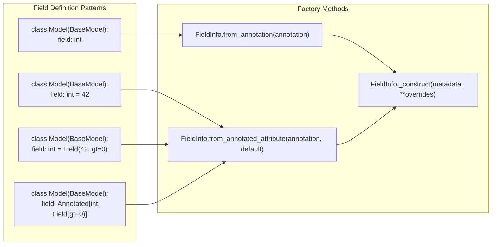

Sources: [pydantic/fields.py:295-521]()

1. **`from_annotation(annotation)`**: For bare type annotations without default values
2. **`from_annotated_attribute(annotation, default)`**: For annotations with assigned values
3. **`_construct(metadata, **attr_overrides)`**: Merges multiple `FieldInfo` instances from `Annotated` metadata

### Field Metadata Collection

The `_collect_metadata` method transforms Field arguments into metadata objects:

| Argument | Metadata Type |
|----------|--------------|
| `gt`, `ge`, `lt`, `le` | `annotated_types.Gt`, `Ge`, `Lt`, `Le` |
| `multiple_of` | `annotated_types.MultipleOf` |
| `min_length`, `max_length` | `annotated_types.MinLen`, `MaxLen` |
| `strict` | `types.Strict` |
| `pattern`, `allow_inf_nan`, etc. | `PydanticGeneralMetadata` |

Sources: [pydantic/fields.py:622-649]()

---

## Advanced Topics

### Model Rebuilding

The `model_rebuild()` method regenerates the schema and validator when forward references couldn't be resolved during initial construction:

```python
@classmethod
def model_rebuild(
    cls,
    *,
    force: bool = False,
    raise_errors: bool = True,
    _parent_namespace_depth: int = 2,
    _types_namespace: MappingNamespace | None = None,
) -> bool | None:
```

Process:
1. Check if model is already complete (skip if `force=False`)
2. Delete existing schema/validator/serializer
3. Resolve parent namespace
4. Call `complete_model_class()` again with namespace resolver

Sources: [pydantic/main.py:593-650]()

### Dynamic Model Creation

The `create_model` function creates model classes programmatically:

```python
from pydantic import create_model

DynamicModel = create_model(
    'DynamicModel',
    field1=(int, ...),  # required field
    field2=(str, 'default'),  # field with default
    __config__=ConfigDict(frozen=True),
    __base__=BaseModel,
    __module__='my_module',
)
```

The function:
1. Creates a new namespace dict
2. Processes field definitions into `FieldInfo` objects
3. Calls `ModelMetaclass.__new__` to construct the class
4. Optionally sets `__module__` for proper pickle support

Sources: [pydantic/main.py:1367-1533]()

### Frozen Models and Hashing

When `frozen=True`, the metaclass automatically generates a `__hash__` method:

**Hash Function Generation**

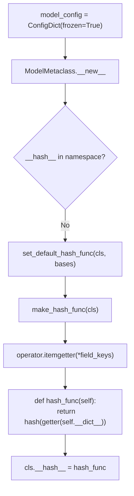

The hash function:
- Uses `operator.itemgetter` to extract field values
- Hashes only the model fields (not extras or private attrs)
- Handles missing keys gracefully via `SafeGetItemProxy`

Sources: [pydantic/_internal/_model_construction.py:521-547]()

---

## Key Implementation Details

### Mock Validators and Serializers

Before schema building completes, models use mock validators/serializers that raise helpful errors:

```python
if not TYPE_CHECKING:
    __pydantic_core_schema__ = _mock_val_ser.MockCoreSchema(
        'Pydantic models should inherit from BaseModel, BaseModel cannot be instantiated directly',
        code='base-model-instantiated',
    )
```

This prevents instantiation of incomplete models and provides clear error messages.

Sources: [pydantic/main.py:220-236](), [pydantic/_internal/_mock_val_ser.py:1-100]()

### Setattr Handler Memoization

For performance, `__setattr__` memoizes handler selection in `__pydantic_setattr_handlers__`:

```python
try:
    handler = self.__pydantic_setattr_handlers__[name]
except KeyError:
    # Determine handler type and memoize it
    ...
    handler = _SIMPLE_SETATTR_HANDLERS[handler_type]
    self.__pydantic_setattr_handlers__[name] = handler

handler(self, name, value)
```

This avoids repeated isinstance checks and configuration lookups.

Sources: [pydantic/main.py:837-933]()

### Model Copy

The `model_copy()` method creates a shallow or deep copy:

```python
def model_copy(self, *, update: Mapping[str, Any] | None = None, deep: bool = False) -> Self:
    copied = self.__deepcopy__() if deep else self.__copy__()
    if update:
        # Update fields and handle extra fields
        ...
    return copied
```

- Copies `__dict__` (may have unexpected effects for cached properties)
- Optionally applies updates (not validated)
- Handles `extra='allow'` by distinguishing fields from extras

Sources: [pydantic/main.py:384-416]()

---

## Summary

The Core Model System provides a comprehensive framework for declarative data validation through:

1. **`BaseModel`** - The base class with validation, serialization, and configuration
2. **`ModelMetaclass`** - The metaclass orchestrating field collection, schema generation, and model completion
3. **`FieldInfo`** - Rich field metadata supporting aliases, defaults, and constraints
4. **Private Attributes** - Separate storage for non-validated instance data
5. **Configuration** - Flexible behavior control through `ConfigDict`
6. **Model Lifecycle** - Well-defined stages from construction to validation to serialization

The system leverages `pydantic-core` (Rust) for the performance-critical validation and serialization operations, while the Python layer handles declarative schema definition and model construction.

For field-level customization through validators and serializers, see [Validation and Serialization](#4). For understanding how Python types are converted to validation schemas, see [Schema Generation](#5).