This document describes Pydantic's plugin system, which allows external code to hook into the validation lifecycle through event handlers. Plugins can observe validation inputs, outputs, errors, and exceptions for all validation methods (`validate_python`, `validate_json`, `validate_strings`).

For information about custom validators and serializers at the field or model level, see [Validators](#4.1) and [Serializers](#4.2). For type-level customization hooks, see [Core Schema Generation](#5.1).

## Overview

The plugin system provides a way to instrument Pydantic's validation process without modifying models or types. Plugins implement the `PydanticPluginProtocol` and receive callbacks at key points during validation:

- **on_enter**: Before validation begins
- **on_success**: After successful validation
- **on_error**: When validation fails
- **on_exception**: When an unexpected exception occurs

Plugins are invoked automatically whenever a `SchemaValidator` is created for BaseModels, TypeAdapters, dataclasses, `validate_call`, or `create_model`.

**Sources:** [pydantic/plugin/__init__.py:1-194]()

## Plugin Protocol

### PydanticPluginProtocol

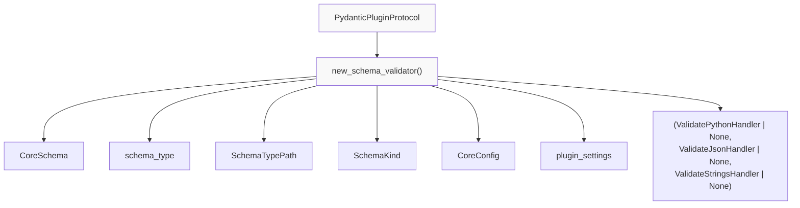

Plugins must implement a single method that returns event handlers for each of the three validation modes:

| Parameter | Type | Description |
|-----------|------|-------------|
| `schema` | `CoreSchema` | The pydantic-core schema for validation |
| `schema_type` | `Any` | The original Python type (e.g., model class) |
| `schema_type_path` | `SchemaTypePath` | Module and name where the type was defined |
| `schema_kind` | `SchemaKind` | One of: `'BaseModel'`, `'TypeAdapter'`, `'dataclass'`, `'create_model'`, `'validate_call'` |
| `config` | `CoreConfig \| None` | Core configuration for the validator |
| `plugin_settings` | `dict[str, object]` | Settings passed via `plugin_settings` in model config |

**Sources:** [pydantic/plugin/__init__.py:40-73]()

### SchemaTypePath and SchemaKind

```python
class SchemaTypePath(NamedTuple):
    module: str  # e.g., "myapp.models"
    name: str    # e.g., "User" or "validate_func.<locals>.func"

SchemaKind = Literal['BaseModel', 'TypeAdapter', 'dataclass', 'create_model', 'validate_call']
```

The `SchemaTypePath` identifies where a schema was created, useful for filtering which schemas a plugin should observe. The `SchemaKind` indicates what API created the schema.

**Sources:** [pydantic/plugin/__init__.py:30-37]()

## Event Handler Protocols

### Handler Lifecycle

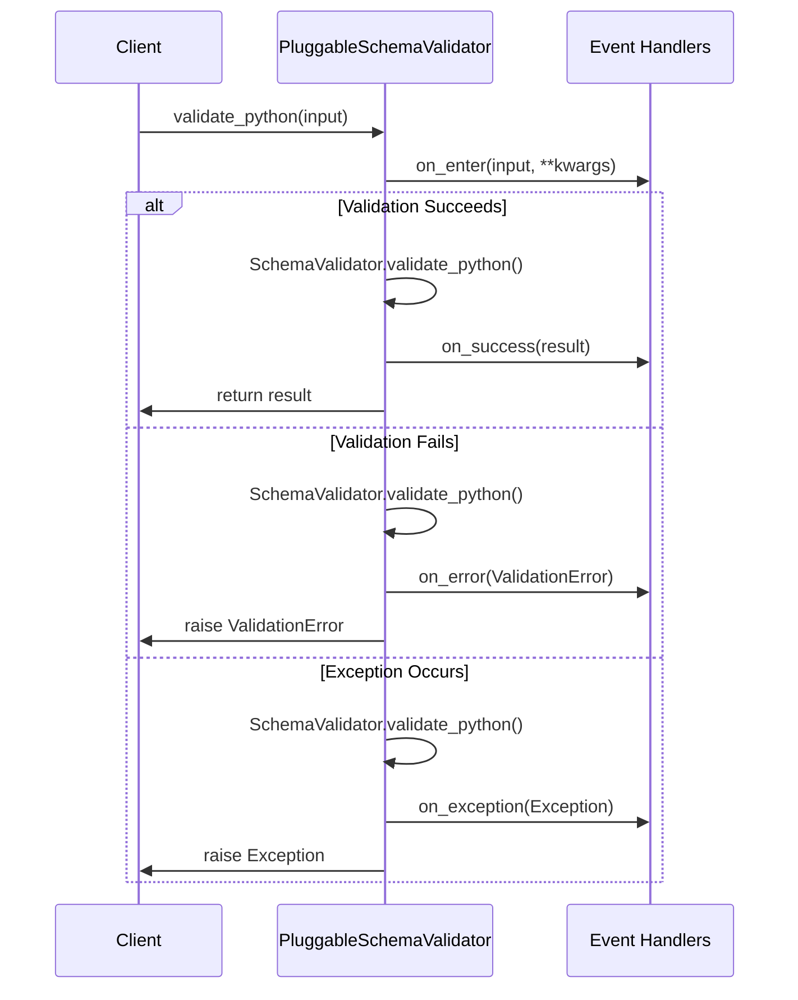

Each handler protocol defines four callback methods. All methods have default no-op implementations, so plugins only need to implement the callbacks they care about.

**Sources:** [pydantic/plugin/_schema_validator.py:96-126]()

### ValidatePythonHandlerProtocol

Handles events for `validate_python()` calls:

```python
class ValidatePythonHandlerProtocol(Protocol):
    def on_enter(
        self,
        input: Any,
        *,
        strict: bool | None = None,
        extra: ExtraValues | None = None,
        from_attributes: bool | None = None,
        context: dict[str, Any] | None = None,
        self_instance: Any | None = None,
        by_alias: bool | None = None,
        by_name: bool | None = None,
    ) -> None: ...
    
    def on_success(self, result: Any) -> None: ...
    def on_error(self, error: ValidationError) -> None: ...
    def on_exception(self, exception: Exception) -> None: ...
```

The `self_instance` parameter is populated when validation occurs during model `__init__`, allowing plugins to observe the model instance being initialized.

**Sources:** [pydantic/plugin/__init__.py:110-138]()

### ValidateJsonHandlerProtocol

Handles events for `validate_json()` calls with JSON string/bytes input:

```python
class ValidateJsonHandlerProtocol(Protocol):
    def on_enter(
        self,
        input: str | bytes | bytearray,
        *,
        strict: bool | None = None,
        extra: ExtraValues | None = None,
        context: dict[str, Any] | None = None,
        self_instance: Any | None = None,
        by_alias: bool | None = None,
        by_name: bool | None = None,
    ) -> None: ...
    
    def on_success(self, result: Any) -> None: ...
    def on_error(self, error: ValidationError) -> None: ...
    def on_exception(self, exception: Exception) -> None: ...
```

**Sources:** [pydantic/plugin/__init__.py:140-166]()

### ValidateStringsHandlerProtocol

Handles events for `validate_strings()` calls:

```python
class ValidateStringsHandlerProtocol(Protocol):
    def on_enter(
        self,
        input: dict[str, StringInput],  # StringInput = dict[str, StringInput] (recursive)
        *,
        strict: bool | None = None,
        extra: ExtraValues | None = None,
        context: dict[str, Any] | None = None,
        by_alias: bool | None = None,
        by_name: bool | None = None,
    ) -> None: ...
    
    def on_success(self, result: Any) -> None: ...
    def on_error(self, error: ValidationError) -> None: ...
    def on_exception(self, exception: Exception) -> None: ...
```

**Sources:** [pydantic/plugin/__init__.py:171-193]()

## PluggableSchemaValidator

### Architecture

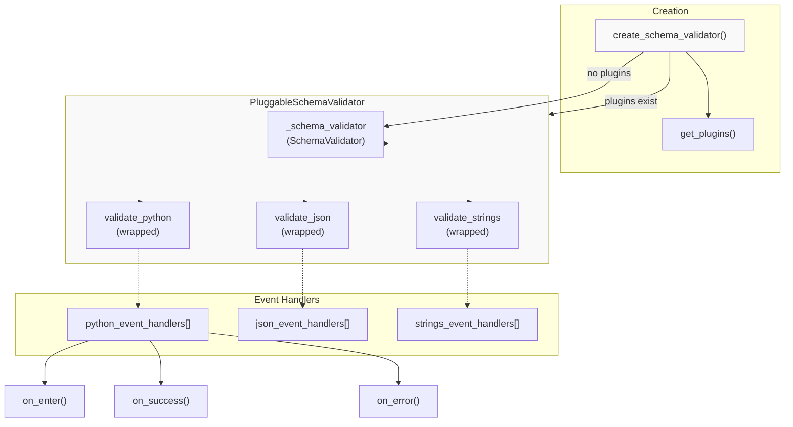

The `PluggableSchemaValidator` wraps a standard `SchemaValidator` and intercepts its validation methods. When plugins are registered, `create_schema_validator()` returns a `PluggableSchemaValidator` instead of a plain `SchemaValidator`.

**Sources:** [pydantic/plugin/_schema_validator.py:22-52](), [pydantic/plugin/_schema_validator.py:54-94]()

### Wrapper Construction

The `build_wrapper()` function creates wrapper methods that invoke event handlers:

| Step | Action |
|------|--------|
| 1. Filter handlers | Only include handlers with custom (non-protocol) implementations |
| 2. Extract callbacks | Collect all `on_enter`, `on_success`, `on_error`, `on_exception` methods |
| 3. Wrap function | Create wrapper that calls handlers at appropriate points |

```python
# Simplified wrapper logic
def wrapper(*args, **kwargs):
    for on_enter_handler in on_enters:
        on_enter_handler(*args, **kwargs)
    
    try:
        result = func(*args, **kwargs)  # Call actual SchemaValidator method
    except ValidationError as error:
        for on_error_handler in on_errors:
            on_error_handler(error)
        raise
    except Exception as exception:
        for on_exception_handler in on_exceptions:
            on_exception_handler(exception)
        raise
    else:
        for on_success_handler in on_successes:
            on_success_handler(result)
        return result
```

The `filter_handlers()` function checks if a method is implemented by the plugin (not inherited from the protocol) by checking if `handler.__module__ == 'pydantic.plugin'`.

**Sources:** [pydantic/plugin/_schema_validator.py:96-141]()

## Plugin Registration

### Integration Points

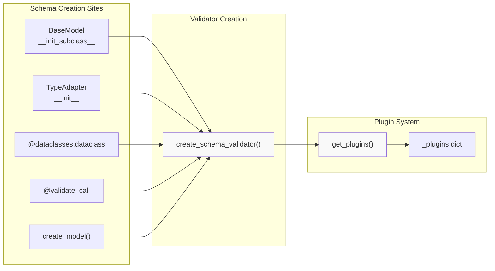

All schema validation entry points use `create_schema_validator()` to construct validators:

| Entry Point | Schema Kind | Location |
|-------------|-------------|----------|
| BaseModel | `'BaseModel'` | Model metaclass during class creation |
| TypeAdapter | `'TypeAdapter'` | `TypeAdapter._init_core_attrs()` |
| @dataclasses.dataclass | `'dataclass'` | Dataclass wrapper initialization |
| @validate_call | `'validate_call'` | `ValidateCallWrapper._create_validators()` |
| create_model() | `'create_model'` | Dynamic model creation |

**Sources:** [pydantic/type_adapter.py:321-330](), [pydantic/_internal/_validate_call.py:91-104]()

### Plugin Settings

Models can pass settings to plugins via the `plugin_settings` configuration:

```python
class Model(BaseModel, plugin_settings={'observe': 'all', 'custom_key': 'value'}):
    field: int
```

These settings are passed to `PydanticPluginProtocol.new_schema_validator()` as the `plugin_settings` parameter, allowing plugins to customize behavior per schema.

**Sources:** [tests/test_plugins.py:68-76]()

## Usage Examples

### Basic Logging Plugin

```python
from typing import Any
from pydantic.plugin import PydanticPluginProtocol, ValidatePythonHandlerProtocol

class LoggingHandler(ValidatePythonHandlerProtocol):
    def on_enter(self, input: Any, **kwargs) -> None:
        print(f"Validating: {input}")
    
    def on_success(self, result: Any) -> None:
        print(f"Success: {result}")
    
    def on_error(self, error: ValidationError) -> None:
        print(f"Validation failed: {error}")

class LoggingPlugin(PydanticPluginProtocol):
    def new_schema_validator(self, schema, schema_type, schema_type_path, 
                             schema_kind, config, plugin_settings):
        # Return handler for validate_python only
        return LoggingHandler(), None, None
```

**Sources:** [tests/test_plugins.py:126-165]()

### Stateful Plugin with Cleanup

Plugins can maintain state across validation calls:

```python
class StackTracker(ValidatePythonHandlerProtocol):
    def __init__(self):
        self.stack = []
    
    def on_enter(self, input: Any, **kwargs) -> None:
        self.stack.append(input)
    
    def on_success(self, result: Any) -> None:
        self.stack.pop()
    
    def on_error(self, error: ValidationError) -> None:
        self.stack.pop()
    
    def on_exception(self, exception: Exception) -> None:
        self.stack.pop()
```

All three lifecycle methods (`on_success`, `on_error`, `on_exception`) are called to ensure proper cleanup regardless of validation outcome.

**Sources:** [tests/test_plugins.py:217-272]()

### Multi-Method Plugin

Plugins can handle all three validation methods:

```python
class FullPlugin(PydanticPluginProtocol):
    def new_schema_validator(self, schema, schema_type, schema_type_path,
                             schema_kind, config, plugin_settings):
        return (
            PythonHandler(),    # For validate_python
            JsonHandler(),      # For validate_json  
            StringsHandler(),   # For validate_strings
        )
```

Each handler receives method-specific parameters in `on_enter()`. For example, `ValidateJsonHandlerProtocol.on_enter()` receives `input: str | bytes | bytearray` while `ValidatePythonHandlerProtocol.on_enter()` receives `input: Any`.

**Sources:** [tests/test_plugins.py:274-336]()

### Filtering by Schema Kind

Plugins can choose which schemas to observe based on `schema_kind`:

```python
class DataclassOnlyPlugin(PydanticPluginProtocol):
    def new_schema_validator(self, schema, schema_type, schema_type_path,
                             schema_kind, config, plugin_settings):
        if schema_kind == 'dataclass':
            return DataclassHandler(), None, None
        return None, None, None  # Skip other schema kinds
```

**Sources:** [tests/test_plugins.py:338-355]()

### Filtering by Module Path

Plugins can filter based on where types are defined:

```python
class AppOnlyPlugin(PydanticPluginProtocol):
    def new_schema_validator(self, schema, schema_type, schema_type_path,
                             schema_kind, config, plugin_settings):
        if schema_type_path.module.startswith('myapp.'):
            return Handler(), None, None
        return None, None, None
```

**Sources:** [tests/test_plugins.py:357-408]()

## Implementation Details

### Handler Method Filtering

The `filter_handlers()` function prevents calling protocol default methods:

```python
def filter_handlers(handler_cls: BaseValidateHandlerProtocol, method_name: str) -> bool:
    handler = getattr(handler_cls, method_name, None)
    if handler is None:
        return False
    elif handler.__module__ == 'pydantic.plugin':
        # Protocol default - don't call
        return False
    else:
        return True  # Custom implementation
```

This allows plugins to only implement the callbacks they need without performance overhead from no-op protocol defaults.

**Sources:** [pydantic/plugin/_schema_validator.py:128-141]()

### Attribute Proxying

`PluggableSchemaValidator` proxies all other attributes to the wrapped `SchemaValidator`:

```python
def __getattr__(self, name: str) -> Any:
    return getattr(self._schema_validator, name)
```

This ensures that `PluggableSchemaValidator` behaves identically to `SchemaValidator` for attributes like `title`, `get_default_value()`, etc.

**Sources:** [pydantic/plugin/_schema_validator.py:92-93]()

### Performance Considerations

When no plugins are installed, `create_schema_validator()` returns a plain `SchemaValidator` with zero overhead. The plugin system only activates when plugins are registered via the plugin loader.

**Sources:** [pydantic/plugin/_schema_validator.py:22-51]()

# Development and Deployment


This document describes the development infrastructure, testing framework, continuous integration/deployment pipeline, and release processes for Pydantic. It covers how the codebase is tested, versioned, documented, and deployed to users.

For information about the core model system and validation logic, see [Core Model System](#2). For schema generation internals, see [Schema Generation](#5).

## Overview

Pydantic's development and deployment infrastructure encompasses:

- **Version Management**: Strict version compatibility checks between `pydantic` and `pydantic-core`
- **Testing Framework**: Comprehensive test suite with pytest fixtures and utilities
- **CI/CD Pipeline**: GitHub Actions workflows for linting, testing, and deployment
- **Documentation System**: MkDocs-based documentation with versioning via mike
- **Release Process**: Automated PyPI publishing with trusted publishing and changelog generation

The infrastructure ensures quality through multi-platform testing, third-party integration testing, and automated version compatibility validation.

## Version Management and Compatibility

### Version Constants and Checking

Pydantic maintains strict version compatibility between the pure Python package (`pydantic`) and the Rust-based validation core (`pydantic-core`).

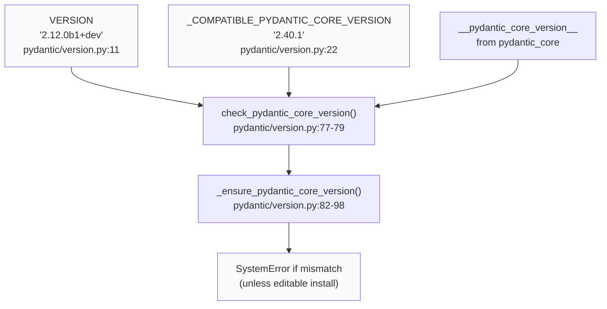

**Sources**: [pydantic/version.py:11](), [pydantic/version.py:22](), [pydantic/version.py:77-99]()

| Component | Description | Location |
|-----------|-------------|----------|
| `VERSION` | Current Pydantic version string | [pydantic/version.py:11]() |
| `_COMPATIBLE_PYDANTIC_CORE_VERSION` | Required pydantic-core version | [pydantic/version.py:22]() |
| `check_pydantic_core_version()` | Validates core version match | [pydantic/version.py:77-79]() |
| `_ensure_pydantic_core_version()` | Raises SystemError on mismatch | [pydantic/version.py:82-98]() |
| `version_info()` | Returns detailed version information | [pydantic/version.py:33-74]() |

The version check occurs at import time and raises a `SystemError` if the installed `pydantic-core` version doesn't match the expected version, unless Pydantic is installed in editable mode (development).

### Version Information Utility

The `version_info()` function provides comprehensive environment information:

```python
version_info() -> str
```

Returns information including:
- Pydantic version
- pydantic-core version and build profile
- Python version and platform
- Related package versions (FastAPI, mypy, pyright, etc.)
- Git commit hash (if in git repository)

**Sources**: [pydantic/version.py:33-74]()

## Testing Infrastructure

### Test Organization and Fixtures

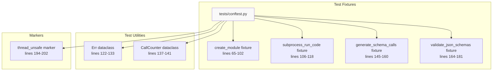

**Sources**: [tests/conftest.py:1-203]()

### Key Testing Fixtures

| Fixture | Purpose | Lines |
|---------|---------|-------|
| `create_module` | Dynamically creates and imports Python modules for testing | [tests/conftest.py:65-102]() |
| `subprocess_run_code` | Executes code in a subprocess and captures output | [tests/conftest.py:106-118]() |
| `generate_schema_calls` | Tracks GenerateSchema.generate_schema call counts | [tests/conftest.py:145-160]() |
| `validate_json_schemas` | Auto-validates generated JSON schemas against Draft 2020-12 spec | [tests/conftest.py:164-181]() |
| `disable_error_urls` | Disables error URLs in output (for stable docs) | [tests/conftest.py:57-61]() |

### Module Creation Fixture

The `create_module` fixture enables dynamic module creation for testing:

```python
create_module(
    source_code_or_function: FunctionType | str,
    rewrite_assertions: bool = True,
    module_name_prefix: str | None = None
) -> ModuleType
```

This fixture:
1. Extracts source code from functions or uses provided strings
2. Creates temporary Python files with unique names
3. Imports modules with optional assertion rewriting
4. Returns executable module objects for testing

**Sources**: [tests/conftest.py:65-102](), [tests/conftest.py:30-43](), [tests/conftest.py:46-54]()

### Thread Safety Markers

Tests using certain fixtures are automatically marked as `thread_unsafe`:

- `generate_schema_calls` - Monkeypatches Pydantic code
- `benchmark` - Cannot be reused across threads
- `tmp_path`/`tmpdir` - Duplicate paths/dirs
- `copy_method` - Uses `pytest.warns()`
- `reset_plugins` - Monkeypatching

**Sources**: [tests/conftest.py:184-202]()

## CI/CD Pipeline

### Main CI Workflow

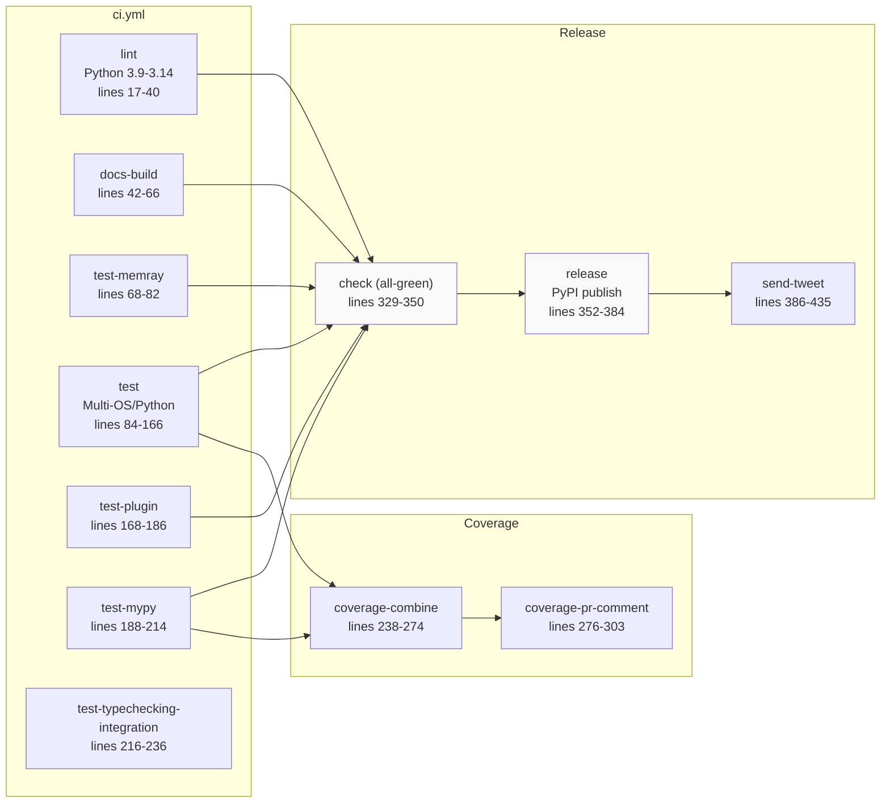

**Sources**: [.github/workflows/ci.yml:1-436]()

### CI Jobs Breakdown

| Job | Purpose | Triggers | Matrix |
|-----|---------|----------|--------|
| `lint` | Pre-commit hooks, ruff, type checks | All pushes/PRs | Python 3.9-3.14 |
| `docs-build` | Validate documentation builds | All pushes/PRs | Single Python 3.12 |
| `test` | Core test suite | All pushes/PRs | 4 OS × 8 Python versions |
| `test-memray` | Memory profiling tests | All pushes/PRs | Python 3.12 |
| `test-mypy` | Mypy plugin tests | All pushes/PRs | Python 3.13 |
| `test-plugin` | Pydantic plugin system tests | All pushes/PRs | Python 3.12 |
| `test-typechecking-integration` | Pyright/mypy integration | All pushes/PRs | Python 3.12 |
| `coverage-combine` | Aggregate coverage | After tests | N/A |
| `coverage-pr-comment` | Post coverage to PRs | After coverage-combine | N/A |
| `release` | Publish to PyPI | Tags only | N/A |
| `send-tweet` | Announce release | After successful release | N/A |

**Sources**: [.github/workflows/ci.yml:17-435]()

### Test Matrix Configuration

The main test job runs across multiple platforms and Python versions:

```yaml
os: [ubuntu-latest, macos-15-intel, macos-latest, windows-latest]
python-version: ['3.9', '3.10', '3.11', '3.12', '3.13', '3.14', '3.14t']
```

Additional PyPy versions tested on Ubuntu only:
- `pypy3.9`
- `pypy3.10`
- `pypy3.11`

**Sources**: [.github/workflows/ci.yml:86-111]()

### Coverage Workflow

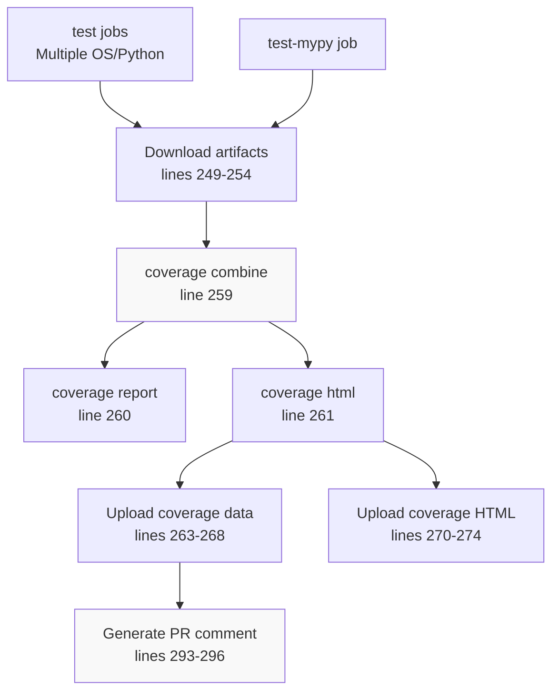

**Sources**: [.github/workflows/ci.yml:238-303]()

Coverage files are:
1. Generated in each test job with unique filenames
2. Downloaded and combined using `coverage combine`
3. Uploaded as artifacts
4. Used to generate PR comments with coverage percentage

### Release Process

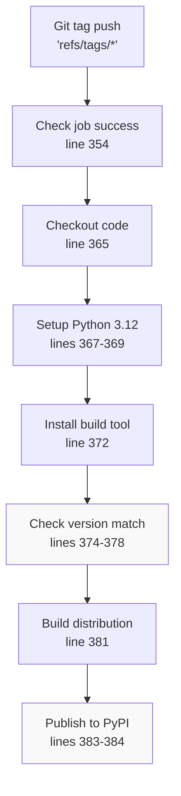

**Sources**: [.github/workflows/ci.yml:352-384]()

The release job:
1. Waits for all CI checks to pass
2. Validates version in `pydantic/version.py` matches git tag
3. Builds distribution using `python -m build`
4. Publishes to PyPI using trusted publishing (OIDC)

**Sources**: [.github/workflows/ci.yml:352-384]()

## Third-Party Integration Testing

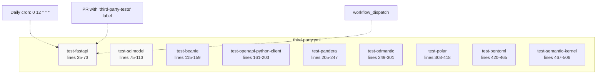

**Sources**: [.github/workflows/third-party.yml:1-506]()

### Third-Party Test Strategy

Each third-party test:
1. Checks out the external project's repository
2. Checks out Pydantic from current branch to `pydantic-latest` path
3. Installs project dependencies
4. Uninstalls locked Pydantic version
5. Installs Pydantic from `pydantic-latest` path in editable mode
6. Runs the project's test suite

Example pattern:
```bash
uv pip install -e ./pydantic-latest
uv pip list  # Verify pydantic path
uv run --no-sync pytest tests
```

**Sources**: [.github/workflows/third-party.yml:48-73]()

### Tested Projects

| Project | Repository | Python Versions | Special Requirements |
|---------|------------|-----------------|---------------------|
| FastAPI | `fastapi/fastapi` | 3.9-3.13 | PYTHONPATH includes docs_src |
| SQLModel | `fastapi/sqlmodel` | 3.9-3.13 | None |
| Beanie | `BeanieODM/beanie` | 3.13 only | MongoDB service |
| openapi-python-client | `openapi-generators/openapi-python-client` | 3.9-3.13 | PDM package manager |
| Pandera | `unionai-oss/pandera` | 3.9-3.12 | Multiple extra dependencies |
| ODMantic | `sydney-runkle/odmantic` | 3.9-3.11 | MongoDB service |
| Polar | `polarsource/polar` | 3.9-3.13 | PostgreSQL, MinIO, Node.js |
| BentoML | `bentoml/BentoML` | 3.9, 3.11-3.12 | PDM package manager |
| Semantic Kernel | `microsoft/semantic-kernel` | 3.10-3.12 | Poetry package manager |

**Sources**: [.github/workflows/third-party.yml:35-506]()

## Documentation System

### MkDocs Configuration

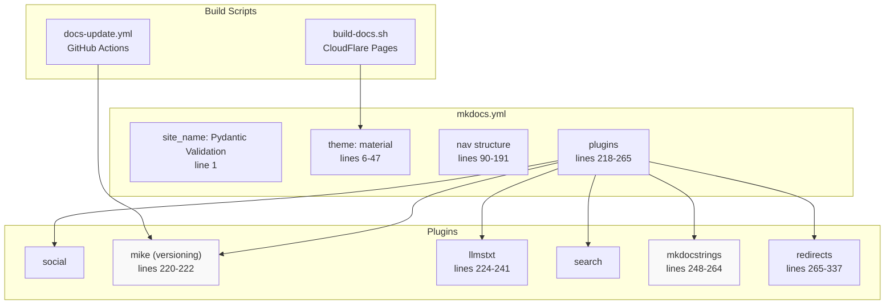

**Sources**: [mkdocs.yml:1-338](), [build-docs.sh:1-26](), [.github/workflows/docs-update.yml:1-113]()

### Documentation Structure

| Component | Purpose | Configuration |
|-----------|---------|---------------|
| Theme | Material for MkDocs with custom styling | [mkdocs.yml:6-47]() |
| Navigation | Hierarchical documentation structure | [mkdocs.yml:90-191]() |
| Mike | Documentation versioning | [mkdocs.yml:220-222]() |
| mkdocstrings | API documentation from docstrings | [mkdocs.yml:248-264]() |
| llmstxt | LLM-friendly documentation export | [mkdocs.yml:224-241]() |
| Algolia | Search integration | Custom JS in [mkdocs.yml:81-83]() |

**Sources**: [mkdocs.yml:1-338]()

### Documentation Build Process

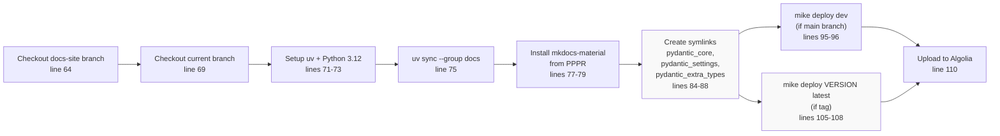

**Sources**: [.github/workflows/docs-update.yml:56-113]()

### Documentation Deployment

The `docs-update.yml` workflow:
1. Triggers on pushes to `main`, `docs-update` branch, or tags
2. Runs lint and test jobs first
3. Checks out `docs-site` branch (orphan branch for built docs)
4. Builds documentation using `mike` for versioning
5. Deploys to `docs-site` branch:
   - `dev` version from `main` branch
   - `X.Y` and `latest` versions from tags
6. Uploads to Algolia for search indexing

**Sources**: [.github/workflows/docs-update.yml:1-113]()

### Build Script Symlinks

The build process creates symlinks to provide better source locations in documentation:

```bash
ln -s .venv/lib/python*/site-packages/pydantic_core pydantic_core
ln -s .venv/lib/python*/site-packages/pydantic_settings pydantic_settings
ln -s .venv/lib/python*/site-packages/pydantic_extra_types pydantic_extra_types
```

This results in documentation source links like:
- `pydantic_core/core_schema.py` 
- Instead of: `.venv/lib/python3.10/site-packages/pydantic_core/core_schema.py`

**Sources**: [build-docs.sh:15-22](), [.github/workflows/docs-update.yml:84-88]()

## Dependency Management

### UV Lock File and Synchronization

Pydantic uses `uv` for dependency management with a lock file:

- Lock file: `uv.lock` (1+ revision)
- Sync command: `uv sync` with various groups
- Frozen mode: `UV_FROZEN=true` in CI to prevent updates

**Sources**: [uv.lock:1-3](), [.github/workflows/ci.yml:13]()

### Dependency Groups

| Group | Purpose | Usage |
|-------|---------|-------|
| `linting` | Pre-commit, ruff, type checkers | CI lint job |
| `docs` | MkDocs, material theme, plugins | Documentation builds |
| `docs-upload` | Algolia upload tools | Documentation deployment |
| `testing-extra` | pytest, memray, coverage | Full test suite |
| `typechecking` | mypy, pyright, type stubs | Type checking tests |
| `all` | All development dependencies | Local development |

**Sources**: [.github/workflows/ci.yml:34](), [.github/workflows/docs-update.yml:75]()

### Dependency Version Testing

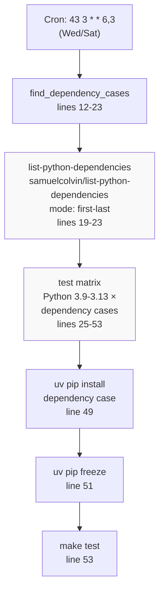

**Sources**: [.github/workflows/dependencies-check.yml:1-54]()

The `dependencies-check.yml` workflow:
1. Runs on a schedule (Wednesday and Saturday)
2. Uses `samuelcolvin/list-python-dependencies` to find first and last versions of each dependency
3. Tests Pydantic with both minimum and maximum dependency versions
4. Ensures compatibility across the supported version range

**Sources**: [.github/workflows/dependencies-check.yml:1-54]()

### Pydantic Family Integration

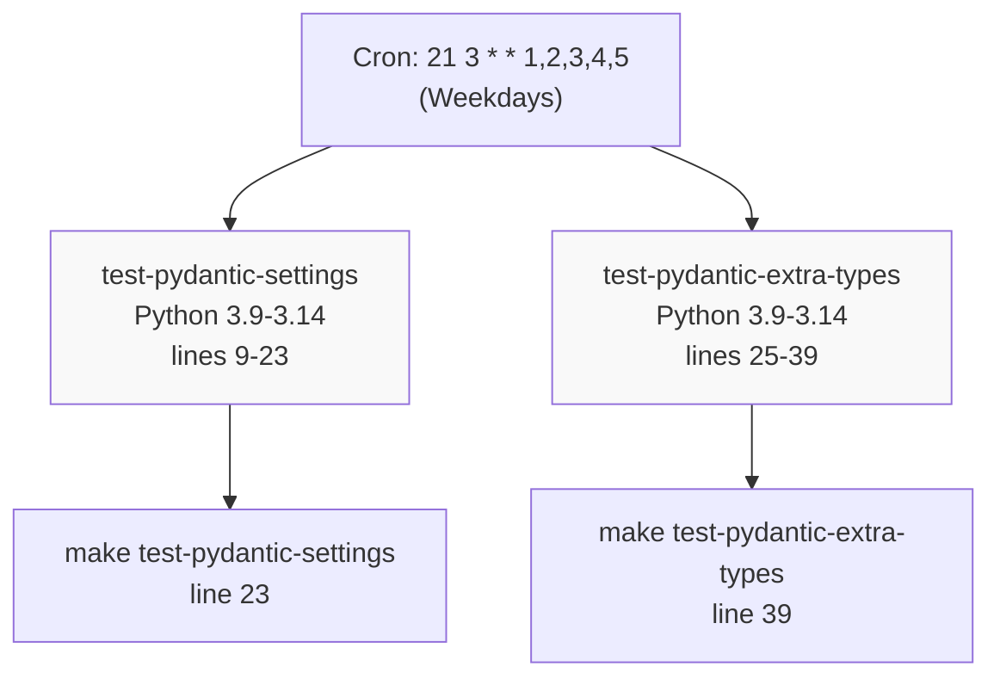

**Sources**: [.github/workflows/integration.yml:1-40]()

The integration workflow tests Pydantic with related packages:
- `pydantic-settings`: Settings management library
- `pydantic-extra-types`: Additional type implementations

Both use the `make` targets which likely checkout and test these repositories with the current Pydantic code.

**Sources**: [.github/workflows/integration.yml:1-40]()

## Additional CI Workflows

### Performance Benchmarking (CodSpeed)

```mermaid
graph LR
    trigger["Push to main,<br/>PRs, or<br/>workflow_dispatch"]
    
    checkout["Checkout code"]
    resolve_core["Resolve pydantic-core tag<br/>from pyproject.toml<br/>lines 30-45"]
    checkout_core["Checkout pydantic-core<br/>at resolved ref<br/>lines 50-55"]
    
    install_rust["Install Rust stable<br/>with llvm-tools<br/>lines 57-60"]
    cache_rust["Cache Rust artifacts<br/>lines 62-65"]
    
    build_pgo["Build pydantic-core<br/>with PGO + debug symbols<br/>lines 67-76"]
    
    codspeed["Run CodSpeed benchmarks<br/>lines 78-82"]
    
    trigger --> checkout
    checkout --> resolve_core
    resolve_core --> checkout_core
    checkout_core --> install_rust
    install_rust --> cache_rust
    cache_rust --> build_pgo
    build_pgo --> codspeed
    
    style build_pgo fill:#f9f9f9
    style codspeed fill:#f9f9f9
```

**Sources**: [.github/workflows/codspeed.yml:1-83]()

The CodSpeed workflow:
1. Resolves the `pydantic-core` version from `pyproject.toml`
2. Checks out `pydantic-core` at that version
3. Builds `pydantic-core` with PGO (Profile-Guided Optimization) and debug symbols
4. Runs benchmarks using CodSpeed for performance tracking

**Sources**: [.github/workflows/codspeed.yml:1-83]()

### Coverage Upload (Smokeshow)

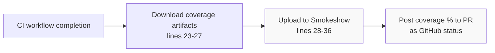

**Sources**: [.github/workflows/upload-previews.yml:1-37]()

The upload-previews workflow:
1. Triggers after CI workflow completion
2. Downloads coverage HTML artifacts
3. Uploads to Smokeshow for preview hosting
4. Posts coverage percentage to PR as GitHub status with threshold of 91%

**Sources**: [.github/workflows/upload-previews.yml:1-37]()

### Automated Labeling

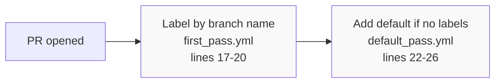

**Sources**: [.github/workflows/labeler.yml:1-27]()

Label configurations:
- `first_pass.yml`: Labels based on branch name patterns (fix, feature, docs, change, performance, packaging)
- `default_pass.yml`: Adds `relnotes-fix` if no labels were applied

This ensures all PRs are properly categorized for changelog generation.

**Sources**: [.github/workflows/labeler.yml:1-27](), [.github/labels/first_pass.yml:1-18](), [.github/labels/default_pass.yml:1-5]()

## Summary

Pydantic's development and deployment infrastructure provides:

1. **Rigorous Version Control**: Strict compatibility checking between `pydantic` and `pydantic-core`
2. **Comprehensive Testing**: Multi-platform test matrix, third-party integration tests, and specialized testing for memory, type checking, and plugins
3. **Automated CI/CD**: GitHub Actions workflows handle linting, testing, coverage tracking, and deployment
4. **Documentation Excellence**: Versioned documentation with MkDocs, automated deployment, and LLM-friendly exports
5. **Quality Assurance**: Dependency version testing, performance benchmarking, and automated labeling for release notes

The infrastructure ensures that Pydantic maintains high quality standards while supporting a wide range of Python versions, platforms, and downstream packages.

**Sources**: [pydantic/version.py:1-114](), [.github/workflows/ci.yml:1-436](), [.github/workflows/third-party.yml:1-506](), [mkdocs.yml:1-338](), [.github/workflows/docs-update.yml:1-113]()

# Testing Framework


## Purpose and Scope

This document covers Pydantic's testing infrastructure, including pytest configuration, test fixtures, module creation utilities, and validation helpers. The framework provides tools for dynamic module creation, JSON schema validation, schema generation monitoring, and thread safety management across the test suite.

For information about CI/CD pipelines and automation, see [CI/CD Pipeline](#7.2). For documentation building and testing, see [Documentation System](#7.3).

---

## Test Configuration Architecture

The testing framework is built on pytest and configured through `tests/conftest.py`. The configuration system provides command-line options, session-wide settings, and automatic test collection hooks.

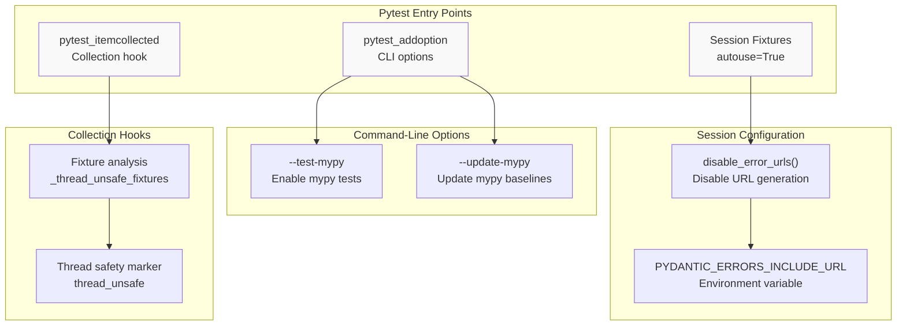

**Sources:** [tests/conftest.py:25-28](), [tests/conftest.py:57-62](), [tests/conftest.py:198-203]()

### Command-Line Options

The framework defines custom pytest options through the `pytest_addoption` hook:

| Option | Purpose | Usage |
|--------|---------|-------|
| `--test-mypy` | Enable mypy type checking tests | `pytest --test-mypy` |
| `--update-mypy` | Update mypy test baselines | `pytest --update-mypy` |

**Sources:** [tests/conftest.py:25-28]()

### Session-Wide Configuration

The `disable_error_urls` fixture runs once per test session and sets an environment variable to prevent Pydantic from including documentation URLs in error messages during tests. This prevents version-specific URLs from appearing in test outputs that would need frequent updating.

**Sources:** [tests/conftest.py:57-62]()

---

## Test Fixtures

Pydantic's test suite provides several specialized fixtures for common testing patterns. These fixtures handle module creation, subprocess execution, schema generation monitoring, and JSON schema validation.

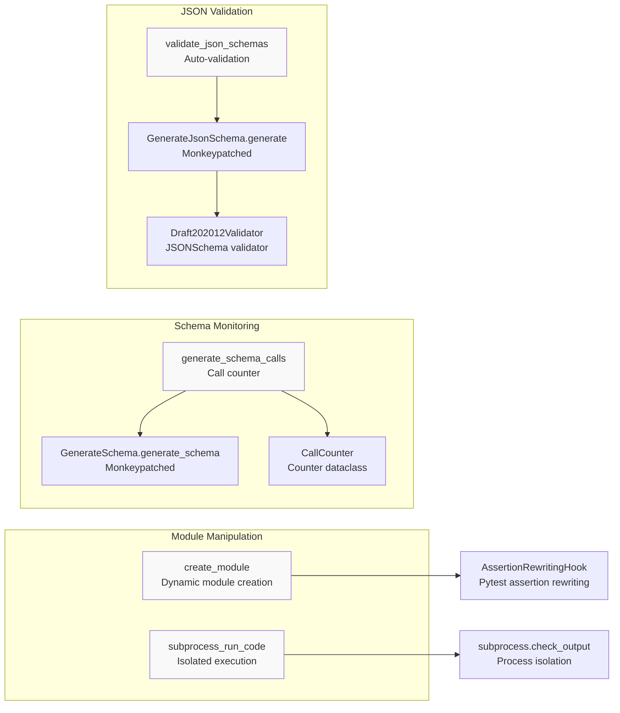

**Sources:** [tests/conftest.py:64-182]()

### Fixture Catalog

| Fixture | Scope | Purpose |
|---------|-------|---------|
| `disable_error_urls` | session | Disables error URL generation globally |
| `create_module` | function | Creates and imports Python modules dynamically |
| `subprocess_run_code` | function | Executes code in isolated subprocess |
| `generate_schema_calls` | function | Monitors and counts schema generation calls |
| `validate_json_schemas` | function | Validates generated JSON schemas automatically |

**Sources:** [tests/conftest.py:57-182]()

---

## Dynamic Module Creation

The `create_module` fixture enables tests to create and import Python modules on-the-fly from source code strings or function bodies. This is essential for testing import-time behaviors, module-level validation, and schema caching.

### Module Creation Pipeline

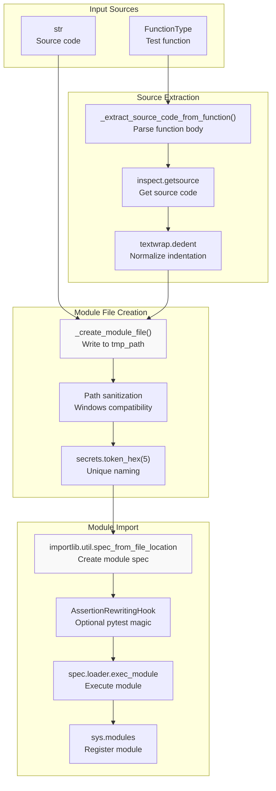

**Sources:** [tests/conftest.py:30-103]()

### Function Source Code Extraction

The `_extract_source_code_from_function` helper extracts the body of a test function, enabling a decorator-like pattern for module creation:

```python