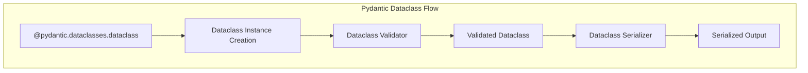

```

Sources: [pydantic/type_adapter.py:69-476](pydantic/type_adapter.py:69-476), [tests/test_type_adapter.py:42-112](tests/test_type_adapter.py:42-112)

## Validation and Serialization with Dataclasses

Pydantic's validation and serialization also work with dataclasses through the `@pydantic.dataclasses.dataclass` decorator.



The dataclass implementation uses the same validation and serialization mechanism as regular Pydantic models:

```python