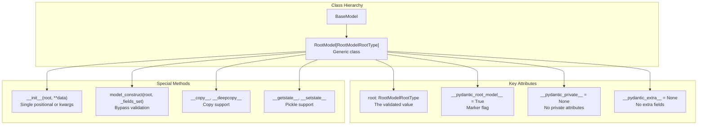
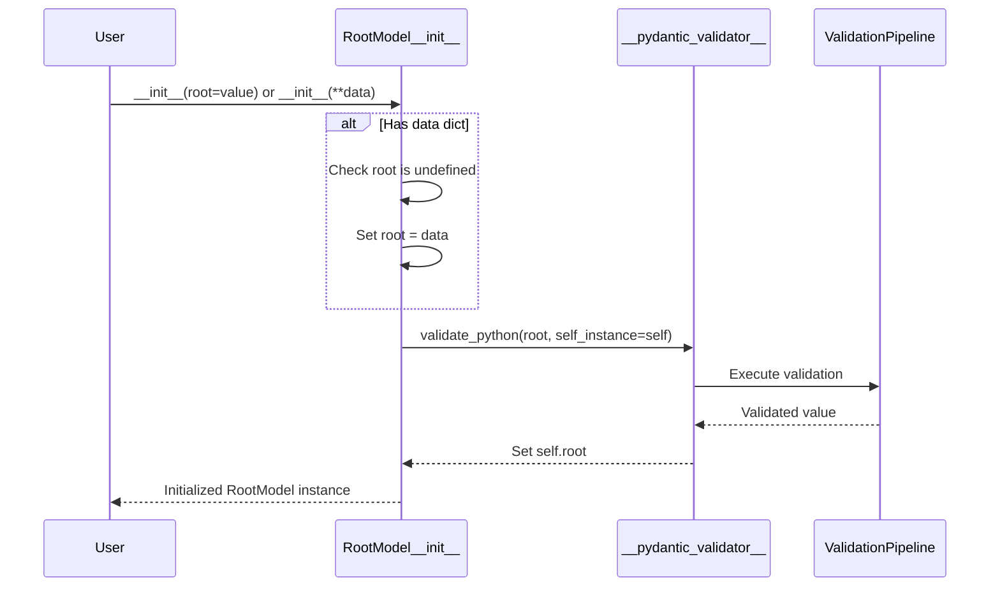

This page documents two distinct but complementary features: **RootModel** for validating root-level values, and **Computed Fields** for adding dynamic, read-only properties to models that appear during serialization.

For basic model functionality, see [BaseModel](#2.1). For field configuration and metadata, see [Field System](#2.2). For serialization customization, see [Serializers](#4.2).

---

## Overview

**RootModel** enables validation of types that don't naturally fit into Pydantic's field-based structure. Instead of defining multiple fields, a RootModel wraps a single root value of any type (primitives, collections, custom types, etc.).

**Computed Fields** are dynamic properties decorated with `@computed_field` that are calculated on-access and automatically included in serialization output. Unlike regular properties, computed fields appear in `model_dump()`, `model_dump_json()`, and JSON schema generation.

---

## RootModel

### Purpose and Design

RootModel provides a way to validate and serialize root-level values that are not traditional models with named fields. This is useful for:
- Wrapping primitive types with validation logic
- Validating collection types (lists, dicts) at the root level
- Creating type aliases with custom validation
- Building discriminated union handlers
- Parsing configuration formats where the entire structure is a single type

**Sources:** [pydantic/root_model.py:1-155]()

### Core Architecture



**Sources:** [pydantic/root_model.py:32-155](), [pydantic/_internal/_model_construction.py]()

### Basic Usage

The `root` field contains the validated value. RootModel can be instantiated with either a positional argument or keyword arguments:

```python
from pydantic import RootModel

# Wrapping a list
class IntList(RootModel[list[int]]):
    pass

# Usage
model = IntList([1, 2, 3])  # positional
model = IntList(root=[1, 2, 3])  # keyword
model = IntList(**{'root': [1, 2, 3]})  # dict unpacking
```

**Sources:** [pydantic/root_model.py:60-69](), [tests/test_root_model.py]()

### Key Characteristics

| Characteristic | Behavior | Rationale |
|---------------|----------|-----------|
| Single field | Only `root` field exists | RootModel represents a single value |
| Extra fields | Not supported (`model_config['extra']` raises error) | Would conflict with root-level validation |
| Private attributes | Set to `None` | Root models don't support `_private` attrs |
| Initialization | Accepts positional or keyword args | Flexible instantiation patterns |
| Validation | Applied to `root` value | Standard validation pipeline |
| Serialization | Returns root value directly in `model_dump()` | Not wrapped in a dict |

**Sources:** [pydantic/root_model.py:52-58](), [pydantic/root_model.py:60-69]()

### Initialization Flow



**Sources:** [pydantic/root_model.py:60-69](), [pydantic/main.py]()

### Construction and Copying

RootModel provides special methods for construction and copying:

**model_construct**: Creates instances without validation
```python
# Bypass validation
model = IntList.model_construct(root=[1, 2, 3], _fields_set={'root'})
```

**Copy operations**: Shallow and deep copy support via `__copy__` and `__deepcopy__`

**Pickle support**: Via `__getstate__` and `__setstate__` for serialization

**Sources:** [pydantic/root_model.py:72-114](), [tests/test_construction.py]()

### Serialization Behavior

Unlike regular models, RootModel's `model_dump()` returns the root value directly, not a dictionary:

```python
model = IntList([1, 2, 3])