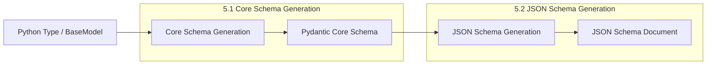

```

Sources: [tests/test_json_schema.py:261-289](tests/test_json_schema.py)

## Integration with Core Schema Generation

JSON Schema generation works in tandem with core schema generation:



During core schema generation, metadata can be attached for later use in JSON Schema generation:

1. `pydantic_js_functions`: For defining custom JSON Schema handlers
2. `pydantic_js_updates`: For adding or updating JSON Schema properties 
3. `pydantic_js_extra`: For adding complete JSON Schema objects

Sources: [pydantic/_internal/_core_metadata.py:13-46](pydantic/_internal/_core_metadata.py), [pydantic/_internal/_generate_schema.py:668-713](pydantic/_internal/_generate_schema.py)

## API Reference

Here are the main functions and classes for JSON Schema generation:

| Name | Description |
|------|-------------|
| `BaseModel.model_json_schema()` | Generate JSON Schema for a model |
| `TypeAdapter.json_schema()` | Generate JSON Schema for any type |
| `models_json_schema()` | Generate JSON Schema for multiple models |
| `GenerateJsonSchema` | Class for customizing JSON Schema generation |

Sources: [pydantic/json_schema.py:216-224](pydantic/json_schema.py), [tests/test_json_schema.py:669-670](tests/test_json_schema.py)

## Advanced Features

### Schema Dialect

By default, Pydantic uses the JSON Schema draft 2020-12 dialect, but this can be customized by extending `GenerateJsonSchema`:

```python
class MyGenerator(GenerateJsonSchema):
    schema_dialect = "https://my-custom-dialect/schema"
```

Sources: [pydantic/json_schema.py:250-251](pydantic/json_schema.py)

### Warning Management

The JSON Schema generator can emit warnings for issues like non-serializable defaults or skipped discriminators:

```python
class MyGenerator(GenerateJsonSchema):
    # Customize which warnings are suppressed
    ignored_warning_kinds = {'skipped-choice', 'non-serializable-default'}
```

Sources: [pydantic/json_schema.py:101-106](pydantic/json_schema.py), [pydantic/json_schema.py:252-254](pydantic/json_schema.py)

### Advanced Reference Management

For complex schemas with many references, Pydantic attempts to simplify reference names by removing redundancy while avoiding collisions:

```python