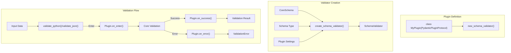

```

Sources: [tests/test_dataclasses.py:1285-1329]()

#### Return Type Annotation

Computed fields require return type annotations. The annotation determines the schema used for serialization:

```python
@computed_field
@property
def value(self) -> int:  # Must have return type
    return self._private_value * 2
```

Without a return type annotation, Pydantic cannot generate the correct schema.

Sources: [pydantic/fields.py:745-810]()

## Plugin System

Pydantic provides a plugin system that allows you to customize validation, serialization, and other behaviors. This is particularly useful for integrating Pydantic with other libraries or adding custom validation logic.



### Creating a Plugin

```python
from pydantic.plugin import PydanticPluginProtocol

class MyPlugin(PydanticPluginProtocol):
    def new_schema_validator(
        self, 
        schema, 
        schema_type, 
        schema_type_path, 
        schema_kind, 
        config, 
        plugin_settings
    ):
        # Create and return validation handlers
        # Return (validate_python, validate_json, validate_strings)
        return None, None, None
```

### Validation Handlers

Plugins can provide handlers for different validation methods:

```python
from pydantic.plugin import ValidatePythonHandlerProtocol

class MyValidationHandler(ValidatePythonHandlerProtocol):
    def on_enter(self, input_value, info):
        # Called before validation
        print(f"Validating: {input_value}")
    
    def on_success(self, result):
        # Called after successful validation
        print(f"Validation successful: {result}")
        return result
    
    def on_error(self, error):
        # Called after validation error
        print(f"Validation failed: {error}")
        raise error
```

### Using Plugins

Plugins are configured through model config:

```python
from pydantic import BaseModel, ConfigDict
from my_plugin import MyPlugin

# Register the plugin
plugin = MyPlugin()

class User(BaseModel):
    name: str
    age: int
    
    model_config = ConfigDict(
        plugin_settings={
            "my_plugin": {"some_option": "value"}
        }
    )
```

Sources: [pydantic/plugin/__init__.py:38-71](), [pydantic/plugin/_schema_validator.py]()

## Integration with Other Libraries

Pydantic integrates well with many Python libraries and frameworks. Here are some common integrations:

### FastAPI Integration

FastAPI leverages Pydantic models for request validation and OpenAPI schema generation:

```python
from fastapi import FastAPI
from pydantic import BaseModel

app = FastAPI()

class Item(BaseModel):
    name: str
    price: float

@app.post("/items/")
async def create_item(item: Item):
    # Item is automatically validated
    return item
```

### Dataframe Validation

Using TypeAdapter with pandas DataFrames:

```python
import pandas as pd
from pydantic import TypeAdapter
from typing import List, Dict, Any

# Define a type adapter for dataframe rows
row_adapter = TypeAdapter(Dict[str, Any])

# Validate each row in a DataFrame
def validate_df(df: pd.DataFrame) -> pd.DataFrame:
    validated_rows = [row_adapter.validate_python(row) for row in df.to_dict(orient='records')]
    return pd.DataFrame(validated_rows)
```

### ORM Integration

Pydantic models can work with ORMs using `from_attributes`:

```python
from sqlalchemy import Column, Integer, String
from sqlalchemy.ext.declarative import declarative_base
from pydantic import BaseModel, ConfigDict

SQLAlchemyBase = declarative_base()

class UserDB(SQLAlchemyBase):
    __tablename__ = "users"
    id = Column(Integer, primary_key=True)
    name = Column(String)
    age = Column(Integer)

class UserModel(BaseModel):
    id: int
    name: str
    age: int
    
    model_config = ConfigDict(from_attributes=True)