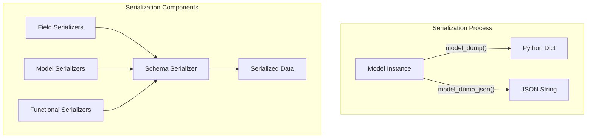
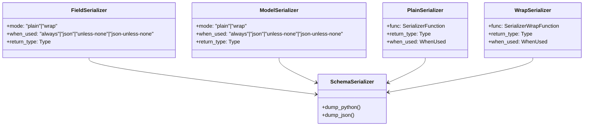
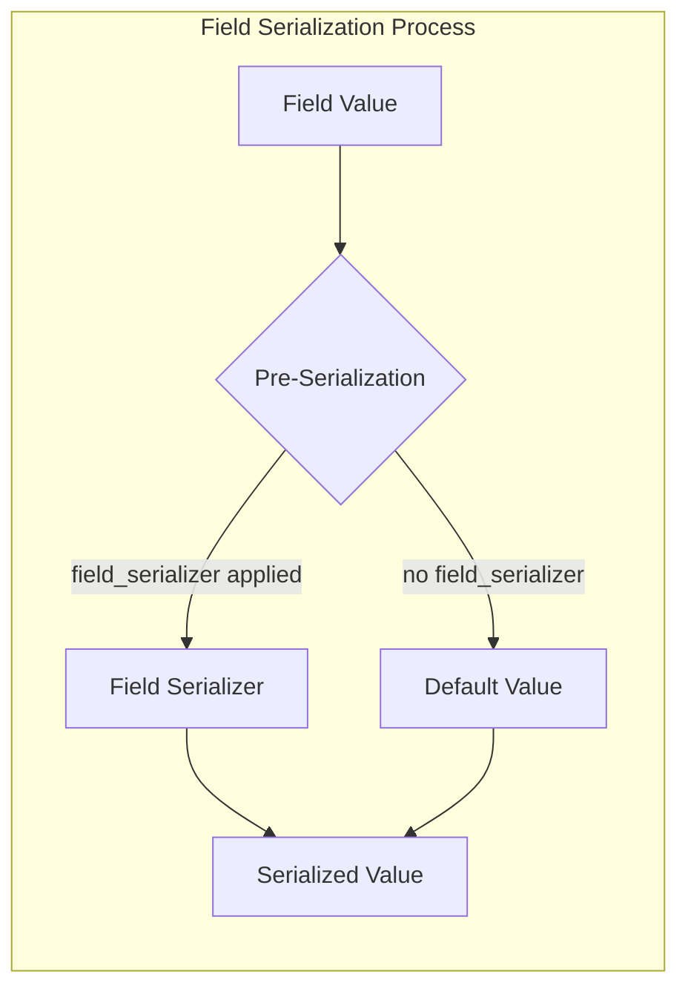

Pydantic's serialization system converts model instances into serializable formats such as Python dictionaries or JSON strings. This page explains how serializers work in Pydantic, including field serializers, model serializers, and functional serializers. For information about validators (which handle input data validation), see [Validators](#4.1).

## Overview of the Serialization System

In Pydantic, serialization is the process of converting a model instance into a simplified representation suitable for storage or transmission. While validation transforms input data into model instances, serialization converts model instances back into primitive data types.



Sources:
- [tests/test_serialize.py:1-29](pydantic/functional_serializers.py:1-29)
- [pydantic/functional_serializers.py:1-20](pydantic/functional_serializers.py:1-20)

## Core Serialization Components

Pydantic offers several components for customizing serialization behavior:



Sources:
- [pydantic/functional_serializers.py:18-165](pydantic/functional_serializers.py:18-165)
- [pydantic/_internal/_decorators.py:90-130](pydantic/_internal/_decorators.py:90-130)

### Serialization Modes

Serializers can operate in two modes:

1. **Plain mode**: The serializer receives the value and returns a transformed value
2. **Wrap mode**: The serializer receives the value and a handler function, allowing for more complex transformations

Additionally, serializers can be configured to run in specific scenarios using the `when_used` parameter:

| `when_used` value | Python serialization | JSON serialization | When value is None |
|-------------------|----------------------|-------------------|-------------------|
| `"always"` (default) | Yes | Yes | Yes |
| `"json"` | No | Yes | Yes |
| `"unless-none"` | Yes | Yes | No |
| `"json-unless-none"` | No | Yes | No |

Sources:
- [tests/test_serialize.py:82-197](tests/test_serialize.py:82-197)
- [pydantic/functional_serializers.py:45-52](pydantic/functional_serializers.py:45-52)

## Field Serializers

Field serializers allow you to customize the serialization of individual model fields. They can be applied using the `@field_serializer` decorator.



### Using the field_serializer Decorator

The `@field_serializer` decorator is used to define custom serialization logic for specific fields:

```python
class MyModel(BaseModel):
    x: int
    
    @field_serializer('x')
    def serialize_x(self, value: int) -> str:
        return f"{value:,}"  # Format as comma-separated number
```

The decorator accepts the following parameters:

- `field`: Field name(s) to which the serializer should be applied
- `mode`: Serialization mode (`"plain"` or `"wrap"`)
- `when_used`: When the serializer should be applied (`"always"`, `"json"`, `"unless-none"`, or `"json-unless-none"`)
- `return_type`: The return type of the serializer function (optional)

Sources:
- [tests/test_serialize.py:148-197](tests/test_serialize.py:148-197)
- [tests/test_serialize.py:225-271](tests/test_serialize.py:225-271)
- [pydantic/_internal/_decorators.py:90-111](pydantic/_internal/_decorators.py:90-111)

### Field Serializer Signature

Field serializers can have several valid function signatures:

```python