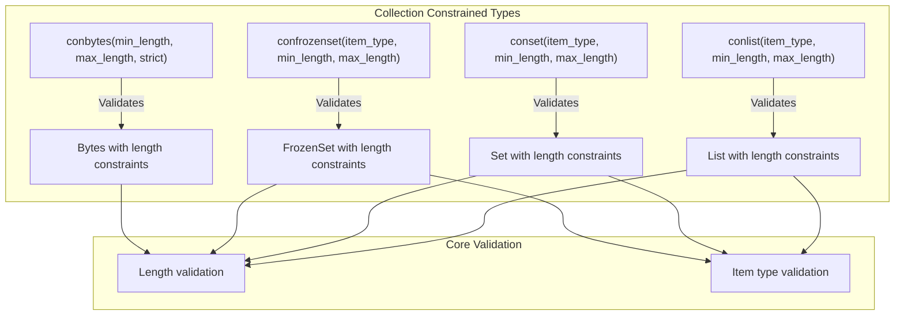
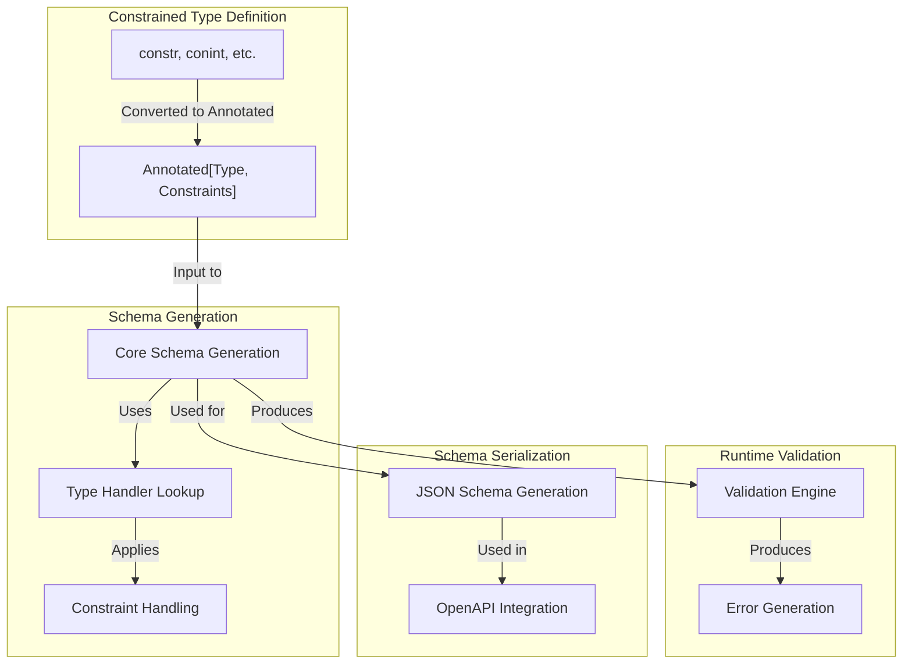

from typing import Annotated
from pydantic import StringConstraints
field: Annotated[str, StringConstraints(min_length=3, max_length=50)]
```

## Collection Constrained Types

Pydantic provides constrained types for various collection types: lists, sets, frozensets, and bytes.



Sources: [pydantic/types.py:663-684](). [pydantic/types.py:839-904]().

### Bytes Constraints

The `conbytes` function creates a constrained bytes type with parameters:

- `min_length`: Minimum length in bytes
- `max_length`: Maximum length in bytes
- `strict`: When True, input must be an actual bytes object

### List Constraints

The `conlist` function creates a constrained list type with parameters:

- `item_type`: The type of items in the list
- `min_length`: Minimum number of items
- `max_length`: Maximum number of items

### Set and FrozenSet Constraints

The `conset` and `confrozenset` functions create constrained set and frozenset types with similar parameters:

- `item_type`: The type of items in the set
- `min_length`: Minimum number of items
- `max_length`: Maximum number of items

## Usage Patterns

### Using Constrained Types in Models

```python
from pydantic import BaseModel, conint, constr, conlist

class User(BaseModel):
    id: conint(gt=0)
    name: constr(min_length=2, max_length=50)
    tags: conlist(str, min_length=1, max_length=5)
```

### Modern Approach with Annotated

```python
from typing import Annotated
from pydantic import BaseModel, Field, StringConstraints

class User(BaseModel):
    id: Annotated[int, Field(gt=0)]
    name: Annotated[str, StringConstraints(min_length=2, max_length=50)]
    tags: Annotated[list[str], Field(min_length=1, max_length=5)]
```

## Integration with Schema Generation

Constrained types automatically generate appropriate schema information that is used for validation and JSON Schema generation.



Sources: [pydantic/types.py:151-235](). [pydantic/types.py:411-497](). [pydantic/types.py:750-828]().

When a constrained type is used in a Pydantic model:

1. The constraint is transformed into an `Annotated` type during schema generation
2. The Pydantic validation engine uses these constraints to validate inputs
3. JSON Schema generation includes the constraints in the resulting schema

## Best Practices

### Prefer Annotated over Constraint Functions

Pydantic recommends using `Annotated` with constraints rather than the legacy constraint functions:

```python
# ✅ Recommended
from typing import Annotated
field: Annotated[int, Field(gt=0)]

# ❌ Discouraged (will be deprecated in Pydantic 3.0)
from pydantic import conint
field: conint(gt=0)
```

The `conX` functions will be deprecated in Pydantic 3.0 in favor of the `Annotated` approach, which provides better static type checking and IDE support.

### Common Use Cases

1. **Validation with Transformation**:
   ```python
   # Automatically strip and convert to uppercase
   name: Annotated[str, StringConstraints(strip_whitespace=True, to_upper=True)]
   ```

2. **Numeric Ranges**:
   ```python
   # Age between 18 and 120
   age: Annotated[int, Field(ge=18, le=120)]
   ```

3. **Pattern Matching**:
   ```python
   # Match a phone number pattern
   phone: Annotated[str, StringConstraints(pattern=r'^\+?[1-9]\d{1,14}$')]
   ```

## Testing Constrained Types

When testing models with constrained types, it's important to test both valid and invalid inputs to ensure constraints are applied correctly:

```python
from pydantic import BaseModel, ValidationError
import pytest

class Product(BaseModel):
    name: Annotated[str, StringConstraints(min_length=3)]
    price: Annotated[float, Field(gt=0)]

def test_valid_product():
    product = Product(name="Computer", price=999.99)
    assert product.name == "Computer"
    assert product.price == 999.99

def test_invalid_product():
    with pytest.raises(ValidationError) as exc_info:
        Product(name="PC", price=0)
    errors = exc_info.value.errors()
    assert len(errors) == 2  # Both constraints violated
```

Sources: [tests/test_types.py:741-821](). [tests/test_types.py:246-347]().

## Related Features

Constrained types work well with other Pydantic features:

- **Field validators**: Apply custom validation logic beyond built-in constraints
- **Type adapters**: Use constrained types with `TypeAdapter` for validation outside of models
- **JSON Schema**: Constrained types generate appropriate JSON schema representations

For more information on related features, see:
- [Field System](#2.2) for details on field configuration and validators
- [Type Adapter](#3.3) for using constrained types outside of models
- [JSON Schema Generation](#5.2) for how constraints appear in JSON schemas