int_container = Container[int](value=1)
str_container = Container[str](value="hello")
```

When you parameterize a generic model with a specific type (e.g., `Container[int]`), Pydantic creates a specialized model class with validation specifically for that type.

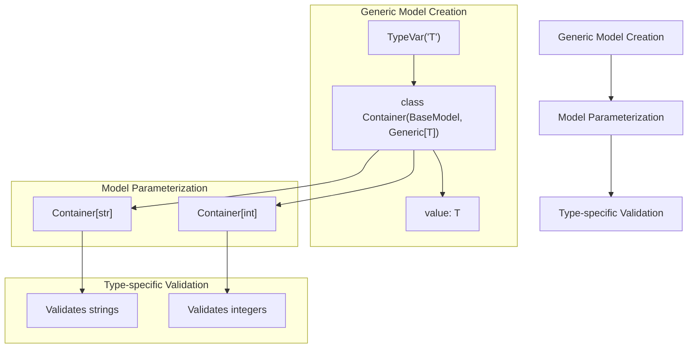

Sources: 
- `tests/test_generics.py:83-92`
- `tests/test_generics.py:580-648`

### Implementation Mechanics

When you parameterize a generic model like `Container[int]`, several key processes occur:

1. **Type Substitution**: All occurrences of the type variable `T` in the model are replaced with the concrete type `int`
2. **Class Creation**: A new subclass of the original model is created with the concrete types
3. **Caching**: The created class is cached to ensure the same parameterization returns the same class

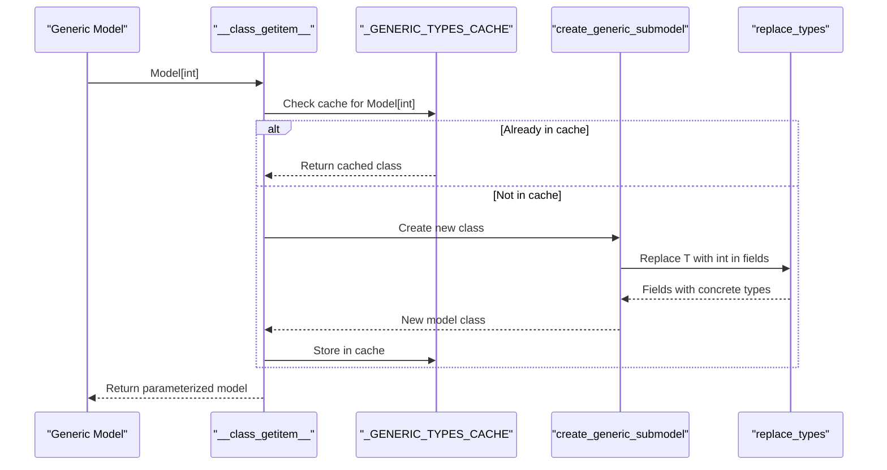

Sources:
- `pydantic/_internal/_generics.py:106-150`
- `pydantic/_internal/_generics.py:246-340`
- `pydantic/_internal/_generics.py:439-547`

### Type Substitution in Depth

The `replace_types` function recursively traverses type annotations and substitutes type variables with concrete types:

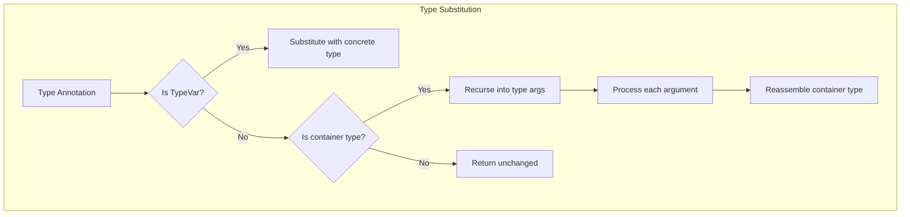

This handles complex nested types like `List[Dict[str, T]]` → `List[Dict[str, int]]` when substituting `T` with `int`.

Sources:
- `pydantic/_internal/_generics.py:178-195`
- `pydantic/_internal/_generics.py:246-340`

### Caching System

Pydantic employs a sophisticated caching mechanism to ensure that:
1. The same parameterization of a generic model returns the same class
2. Memory usage is optimized by using weak references
3. The system can handle recursive generic types

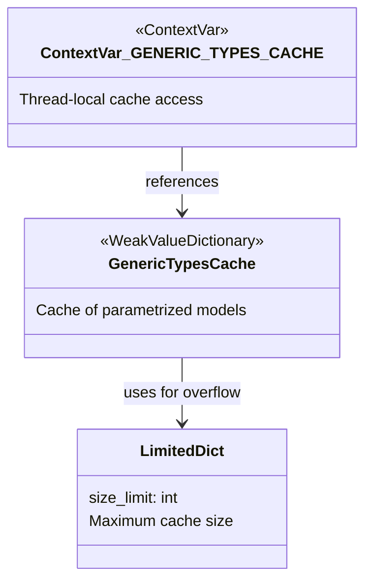

The caching system uses a two-stage lookup to optimize performance:
1. An "early" cache key for quick lookups
2. A "late" cache key that handles more complex equivalence relationships

Sources:
- `pydantic/_internal/_generics.py:42-57`
- `pydantic/_internal/_generics.py:97-97`
- `pydantic/_internal/_generics.py:439-547`
- `tests/test_generics.py:352-456`

## Forward References

Forward references allow referencing types that haven't been fully defined yet, which is essential for recursive models and handling circular dependencies.

### Basic Usage

In Python, forward references are typically written as string literals:

```python
from pydantic import BaseModel

class Person(BaseModel):
    name: str
    friends: list["Person"] = []  # Forward reference to Person itself
```

This creates a recursive data structure where a `Person` can have a list of `Person` objects as friends.

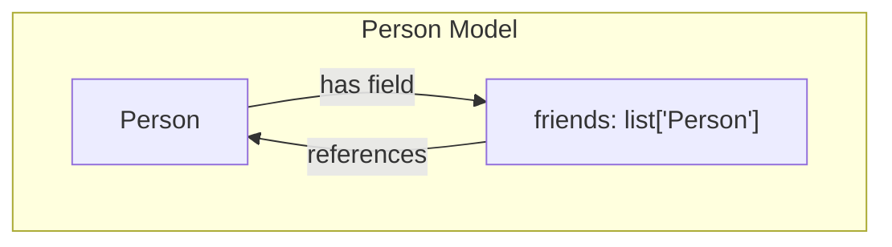

Sources:
- `tests/test_forward_ref.py:128-166`
- `tests/test_forward_ref.py:261-289`

### Forward Reference Resolution

When Pydantic encounters a string annotation, it:
1. Records the original string annotation
2. Marks the field as incomplete (`_complete = False`)
3. Attempts to resolve the reference when needed

The resolution process happens:
- **Automatically** during validation if a model has unresolved references
- **Explicitly** when calling `Model.model_rebuild()`

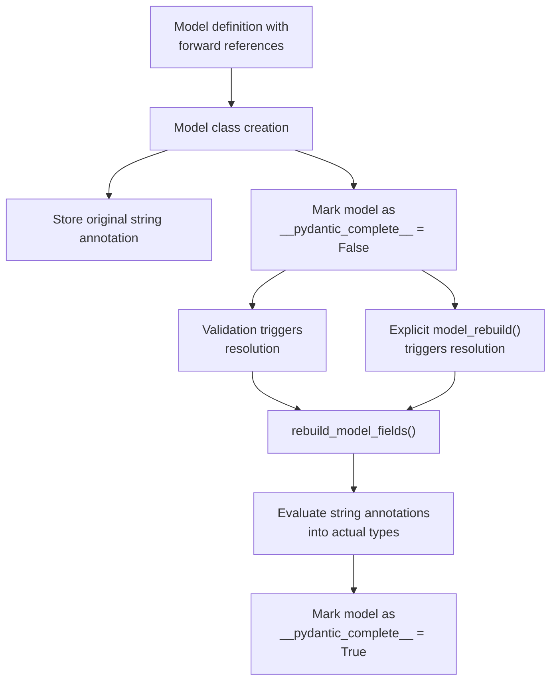

Sources:
- `pydantic/_internal/_fields.py:78-282`
- `pydantic/_internal/_fields.py:300-337`
- `tests/test_forward_ref.py:42-75`

### Type Evaluation

Pydantic evaluates string annotations by:
1. Using the `eval_type` function to convert the string to a type object
2. Searching for the referenced type in appropriate namespaces
3. Handling failure gracefully if a type can't be resolved immediately

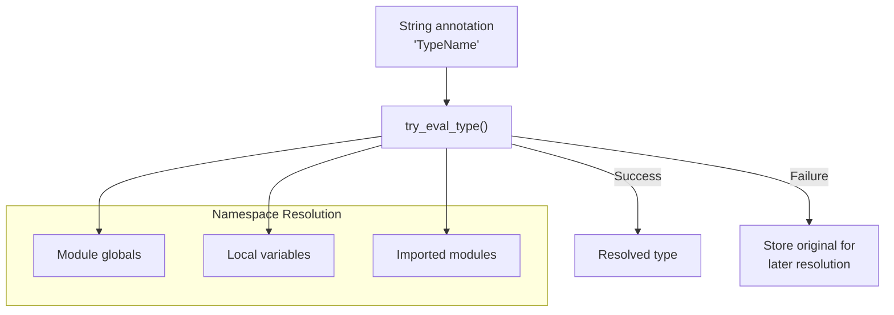

Sources:
- `pydantic/_internal/_typing_extra.py:290-457`
- `pydantic/_internal/_typing_extra.py:209-271`

### Recursive Models and Circular Dependencies

Pydantic efficiently handles recursive models (like trees or graphs) and circular dependencies between models by:
1. Detecting recursion during schema generation
2. Using special schema references to avoid infinite recursion
3. Auto-rebuilding models as necessary to resolve circular dependencies

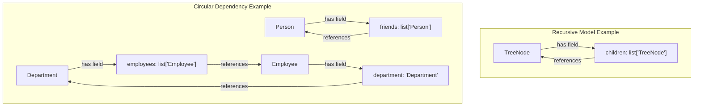

Sources:
- `tests/test_forward_ref.py:111-166`
- `tests/test_forward_ref.py:205-260`
- `tests/test_forward_ref.py:261-411`
- `tests/test_forward_ref.py:697-714`

## Combining Generics and Forward References

### Generic Models with Forward References

Combining generics and forward references enables powerful type patterns:

```python
from typing import Generic, TypeVar
from pydantic import BaseModel

T = TypeVar('T')

class TreeNode(BaseModel, Generic[T]):
    value: T
    children: list["TreeNode[T]"] = []  # Forward reference to the generic model itself
```

When this forward reference is resolved, the type variable `T` is correctly substituted with the concrete type.

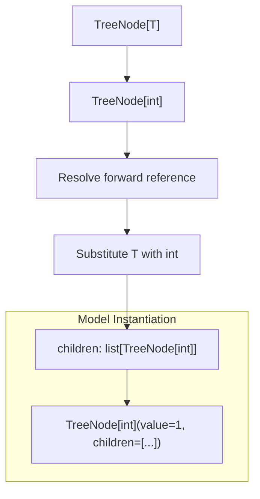

Sources:
- `tests/test_generics.py:664-794`
- `pydantic/_internal/_fields.py:327-328`
- `pydantic/_internal/_generics.py:396-437`

### Handling Recursive Generic Types

For recursive generic types, Pydantic implements special handling to prevent infinite recursion:

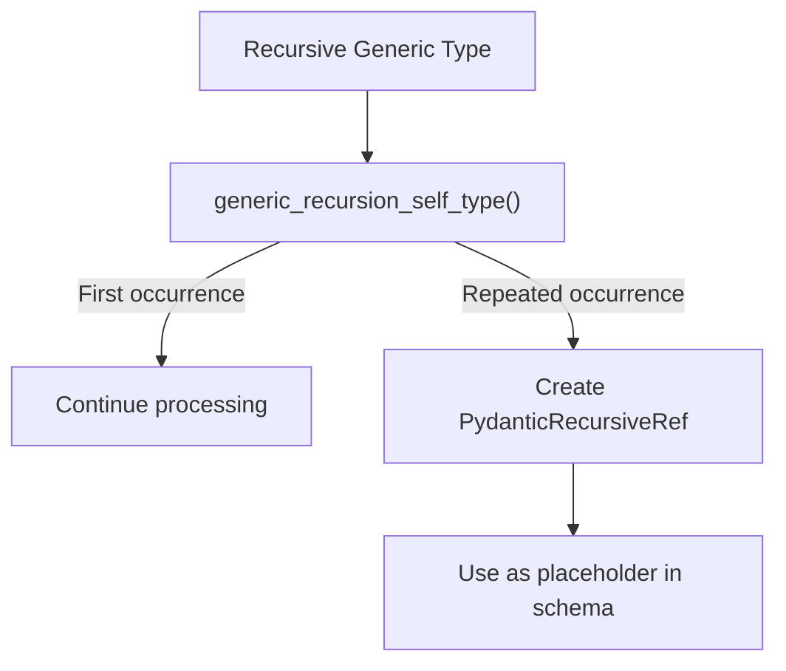

This allows for properly handling complex structures like trees where nodes can contain other nodes of the same type.

Sources:
- `pydantic/_internal/_generics.py:396-437`
- `tests/test_generics.py:458-486`

## Advanced Usage Patterns

### Bounded Type Variables

You can restrict the allowed types by using bounded type variables:

```python
from typing import Generic, TypeVar
from pydantic import BaseModel

T = TypeVar('T', bound=int)  # T must be int or a subclass of int

class NumberModel(BaseModel, Generic[T]):
    value: T
```

This ensures that only types compatible with the bound can be used as parameters.

Sources:
- `tests/test_generics.py:881-912`

### Default Type Arguments

Generic models can have default type arguments using Python 3.12+ syntax:

```python
from typing import Generic, TypeVar
from typing_extensions import TypeVar

T = TypeVar('T')
S = TypeVar('S', default=int)  # Default type is int

class Model(BaseModel, Generic[T, S]):
    t: T
    s: S
```

This allows users to only specify some type arguments while others default to predefined types.

Sources:
- `tests/test_generics.py:297-349`

### Partial Specialization

You can partially specialize a generic model with multiple type variables:

```python
from typing import Generic, TypeVar
from pydantic import BaseModel

T = TypeVar('T')
S = TypeVar('S')

class Model(BaseModel, Generic[T, S]):
    t: T
    s: S

IntModel = Model[int, S]  # Partially specialized
IntStrModel = IntModel[str]  # Fully specialized
```

Partial specialization allows for creating intermediate template models.

Sources:
- `tests/test_generics.py:797-878`

## Implementation Details

### Generic Model Creation Internals

When a generic model is parameterized, the `create_generic_submodel` function creates a new subclass:

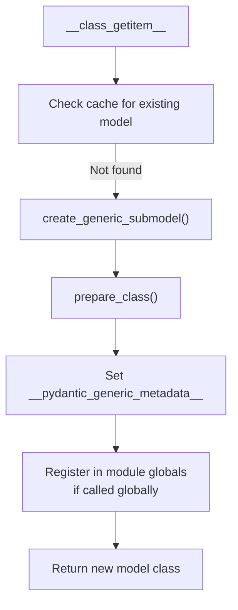

The created model contains metadata about its generic origin, arguments, and parameters to support further operations.

Sources:
- `pydantic/_internal/_generics.py:100-150`
- `pydantic/_internal/_generics.py:343-393`

### Forward Reference Handling Internals

The handling of forward references is primarily implemented in the `_fields.py` and `_typing_extra.py` modules:

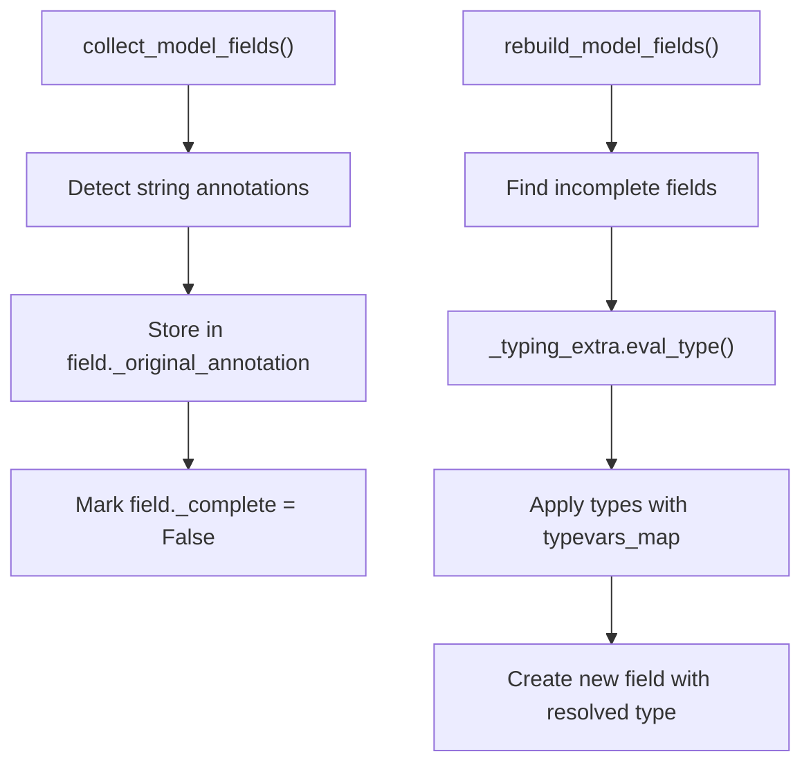

The resolution process uses Python's introspection capabilities to find the right namespace context for evaluating the string annotations.

Sources:
- `pydantic/_internal/_fields.py:78-167`
- `pydantic/_internal/_fields.py:300-337`
- `pydantic/_internal/_typing_extra.py:290-464`

## Conclusion

Generics and forward references are powerful features in Pydantic that enable complex type patterns while maintaining type safety. They allow for:

1. Creating reusable model templates with generics
2. Building recursive data structures with forward references
3. Combining both to create sophisticated type systems

Understanding these features is essential for advanced Pydantic usage, especially when building models with complex relationships or when creating reusable model libraries.