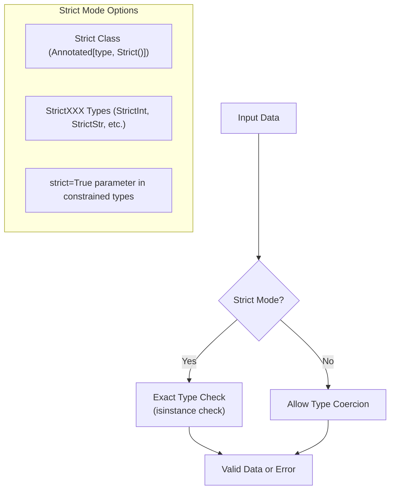
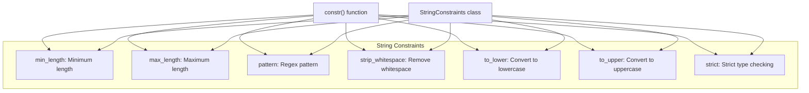
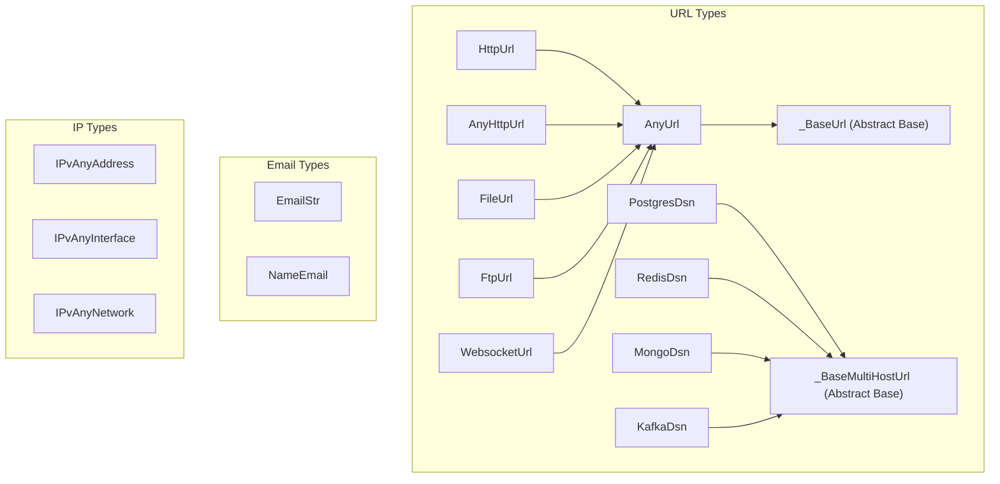
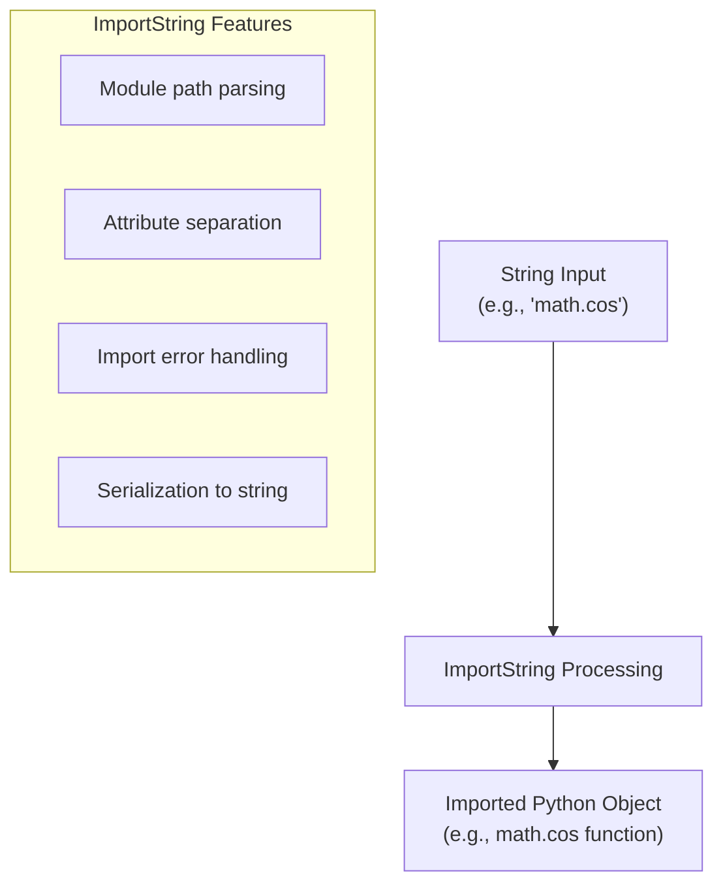
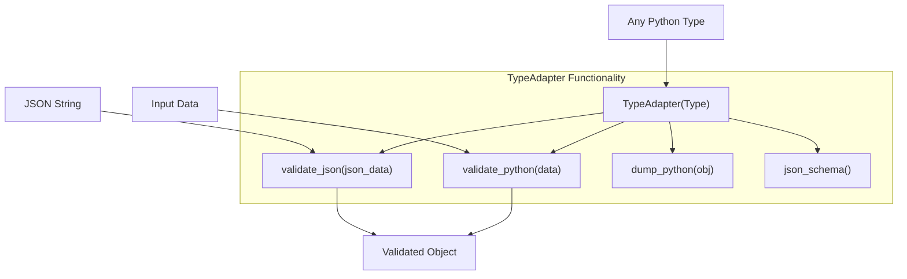
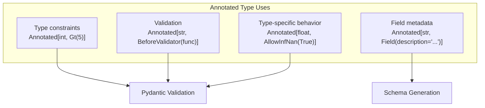
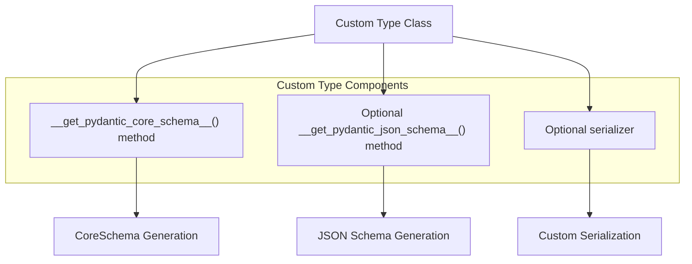
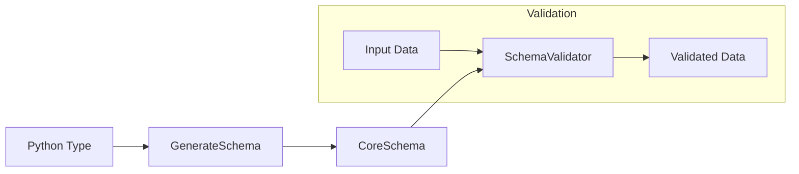

from typing import Annotated
from pydantic import BaseModel, Field

class Model(BaseModel):
    value: Annotated[int, Field(gt=0, lt=100)]
```

The latter approach using `Annotated` is recommended for better support with static analysis tools.

### Strict Mode

Pydantic allows enforcing strict type checking using the `Strict` class:



Sources: [pydantic/types.py:113-146]()

## Constrained Types

### Numeric Types

Pydantic provides constrained versions of numeric types with validation rules:

| Type | Description | Constraints |
|------|-------------|-------------|
| `conint()` | Constrained integer | `gt`, `ge`, `lt`, `le`, `multiple_of` |
| `PositiveInt` | Integer > 0 | Equivalent to `Annotated[int, Gt(0)]` |
| `NegativeInt` | Integer < 0 | Equivalent to `Annotated[int, Lt(0)]` |
| `NonNegativeInt` | Integer >= 0 | Equivalent to `Annotated[int, Ge(0)]` |
| `NonPositiveInt` | Integer <= 0 | Equivalent to `Annotated[int, Le(0)]` |
| `confloat()` | Constrained float | `gt`, `ge`, `lt`, `le`, `multiple_of`, `allow_inf_nan` |
| `PositiveFloat` | Float > 0 | Equivalent to `Annotated[float, Gt(0)]` |
| `NegativeFloat` | Float < 0 | Equivalent to `Annotated[float, Lt(0)]` |
| `NonNegativeFloat` | Float >= 0 | Equivalent to `Annotated[float, Ge(0)]` |
| `NonPositiveFloat` | Float <= 0 | Equivalent to `Annotated[float, Le(0)]` |
| `FiniteFloat` | Float that is not `inf` or `nan` | Equivalent to `Annotated[float, AllowInfNan(False)]` |
| `condecimal()` | Constrained decimal | Similar to `confloat()` + `max_digits`, `decimal_places` |

Sources: [pydantic/types.py:147-362](), [pydantic/types.py:386-645]()

### String Types

Pydantic offers string constraints through `constr()` and `StringConstraints`:



Sources: [pydantic/types.py:690-828]()

Similar constraints exist for bytes with `conbytes()`.

### Collection Types

Pydantic provides constrained collection types:

| Type | Description | Constraints |
|------|-------------|-------------|
| `conlist()` | Constrained list | `item_type`, `min_length`, `max_length` |
| `conset()` | Constrained set | `item_type`, `min_length`, `max_length` |
| `confrozenset()` | Constrained frozenset | `item_type`, `min_length`, `max_length` |

Sources: [pydantic/types.py:836-903]()

## Network Types

Pydantic includes a rich set of network-related types defined in `networks.py`:



Sources: [pydantic/networks.py:70-526](), [pydantic/networks.py:534-669]()

Network types provide specialized validation:
- URL types validate and normalize URLs with various schemes
- Email types validate email addresses
- IP types validate IPv4 and IPv6 addresses, networks, and interfaces

These network types can be directly used in models:

```python
from pydantic import BaseModel, HttpUrl, EmailStr

class User(BaseModel):
    website: HttpUrl
    email: EmailStr
```

## Special Types

### Path Types

Path-related types provide validation for file system paths:

| Type | Description |
|------|-------------|
| `FilePath` | Path that points to an existing file |
| `DirectoryPath` | Path that points to an existing directory |
| `NewPath` | Path that does not currently exist |
| `SocketPath` | Path pointing to a Unix socket |

Sources: [pydantic/__init__.py:73-77](), [pydantic/__init__.py:357-359]()

### Secret Types

Secret types provide special handling for sensitive data:

| Type | Description |
|------|-------------|
| `SecretStr` | String that hides its contents in repr |  
| `SecretBytes` | Bytes that hides its contents in repr |
| `Secret` | Generic version of secret types |

Sources: [pydantic/__init__.py:78-80](), [pydantic/__init__.py:348-350]()

### ImportString Type

`ImportString` provides a way to import Python objects from strings:



Sources: [pydantic/types.py:906-1028]()

## Type Adapter

The `TypeAdapter` class provides a way to use Pydantic's validation system outside of models:



Sources: [pydantic/__init__.py:380]()

The TypeAdapter makes it easy to apply Pydantic validation to standalone types:

```python
from pydantic import TypeAdapter

int_list_validator = TypeAdapter(list[int])
validated = int_list_validator.validate_python(['1', '2', '3'])
# Result: [1, 2, 3]
```

## Working with Annotated Types

Pydantic provides special handling for Python's `Annotated` type:



Sources: [pydantic/_internal/_known_annotated_metadata.py:1-42]()

`Annotated` provides a clean way to combine type information with metadata:

```python
from typing import Annotated
from annotated_types import Gt, Lt
from pydantic import BaseModel

class Model(BaseModel):
    # Integer between 1 and 100
    value: Annotated[int, Gt(0), Lt(101)]
```

## Creating Custom Types

Pydantic allows for creation of custom types by implementing `__get_pydantic_core_schema__` method:



Sources: [pydantic/_internal/_validators.py:66-127]()

## Internal Validation Process

The type system works with Pydantic's validation engine:



Sources: [pydantic/_internal/_core_utils.py:43-66](), [pydantic/_internal/_validators.py:66-127]()

## Constraints Reference

| Type Category | Available Constraints |
|---------------|------------------------|
| String        | `min_length`, `max_length`, `pattern`, `strip_whitespace`, `to_lower`, `to_upper`, `strict` |
| Bytes         | `min_length`, `max_length`, `strict` |
| List          | `min_length`, `max_length`, `strict`, `fail_fast` |
| Set           | `min_length`, `max_length`, `strict`, `fail_fast` |
| Dict          | `min_length`, `max_length`, `strict` |
| Float         | `gt`, `ge`, `lt`, `le`, `multiple_of`, `allow_inf_nan`, `strict` |
| Integer       | `gt`, `ge`, `lt`, `le`, `multiple_of`, `strict` |
| Decimal       | `gt`, `ge`, `lt`, `le`, `multiple_of`, `max_digits`, `decimal_places`, `strict` |

Sources: [pydantic/_internal/_known_annotated_metadata.py:18-64]()