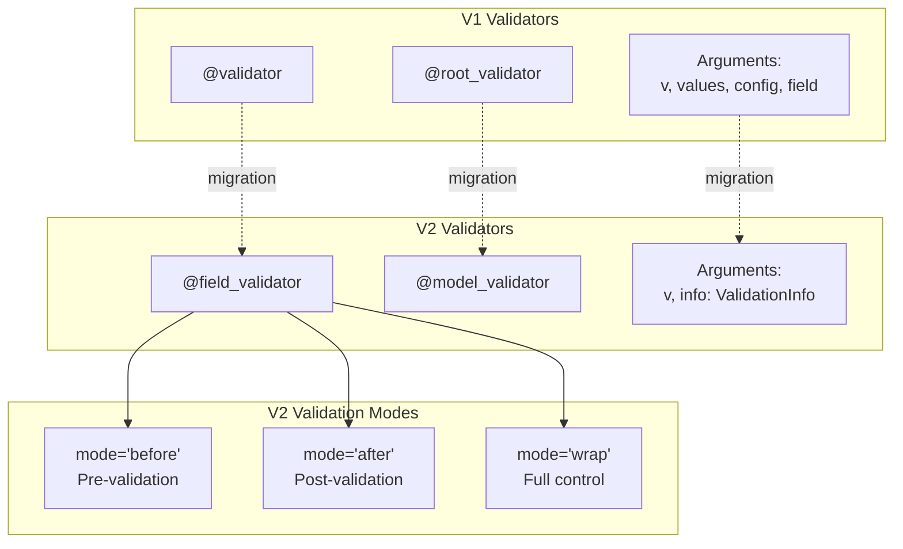
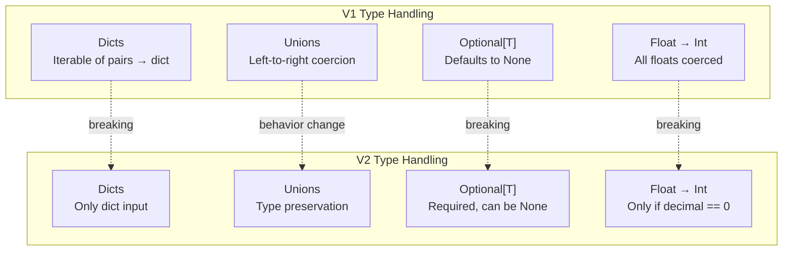

```

Sources: [docs/migration.md:436-464]()

### Serializer Introduction

V2 adds `@field_serializer` and `@model_serializer` decorators for custom serialization, replacing the deprecated `json_encoders` config option:

```python
from pydantic import BaseModel, field_serializer

class Model(BaseModel):
    value: int
    
    @field_serializer('value')
    def serialize_value(self, value: int) -> str:
        return str(value)
```

Sources: [docs/migration.md:167-175](), [docs/concepts/serialization.md:218-420]()



**Validator Decorator Migration**

Sources: [docs/migration.md:360-434](), [docs/concepts/validators.md:29-463]()

## Dataclass Changes

### Initialization and Validation

In V2, the `__post_init__` method is called *after* validation rather than before. The `__post_init_post_parse__` method has been removed as it's now redundant.

Pydantic dataclasses no longer support `extra='allow'` with attribute storage. Only `extra='ignore'` is supported for ignoring unexpected fields.

Sources: [docs/migration.md:295-307]()

### Schema Access Changes

Pydantic dataclasses no longer have a `__pydantic_model__` attribute. To access validation and schema functionality, wrap the dataclass with `TypeAdapter`:

```python
from pydantic.dataclasses import dataclass
from pydantic import TypeAdapter

@dataclass
class MyDataclass:
    x: int

# V1
schema = MyDataclass.__pydantic_model__.schema()

# V2
adapter = TypeAdapter(MyDataclass)
schema = adapter.json_schema()
```

Sources: [docs/migration.md:307-317](), [docs/concepts/dataclasses.md:1-80]()

### Configuration Inheritance

In V1, vanilla dataclasses used as fields would inherit the parent type's config. In V2, this no longer occurs. Use the `config` parameter on the `@dataclass` decorator to override configuration:

```python
from pydantic.dataclasses import dataclass
from pydantic import ConfigDict

@dataclass(config=ConfigDict(validate_assignment=True))
class MyDataclass:
    a: int
```

Sources: [docs/migration.md:313-318](), [docs/concepts/dataclasses.md:85-118]()

## Type System Changes

### GenericModel Removal

`pydantic.generics.GenericModel` has been removed. Create generic models by inheriting directly from `BaseModel` and `Generic`:

```python
# V1
from pydantic.generics import GenericModel
from typing import TypeVar

T = TypeVar('T')

class MyModel(GenericModel, Generic[T]):
    value: T

# V2
from pydantic import BaseModel
from typing import Generic, TypeVar

T = TypeVar('T')

class MyModel(BaseModel, Generic[T]):
    value: T
```

Avoid using parametrized generics in `isinstance()` checks. For such checks, create concrete subclasses:

```python
class MyIntModel(MyModel[int]):
    pass

isinstance(obj, MyIntModel)  # OK
```

Sources: [docs/migration.md:255-273]()

### Input Type Preservation

V1 attempted to preserve input types for generic collections (e.g., `Counter` → `Counter`). V2 only guarantees output types match annotations, typically converting to standard types:

```python
from collections.abc import Mapping
from pydantic import TypeAdapter

class MyDict(dict):
    pass

ta = TypeAdapter(Mapping[str, int])
v = ta.validate_python(MyDict())
# V1: type(v) is MyDict
# V2: type(v) is dict
```

To preserve input types, use a custom validator with `WrapValidator`:

```python
from typing import Annotated, Any, TypeVar
from pydantic import TypeAdapter, WrapValidator, ValidatorFunctionWrapHandler, ValidationInfo

def restore_input_type(value: Any, handler: ValidatorFunctionWrapHandler, _info: ValidationInfo) -> Any:
    return type(value)(handler(value))

T = TypeVar('T')
PreserveType = Annotated[T, WrapValidator(restore_input_type)]

ta = TypeAdapter(PreserveType[Mapping[str, int]])
```

V2 preserves types for `BaseModel` subclasses and dataclasses.

Sources: [docs/migration.md:498-611]()

### Union Type Behavior

V2 preserves input types when they match a union member, even if another type would also validate:

```python
from typing import Union
from pydantic import BaseModel

class Model(BaseModel):
    x: Union[int, str]

# V1: Model(x='1') → x=1 (coerced to int first)
# V2: Model(x='1') → x='1' (preserved as str)
```

To revert to V1's left-to-right behavior, use `Field(union_mode='left_to_right')`.

Sources: [docs/migration.md:620-644]()

### Required vs Optional Fields

V2 aligns with dataclasses behavior for `Optional` fields:

| Pattern | V1 Behavior | V2 Behavior |
|---------|-------------|-------------|
| `f: str` | Required, cannot be None | Same |
| `f: str = 'default'` | Optional, cannot be None | Same |
| `f: Optional[str]` | Optional, defaults to None | **Required**, can be None |
| `f: Optional[str] = None` | Optional, defaults to None | Same |
| `f: Any` | Optional, defaults to None | **Required**, can be None or any type |
| `f: Any = None` | Optional, defaults to None | Same |

**Breaking Change:** `Optional[T]` fields are now required by default unless a default value is provided.

Sources: [docs/migration.md:645-694]()

### Float to Integer Coercion

V2 only allows float-to-int coercion when the decimal part is zero:

```python
from pydantic import BaseModel

class Model(BaseModel):
    x: int

Model(x=10.0)  # OK in both V1 and V2
Model(x=10.2)  # OK in V1, ValidationError in V2
```

Sources: [docs/migration.md:708-733]()

### Regex Engine Change

V2 uses Rust's regex engine instead of Python's, providing linear-time matching but without lookarounds and backreferences. Use `regex_engine` config to revert to Python's engine if needed:

```python
from pydantic import BaseModel, ConfigDict

class Model(BaseModel):
    model_config = ConfigDict(regex_engine='python-re')
```

Sources: [docs/migration.md:696-706]()



**Key Type System Behavior Changes**

Sources: [docs/migration.md:613-733]()

## TypeAdapter Introduction

V2 introduces `TypeAdapter` for validating and serializing arbitrary types outside `BaseModel`. This replaces V1's `parse_obj_as` and `schema_of` functions:

```python
# V1
from pydantic import parse_obj_as

result = parse_obj_as(list[int], ['1', '2', '3'])

# V2
from pydantic import TypeAdapter

adapter = TypeAdapter(list[int])
result = adapter.validate_python(['1', '2', '3'])
schema = adapter.json_schema()
```

`TypeAdapter` provides methods for:
- `validate_python()` - Validate Python objects
- `validate_json()` - Validate JSON strings
- `dump_python()` - Serialize to Python objects
- `dump_json()` - Serialize to JSON strings
- `json_schema()` - Generate JSON schema

For proper typing with generic parameters, specify the type explicitly:

```python
adapter = TypeAdapter[str | int](str | int)
```

Sources: [docs/migration.md:735-768](), [docs/concepts/type_adapter.md:1-100]()

## Custom Types and Schema Generation

### Custom Type Hooks

V2 completely overhauls custom type definition:

| V1 Method | V2 Replacement |
|-----------|----------------|
| `__get_validators__` | `__get_pydantic_core_schema__` |
| `__modify_schema__` | `__get_pydantic_json_schema__` |

These hooks can also be provided via `Annotated` metadata rather than modifying the type directly:

```python
from typing import Annotated
from pydantic import GetCoreSchemaHandler
from pydantic_core import core_schema

def custom_schema(source_type, handler: GetCoreSchemaHandler):
    return core_schema.no_info_after_validator_function(
        lambda v: v,
        handler(source_type)
    )

CustomInt = Annotated[int, custom_schema]
```

Sources: [docs/migration.md:769-791](), [docs/concepts/types.md:1-100]()

### JSON Schema Generation

V2 introduces `GenerateJsonSchema` class for customizable JSON schema generation:

**Key Changes:**
- Default target is JSON Schema Draft 2020-12 (was Draft 7 in V1)
- `Optional` fields now indicate `null` is allowed
- `Decimal` serialized as string (was number in V1)
- Namedtuples no longer preserved in schema
- Schema mode can be `'validation'` or `'serialization'`

Customize schema generation by subclassing `GenerateJsonSchema`:

```python
from pydantic import BaseModel
from pydantic.json_schema import GenerateJsonSchema

class CustomSchemaGenerator(GenerateJsonSchema):
    def generate(self, schema, mode='validation'):
        # Custom logic
        return super().generate(schema, mode)

class Model(BaseModel):
    x: int

schema = Model.model_json_schema(schema_generator=CustomSchemaGenerator)
```

Sources: [docs/migration.md:793-824](), [docs/concepts/json_schema.md:1-100]()

## Relocated and Removed Features

### BaseSettings Migration

`BaseSettings` has moved to the separate `pydantic-settings` package:

```bash
pip install pydantic-settings
```

```python