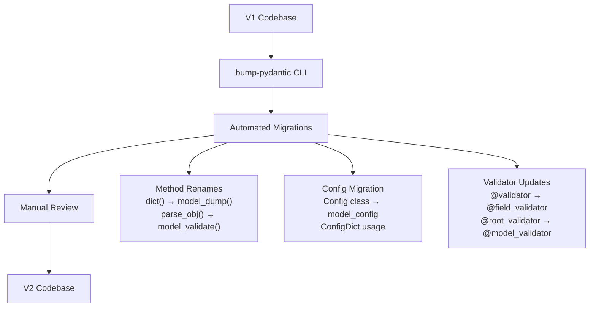
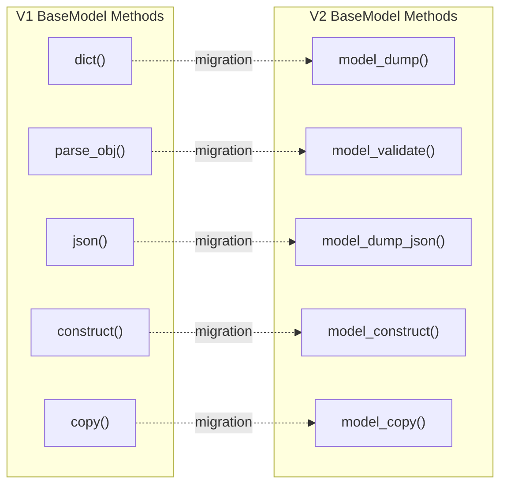

This document provides a comprehensive guide for migrating Pydantic code from V1 to V2. It covers breaking changes, API modifications, and migration strategies. For specific documentation on V2 features like validators, serializers, or model configuration, see the respective pages in sections 2-4 of this wiki.

## Overview and Installation

### Installing Pydantic V2

Pydantic V2 is the current production release and can be installed from PyPI:

```bash
pip install -U pydantic
```

For users who need to continue using V1 features, the V1 API is accessible through the `pydantic.v1` namespace when using Pydantic V2. Alternatively, Pydantic V1 can be installed directly with `pip install "pydantic==1.*"`.

Sources: [docs/migration.md:10-76]()

### Migration Tool: bump-pydantic

The `bump-pydantic` tool automates much of the migration process:

```bash
pip install bump-pydantic
cd /path/to/repo_folder
bump-pydantic my_package
```

This tool handles common migration patterns including method renames, config updates, and validator syntax changes. Use the `--dry-run` flag to preview changes without modifying files.

Sources: [docs/migration.md:25-47]()



**Migration Workflow with bump-pydantic Tool**

Sources: [docs/migration.md:25-47]()

## BaseModel API Changes

### Method Name Changes

Pydantic V2 standardizes method naming with `model_*` and `__*pydantic*__` patterns. Deprecated V1 method names remain available but emit deprecation warnings.

| Pydantic V1 | Pydantic V2 | Purpose |
|-------------|-------------|---------|
| `__fields__` | `model_fields` | Field definitions |
| `__private_attributes__` | `__pydantic_private__` | Private attributes |
| `__validators__` | `__pydantic_validator__` | Validator functions |
| `construct()` | `model_construct()` | Create without validation |
| `copy()` | `model_copy()` | Copy model instance |
| `dict()` | `model_dump()` | Serialize to dictionary |
| `json_schema()` | `model_json_schema()` | Generate JSON schema |
| `json()` | `model_dump_json()` | Serialize to JSON string |
| `parse_obj()` | `model_validate()` | Validate Python object |
| `parse_raw()` | Deprecated | Use `model_validate_json()` |
| `parse_file()` | Deprecated | Load data then validate |
| `from_orm()` | Deprecated | Use `model_validate()` with `from_attributes=True` |
| `update_forward_refs()` | `model_rebuild()` | Rebuild schema |

Sources: [docs/migration.md:129-149]()

### Equality Behavior Changes

In V2, model equality checking has stricter rules:
- Models can only equal other `BaseModel` instances
- Both instances must have the same type (or non-parametrized generic origin)
- Field values, extra values, and private attribute values must all match
- Models are no longer equal to dictionaries containing their data

Sources: [docs/migration.md:152-162]()

### RootModel Replaces `__root__`

The `__root__` field pattern for custom root models has been replaced with the `RootModel` class:

```python
# V1 pattern (deprecated)
class MyModel(BaseModel):
    __root__: list[str]

# V2 pattern
from pydantic import RootModel

class MyModel(RootModel[list[str]]):
    pass
```

`RootModel` types do not support `arbitrary_types_allowed` configuration.

Sources: [docs/migration.md:163-166](), [docs/concepts/models.md:1-100]()



**BaseModel Method Migration Mapping**

Sources: [docs/migration.md:135-146]()

## Field and Configuration Changes

### Field Function Updates

Several `Field()` parameters have been removed or renamed:

| V1 Parameter | V2 Replacement | Notes |
|--------------|----------------|-------|
| `const` | Removed | Use `Literal` type instead |
| `min_items` | `min_length` | Renamed for consistency |
| `max_items` | `max_length` | Renamed for consistency |
| `unique_items` | Removed | |
| `allow_mutation` | `frozen` | Inverse logic |
| `regex` | `pattern` | Renamed |
| `final` | Use `typing.Final` | Type hint instead of field parameter |

Field constraints no longer automatically propagate to generic type parameters. Use `Annotated` for item-level validation:

```python
# V1 (no longer works)
my_list: list[str] = Field(pattern=".*")

# V2
from typing import Annotated
my_list: list[Annotated[str, Field(pattern=".*")]]
```

The `alias` property now returns `None` when no alias is set (V1 returned the field name).

Sources: [docs/migration.md:275-294]()

### Model Configuration Migration

V2 introduces `model_config` with `ConfigDict` replacing the V1 `Config` class:

```python