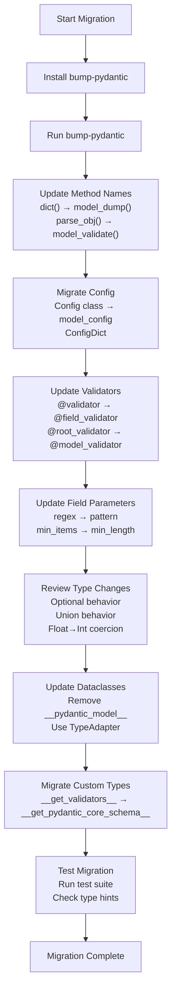

from pydantic import validate_call

@validate_call
def my_function(x: int) -> int:
    return x * 2
```

V1's validator function attributes (`raw_function`, `validate`) are no longer available in V2.

Sources: [docs/migration.md:489-497]()

## Migration Checklist



**Recommended Migration Process**

Sources: [docs/migration.md:1-851]()

### Key Migration Steps

1. **Install Tools**: Install `bump-pydantic` and run it on your codebase
2. **Update BaseModel Methods**: Replace deprecated method names with V2 equivalents
3. **Migrate Configuration**: Convert `Config` classes to `model_config` with `ConfigDict`
4. **Update Validators**: Replace `@validator` and `@root_validator` with new decorators
5. **Fix Field Definitions**: Update field parameters and use `Annotated` for constraints
6. **Review Type Behavior**: Test Optional fields, unions, and numeric coercion
7. **Update Dataclasses**: Replace `__pydantic_model__` usage with `TypeAdapter`
8. **Migrate Custom Types**: Implement `__get_pydantic_core_schema__` hooks
9. **Test Thoroughly**: Run comprehensive tests and type checking

Sources: [docs/migration.md:1-851](), [docs/contributing.md:1-272]()