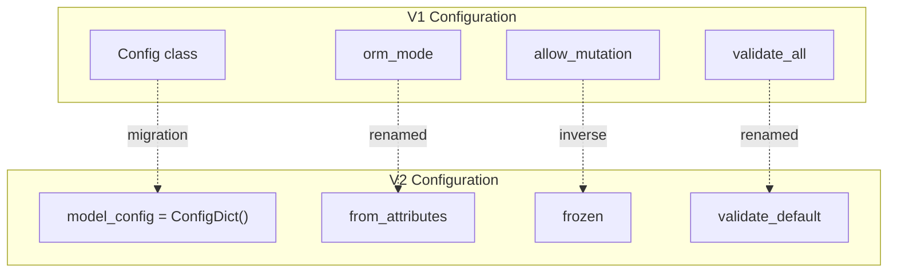

from pydantic import ConfigDict

class Model(BaseModel):
    model_config = ConfigDict(validate_assignment=True)
```

Configuration can also be specified as class arguments for better type checking:

```python
class Model(BaseModel, frozen=True):
    a: str
```

Sources: [docs/migration.md:319-329](), [docs/concepts/config.md:9-50]()

### Configuration Options Removed/Renamed

**Removed Options:**
- `allow_mutation` → use `frozen` (inverse logic)
- `error_msg_templates`
- `fields` → use `Annotated` for field modifications
- `getter_dict` → removed with `orm_mode`
- `smart_union` → default behavior in V2
- `underscore_attrs_are_private` → always `True` in V2
- `json_loads`, `json_dumps`
- `copy_on_model_validation`
- `post_init_call`

**Renamed Options:**

| V1 Name | V2 Name |
|---------|---------|
| `allow_population_by_field_name` | `populate_by_name` or `validate_by_name` (v2.11+) |
| `anystr_lower` | `str_to_lower` |
| `anystr_strip_whitespace` | `str_strip_whitespace` |
| `anystr_upper` | `str_to_upper` |
| `keep_untouched` | `ignored_types` |
| `max_anystr_length` | `str_max_length` |
| `min_anystr_length` | `str_min_length` |
| `orm_mode` | `from_attributes` |
| `schema_extra` | `json_schema_extra` |
| `validate_all` | `validate_default` |

Sources: [docs/migration.md:330-356]()



**Configuration Migration Pattern**

Sources: [docs/migration.md:319-356]()

## Validator and Serializer Changes

### Decorator Migration

V2 introduces new validator and serializer decorators with enhanced functionality:

**Validator Migration:**

| V1 | V2 | Key Changes |
|----|----|----|
| `@validator` | `@field_validator` | No `each_item` parameter; use `Annotated` for items |
| `@root_validator` | `@model_validator` | May receive model instance instead of dict |

The `@field_validator` decorator requires explicit mode specification and uses different argument patterns:

```python
# V1
@validator('x')
def validate_x(cls, v, values, config, field):
    return v

# V2
@field_validator('x', mode='after')
@classmethod
def validate_x(cls, v: int, info: ValidationInfo) -> int:
    # Access config via info.config
    # Access field via cls.model_fields[info.field_name]
    return v
```

Sources: [docs/migration.md:360-434](), [docs/concepts/validators.md:29-463]()

### Validator Argument Changes

V2 validators no longer accept `field` and `config` keyword arguments. Use `ValidationInfo` instead:

- `config` → `info.config` (now a dict, not a class)
- `field` → `cls.model_fields[info.field_name]` (no longer `ModelField` object)

The `allow_reuse` keyword argument is no longer needed due to improved reuse detection.

Sources: [docs/migration.md:404-488]()

### TypeError Handling

In V1, `TypeError` raised in validators was converted to `ValidationError`. In V2, `TypeError` is raised directly:

```python
from pydantic import BaseModel, field_validator

class Model(BaseModel):
    x: int
    
    @field_validator('x')
    def val_x(cls, v: int) -> int:
        return str.lower(v)  # TypeError raised, not ValidationError