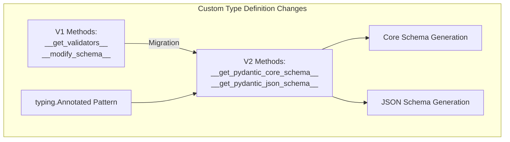

from pydantic import TypeAdapter
adapter = TypeAdapter(list[int])
data = adapter.validate_python(['1', '2', '3'])
```

Sources: [docs/migration.md:730-768](docs/migration.md:730-768), [docs/concepts/type_adapter.md:1-16](docs/concepts/type_adapter.md:1-16)

### Custom Types

The way custom types are defined has changed in V2:



For custom types, replace:
- `__get_validators__` with `__get_pydantic_core_schema__`
- `__modify_schema__` with `__get_pydantic_json_schema__`

V2 also supports `typing.Annotated` to add validation logic to existing types.

Sources: [docs/migration.md:771-792](docs/migration.md:771-792), [docs/concepts/types.md:65-138](docs/concepts/types.md:65-138)

### Required, Optional, and Nullable Fields

V2 changes how optional and required fields work:

| State | Field Definition |
|-------|------------------|
| Required, cannot be `None` | `f1: str` |
| Not required, cannot be `None`, has default | `f2: str = 'abc'` |
| Required, can be `None` | `f3: Optional[str]` |
| Not required, can be `None`, default is `None` | `f4: Optional[str] = None` |
| Not required, can be `None`, has default | `f5: Optional[str] = 'abc'` |

A field annotated as `Optional[T]` will be required but allow `None` values, unlike in V1 where it implicitly had a default of `None`.

Sources: [docs/migration.md:647-696](docs/migration.md:647-696)

## Forward Compatibility Techniques

When writing code that needs to work with both V1 and V2, consider these approaches:

### Compatible Import Pattern

```python
try:
    from pydantic.v1.fields import ModelField
except ImportError:
    from pydantic.fields import ModelField
```

### Feature Detection

```python
import pydantic

if hasattr(pydantic, 'BaseModel'):
    # V1-style code
    from pydantic import BaseModel
else:
    # V2-style code
    from pydantic.main import BaseModel
```

Sources: [docs/migration.md:78-124](docs/migration.md:78-124)

## Common Migration Issues and Solutions

### Equality Behavior

The `__eq__` method has changed for models in V2:
- Models can only be equal to other `BaseModel` instances
- They must have the same type, field values, extra values, and private attribute values
- Models are no longer equal to dicts containing their data

### Input Type Preservation

V2 no longer preserves input types for generic collections, except for subclasses of `BaseModel` and dataclasses:

```python