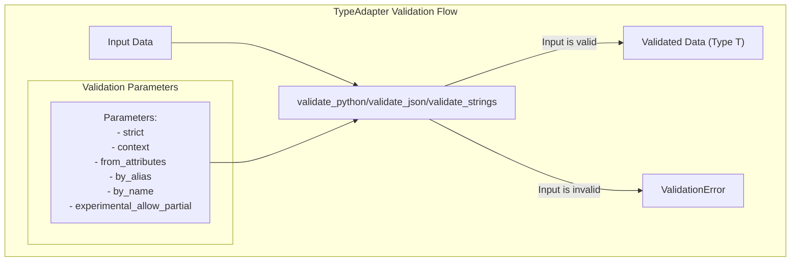
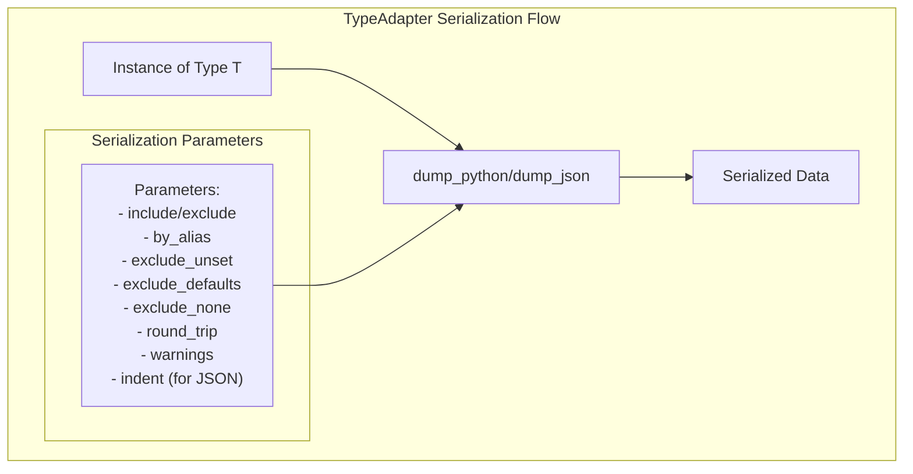
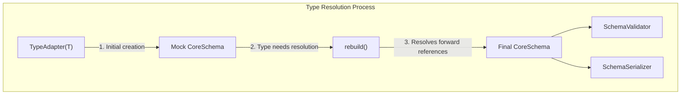
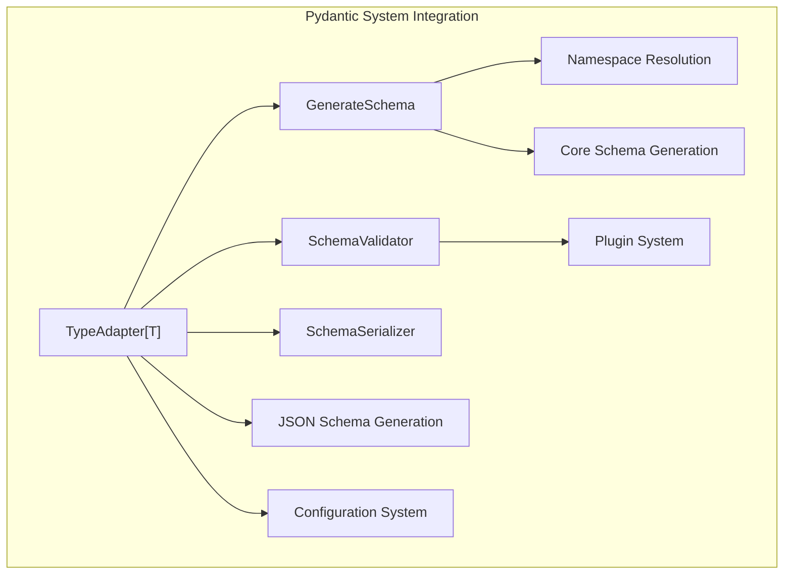

dict_adapter = TypeAdapter(dict[str, int])
validated_dict = dict_adapter.validate_python({"a": "1", "b": "2"})  # Returns {"a": 1, "b": 2}
```

Sources: [pydantic/type_adapter.py:195-234](, [tests/test_type_adapter.py:42-65](

## Validation Methods

TypeAdapter provides three main validation methods:

1. `validate_python`: Validates Python data against the type
2. `validate_json`: Validates JSON data against the type
3. `validate_strings`: Validates string data against the type

Each method has parameters to control validation behavior:

- `strict`: Whether to strictly check types
- `context`: Additional context for validation
- `from_attributes`: Whether to extract data from object attributes
- `by_alias`: Whether to use field aliases
- `by_name`: Whether to use field names
- `experimental_allow_partial`: Whether to enable partial validation



Sources: [pydantic/type_adapter.py:381-430](, [pydantic/type_adapter.py:431-475](, [pydantic/type_adapter.py:477-518](

## Serialization Methods

TypeAdapter also provides two main serialization methods:

1. `dump_python`: Serializes an instance to a Python object
2. `dump_json`: Serializes an instance to JSON

These methods have parameters to control serialization behavior:

- `include`: Fields to include in the output
- `exclude`: Fields to exclude from the output
- `by_alias`: Whether to use alias names for field names
- `exclude_unset`: Whether to exclude unset fields
- `exclude_defaults`: Whether to exclude fields with default values
- `exclude_none`: Whether to exclude fields with None values
- `round_trip`: Whether to output data in a way that's compatible with deserialization
- `warnings`: How to handle serialization errors
- `indent`: For JSON serialization, number of spaces for indentation



Sources: [pydantic/type_adapter.py:532-586](, [pydantic/type_adapter.py:588-645](

## JSON Schema Generation

TypeAdapter can generate a JSON schema for the type using the `json_schema` method. This is useful for API documentation and client code generation.

```python
from pydantic import TypeAdapter
from typing import Dict, List

# Generate JSON schema for a complex type
adapter = TypeAdapter(Dict[str, List[int]])
schema = adapter.json_schema()
```

The `json_schema` method has parameters to control schema generation:

- `by_alias`: Whether to use alias names for field names
- `ref_template`: The format string for generating $ref strings
- `schema_generator`: The generator class for creating the schema
- `mode`: The mode to use for schema generation (validation or serialization)

Sources: [pydantic/type_adapter.py:647-678](

## Type Resolution and Forward References

TypeAdapter handles forward references through the `rebuild` method. This is useful when your type definitions reference types that aren't fully defined yet.



When using forward references, you may need to call `rebuild` explicitly to resolve them:

```python
from pydantic import TypeAdapter
from typing import List, Dict, ForwardRef

NodeRef = ForwardRef('Node')

class Node:
    children: List[NodeRef]
    data: Dict[str, str]

# Create TypeAdapter with forward reference
node_adapter = TypeAdapter(Node)

# After Node is fully defined, rebuild the adapter
node_adapter.rebuild()
```

Sources: [pydantic/type_adapter.py:335-379](, [tests/test_type_adapter.py:162-181](

## Integration with Pydantic Systems

TypeAdapter integrates with various Pydantic systems, including:



Source: [pydantic/type_adapter.py:246-316](

## Configuration

TypeAdapter can be configured using a `ConfigDict`. The configuration affects validation and serialization behavior.

```python
from pydantic import TypeAdapter, ConfigDict
from typing import List

# Configure TypeAdapter with strict validation
int_list_adapter = TypeAdapter(List[int], config=ConfigDict(strict=True))

# This will fail due to strict validation
try:
    int_list_adapter.validate_python(["1", "2"])
except Exception as e:
    print(f"Validation failed: {e}")
```

However, you cannot provide a configuration when the type you're using has its own config that cannot be overridden (e.g., `BaseModel`, `TypedDict`, and `dataclass`).

Sources: [pydantic/type_adapter.py:198-210](, [tests/test_type_adapter.py:194-254](

## Deferred Building

TypeAdapter supports deferred building of the schema through the `defer_build` configuration option. This is useful for types with forward references that can't be resolved immediately.

```python
from pydantic import TypeAdapter, ConfigDict