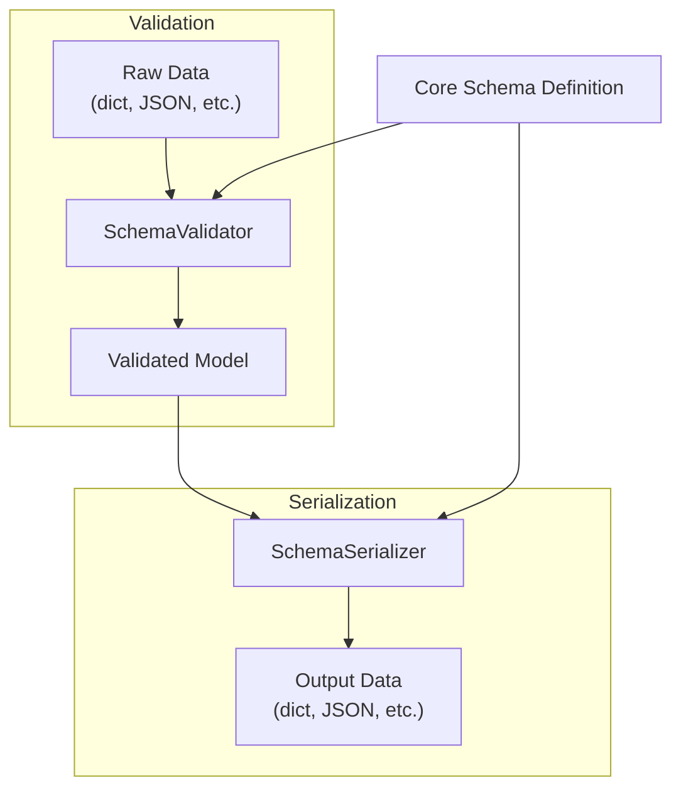
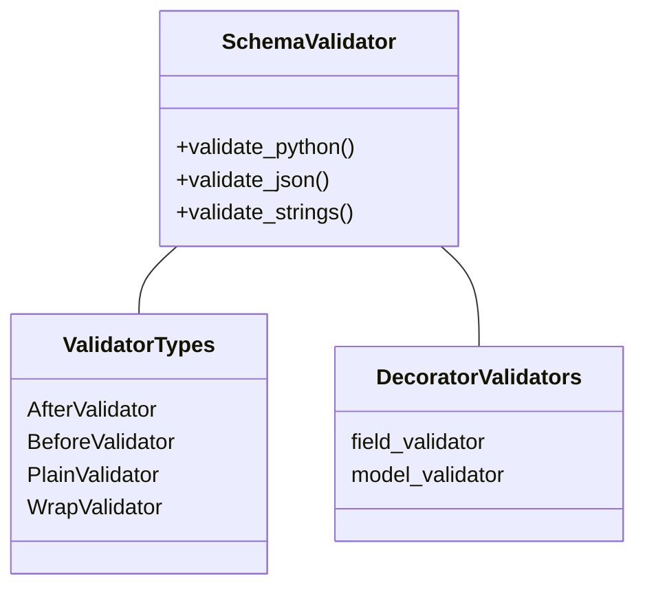
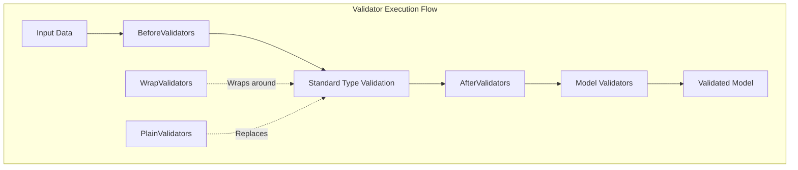
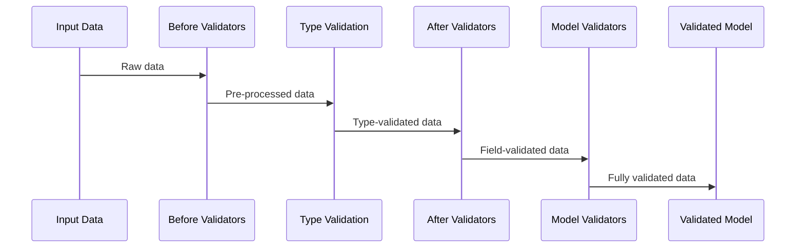
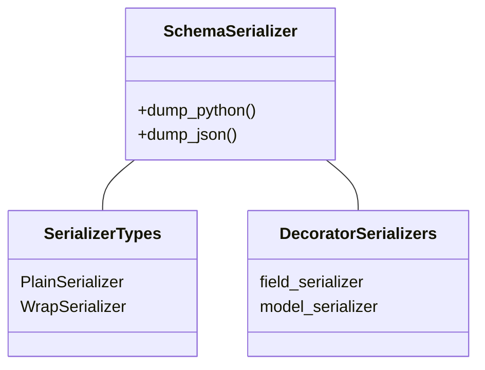
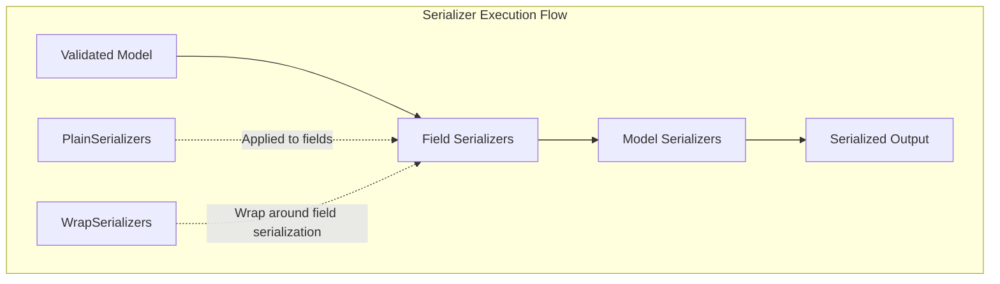
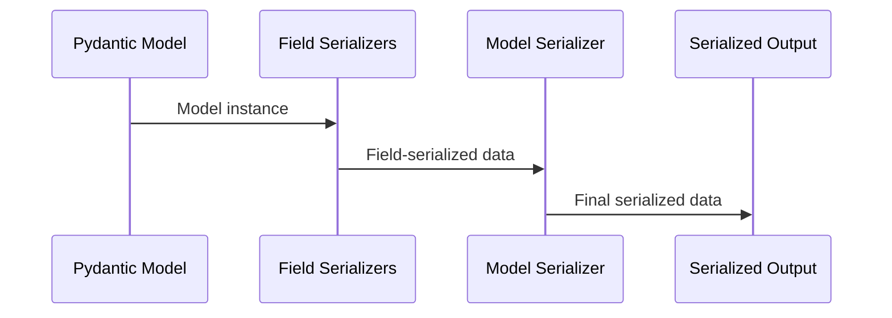
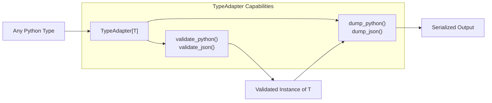

This page provides an overview of Pydantic's validation and serialization architecture, explaining how data is validated when creating models and serialized when outputting data. For information on schema generation, see [Schema Generation](#5).

## Overview

At the core of Pydantic's functionality are two fundamental processes:

1. **Validation**: Converting and validating input data against model schema definitions
2. **Serialization**: Converting validated models into standard formats like Python dictionaries and JSON

These processes work together to ensure that data flowing into and out of your application is consistent, type-safe, and properly formatted.



Sources: [pydantic/functional_validators.py:27-323](pydantic/functional_validators.py:27-323), [pydantic/functional_serializers.py:19-89](pydantic/functional_serializers.py:19-89)

## Validation Architecture

Validation ensures that input data conforms to the defined model schema. Pydantic leverages a layered architecture that processes data through several validation stages.

### Core Validation Components



Sources: [pydantic/functional_validators.py:27-156](pydantic/functional_validators.py:27-156), [pydantic/_internal/_decorators.py:30-154](pydantic/_internal/_decorators.py:30-154)

### Validator Types and Functions

Pydantic offers several types of validators that can be applied at different stages of the validation process:

1. **Field Validators**: Apply to specific fields using the `@field_validator` decorator
2. **Model Validators**: Apply to the entire model using the `@model_validator` decorator
3. **Functional Validators**: Used with `Annotated` types to apply validation to specific types

The functional validators include:

- **BeforeValidator**: Executes before the standard validation
- **AfterValidator**: Executes after the standard validation
- **PlainValidator**: Replaces the standard validation
- **WrapValidator**: Wraps around the standard validation, providing access to both the input and the standard validation function



Sources: [pydantic/functional_validators.py:70-327](pydantic/functional_validators.py:70-327), [tests/test_validators.py:51-156](tests/test_validators.py:51-156)

### Validation Process

When validating data, Pydantic follows this general process:

1. Apply any `BeforeValidator` or `WrapValidator` functions
2. Perform standard type coercion and validation
3. Apply any `AfterValidator` functions
4. Apply model-level validators
5. Construct the validated model

This pipeline allows for powerful and flexible validation at different stages.



Sources: [tests/test_validators.py:87-156](tests/test_validators.py:87-156), [tests/test_validators.py:192-300](tests/test_validators.py:192-300)

## Serialization Architecture

Serialization converts validated Pydantic models into Python dictionaries, JSON, or other formats. Like validation, serialization uses a modular architecture.

### Core Serialization Components



Sources: [pydantic/functional_serializers.py:19-195](pydantic/functional_serializers.py:19-195), [tests/test_serialize.py:33-109](tests/test_serialize.py:33-109)

### Serializer Types

Pydantic offers several types of serializers:

1. **Field Serializers**: Customize serialization for specific fields using the `@field_serializer` decorator
2. **Model Serializers**: Customize serialization for the entire model using the `@model_serializer` decorator
3. **Functional Serializers**: Used with `Annotated` types to apply serialization to specific types

The functional serializers include:

- **PlainSerializer**: Directly determines the serialized output
- **WrapSerializer**: Wraps around the standard serialization, providing access to both the input and the standard serialization function



Sources: [pydantic/functional_serializers.py:19-89](pydantic/functional_serializers.py:19-89), [pydantic/functional_serializers.py:89-195](pydantic/functional_serializers.py:89-195)

### Serialization Process

When serializing data, Pydantic follows this general process:

1. Determine the serialization mode (Python, JSON)
2. Apply field-specific serializers
3. Apply model-level serializers
4. Convert to the target format (dict, JSON string)

This pipeline allows for customizable serialization at different levels.



Sources: [tests/test_serialize.py:82-109](tests/test_serialize.py:82-109), [tests/test_serialize.py:148-198](tests/test_serialize.py:148-198)

## TypeAdapter Integration

The `TypeAdapter` class extends validation and serialization capabilities to arbitrary Python types, not just Pydantic models.



TypeAdapter leverages the same core validation and serialization mechanisms as Pydantic models, but applies them to arbitrary types:

```python