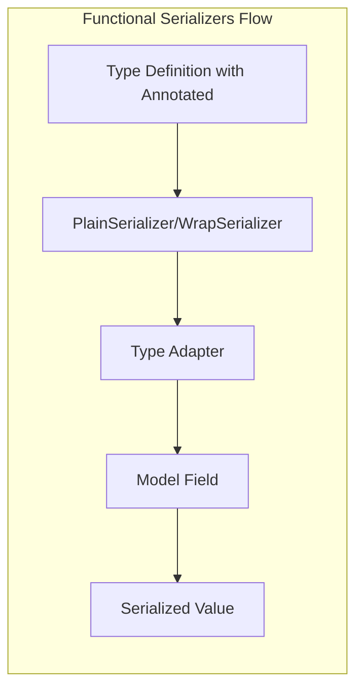

@field_serializer('field_name', mode='wrap')
def serialize_field(self, value: Any, handler: SerializerFunctionWrapHandler, 
                   info: FieldSerializationInfo) -> Any:
    return handler(transformed_value)
```

The `info` parameter provides context about the serialization process, including the field name and serialization mode.

Sources:
- [tests/test_serialize.py:225-271](tests/test_serialize.py:225-271)
- [pydantic/_internal/_decorators.py:90-111](pydantic/_internal/_decorators.py:90-111)

## Functional Serializers

Functional serializers are used with the `Annotated` type to define custom serialization logic for specific types. This allows you to reuse serialization logic across multiple models.



Pydantic provides two main types of functional serializers:

1. **PlainSerializer**: Applies a transformation function directly to the value
2. **WrapSerializer**: Provides both the value and a handler function for more complex transformations

### PlainSerializer

```python
from typing import Annotated
from pydantic import BaseModel, PlainSerializer