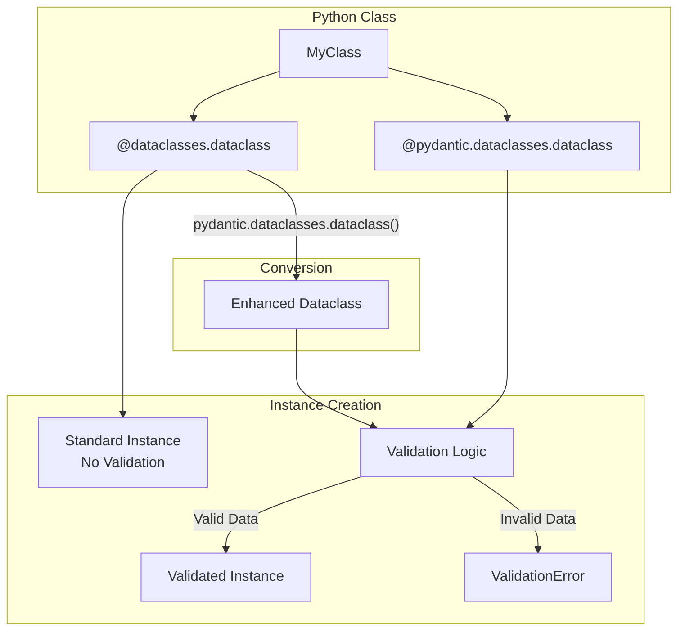
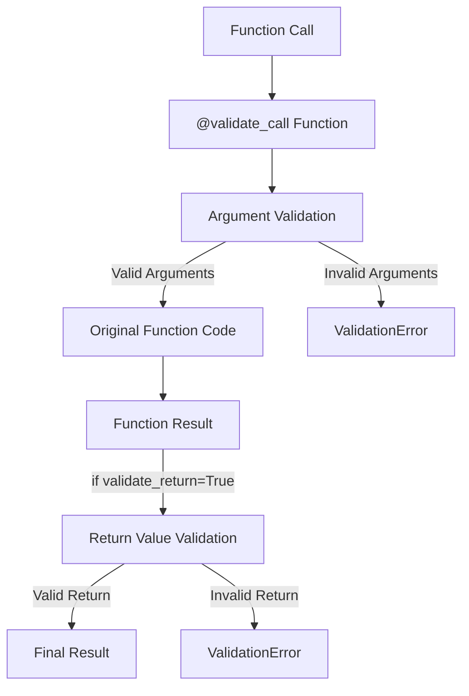
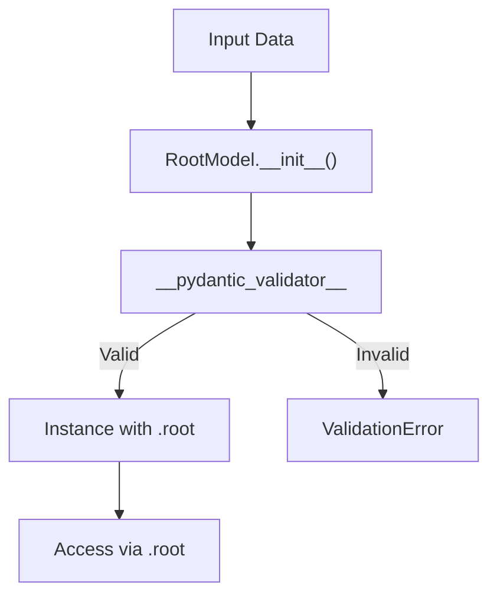
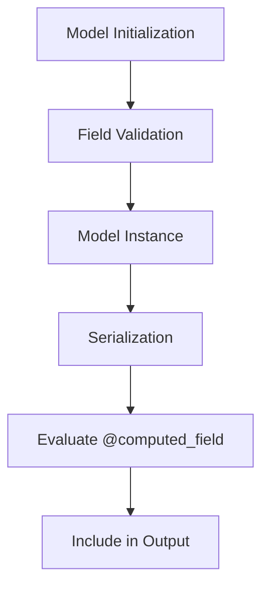

```

Sources: [pydantic/json_schema.py:135-186](pydantic/json_schema.py)

## Performance Considerations

For models with many related types, JSON Schema generation may be expensive. Consider:

1. Caching generated schemas when appropriate
2. Only generating schemas when needed, not during startup
3. Using `TypeAdapter` for simpler types that don't need full model capabilities

# Advanced Features


This page documents advanced Pydantic features that extend beyond basic models. We cover enhanced dataclasses, function validation, root models with computed fields, and the plugin system for customizing validation behavior.

## Dataclass Support

Pydantic provides the `@pydantic.dataclasses.dataclass` decorator that enhances Python's standard dataclasses with validation capabilities while maintaining compatibility with the standard library's `dataclasses` module.



### Creating Pydantic Dataclasses

The `@pydantic.dataclasses.dataclass` decorator wraps the standard library `dataclasses.dataclass` and adds validation:

```python
from pydantic.dataclasses import dataclass
from datetime import datetime

@dataclass
class User:
    id: int
    name: str
    signup_ts: datetime = None
```

The decorator creates a custom `__init__` that validates input using a `__pydantic_validator__` attribute. The actual dataclass creation happens via `dataclasses.dataclass()` after field processing.

Sources: [pydantic/dataclasses.py:98-250](), [pydantic/_internal/_dataclasses.py:85-190]()

### Configuration Options

Dataclass configuration is provided via the `config` parameter, which accepts a `ConfigDict`:

| Configuration | Description |
|--------------|-------------|
| `validate_assignment` | When `True`, validates field values on assignment after initialization |
| `frozen` | Creates immutable dataclass instances |
| `str_max_length` | Maximum string length for all string fields |
| `arbitrary_types_allowed` | Allows arbitrary types that don't have Pydantic validation |

The `frozen` parameter can be set on both the decorator and in config. The decorator value takes precedence.

Sources: [pydantic/dataclasses.py:99-221](), [tests/test_dataclasses.py:108-130]()

### Converting Standard Dataclasses

Existing standard library dataclasses can be wrapped to add validation without modifying the original class:

```python
import dataclasses
from pydantic.dataclasses import dataclass as pydantic_dataclass

@dataclasses.dataclass
class File:
    hash: str
    name: str
    size: int

# Wrap to create validated version
ValidFile = pydantic_dataclass(File)
```

When wrapping a standard dataclass, Pydantic creates a new subclass (not modifying the original) and processes it through the same field collection and schema generation pipeline as regular Pydantic dataclasses.

Sources: [pydantic/dataclasses.py:194-206](), [tests/test_dataclasses.py:807-840]()

### Field Collection

Pydantic dataclasses collect fields using `collect_dataclass_fields()`, which:

1. Iterates through the dataclass MRO (Method Resolution Order) in reverse
2. Processes `__dataclass_fields__` from each dataclass in the hierarchy
3. Evaluates field annotations using the namespace resolver
4. Creates `FieldInfo` instances for each field
5. Applies typevars mapping for generic dataclasses

The process respects both `dataclasses.field()` and `pydantic.Field()` for defining field metadata.

Sources: [pydantic/_internal/_fields.py:460-539](), [pydantic/_internal/_dataclasses.py:65-83]()

### Dataclass-Specific Features

#### InitVar Support

Pydantic dataclasses support `dataclasses.InitVar` for initialization-only fields:

```python
from pydantic.dataclasses import dataclass
import dataclasses
from typing import Annotated
from annotated_types import Gt

@dataclass
class TestInitVar:
    x: int
    y: dataclasses.InitVar
    z: Annotated[dataclasses.InitVar[int], Gt(1)]
```

InitVar fields are validated during initialization but are not stored on the instance.

Sources: [tests/test_dataclasses.py:673-687]()

#### Post-Init Processing

The `__post_init__` method is called after validation completes, allowing for derived field computation:

```python
@dataclass
class DerivedWithInitVar:
    plusone: int = dataclasses.field(init=False)
    number: dataclasses.InitVar[int]
    
    def __post_init__(self, number):
        self.plusone = number + 1
```

Sources: [tests/test_dataclasses.py:689-702]()

#### Validate Assignment

When `validate_assignment=True`, field assignments after initialization are validated:

```python
@dataclass(config=ConfigDict(validate_assignment=True))
class MyDataclass:
    a: int

d = MyDataclass(1)
d.a = '7'  # Validated and coerced to 7
```

The implementation wraps `__setattr__` with validation logic that calls `__pydantic_validator__.validate_assignment()`.

Sources: [pydantic/dataclasses.py:251-268](), [tests/test_dataclasses.py:120-149]()

### Schema Generation

Dataclass schemas are built by `complete_dataclass()`, which:

1. Collects fields via `set_dataclass_fields()`
2. Creates a `GenerateSchema` instance with the config wrapper
3. Generates the core schema
4. Creates `SchemaValidator` and `SchemaSerializer` instances
5. Sets completion attributes like `__pydantic_complete__`

If schema generation fails (e.g., due to undefined forward references), mock validators are set and `__pydantic_complete__` remains `False`.

Sources: [pydantic/_internal/_dataclasses.py:85-191]()

## Function Validation

The `@validate_call` decorator validates function arguments and optionally return values against type annotations.



### The `@validate_call` Decorator

The decorator creates a `ValidateCallWrapper` that intercepts function calls:

```python
from pydantic import validate_call

@validate_call
def process_user(user_id: int, name: str, active: bool = True):
    return {"id": user_id, "name": name, "active": active}
```

The wrapper validates arguments using `ArgsKwargs` and converts them to match the function signature.

Sources: [pydantic/validate_call_decorator.py:57-116](), [pydantic/_internal/_validate_call.py:49-90]()

### ValidateCallWrapper Implementation

The `ValidateCallWrapper` class implements the validation logic:

| Attribute | Purpose |
|-----------|---------|
| `function` | The original function being wrapped |
| `validate_return` | Whether to validate return values |
| `__pydantic_validator__` | SchemaValidator for arguments |
| `__return_pydantic_validator__` | SchemaValidator for return value (if enabled) |

The wrapper:
1. Creates a schema from the function signature
2. Validates input as `ArgsKwargs` containing positional and keyword arguments
3. Calls the original function with validated arguments
4. Optionally validates the return value

Sources: [pydantic/_internal/_validate_call.py:49-125]()

### Function Schema Generation

Schema generation for functions happens in `GenerateSchema.validate_call_schema()`:

1. Extracts function signature via `inspect.signature()`
2. Processes each parameter to create argument schemas
3. Handles special parameter types (VAR_POSITIONAL, VAR_KEYWORD)
4. Creates an `arguments_schema` for validation
5. Optionally creates a return schema if `validate_return=True`

The generated schema validates arguments as an `ArgsKwargs` structure that gets unpacked to call the function.

Sources: [pydantic/_internal/_generate_schema.py:1547-1651]()

### Validating Return Values

Enable return value validation with `validate_return=True`:

```python
@validate_call(validate_return=True)
def get_user_info(user_id: int) -> dict[str, str]:
    return {"name": "John", "age": 30}  # Validation error: age is int, not str
```

Return validation uses a separate `__return_pydantic_validator__` created from the return type annotation.

Sources: [pydantic/_internal/_validate_call.py:91-125](), [tests/test_validate_call.py:547-575]()

### Configuration

Configuration is passed via the `config` parameter:

```python
@validate_call(config=ConfigDict(str_strip_whitespace=True))
def greet(name: str):
    return f"Hello, {name}!"
```

The configuration affects both argument and return value validation.

Sources: [pydantic/validate_call_decorator.py:57-116](), [tests/test_validate_call.py:618-641]()

### Supported Function Types

The decorator supports:
- Regular functions
- Async functions
- Methods (instance, class, static)
- Lambda functions
- `functools.partial` objects

It does not support:
- Built-in functions (e.g., `breakpoint`)
- Classes (use on `__init__` or `__new__` instead)
- Non-callable objects

Sources: [pydantic/validate_call_decorator.py:24-95](), [tests/test_validate_call.py:42-97]()


## RootModel and Computed Fields

### RootModel

The `RootModel` class validates a single root-level value rather than multiple fields. It's a `BaseModel` subclass with a single field named `root`.

**RootModel Validation Flow**



The `RootModel` class:
- Sets `__pydantic_root_model__ = True` 
- Has a single field `root: RootModelRootType`
- Does not support `model_config['extra']`
- Accepts either positional or keyword arguments in `__init__`

Sources: [pydantic/root_model.py:32-86]()

#### Creating RootModels

```python
from typing import List
from pydantic import RootModel

class IntListModel(RootModel[List[int]]):
    pass

model = IntListModel(["1", 2, "3"])
print(model.root)  # [1, 2, 3]
```

The root type is specified as a generic parameter. The model validates that the input matches the root type.

Sources: [pydantic/root_model.py:32-69]()

#### Serialization

RootModel serialization methods return the root value directly:

| Method | Returns |
|--------|---------|
| `model_dump()` | Python representation of root |
| `model_dump_json()` | JSON string of root |

```python
model = IntListModel([1, 2, 3])
python_data = model.model_dump()  # [1, 2, 3]
json_data = model.model_dump_json()  # '[1,2,3]'
```

Sources: [pydantic/root_model.py:109-158]()

### Computed Fields

The `@computed_field` decorator creates dynamic properties that appear in serialization but are not part of the model's validated fields.

**Computed Field Lifecycle**



Computed fields:
- Are evaluated during serialization, not validation
- Appear in `model_dump()` and `model_dump_json()` output
- Can be cached with `@cached_property`
- Support custom serializers via `@field_serializer`

Sources: [pydantic/fields.py:745-894]()

#### Basic Usage

```python
from pydantic import BaseModel, computed_field

class Rectangle:
    width: float
    height: float
    
    @computed_field
    @property
    def area(self) -> float:
        return self.width * self.height

r = Rectangle(width=3, height=4)
print(r.model_dump())  # {'width': 3.0, 'height': 4.0, 'area': 12.0}
```

The `@computed_field` decorator must be applied to a `@property`. The computed value is included in serialization output.

Sources: [pydantic/fields.py:745-810]()

#### JSON Schema

Computed fields appear in JSON schema with `readOnly: true` in serialization mode:

```python
from pydantic import BaseModel, computed_field

class Model(BaseModel):
    x: int
    
    @computed_field
    @property
    def double_x(self) -> int:
        return 2 * self.x