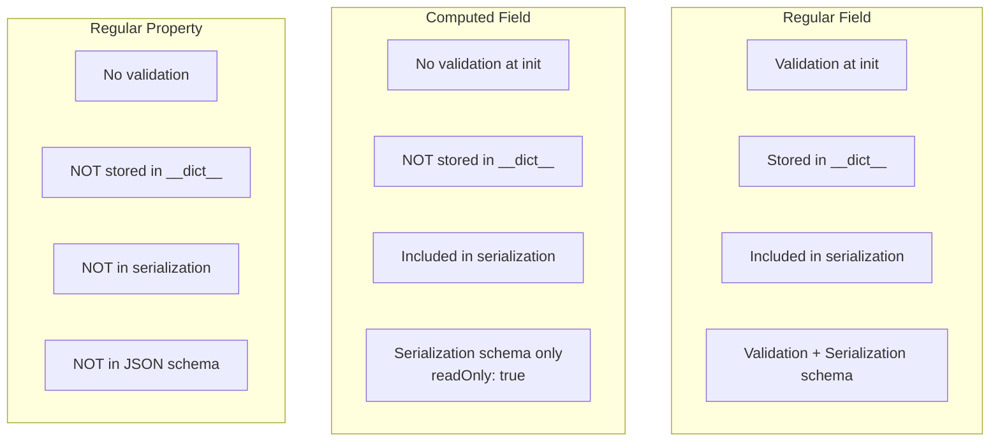
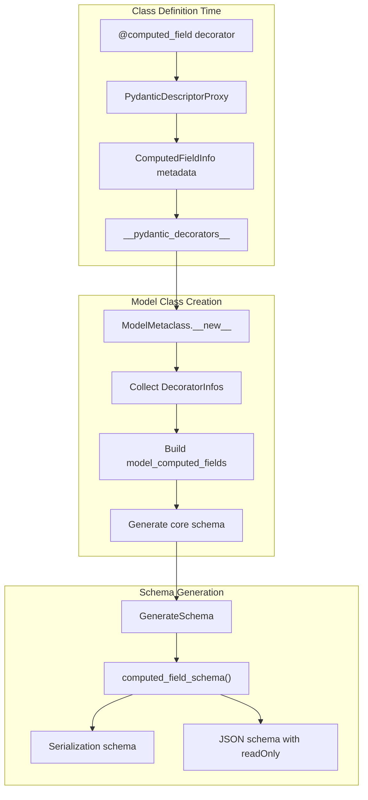

```

**Sources:** [tests/test_computed_fields.py:287-309](), [pydantic/main.py]()

---

## Storage and Access Patterns

### Field vs Computed Field Comparison



| Feature | Regular Field | Computed Field | Regular Property |
|---------|--------------|----------------|------------------|
| Validated at init | ✓ | ✗ | ✗ |
| Stored in `__dict__` | ✓ | ✗ | ✗ |
| In `model_dump()` | ✓ | ✓ | ✗ |
| In JSON schema | ✓ | ✓ (readOnly) | ✗ |
| Can have setter | ✗ | ✓ | ✓ |
| Cached by default | ✓ | ✗ | ✗ |
| Computed on access | ✗ | ✓ | ✓ |

**Sources:** [tests/test_computed_fields.py:27-66](), [pydantic/main.py]()

---

## Integration with Validation and Serialization

### Computed Fields in Validation Pipeline

Computed fields are **not** part of the validation pipeline. They are only evaluated during serialization or when accessed as properties.

```mermaid
graph LR
    subgraph "Validation Flow"
        Input["Input Data"]
        Validators["Field Validators"]
        ModelValidators["Model Validators"]
        Instance["Model Instance"]
    end
    
    subgraph "Serialization Flow"
        SerStart["Serialization Start"]
        FieldSer["Field Serializers"]
        ComputedEval["Evaluate Computed Fields"]
        ComputedSer["Computed Field Serializers"]
        Output["Serialized Output"]
    end
    
    Input --> Validators
    Validators --> ModelValidators
    ModelValidators --> Instance
    
    Instance --> SerStart
    SerStart --> FieldSer
    FieldSer --> ComputedEval
    ComputedEval --> ComputedSer
    ComputedSer --> Output
    
    style ComputedEval fill:#f9f9f9
    style ComputedSer fill:#f9f9f9
```



**Sources:** [pydantic/_internal/_generate_schema.py](), [tests/test_computed_fields.py]()

### Decorator Processing Flow



**Sources:** [pydantic/_internal/_decorators.py:427](), [pydantic/_internal/_model_construction.py](), [pydantic/_internal/_generate_schema.py]()

---

## Code Entity Reference

### RootModel Implementation

| Class/Function | Location | Purpose |
|----------------|----------|---------|
| `RootModel` | [pydantic/root_model.py:32]() | Main RootModel class definition |
| `RootModel.__init__` | [pydantic/root_model.py:60-69]() | Initialize with root value |
| `RootModel.model_construct` | [pydantic/root_model.py:72-86]() | Construct without validation |
| `RootModel.__init_subclass__` | [pydantic/root_model.py:52-58]() | Check extra config not set |
| `_RootModelMetaclass` | [pydantic/root_model.py:25]() | Metaclass for RootModel |

**Sources:** [pydantic/root_model.py:1-155]()

### Computed Field Implementation

| Class/Function | Location | Purpose |
|----------------|----------|---------|
| `@computed_field` | [pydantic/fields.py]() | Decorator for computed fields |
| `ComputedFieldInfo` | [pydantic/fields.py]() | Metadata container for computed fields |
| `DecoratorInfos.computed_fields` | [pydantic/_internal/_decorators.py:427]() | Storage in decorator info |
| `model_computed_fields` | [pydantic/main.py]() | ClassVar dict of computed fields |

**Sources:** [pydantic/fields.py](), [pydantic/_internal/_decorators.py]()

### Schema Generation

| Function | Location | Purpose |
|----------|----------|---------|
| `computed_field_schema()` | [pydantic/_internal/_generate_schema.py]() | Generate schema for computed field |
| `_computed_field_common_schema()` | [pydantic/_internal/_generate_schema.py]() | Common schema logic |

**Sources:** [pydantic/_internal/_generate_schema.py]()