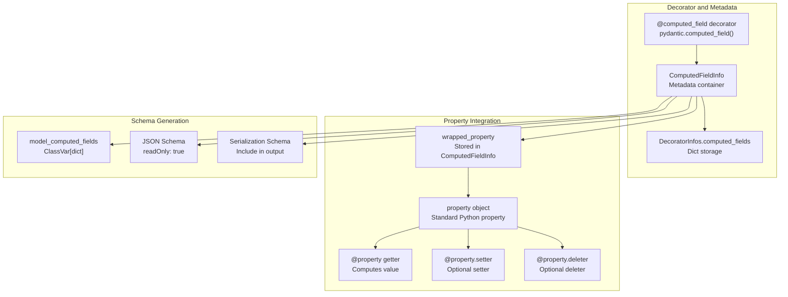

```

This behavior is controlled by the model's serialization schema and differs from BaseModel to match the semantic meaning of a "root" value.

**Sources:** [pydantic/root_model.py:116-144](), [tests/test_root_model.py]()

---

## Computed Fields

### Purpose and Design

Computed fields are dynamic properties that:
1. Are calculated on-access (not stored in `__dict__`)
2. Automatically appear in serialization (`model_dump()`, `model_dump_json()`)
3. Generate JSON schema with `readOnly: true`
4. Can have custom serializers applied
5. Support property setters and deleters

They bridge the gap between regular properties (not serialized) and model fields (stored and validated).

**Sources:** [pydantic/fields.py](), [tests/test_computed_fields.py:27-66]()

### Core Components



**Sources:** [pydantic/fields.py](), [pydantic/_internal/_decorators.py:427](), [tests/test_computed_fields.py]()

### Basic Usage

The `@computed_field` decorator can be used directly or with the `@property` decorator:

```python
from pydantic import BaseModel, computed_field

class Rectangle(BaseModel):
    width: int
    length: int
    
    @computed_field
    @property
    def area(self) -> int:
        """Calculate area"""
        return self.width * self.length
    
    # Shorthand (property is implied)
    @computed_field
    def perimeter(self) -> int:
        return 2 * (self.width + self.length)

rect = Rectangle(width=10, length=5)