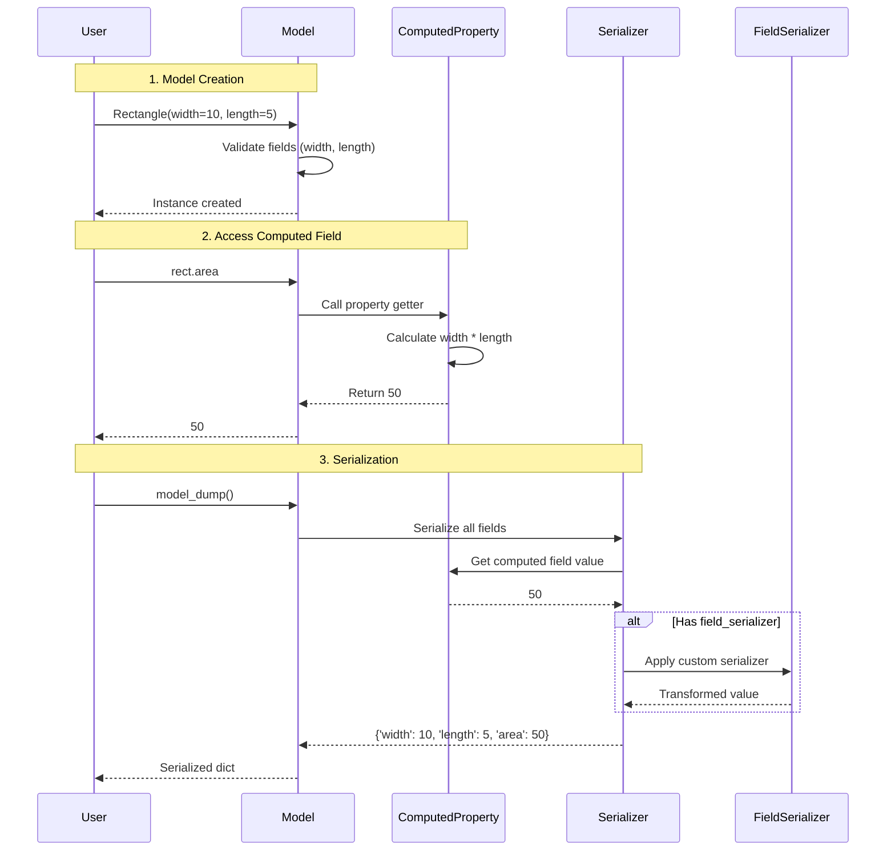

```

**Sources:** [tests/test_computed_fields.py:27-66]()

### Field Metadata and Configuration

Computed fields support the same metadata as regular fields:

| Parameter | Type | Purpose | Example |
|-----------|------|---------|---------|
| `title` | `str` | JSON schema title | `title='Area'` |
| `description` | `str` | Documentation | `description='Calculated area'` |
| `examples` | `list` | Example values | `examples=[100, 200]` |
| `json_schema_extra` | `dict` | Additional JSON schema properties | `json_schema_extra={'foo': 42}` |
| `alias` | `str` | Serialization alias | `alias='the_area'` |
| `repr` | `bool` | Include in `__repr__` (default: `True`) | `repr=False` |
| `return_type` | `type` | Override inferred return type | `return_type=float` |

**Sources:** [tests/test_computed_fields.py:68-121](), [pydantic/fields.py]()

### Computed Field Lifecycle



**Sources:** [tests/test_computed_fields.py:27-66](), [pydantic/_internal/_generate_schema.py]()

### Property Setters and Deleters

Computed fields can have setters and deleters like regular properties:

```python
class Square(BaseModel):
    side: float
    
    @computed_field
    @property
    def area(self) -> float:
        return self.side ** 2
    
    @area.setter
    def area(self, new_area: float):
        self.side = new_area ** 0.5
    
    @area.deleter
    def area(self):
        self.side = 0

s = Square(side=10)