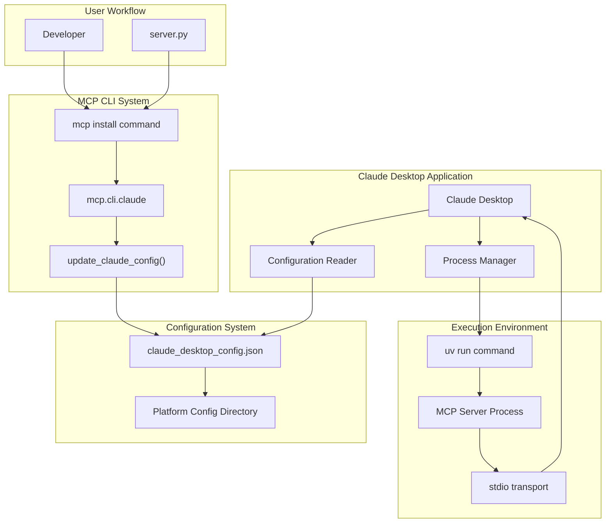
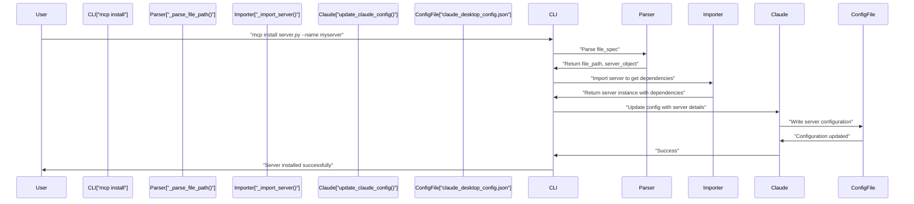
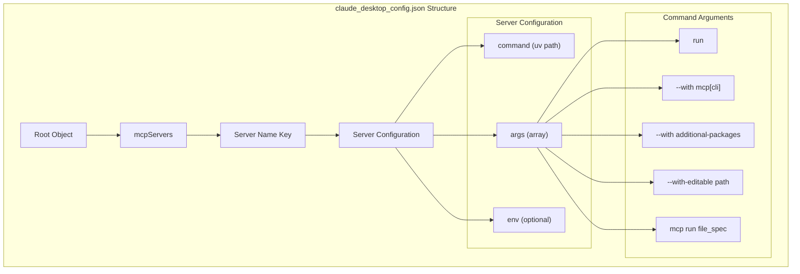
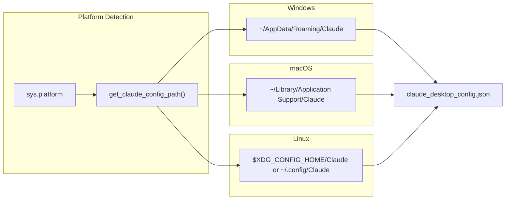
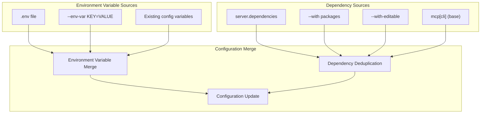
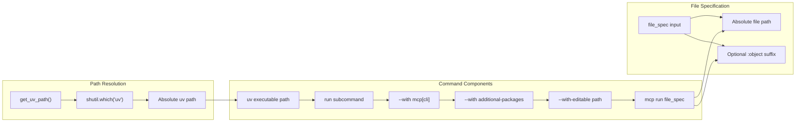

This document covers the integration of MCP servers with the Claude Desktop application. The integration allows MCP servers built with the Python SDK to be automatically discovered and used by Claude Desktop through configuration file management and standardized execution commands.

For information about building MCP servers, see [FastMCP Server Framework](#2). For CLI development tools, see [MCP CLI Commands](#8.1).

## Integration Architecture

The Claude Desktop integration operates through a configuration-based approach where MCP servers are registered in Claude Desktop's configuration file and executed via standardized `uv run` commands.



**Claude Desktop Integration Architecture**

Sources: [src/mcp/cli/claude.py:44-148](), [src/mcp/cli/cli.py:362-488]()

## Installation Process

The installation process uses the `mcp install` command to register MCP servers with Claude Desktop. The process involves server discovery, dependency resolution, and configuration file updates.



**MCP Server Installation Flow**

The installation process handles several key aspects:

| Component | Function | Purpose |
|-----------|----------|---------|
| File parsing | `_parse_file_path()` | Extracts file path and optional server object name |
| Server import | `_import_server()` | Loads server to extract metadata and dependencies |
| Config update | `update_claude_config()` | Updates Claude's configuration file |
| Dependency resolution | Server.dependencies | Automatically includes required packages |

Sources: [src/mcp/cli/cli.py:420-488](), [src/mcp/cli/cli.py:88-117](), [src/mcp/cli/cli.py:119-208]()

## Configuration File Structure

Claude Desktop uses a JSON configuration file to store MCP server definitions. The configuration file follows a specific structure that defines execution commands, environment variables, and server metadata.



**Configuration File Structure**

The generated configuration follows this pattern:

```json
{
  "mcpServers": {
    "server-name": {
      "command": "/path/to/uv",
      "args": [
        "run",
        "--with", "mcp[cli]",
        "--with", "additional-package",
        "--with-editable", "/path/to/editable/package",
        "mcp", "run", "/absolute/path/to/server.py:object"
      ],
      "env": {
        "VAR_NAME": "value"
      }
    }
  }
}
```

Sources: [src/mcp/cli/claude.py:87-135](), [src/mcp/cli/claude.py:101-125]()

## Platform-Specific Configuration Paths

The system automatically detects Claude Desktop's configuration directory based on the operating system platform using standardized application data locations.



**Platform-Specific Configuration Paths**

| Platform | Configuration Path | Environment Variable |
|----------|-------------------|---------------------|
| Windows | `%USERPROFILE%\AppData\Roaming\Claude` | - |
| macOS | `~/Library/Application Support/Claude` | - |
| Linux | `$XDG_CONFIG_HOME/Claude` or `~/.config/Claude` | `XDG_CONFIG_HOME` |

Sources: [src/mcp/cli/claude.py:17-30]()

## Environment Variables and Dependencies

The configuration system supports environment variables and automatic dependency management for MCP servers. Environment variables are preserved across updates and can be loaded from files or command line arguments.



**Environment and Dependency Management**

The system handles environment variables with the following precedence:
1. New command-line variables override existing ones
2. Existing variables are preserved if not explicitly updated
3. Variables from `.env` files are loaded using the `python-dotenv` library

Dependency management includes:
- Automatic inclusion of `mcp[cli]` package
- Server-specific dependencies from `server.dependencies` attribute
- Additional packages specified via `--with` flags
- Editable package installations via `--with-editable`

Sources: [src/mcp/cli/claude.py:92-99](), [src/mcp/cli/cli.py:452-456](), [src/mcp/cli/cli.py:104-115](), [src/mcp/cli/cli.py:458-476]()

## UV Command Generation

The integration generates standardized `uv run` commands that Claude Desktop executes to launch MCP servers. The command structure ensures proper dependency isolation and package management.



**UV Command Generation Process**

The system generates commands following this pattern:
```bash
/path/to/uv run --with mcp[cli] --with package1 --with package2 --with-editable /path/to/project mcp run /absolute/path/to/server.py:object
```

Key aspects of command generation:
- Uses absolute path to `uv` executable for reliability
- Converts relative file paths to absolute paths
- Preserves server object specifications (e.g., `server.py:app`)
- Deduplicates packages while preserving order
- Handles Windows drive letter syntax correctly

Sources: [src/mcp/cli/claude.py:33-41](), [src/mcp/cli/claude.py:101-125](), [src/mcp/cli/claude.py:116-122]()