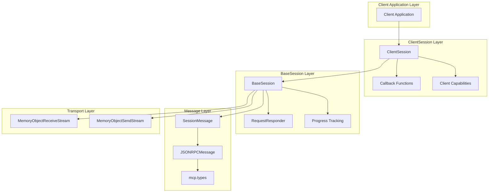
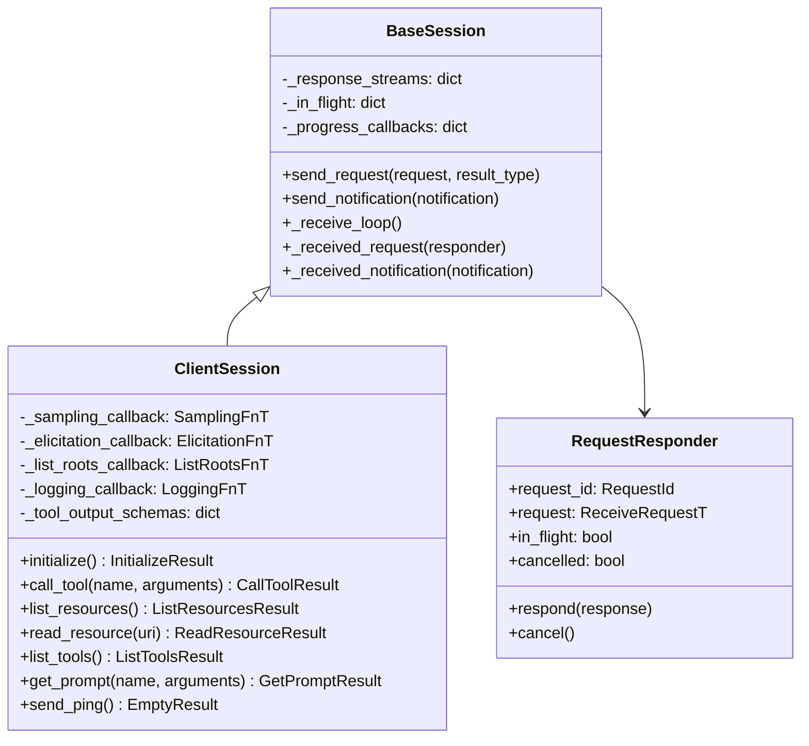
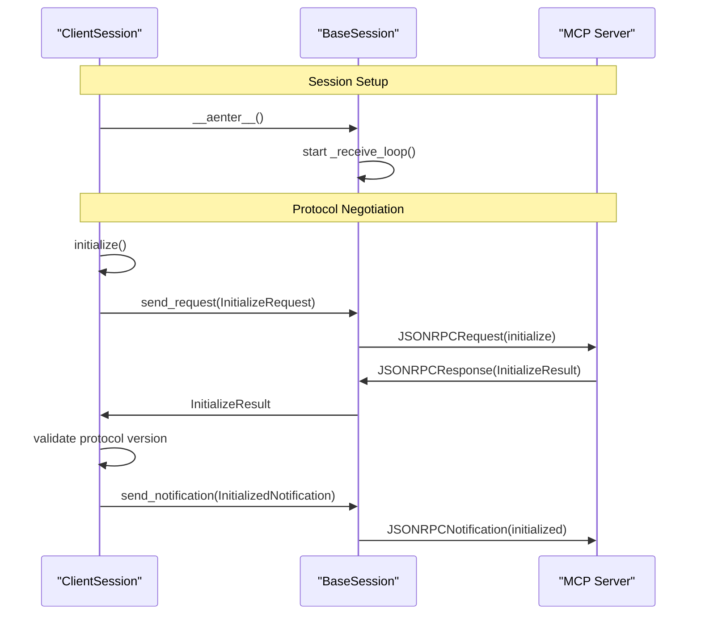
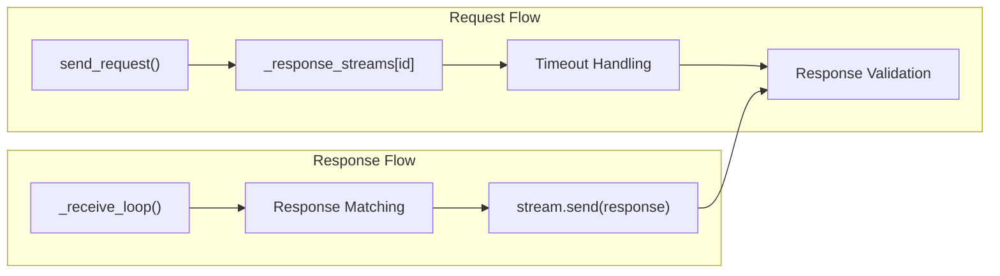
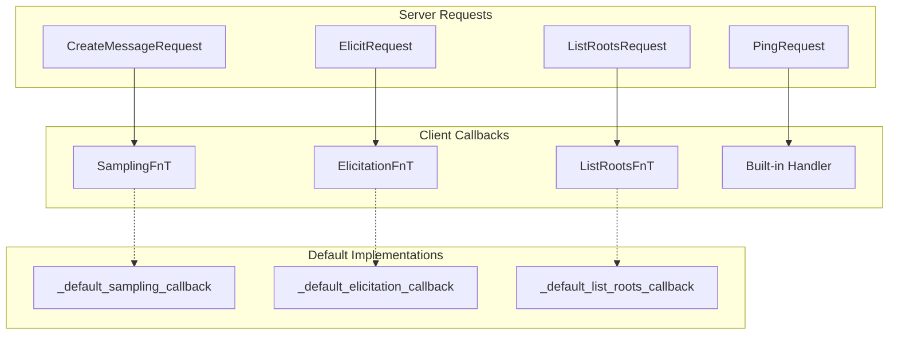
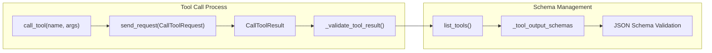
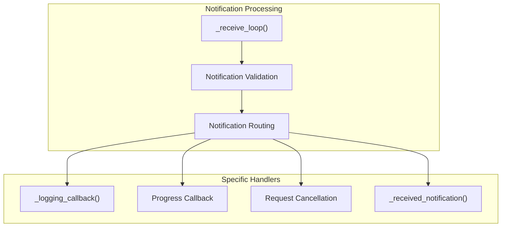
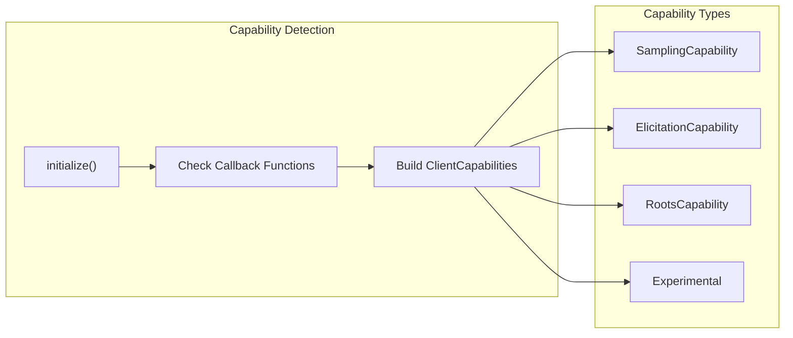

The `ClientSession` class provides the high-level client interface for communicating with MCP servers. It manages the complete lifecycle of client-server communication, including session initialization, protocol negotiation, request/response handling, and server-initiated callbacks. This document covers the core session management architecture and message handling system.

For transport-specific client implementations, see [Client Transports](#3.2). For OAuth authentication in client sessions, see [Client Authentication](#3.3).

## Session Architecture Overview

The client session architecture consists of layered components that handle different aspects of MCP communication:

Sources: [src/mcp/client/session.py:101-434](), [src/mcp/shared/session.py:159-471]()

## ClientSession Class Structure

The `ClientSession` class extends `BaseSession` with client-specific functionality and type parameters:

Sources: [src/mcp/client/session.py:101-109](), [src/mcp/shared/session.py:159-167](), [src/mcp/shared/session.py:52-67]()

## Session Initialization Flow

The initialization process establishes communication and negotiates capabilities between client and server:

The `initialize` method [src/mcp/client/session.py:137-174]() performs several key operations:

1. **Capability Advertisement**: Determines client capabilities based on provided callbacks
2. **Protocol Version**: Sends `LATEST_PROTOCOL_VERSION` and validates server response
3. **Initialization Request**: Sends `InitializeRequest` with client info and capabilities
4. **Version Validation**: Ensures server protocol version is in `SUPPORTED_PROTOCOL_VERSIONS`
5. **Completion Notification**: Sends `InitializedNotification` to complete handshake

Sources: [src/mcp/client/session.py:137-174](), [tests/client/test_session.py:30-114]()

## Request/Response Management

The session manages request/response pairs using a stream-based approach with timeout handling:

| Component | Purpose | Key Methods |
|-----------|---------|-------------|
| `send_request` | Send request and wait for response | Type-safe request/response matching |
| `_response_streams` | Track pending requests | Maps request ID to response stream |
| `_progress_callbacks` | Handle progress updates | Maps progress token to callback function |
| `RequestResponder` | Manage server-initiated requests | Context manager for request lifecycle |

The `send_request` method [src/mcp/shared/session.py:220-294]() provides:

- **Type Safety**: Generic type parameters ensure request/response type matching
- **Progress Support**: Automatic progress token injection and callback registration
- **Timeout Management**: Request-specific and session-level timeout support
- **Error Handling**: Converts `JSONRPCError` responses to `McpError` exceptions

Sources: [src/mcp/shared/session.py:220-294](), [src/mcp/shared/session.py:331-436]()

## Server-Initiated Request Handling

The client handles four types of server-initiated requests through configurable callback functions:

The `_received_request` method [src/mcp/client/session.py:388-417]() routes server requests to appropriate callbacks:

- **Sampling Requests**: Handle `CreateMessageRequest` for LLM message generation
- **Elicitation Requests**: Handle `ElicitRequest` for information extraction  
- **List Roots Requests**: Handle `ListRootsRequest` for file system roots
- **Ping Requests**: Built-in handler returns `EmptyResult`

Each callback receives a `RequestContext` with session reference and request metadata.

Sources: [src/mcp/client/session.py:388-417](), [src/mcp/client/session.py:21-96]()

## Tool Calling with Validation

The client provides structured tool calling with automatic output schema validation:

The tool calling system [src/mcp/client/session.py:270-319]() provides:

- **Progress Support**: Optional progress callback for long-running tools
- **Timeout Control**: Per-request timeout override capability
- **Schema Validation**: Automatic validation of structured content against tool output schemas
- **Schema Caching**: Maintains cache of tool output schemas from `list_tools` responses

The `_validate_tool_result` method ensures that tools returning structured content conform to their declared output schemas.

Sources: [src/mcp/client/session.py:270-319](), [src/mcp/client/session.py:366-382]()

## Notification Handling

The client processes various server notifications through the notification handling system:

| Notification Type | Handler | Purpose |
|------------------|---------|---------|
| `LoggingMessageNotification` | `_logging_callback` | Process server log messages |
| `ProgressNotification` | Progress callback lookup | Update request progress |
| `CancelledNotification` | Request cancellation | Cancel in-flight requests |
| Generic notifications | `_received_notification` | Custom notification processing |

The notification system [src/mcp/shared/session.py:377-401]() handles:

- **Logging Notifications**: Forward to configurable logging callback
- **Progress Notifications**: Route to request-specific progress callbacks using progress tokens
- **Cancellation Notifications**: Cancel in-flight requests using `RequestResponder.cancel()`

Sources: [src/mcp/shared/session.py:377-401](), [src/mcp/client/session.py:426-433]()

## Capability Advertisement

The client dynamically advertises capabilities based on provided callback functions during initialization:

Capability detection logic [src/mcp/client/session.py:137-161]():

- **Sampling**: Advertised if `sampling_callback` is not the default implementation
- **Elicitation**: Advertised if `elicitation_callback` is not the default implementation  
- **Roots**: Advertised if `list_roots_callback` is not the default implementation
- **Experimental**: Currently always `None`

The `RootsCapability` includes `listChanged=True` to indicate support for root list change notifications.

Sources: [src/mcp/client/session.py:137-161](), [tests/client/test_session.py:356-500]()