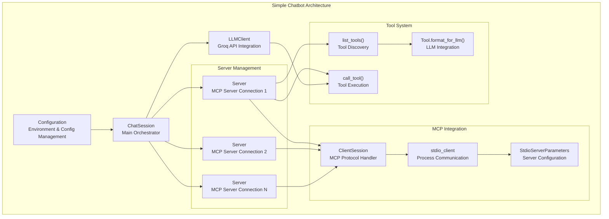
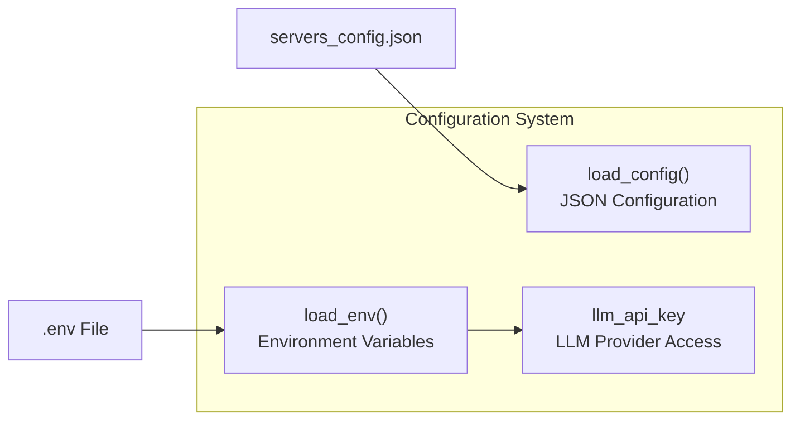
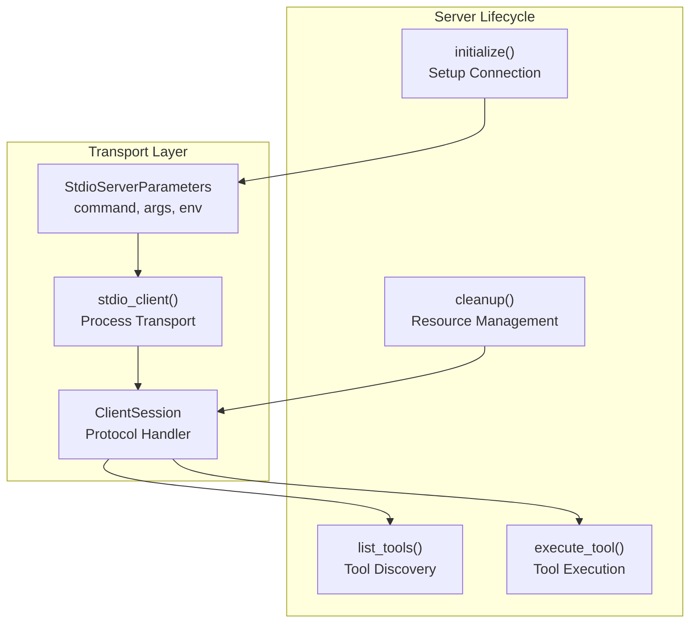
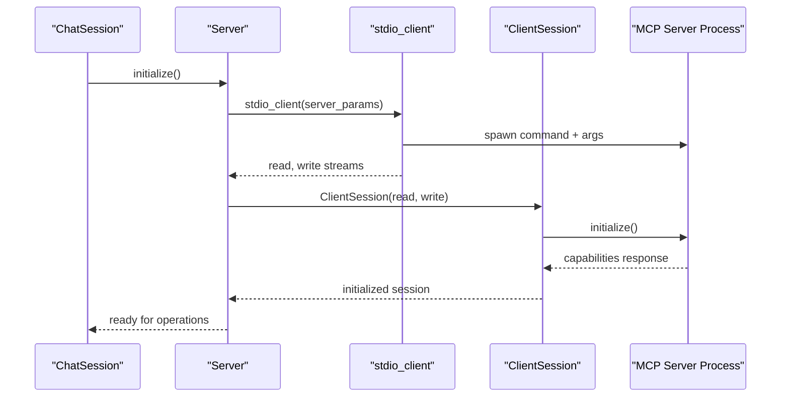
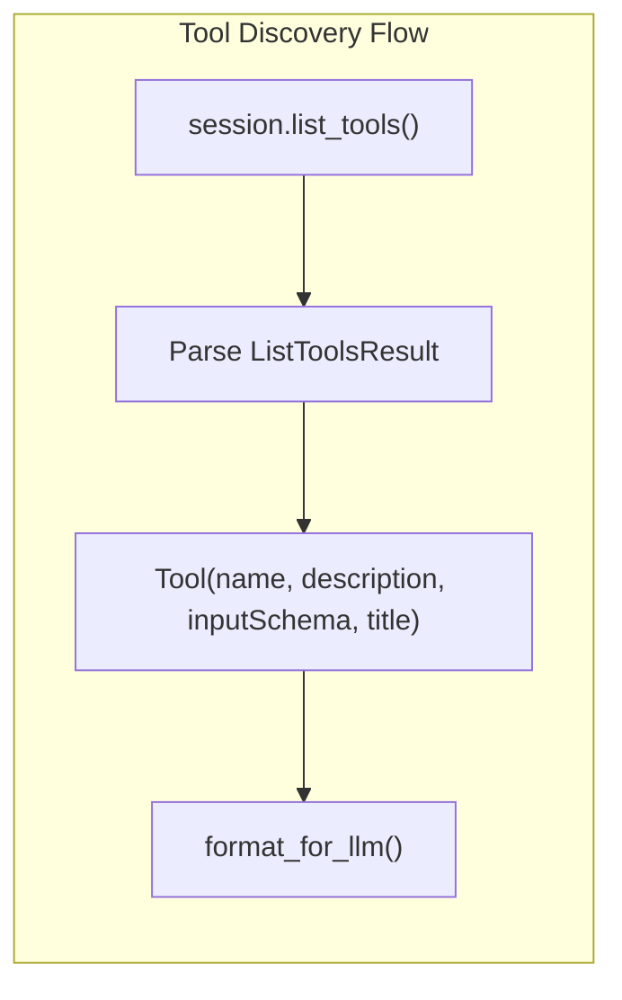
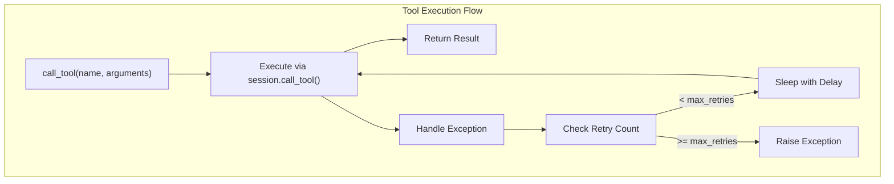
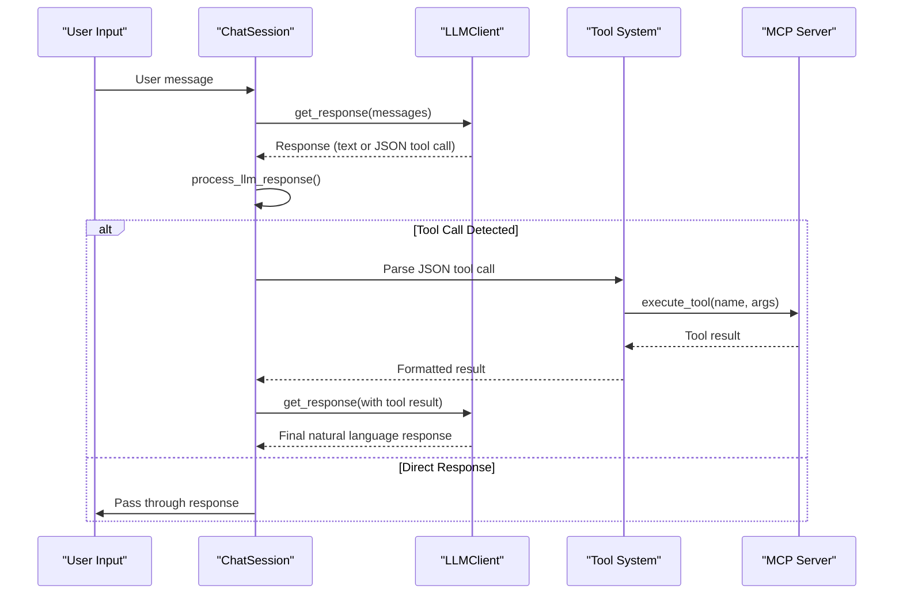
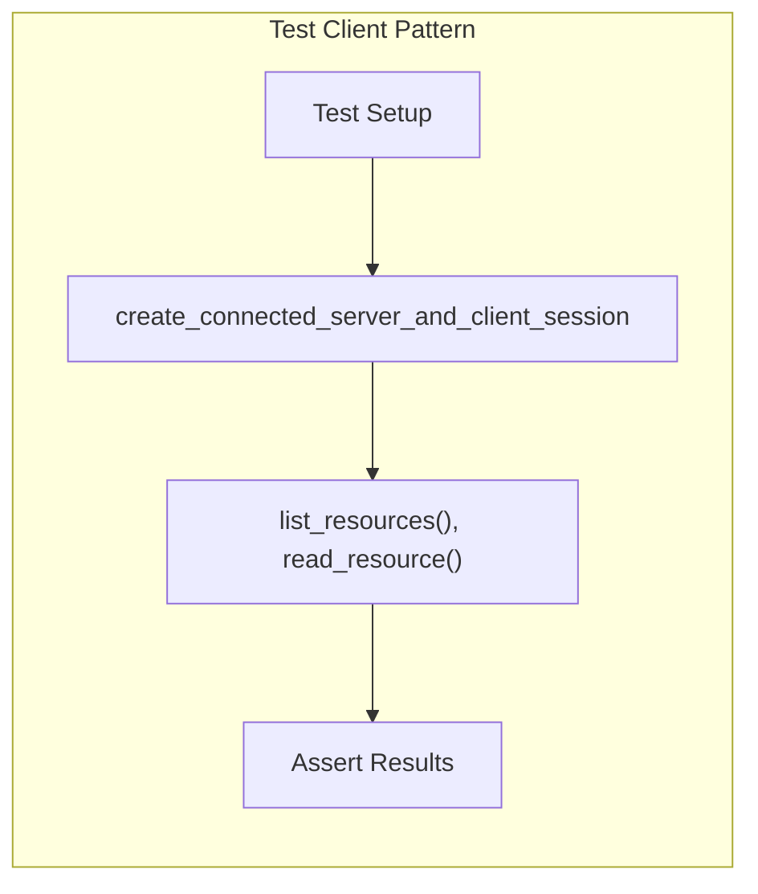

This document provides practical examples of MCP client implementations, focusing on real-world usage patterns and architectures. The primary example is the simple-chatbot client that demonstrates comprehensive integration with MCP servers, LLM providers, and user interaction patterns.

For server-side examples, see [Server Examples](#9.1). For core client framework documentation, see [Client Framework](#3).

## Simple Chatbot Example Overview

The simple-chatbot example demonstrates a complete MCP client implementation that connects to multiple MCP servers, discovers their tools, and integrates with an LLM provider to create an interactive chatbot experience.



Sources: [examples/clients/simple-chatbot/mcp_simple_chatbot/main.py:1-409]()

## Client Architecture Components

The simple-chatbot demonstrates four main architectural components that work together to provide a complete MCP client experience.

### Configuration Management

The `Configuration` class handles environment setup and server configuration loading:



The configuration system supports:
- Environment variable management via `python-dotenv`
- JSON-based server configuration loading
- API key validation and access

Sources: [examples/clients/simple-chatbot/mcp_simple_chatbot/main.py:18-61]()

### Server Connection Management

The `Server` class manages individual MCP server connections with proper lifecycle management:



Key features include:
- `AsyncExitStack` for proper resource cleanup
- Retry logic with configurable attempts and delays
- Error handling and recovery mechanisms

Sources: [examples/clients/simple-chatbot/mcp_simple_chatbot/main.py:63-169]()

## Connection and Session Management

The client demonstrates proper MCP session establishment and management patterns:



The session management includes:
- Process spawning with `shutil.which()` for command resolution
- Stream-based communication setup
- Capability negotiation through `session.initialize()`
- Proper error handling and cleanup on failure

Sources: [examples/clients/simple-chatbot/mcp_simple_chatbot/main.py:74-94]()

## Tool Discovery and Execution

The client implements comprehensive tool management with LLM integration:

### Tool Discovery Pattern



The discovery process extracts tool metadata and formats it for LLM consumption:
- Tool name and description
- JSON schema for input parameters
- Required vs optional parameter identification
- Human-readable formatting for LLM prompts

Sources: [examples/clients/simple-chatbot/mcp_simple_chatbot/main.py:96-115](), [examples/clients/simple-chatbot/mcp_simple_chatbot/main.py:171-213]()

### Tool Execution with Retry Logic



The execution system provides:
- Configurable retry attempts (default: 2)
- Exponential backoff with configurable delay
- Comprehensive error logging
- Progress reporting for long-running tools

Sources: [examples/clients/simple-chatbot/mcp_simple_chatbot/main.py:117-158]()

## LLM Integration Patterns

The client demonstrates how to integrate MCP tools with LLM providers through structured prompting and tool calling protocols.

### LLM Communication Flow



### Tool Call Protocol

The client implements a JSON-based tool calling protocol:

```json
{
    "tool": "tool-name",
    "arguments": {
        "argument-name": "value"
    }
}
```

The system message instructs the LLM on tool usage patterns and response formatting, ensuring consistent tool invocation and natural language result processing.

Sources: [examples/clients/simple-chatbot/mcp_simple_chatbot/main.py:283-321](), [examples/clients/simple-chatbot/mcp_simple_chatbot/main.py:341-361]()

## Usage Examples

### Basic Client Setup

The simple-chatbot can be configured through a JSON configuration file:

```json
{
    "mcpServers": {
        "filesystem": {
            "command": "node",
            "args": ["path/to/filesystem-server.js"],
            "env": {}
        },
        "database": {
            "command": "python",
            "args": ["-m", "database_server"],
            "env": {
                "DB_PATH": "/path/to/database"
            }
        }
    }
}
```

### Environment Configuration

Required environment variables:
- `LLM_API_KEY`: API key for the LLM provider (Groq in this example)

The client uses `python-dotenv` for environment management, supporting `.env` files for development.

Sources: [examples/clients/simple-chatbot/mcp_simple_chatbot/main.py:397-404]()

### Test Integration Patterns

The codebase includes several test patterns that demonstrate client usage:

#### Resource Testing with Client Sessions



This pattern is used extensively in tests for validating server behavior from a client perspective.

Sources: [tests/issues/test_152_resource_mime_type.py:36-61](), [tests/issues/test_141_resource_templates.py:81-114]()

The examples demonstrate comprehensive MCP client implementation patterns, from basic connection management to advanced tool integration with LLM providers, providing a solid foundation for building sophisticated MCP client applications.