This document explains the internal architecture of the FastMCP server framework, including its core components, managers, function introspection system, and transport integration. FastMCP provides a high-level, decorator-based interface for building MCP servers that automatically handles schema generation, validation, and protocol compliance.

For information about using FastMCP decorators and APIs, see [Tool Management](#2.2) and [Resource & Prompt Management](#2.3). For details about the underlying protocol implementation, see [Low-Level Server Architecture](#6.1).

## Core Architecture Overview

FastMCP implements a layered architecture that wraps the low-level MCP server with higher-level abstractions and automatic introspection capabilities.


**Sources:** [src/mcp/server/fastmcp/server.py:122-206](), [src/mcp/server/fastmcp/utilities/func_metadata.py:62-67]()

## FastMCP Main Server Class

The `FastMCP` class serves as the primary entry point and orchestrator for the entire server framework. It manages settings, coordinates managers, and provides the decorator interface.

### Core Components

The `FastMCP` class initializes and coordinates several key subsystems:

- **Settings Management**: Uses `Settings` class with environment variable support (prefix `FASTMCP_`)
- **Manager Coordination**: Initializes `ToolManager`, `ResourceManager`, and `PromptManager`
- **Protocol Integration**: Wraps the low-level `MCPServer` with enhanced functionality
- **Transport Apps**: Generates transport-specific applications (stdio, SSE, StreamableHTTP)


**Sources:** [src/mcp/server/fastmcp/server.py:152-209](), [src/mcp/server/fastmcp/server.py:268-280]()

### Decorator Interface

FastMCP provides three primary decorators that automatically handle function registration and introspection:

| Decorator | Manager | Purpose |
|-----------|---------|---------|
| `@tool()` | `ToolManager` | Register functions as callable tools |
| `@resource()` | `ResourceManager` | Register functions as resources or templates |
| `@prompt()` | `PromptManager` | Register functions as prompt generators |

Each decorator uses the same underlying pattern: function introspection → manager registration → protocol handler binding.

**Sources:** [src/mcp/server/fastmcp/server.py:393-451](), [src/mcp/server/fastmcp/server.py:479-578](), [src/mcp/server/fastmcp/server.py:588-641]()

## Manager Subsystem Architecture

The manager subsystem handles registration, validation, and execution of user-defined functions through a consistent interface pattern.


**Sources:** [src/mcp/server/fastmcp/tools.py](), [src/mcp/server/fastmcp/resources.py](), [src/mcp/server/fastmcp/prompts.py]()

### Function Registration Flow

All managers follow a consistent registration pattern:

1. **Function Analysis**: Extract signature, docstring, and type annotations
2. **Schema Generation**: Create Pydantic models for inputs and outputs
3. **Metadata Creation**: Build `Tool`, `Resource`, or `Prompt` objects
4. **Storage**: Register in manager's internal dictionary
5. **Validation**: Check for duplicates and conflicts

**Sources:** [src/mcp/server/fastmcp/utilities/func_metadata.py:166-284]()

## Function Introspection System

The function introspection system (`func_metadata`) is the core of FastMCP's automatic schema generation and validation capabilities.

### FuncMetadata Components


**Sources:** [src/mcp/server/fastmcp/utilities/func_metadata.py:62-120]()

### Structured Output Detection

FastMCP automatically determines whether a function should have structured output based on its return type annotation:

| Return Type | Output Handling | Wrapping |
|-------------|-----------------|----------|
| `BaseModel` subclass | Direct schema generation | No wrapping |
| Primitive types (`str`, `int`, etc.) | Wrapped in `{"result": value}` | Yes |
| `dict[str, T]` | RootModel generation | No wrapping |
| Generic types (`list[T]`, `Union`) | Wrapped in `{"result": value}` | Yes |
| Unannotated classes | No structured output | N/A |

**Sources:** [src/mcp/server/fastmcp/utilities/func_metadata.py:287-371]()

## Context Injection System

FastMCP provides automatic context injection that gives functions access to request-specific information and MCP capabilities.


**Sources:** [src/mcp/server/fastmcp/utilities/context_injection.py](), [src/mcp/shared/context.py]()

## Transport Integration Architecture

FastMCP integrates with multiple transport protocols by generating transport-specific ASGI applications that wrap the core MCP server functionality.


**Sources:** [src/mcp/server/fastmcp/server.py:687-725](), [src/mcp/server/fastmcp/server.py:752-884](), [src/mcp/server/fastmcp/server.py:885-984]()

### Transport Application Generation

Each transport type requires different ASGI application structure:

1. **stdio**: Direct async function for process communication
2. **SSE**: Starlette app with GET/POST endpoints and optional authentication
3. **StreamableHTTP**: Session-managed app with resumable connections

The `FastMCP` class generates these applications on-demand, configuring middleware, authentication, and routing based on server settings.

**Sources:** [src/mcp/server/fastmcp/server.py:752-883]()

## Request Processing Flow

The following diagram shows how requests flow through the FastMCP architecture from transport to function execution:


**Sources:** [src/mcp/server/fastmcp/server.py:308-312](), [src/mcp/server/fastmcp/utilities/func_metadata.py:68-89]()

This architecture enables FastMCP to provide a high-level, decorator-based interface while maintaining full compatibility with the MCP protocol and supporting multiple transport mechanisms.

# Tool Management


FastMCP's tool management system enables developers to register Python functions as MCP tools using the `@tool` decorator and execute them through the `ToolManager`. The system automatically handles argument validation, context injection, and structured output generation.

The tool management system consists of three main components: the `ToolManager` for centralized tool registration and execution, the `Tool` class for wrapping functions with metadata, and the `FuncMetadata` system for function introspection and validation.

## Tool Registration with @tool Decorator

Tools are registered using the `@tool` decorator, which automatically converts Python functions into MCP tools. The decorator analyzes function signatures, creates validation schemas, and registers the tool with the `ToolManager`.

### Tool Registration Flow


Sources: [src/mcp/server/fastmcp/tools/tool_manager.py:45-71](), [src/mcp/server/fastmcp/tools/base.py:42-84]()

### Function Metadata Extraction

The `func_metadata()` function performs deep introspection of Python functions to extract type information and create validation models.


Sources: [src/mcp/server/fastmcp/utilities/func_metadata.py:166-207]()

The `func_metadata()` function performs deep introspection of Python functions to create a `FuncMetadata` object containing:

- **arg_model**: A Pydantic model representing function arguments with validation
- **output_schema**: JSON schema for structured output (if enabled)
- **output_model**: Pydantic model for return type validation
- **wrap_output**: Whether to wrap primitive returns in `{"result": value}`

### Argument Processing Pipeline

The `FuncMetadata.call_fn_with_arg_validation()` method processes raw arguments through validation and type conversion before function execution.

```mermaid
flowchart LR
    RawArgs["Raw Arguments\n{\"key\": \"value\"}"] --> pre_parse_json["pre_parse_json()"]
    pre_parse_json --> ParsedArgs["Parsed Arguments\n{\"key\": parsed_value}"]
    ParsedArgs --> model_validate["arg_model.model_validate()"]
    model_validate --> ValidatedModel["ArgModelBase instance"]
    ValidatedModel --> model_dump_one_level["model_dump_one_level()"]
    model_dump_one_level --> FunctionKwargs["Function kwargs\nready for execution"]
```

Sources: [src/mcp/server/fastmcp/utilities/func_metadata.py:68-89](), [src/mcp/server/fastmcp/utilities/func_metadata.py:121-159](), [src/mcp/server/fastmcp/utilities/func_metadata.py:44-55]()

**Argument Processing Features:**

| Stage | Implementation | Purpose | Example |
|-------|---------------|---------|---------|
| JSON Pre-parsing | `pre_parse_json()` | Parse JSON strings to Python objects | `"[1,2,3]"` → `[1,2,3]` |
| Type Validation | `arg_model.model_validate()` | Validate against Pydantic model | `str` parameter rejects `int` |
| Alias Resolution | `model_dump_one_level()` | Map aliases to parameter names | Field aliases → function parameter names |
| Default Handling | Pydantic `Field()` | Apply default values | Optional parameters get defaults |
| Complex Types | Nested model support | Handle complex structures | `BaseModel`, `TypedDict`, dataclasses |

**JSON Pre-parsing Logic:**

The `pre_parse_json()` method handles cases where MCP clients send complex data as JSON strings instead of native types:


Sources: [src/mcp/server/fastmcp/utilities/func_metadata.py:121-159]()

## Tool Registration System

Tools are registered through the `Tool` class and the `@mcp.tool` decorator, which provides a high-level interface for function-to-tool conversion.

### Tool Class Structure

The `Tool` class encapsulates all information needed to execute a function as an MCP tool, including metadata, validation models, and execution logic.


Sources: [src/mcp/server/fastmcp/tools/tool_manager.py:19-35](), [src/mcp/server/fastmcp/tools/base.py:22-39](), [src/mcp/server/fastmcp/utilities/func_metadata.py:62-66]()

### Tool Creation Process

The `Tool.from_function()` method creates a `Tool` instance from a Python function by extracting metadata and creating validation schemas.

```mermaid
flowchart TD
    fn["Python Function"] --> from_function["Tool.from_function()"]
    from_function --> extract_name["Extract function name"]
    from_function --> extract_doc["Extract docstring"]
    from_function --> is_async_check["_is_async_callable()"]
    from_function --> find_context["find_context_parameter()"]
    from_function --> func_metadata_call["func_metadata()"]
    
    extract_name --> func_name["name: str"]
    extract_doc --> func_doc["description: str"]
    is_async_check --> is_async["is_async: bool"]
    find_context --> context_kwarg["context_kwarg: str | None"]
    func_metadata_call --> func_arg_metadata["FuncMetadata"]
    
    func_arg_metadata --> parameters["parameters: dict"]
    
    func_name --> Tool_instance["Tool()"]
    func_doc --> Tool_instance
    is_async --> Tool_instance
    context_kwarg --> Tool_instance
    func_arg_metadata --> Tool_instance
    parameters --> Tool_instance
```



Sources: [src/mcp/server/fastmcp/tools/base.py:42-84]()

### Context Parameter Detection and Injection

The system automatically detects `Context` parameters in function signatures and excludes them from the tool schema while injecting them during execution.

**Context Detection in find_context_parameter():**


**Context Injection During Execution:**


The context parameter is excluded from the `func_metadata()` call via the `skip_names` parameter and injected separately during execution.

Sources: [src/mcp/server/fastmcp/tools/base.py:63-69](), [src/mcp/server/fastmcp/tools/base.py:94-99](), [src/mcp/server/fastmcp/utilities/context_injection.py]()

## Tool Execution System

Tool execution involves argument validation, context injection, and result conversion.

### Tool Execution Pipeline


Sources: [src/mcp/server/fastmcp/tools/tool_manager.py:73-85](), [src/mcp/server/fastmcp/tools/base.py:86-106](), [src/mcp/server/fastmcp/utilities/func_metadata.py:68-89]()

### Error Handling

Tool execution wraps exceptions in `ToolError` for consistent error reporting:

```python
try:
    result = await self.fn_metadata.call_fn_with_arg_validation(
        self.fn,
        self.is_async,
        arguments,
        {self.context_kwarg: context} if self.context_kwarg is not None else None,
    )
    
    if convert_result:
        result = self.fn_metadata.convert_result(result)
    
    return result
except Exception as e:
    raise ToolError(f"Error executing tool {self.name}: {e}") from e
```

Sources: [src/mcp/server/fastmcp/tools/base.py:97-110]()

## ToolManager - Centralized Tool Management

The `ToolManager` class provides centralized registration, retrieval, and execution of tools. It maintains a registry of `Tool` instances and handles tool lifecycle management.

### ToolManager Architecture


Sources: [src/mcp/server/fastmcp/tools/tool_manager.py:19-35](), [src/mcp/server/fastmcp/tools/tool_manager.py:45-85]()

### ToolManager API

| Method | Purpose | Parameters | Return Type |
|--------|---------|------------|-------------|
| `add_tool()` | Register function as tool | `fn`, `name`, `title`, `description`, `annotations`, `icons`, `structured_output` | `Tool` |
| `get_tool()` | Retrieve tool by name | `name: str` | `Tool \| None` |
| `list_tools()` | Get all registered tools | None | `list[Tool]` |
| `call_tool()` | Execute tool with arguments | `name`, `arguments`, `context`, `convert_result` | `Any` |

Sources: [src/mcp/server/fastmcp/tools/tool_manager.py:37-85]()

### Tool Registration Workflow


Sources: [src/mcp/server/fastmcp/tools/tool_manager.py:45-71](), [src/mcp/server/fastmcp/tools/base.py:42-84]()

## Structured Output Support

Tools can return structured output with automatic schema generation and validation.

### Structured Output Types

```mermaid
flowchart TD
    ReturnType["Function Return Type"] --> BaseModel["BaseModel"]
    ReturnType --> Primitive["Primitive Types\n(str, int, float, bool)"]
    ReturnType --> Generic["Generic Types\n(list, dict, Union)"]
    ReturnType --> TypedDict["TypedDict"]
    ReturnType --> Dataclass["@dataclass"]
    ReturnType --> RegularClass["Regular Class\nwith annotations"]
    
    BaseModel --> DirectUse["Use directly as schema"]
    Primitive --> Wrapped["Wrap in {\"result\": value}"]
    Generic --> Wrapped
    TypedDict --> Convert["Convert to Pydantic model"]
    Dataclass --> Convert
    RegularClass --> Convert
    
    DirectUse --> Schema["JSON Schema"]
    Wrapped --> Schema
    Convert --> Schema
```

Sources: [src/mcp/server/fastmcp/utilities/func_metadata.py:287-371](), [src/mcp/server/fastmcp/utilities/func_metadata.py:425-449]()

### Output Conversion Process

The `convert_result()` method handles both unstructured and structured output:

**Dual Output Generation:**


**Content Conversion Logic:**
- **Unstructured**: Converts results to `ContentBlock` sequences (text, image, audio)
- **Structured**: Validates against output schema and serializes to JSON-compatible dict
- **Return**: Tuple of both formats for backwards compatibility

Sources: [src/mcp/server/fastmcp/utilities/func_metadata.py:91-119](), [src/mcp/server/fastmcp/utilities/func_metadata.py:489-524]()

## Advanced Features

### Reserved Parameter Names

The system handles conflicts with Pydantic `BaseModel` methods by using aliases:

```python
def tool(model_dump: str, validate: bool) -> str:
    # Parameters conflict with BaseModel methods
    # System automatically creates aliases
```

**Alias Resolution Process:**

```mermaid
flowchart TD
    param_name["Parameter Name"] --> check_conflict{"hasattr(BaseModel, name) &&\ncallable(getattr(BaseModel, name))?"}
    check_conflict -->|No| use_direct["Use parameter name directly"]
    check_conflict -->|Yes| create_alias["Create alias mapping"]
    
    create_alias --> set_aliases["field_info.alias = param_name\nfield_info.validation_alias = param_name\nfield_info.serialization_alias = param_name"]
    set_aliases --> internal_name["internal_name = f'field_{param_name}'"]
    internal_name --> store_internal["Store with internal name in model"]
    
    use_direct --> store_direct["Store with original name"]
```

This prevents Pydantic warnings about shadowing parent attributes while maintaining the original parameter names in the external API.

Sources: [src/mcp/server/fastmcp/utilities/func_metadata.py:240-252]()

### Async Function Support

Both sync and async functions are supported with automatic detection:

```python
def _is_async_callable(obj: Any) -> bool:
    while isinstance(obj, functools.partial):
        obj = obj.func
    
    return inspect.iscoroutinefunction(obj) or (
        callable(obj) and inspect.iscoroutinefunction(getattr(obj, "__call__", None))
    )
```

Sources: [src/mcp/server/fastmcp/tools/base.py:113-119]()

### Tool Annotations

Tools support optional metadata through `ToolAnnotations`:

- `title`: Human-readable title
- `readOnlyHint`: Indicates read-only operations  
- `openWorldHint`: Indicates open-world assumptions

Sources: [src/mcp/server/fastmcp/tools/base.py:34]()