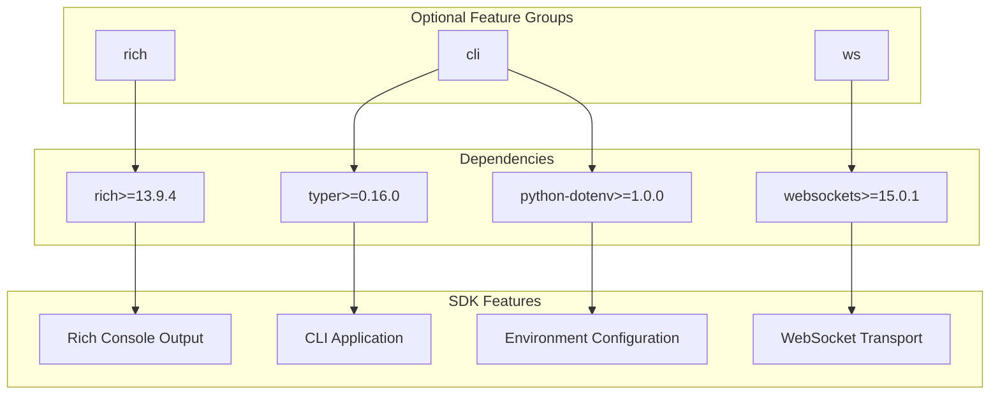
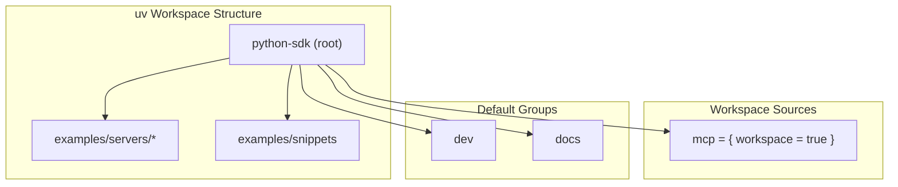

pip install mcp[rich,cli,ws]
```

### Development Installation

For development work, install from source with development dependencies:

```bash
# Clone and install with uv
git clone https://github.com/modelcontextprotocol/python-sdk
cd python-sdk
uv sync
```

**Sources:** [pyproject.toml:38-41](), [pyproject.toml:43-44]()

## Core Dependencies Architecture

The following diagram shows how core dependencies support different functional areas of the MCP SDK:

```mermaid
graph TB
    subgraph "Transport Layer Dependencies"
        anyio["anyio>=4.5"]
        httpx["httpx>=0.27.1"] 
        httpx_sse["httpx-sse>=0.4"]
        starlette["starlette>=0.27"]
        multipart["python-multipart>=0.0.9"]
        sse_starlette["sse-starlette>=1.6.1"]
        uvicorn["uvicorn>=0.31.1"]
    end
    
    subgraph "Data & Validation Dependencies"
        pydantic["pydantic>=2.11.0"]
        pydantic_settings["pydantic-settings>=2.5.2"]
        jsonschema["jsonschema>=4.20.0"]
    end
    
    subgraph "Platform Dependencies"
        pywin32["pywin32>=310"]
    end
    
    subgraph "Core MCP Functions"
        AsyncIO["Async I/O Operations"]
        HTTPTransport["HTTP Transport"]
        SSETransport["SSE Transport"] 
        WebFramework["Web Framework"]
        DataValidation["Data Validation"]
        SchemaGeneration["Schema Generation"]
        WindowsSupport["Windows Process Support"]
    end
    
    anyio --> AsyncIO
    httpx --> HTTPTransport
    httpx_sse --> SSETransport
    starlette --> WebFramework
    multipart --> WebFramework
    sse_starlette --> SSETransport
    uvicorn --> WebFramework
    pydantic --> DataValidation
    pydantic_settings --> DataValidation
    jsonschema --> SchemaGeneration
    pywin32 --> WindowsSupport
```



**Sources:** [pyproject.toml:24-36]()

### Core Dependency Functions

| Dependency | Version | Purpose |
|------------|---------|---------|
| `anyio` | >=4.5 | Async I/O abstraction for cross-platform async operations |
| `httpx` | >=0.27.1 | HTTP client for transport layer communication |
| `httpx-sse` | >=0.4 | Server-Sent Events support for real-time communication |
| `pydantic` | >=2.11.0,<3.0.0 | Data validation and serialization |
| `starlette` | >=0.27 | ASGI web framework for server implementations |
| `python-multipart` | >=0.0.9 | Multipart form data parsing for HTTP transport |
| `sse-starlette` | >=1.6.1 | SSE server implementation for Starlette |
| `pydantic-settings` | >=2.5.2 | Configuration management with Pydantic |
| `uvicorn` | >=0.31.1 | ASGI server (excluded on emscripten platform) |
| `jsonschema` | >=4.20.0 | JSON schema validation and generation |

## Optional Dependencies

### Feature-Specific Optional Dependencies



**Sources:** [pyproject.toml:38-41]()

### CLI Script Configuration

The SDK provides a CLI entry point through the `mcp` command, which requires the `cli` optional dependency group to be installed. The CLI script configuration automatically includes the required dependencies when the CLI feature is requested.

**Sources:** [pyproject.toml:43-44]()

## Development Dependencies

### Development Dependency Groups

```mermaid
graph TB
    subgraph "Development Groups"
        dev_group["dev"]
        docs_group["docs"]
    end
    
    subgraph "Code Quality Tools"
        pyright["pyright>=1.1.400"]
        ruff["ruff>=0.8.5"] 
    end
    
    subgraph "Testing Framework"
        pytest["pytest>=8.3.4"]
        trio["trio>=0.26.2"]
        pytest_flakefinder["pytest-flakefinder>=1.1.0"]
        pytest_xdist["pytest-xdist>=3.6.1"]
        pytest_examples["pytest-examples>=0.0.14"]
        pytest_pretty["pytest-pretty>=1.2.0"]
        inline_snapshot["inline-snapshot>=0.23.0"]
        dirty_equals["dirty-equals>=0.9.0"]
    end
    
    subgraph "Documentation Tools"
        mkdocs["mkdocs>=1.6.1"]
        mkdocs_glightbox["mkdocs-glightbox>=0.4.0"]
        mkdocs_material["mkdocs-material[imaging]>=9.5.45"]
        mkdocstrings["mkdocstrings-python>=1.12.2"]
    end
    
    dev_group --> pyright
    dev_group --> ruff
    dev_group --> pytest
    dev_group --> trio
    dev_group --> pytest_flakefinder
    dev_group --> pytest_xdist
    dev_group --> pytest_examples
    dev_group --> pytest_pretty
    dev_group --> inline_snapshot
    dev_group --> dirty_equals
    
    docs_group --> mkdocs
    docs_group --> mkdocs_glightbox
    docs_group --> mkdocs_material
    docs_group --> mkdocstrings
```



The development environment automatically includes both `dev` and `docs` dependency groups through the default groups configuration.

**Sources:** [pyproject.toml:46-47](), [pyproject.toml:50-68]()

## Build System & Versioning

### Build Configuration

The SDK uses a modern Python build system with dynamic versioning:

| Component | Tool | Purpose |
|-----------|------|---------|
| Build Backend | `hatchling` | Modern Python packaging build system |
| Version Source | `uv-dynamic-versioning` | Git-based dynamic version generation |
| Version Style | `pep440` | PEP 440 compliant version numbering |
| Package Location | `src/mcp` | Source package directory |

The build system automatically generates versions from Git tags using PEP 440 formatting with bump support for development versions.

**Sources:** [pyproject.toml:70-80](), [pyproject.toml:87-88]()

## Dependency Management with uv

### Workspace Configuration



The uv workspace configuration enables unified dependency management across the main SDK package and all example projects. This ensures consistent dependency versions and simplifies development workflows.

**Sources:** [pyproject.toml:136-140](), [pyproject.toml:46-47]()

### Version Constraints

The uv configuration enforces minimum version requirements and provides automatic dependency resolution across the entire workspace. The required uv version (>=0.7.2) ensures access to modern workspace features and dependency group management.

**Sources:** [pyproject.toml:46-48]()