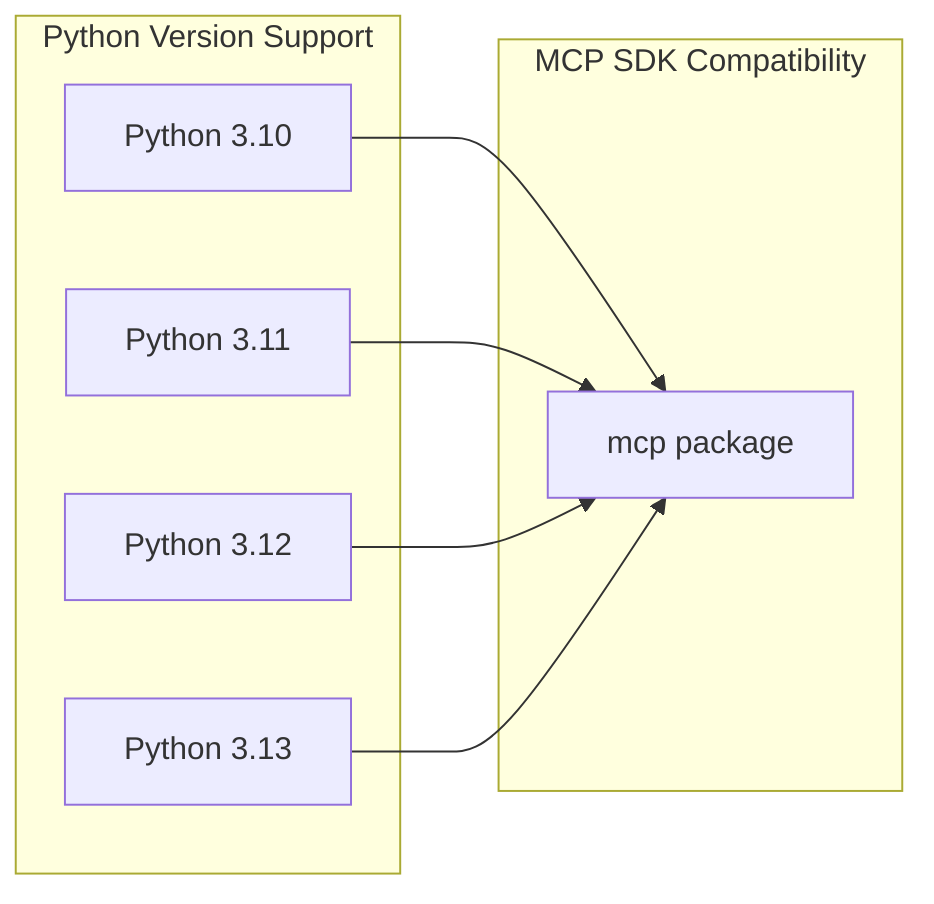

This document covers the installation process for the MCP Python SDK and explains its dependency management system. It provides guidance on system requirements, installation methods, and the role of each dependency category in the SDK's functionality.

For information about core MCP concepts after installation, see [Key Concepts](#1.2). For development environment setup including CLI tools, see [Development Environment](#8.2).

## System Requirements

The MCP Python SDK has specific system requirements that must be met before installation.

### Python Version Requirements



The SDK requires Python 3.10 or higher, with official support through Python 3.13. Platform-specific dependencies include `pywin32>=310` for Windows systems to support process management and inter-process communication.

**Sources:** [pyproject.toml:6](), [pyproject.toml:19-22](), [pyproject.toml:35]()

### Package Manager Requirements

The project uses `uv` as its primary dependency manager with a minimum required version of 0.7.2. This is enforced through the build configuration to ensure consistent dependency resolution and workspace management.

**Sources:** [pyproject.toml:46-48]()

## Installation Methods

### Standard Installation

The MCP SDK can be installed from PyPI using standard Python package managers:

```bash
pip install mcp
```

### Optional Feature Installation

The SDK provides optional feature sets that can be installed as needed:

```bash