This document explains the fundamental concepts of the Model Context Protocol (MCP) Python SDK. It covers the core entities, protocol mechanics, and architectural patterns that developers need to understand when building MCP servers and clients. For specific implementation guidance on building servers, see [FastMCP Server Framework](#2). For client-side development, see [Client Framework](#3).

## MCP Protocol Overview

The Model Context Protocol enables standardized communication between Large Language Models and external systems. The protocol defines how clients (typically LLM applications) can discover and interact with servers that expose tools, data, and interaction patterns.

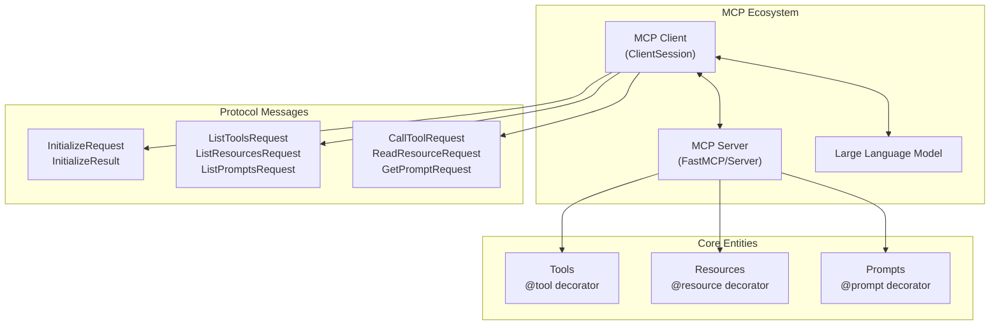

**MCP Core Architecture**

Sources: [README.md:84-194](), [src/mcp/types.py:8-34]()

## Servers and Clients

### MCP Servers

Servers expose functionality and data to LLM applications. The MCP Python SDK provides two server implementation approaches:

- **FastMCP**: High-level decorator-based framework using `FastMCP` class
- **Low-level Server**: Direct protocol implementation using `Server` class

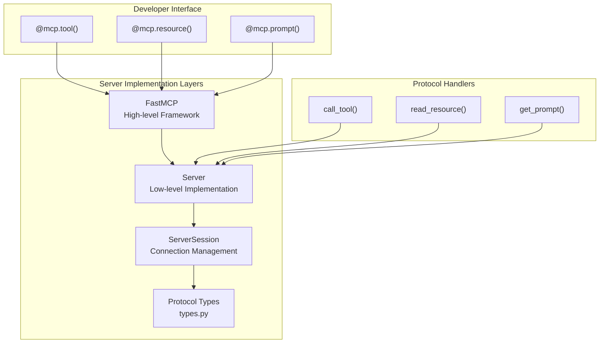

**Server Implementation Architecture**

Sources: [src/mcp/server/lowlevel/server.py:1-66](), [README.md:198-265]()

### MCP Clients

Clients connect to servers and facilitate communication with LLMs. The primary client implementation is `ClientSession`, which handles protocol negotiation, message routing, and connection management.

Sources: [README.md:84-92]()

## Core MCP Entities

### Tools

Tools are executable functions that LLMs can call to perform actions or computations. They are defined using the `@tool` decorator in FastMCP or the `call_tool()` handler in low-level servers.

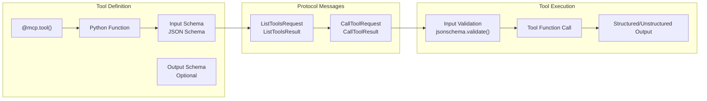

**Tool Lifecycle and Processing**

Tools support both structured and unstructured output. The `CallToolResult` type includes both `content` (unstructured) and `structuredContent` (structured) fields for maximum compatibility.

Sources: [README.md:297-384](), [src/mcp/server/lowlevel/server.py:465-547](), [src/mcp/types.py:869-922]()

### Resources

Resources provide read-only access to data that LLMs can consume. They are identified by URIs and can return text, binary data, or multiple content blocks.

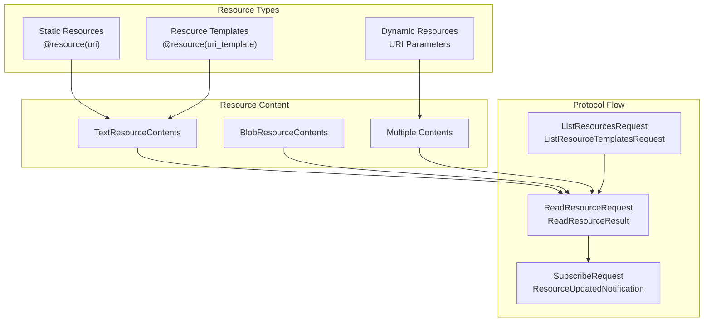

**Resource Architecture and Content Types**

Sources: [README.md:266-296](), [src/mcp/types.py:431-554](), [src/mcp/server/lowlevel/server.py:311-367]()

### Prompts

Prompts are reusable templates that help structure LLM interactions. They can include parameters and return formatted message sequences.

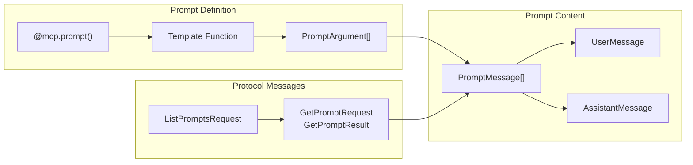

**Prompt Template System**

Sources: [README.md:490-517](), [src/mcp/types.py:630-812]()

## Protocol and Message Flow

The MCP protocol uses JSON-RPC 2.0 for message exchange. Communication follows a request-response pattern with support for notifications.

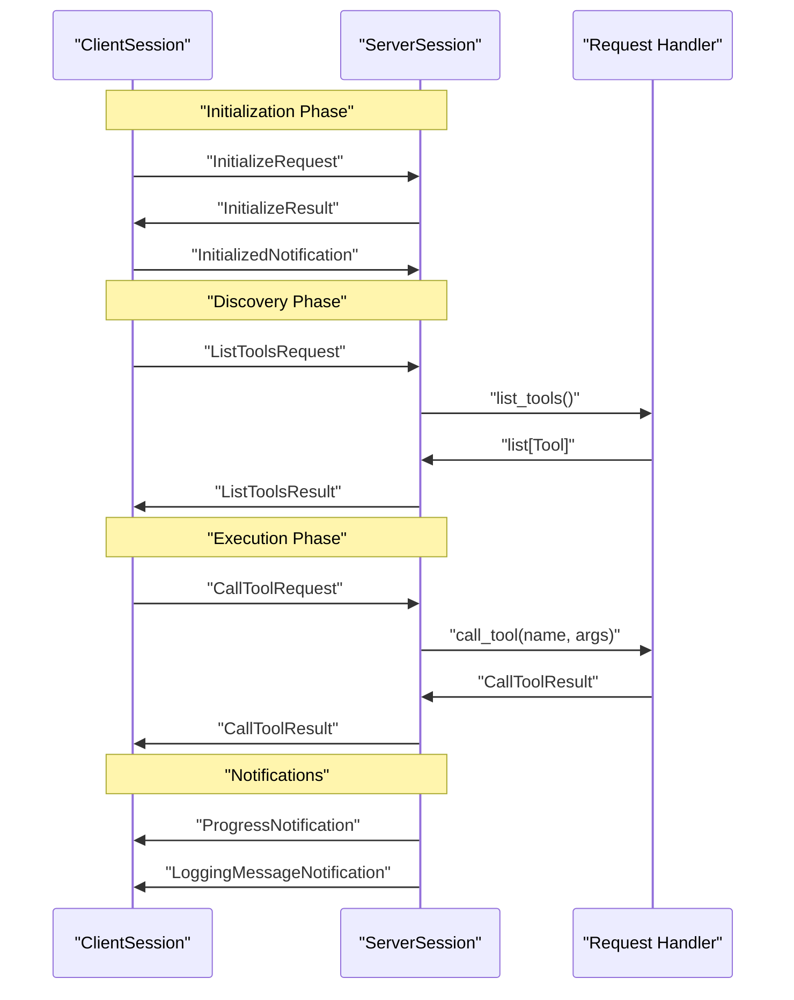

**MCP Protocol Message Flow**

The protocol supports several core message types defined in `types.py`:

- **Requests**: `ClientRequest`, `ServerRequest` - expect responses
- **Notifications**: `ClientNotification`, `ServerNotification` - no response expected  
- **Results**: `ClientResult`, `ServerResult` - responses to requests

Sources: [src/mcp/types.py:82-348](), [README.md:25-194]()

## Transport Layer

MCP supports multiple transport mechanisms for client-server communication:

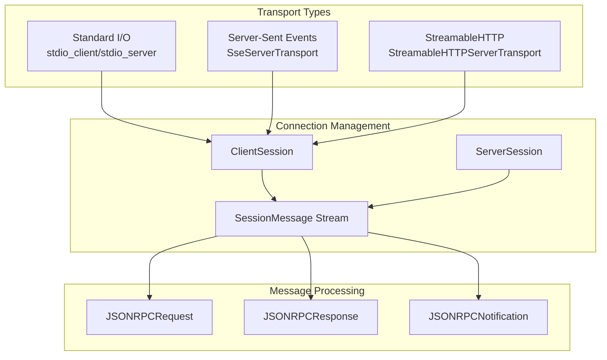

**Transport Layer Architecture**

Each transport provides bidirectional communication with different characteristics:

- **stdio**: Process-based communication via stdin/stdout
- **SSE**: HTTP-based with server-sent events for real-time updates
- **StreamableHTTP**: Advanced HTTP transport with session management and resumability

Sources: [src/mcp/types.py:124-193](), Transport architecture from overview diagrams

## Server Implementations

### FastMCP Framework

`FastMCP` provides a decorator-based approach for rapid server development. It automatically handles protocol compliance, schema generation, and message routing.

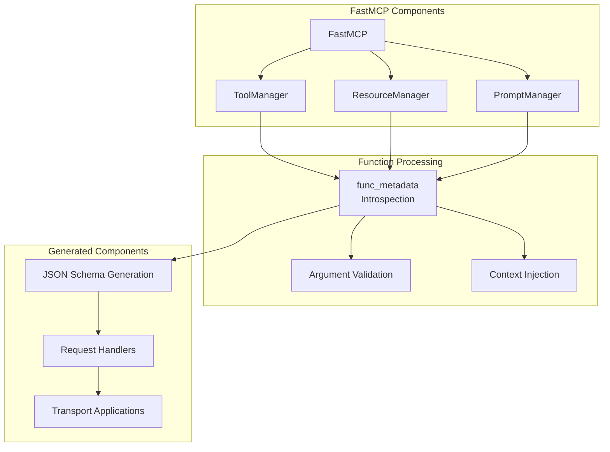

**FastMCP Internal Architecture**

### Low-level Server

The `Server` class provides direct access to the MCP protocol with explicit handler registration using decorators like `list_tools()`, `call_tool()`, etc.

Sources: [src/mcp/server/lowlevel/server.py:133-158](), FastMCP concepts from overview diagrams

## Context and Session Management

### Request Context

The `Context` object provides access to MCP capabilities and request metadata within tool and resource functions.

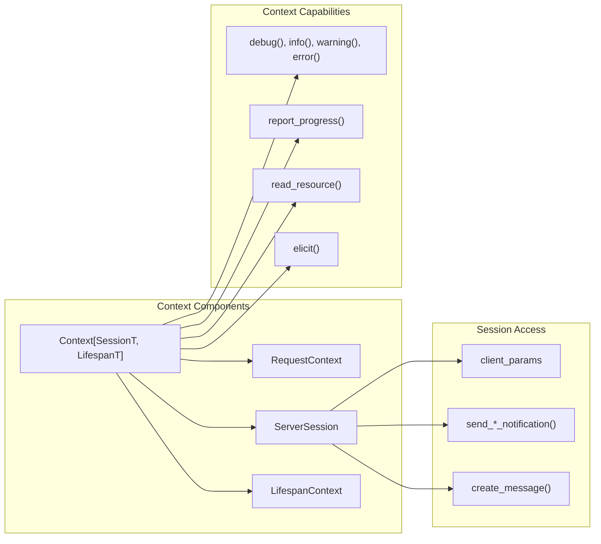

**Context and Session Architecture**

The context system enables:

- **Logging**: Send log messages to clients via `LoggingMessageNotification`
- **Progress**: Report operation progress via `ProgressNotification`  
- **Resource Access**: Read other resources via `ReadResourceRequest`
- **User Interaction**: Request additional information via `ElicitRequest`
- **LLM Sampling**: Generate text via `CreateMessageRequest`

### Session Lifecycle

Both `ClientSession` and `ServerSession` manage connection state, protocol version negotiation, and message routing throughout the connection lifetime.

Sources: [README.md:580-646](), [src/mcp/shared/context.py]() (referenced), [src/mcp/server/session.py]() (referenced)

# FastMCP Server Framework


FastMCP is a high-level, decorator-based framework for building Model Context Protocol (MCP) servers in Python. It provides an ergonomic interface that simplifies server development through automatic function introspection, context injection, and seamless integration with multiple transport protocols.

For low-level server implementation details, see [Low-Level Server Implementation](#6). For client-side components, see [Client Framework](#3). For transport layer specifics, see [Transport Layer](#5).

## Overview

FastMCP abstracts away the complexities of the MCP protocol by providing a decorator-based API that automatically converts Python functions into MCP tools, resources, and prompts. The framework handles JSON schema generation, input validation, output conversion, and protocol message handling.

### FastMCP Core Architecture

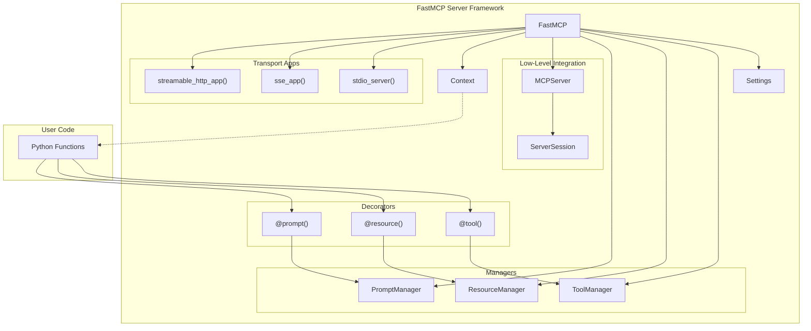

Sources: [src/mcp/server/fastmcp/server.py:122-209](), [src/mcp/server/fastmcp/server.py:268-280]()

## Core Components

### FastMCP Class

The `FastMCP` class serves as the central orchestrator, managing all server components and providing the decorator-based API. It wraps a low-level `MCPServer` instance while providing higher-level abstractions.

| Component | Purpose | Key Methods |
|-----------|---------|-------------|
| `FastMCP` | Main server class | `tool()`, `resource()`, `prompt()`, `run()` |
| `Settings` | Configuration management | Environment variable integration |
| `Context` | Request context access | `log()`, `report_progress()`, `read_resource()` |

### Manager Classes

FastMCP uses specialized manager classes to handle different types of MCP entities:

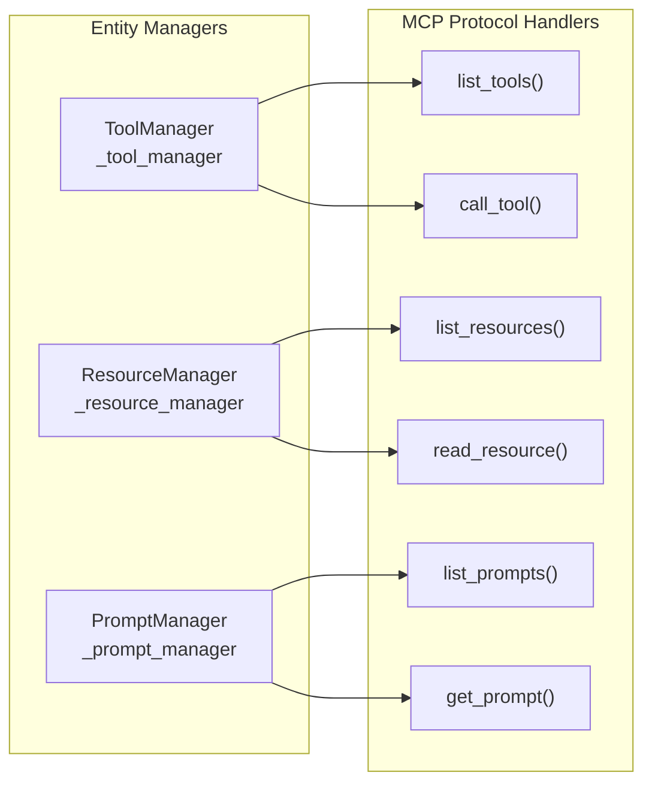

Sources: [src/mcp/server/fastmcp/server.py:181-183](), [src/mcp/server/fastmcp/server.py:270-279]()

## Decorator-Based API

### Tool Registration

The `@tool()` decorator converts Python functions into MCP tools with automatic schema generation:

```python
@server.tool()
def calculate_sum(a: int, b: int) -> int:
    """Add two numbers together."""
    return a + b

@server.tool()
async def async_tool(x: int, ctx: Context) -> str:
    await ctx.report_progress(50, 100)
    return f"Processed {x}"
```

The decorator supports several parameters for customization:

| Parameter | Type | Purpose |
|-----------|------|---------|
| `name` | `str \| None` | Custom tool name (defaults to function name) |
| `title` | `str \| None` | Human-readable title |
| `description` | `str \| None` | Tool description |
| `structured_output` | `bool \| None` | Controls output schema generation |

Sources: [src/mcp/server/fastmcp/server.py:393-451](), [tests/server/fastmcp/test_server.py:146-153]()

### Resource Registration

Resources can be registered as static resources or parameterized templates:

```python