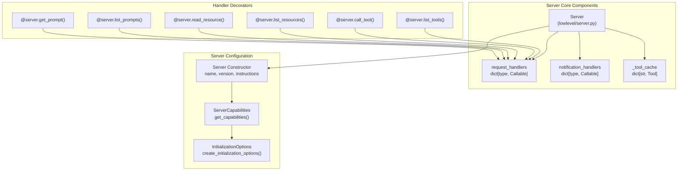
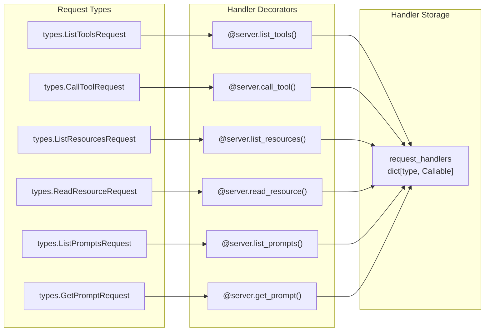
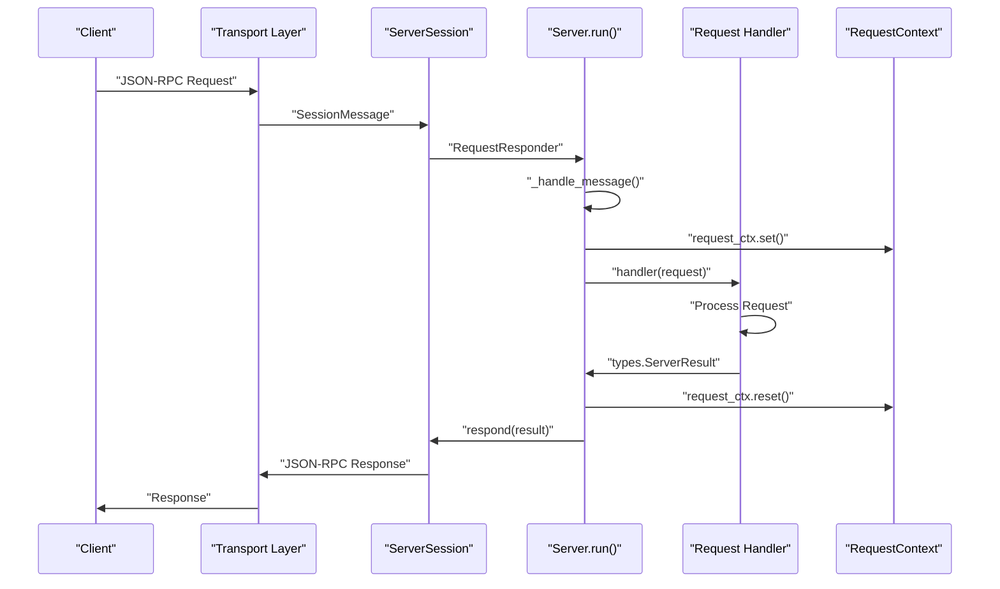
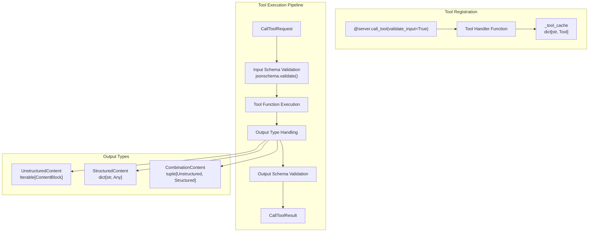
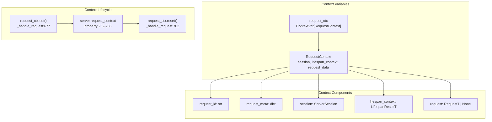
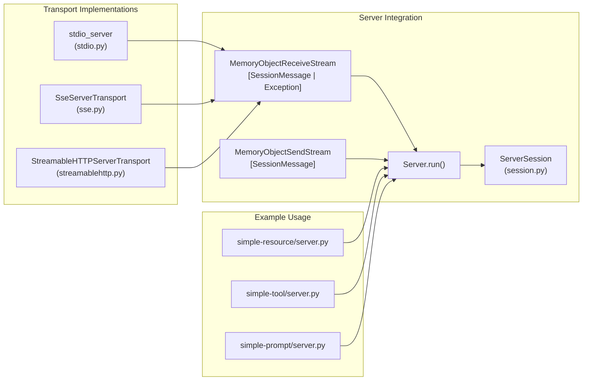

This document covers the low-level `Server` class implementation in the MCP Python SDK, which provides the foundational layer for building MCP servers. This class handles protocol message dispatching, request validation, and the core server lifecycle without the convenience abstractions provided by FastMCP.

For high-level server development using decorators and automatic schema generation, see [FastMCP Server Framework](#2). For details about session management and client communication, see [ServerSession Implementation](#6.2).

## Server Class Overview

The `Server` class in [src/mcp/server/lowlevel/server.py:133-158]() serves as the foundation for all MCP server implementations. It manages handler registration, request dispatching, and protocol compliance.

**Server Initialization and Configuration**

The `Server` constructor takes essential metadata and an optional lifespan context manager:

| Parameter | Type | Purpose |
|-----------|------|---------|
| `name` | `str` | Server identifier |
| `version` | `str \| None` | Server version |
| `instructions` | `str \| None` | Usage instructions for clients |
| `website_url` | `str \| None` | Server website |
| `icons` | `list[types.Icon] \| None` | UI display icons |
| `lifespan` | `Callable` | Async context manager for startup/shutdown |

Sources: [src/mcp/server/lowlevel/server.py:134-157]()

## Handler Registration System

The Server class uses a decorator-based system to register handlers for different MCP request types. Each decorator corresponds to a specific MCP protocol message type.

**Handler Registration Process**

Each decorator method follows a consistent pattern:
1. Creates a wrapper function that adapts the user function to the expected signature
2. Stores the wrapper in `request_handlers` with the request type as key
3. Returns the original function unchanged

For example, the `list_tools` decorator at [src/mcp/server/lowlevel/server.py:409-437]() registers handlers for `types.ListToolsRequest` and manages the tool cache.

Sources: [src/mcp/server/lowlevel/server.py:238-596]()

## Request Processing Architecture

The Server processes incoming requests through a multi-stage pipeline that includes message handling, context setup, and response generation.

**Message Handling Flow**

The main request processing occurs in `_handle_request` at [src/mcp/server/lowlevel/server.py:656-712]():

1. **Handler Lookup**: Finds handler by request type in `request_handlers`
2. **Context Setup**: Creates and sets `RequestContext` with session and lifespan data
3. **Handler Execution**: Calls the registered handler function
4. **Error Handling**: Catches exceptions and converts to appropriate error responses
5. **Context Cleanup**: Resets the request context using `contextvars`

Sources: [src/mcp/server/lowlevel/server.py:598-723]()

## Tool System Architecture

The Server implements a sophisticated tool handling system with caching, validation, and structured output support.

**Tool Caching and Validation**

The Server maintains a tool cache (`_tool_cache`) that stores `Tool` definitions for input/output validation. The cache is populated when `list_tools` handlers are called, as shown in [src/mcp/server/lowlevel/server.py:418-433]().

**Tool Call Processing**

The `call_tool` decorator at [src/mcp/server/lowlevel/server.py:465-547]() implements comprehensive tool call handling:

1. **Input Validation**: Uses `jsonschema` to validate arguments against `inputSchema`
2. **Tool Execution**: Calls the registered tool function
3. **Output Normalization**: Handles three output types:
   - `UnstructuredContent`: Raw content blocks
   - `StructuredContent`: JSON objects  
   - `CombinationContent`: Both structured and unstructured
4. **Output Validation**: Validates structured output against `outputSchema` if defined

Sources: [src/mcp/server/lowlevel/server.py:449-547](), [src/mcp/server/lowlevel/server.py:99-102]()

## Context Management

The Server uses Python's `contextvars` module to provide request-scoped context accessible throughout the request processing pipeline.

**Request Context Structure**

The `RequestContext` is created in `_handle_request` at [src/mcp/server/lowlevel/server.py:677-684]() with:
- Request ID and metadata from the message
- `ServerSession` instance for client communication
- Lifespan context from the server's lifespan manager
- Optional request-specific data

**Context Access**

Handlers can access the current request context via the `request_context` property at [src/mcp/server/lowlevel/server.py:232-236](), which retrieves the context variable or raises `LookupError` if called outside a request.

Sources: [src/mcp/server/lowlevel/server.py:105](), [src/mcp/shared/context.py](), [src/mcp/server/lowlevel/server.py:677-702]()

## Integration with Transport Layer

The Server integrates with various transport mechanisms through the `ServerSession` and stream-based communication.

**Server Run Method**

The `run` method at [src/mcp/server/lowlevel/server.py:598-635]() orchestrates the server lifecycle:

1. **Lifespan Management**: Enters the async context manager for startup/shutdown
2. **Session Creation**: Creates `ServerSession` with provided streams and options
3. **Message Processing**: Iterates over incoming messages and spawns handlers
4. **Graceful Shutdown**: Ensures proper cleanup of resources

**Transport Examples**

The example servers demonstrate different transport integrations:
- **stdio**: Direct process communication via stdin/stdout
- **SSE**: HTTP Server-Sent Events with Starlette ASGI integration
- **HTTP**: Full bidirectional HTTP with session management

Sources: [src/mcp/server/lowlevel/server.py:598-635](), [examples/servers/simple-resource/mcp_simple_resource/server.py:60-91](), [examples/servers/simple-tool/mcp_simple_tool/server.py:60-91](), [examples/servers/simple-prompt/mcp_simple_prompt/server.py:79-110]()