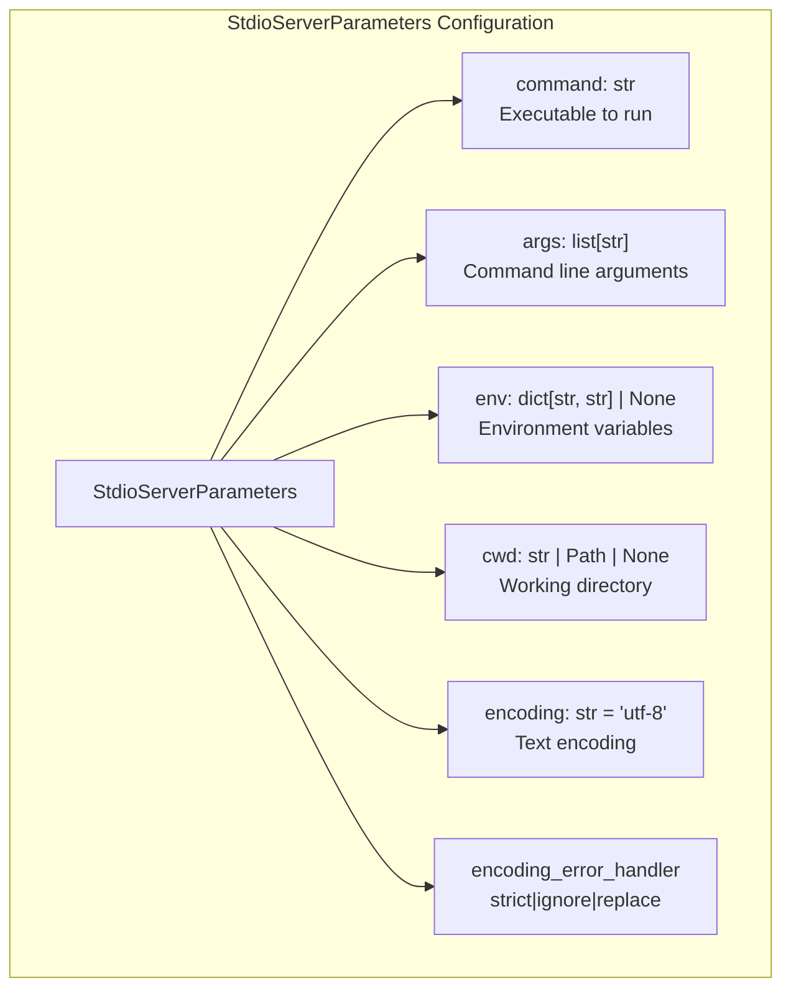
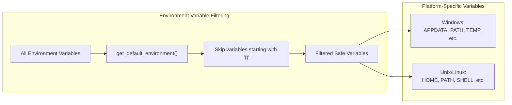
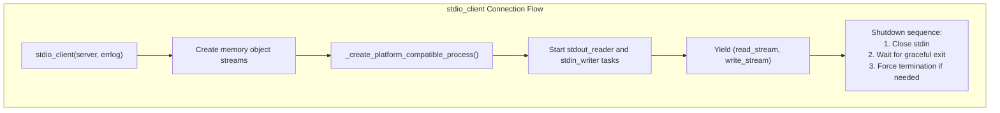
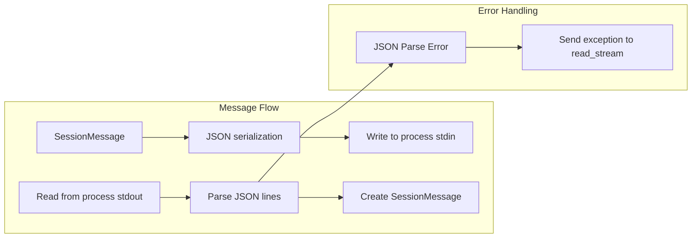
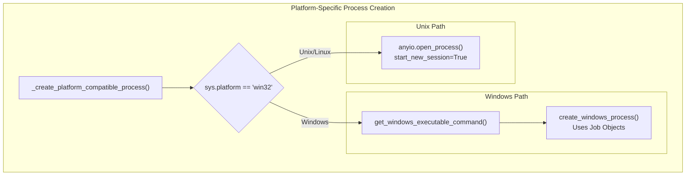
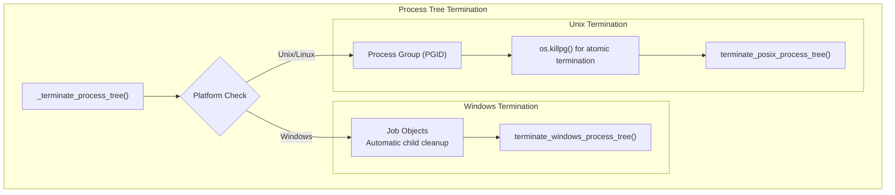
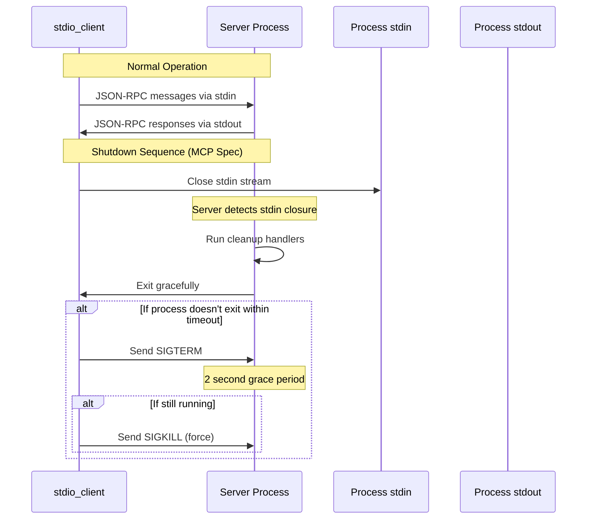
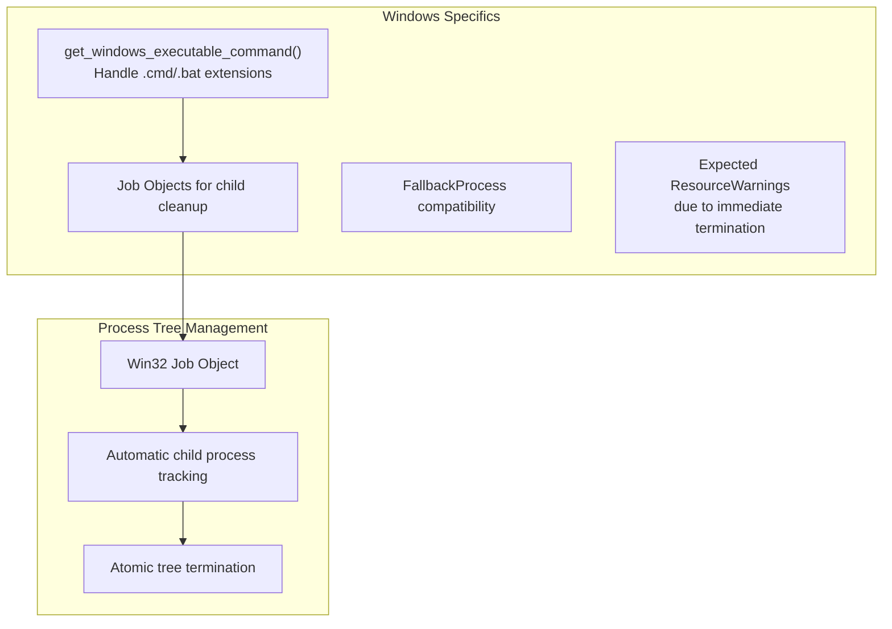
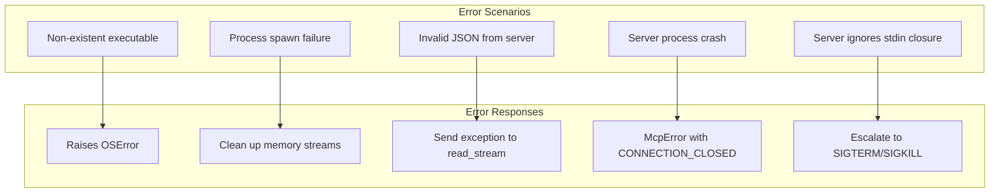

```

The transport automatically handles path prefix resolution using ASGI scope's `root_path` [src/mcp/server/sse.py:152-158]().

Sources: [src/mcp/server/sse.py:6-37](), [tests/shared/test_sse.py:83-104](), [tests/shared/test_sse.py:289-300]()

# STDIO Transport


The STDIO Transport enables MCP clients to communicate with servers by spawning processes and using standard input/output streams for message exchange. This transport is particularly useful for local development, CLI tools, and scenarios where servers are distributed as standalone executables. For HTTP-based transports, see [StreamableHTTP Transport](#5.1) and [SSE Transport](#5.2).

## Configuration

The STDIO transport is configured using the `StdioServerParameters` class, which defines how the server process should be spawned and managed.

### StdioServerParameters

The configuration model provides comprehensive control over process execution:



**Sources:** [src/mcp/client/stdio/__init__.py:72-103]()

The `env` parameter controls environment variable inheritance. When `None`, the system uses `get_default_environment()` which provides a secure subset of environment variables filtered for safety.

### Default Environment Security

The transport implements security measures for environment variable inheritance:



**Sources:** [src/mcp/client/stdio/__init__.py:51-69](), [src/mcp/client/stdio/__init__.py:27-45]()

## Connection Management

### stdio_client Context Manager

The `stdio_client` function provides the primary interface for establishing STDIO connections. It returns read and write streams for JSON-RPC message exchange:



**Sources:** [src/mcp/client/stdio/__init__.py:105-216]()

### Message Processing

The transport handles JSON-RPC message serialization automatically:



**Sources:** [src/mcp/client/stdio/__init__.py:139-179]()

## Process Management

### Cross-Platform Process Creation

The transport provides platform-specific process creation to ensure reliable child process management:



**Sources:** [src/mcp/client/stdio/__init__.py:234-258](), [src/mcp/client/stdio/__init__.py:218-232]()

### Process Tree Termination

The transport implements comprehensive child process cleanup using platform-specific mechanisms:



**Sources:** [src/mcp/client/stdio/__init__.py:261-277]()

## Shutdown and Cleanup

### MCP-Compliant Shutdown Sequence

The transport implements the MCP specification's stdio shutdown sequence for graceful server termination:



**Sources:** [src/mcp/client/stdio/__init__.py:190-215]()

### Timeout Configuration

The transport uses configurable timeouts for process termination:

- **`PROCESS_TERMINATION_TIMEOUT`**: 2.0 seconds for graceful exit after stdin closure
- Escalation to SIGTERM if graceful exit fails
- Final SIGKILL if SIGTERM is ignored

**Sources:** [src/mcp/client/stdio/__init__.py:47-48]()

## Platform Considerations

### Windows-Specific Handling

Windows requires special handling for executable resolution and process management:



**Sources:** [src/mcp/client/stdio/__init__.py:228-232](), [src/mcp/client/stdio/__init__.py:16-22]()

### Unix Process Groups

Unix systems use process groups for reliable child process management:

- **Session Creation**: `start_new_session=True` creates new process group
- **Atomic Termination**: `os.killpg()` terminates entire process group
- **Signal Escalation**: SIGTERM → SIGKILL escalation for unresponsive processes

**Sources:** [src/mcp/client/stdio/__init__.py:250-256]()

## Error Handling and Edge Cases

### Connection Failures

The transport handles various failure scenarios:



**Sources:** [src/mcp/client/stdio/__init__.py:131-137](), [src/mcp/client/stdio/__init__.py:154-161]()

### Child Process Cleanup

The transport includes comprehensive tests for child process scenarios:

- **Basic Parent-Child**: Single child process termination
- **Nested Trees**: Multi-level process hierarchies (parent → child → grandchild)
- **Race Conditions**: Parent exits during cleanup sequence
- **Signal Handling**: Processes that ignore specific signals

**Sources:** [tests/client/test_stdio.py:226-521]()

## Integration Examples

### Basic Usage

```python
from mcp.client.stdio import StdioServerParameters, stdio_client
from mcp.client.session import ClientSession

server_params = StdioServerParameters(
    command="python",
    args=["-m", "my_mcp_server"],
    env={"DEBUG": "1"}
)

async with stdio_client(server_params) as (read, write):
    async with ClientSession(read, write) as session:
        await session.initialize()
        # Use session for MCP operations
```

### Custom Environment

```python
server_params = StdioServerParameters(
    command="./my_server",
    env={
        **get_default_environment(),
        "API_KEY": "secret",
        "LOG_LEVEL": "debug"
    }
)
```

**Sources:** [tests/client/test_stdio.py:37-81](), [src/mcp/client/stdio/__init__.py:127-128]()