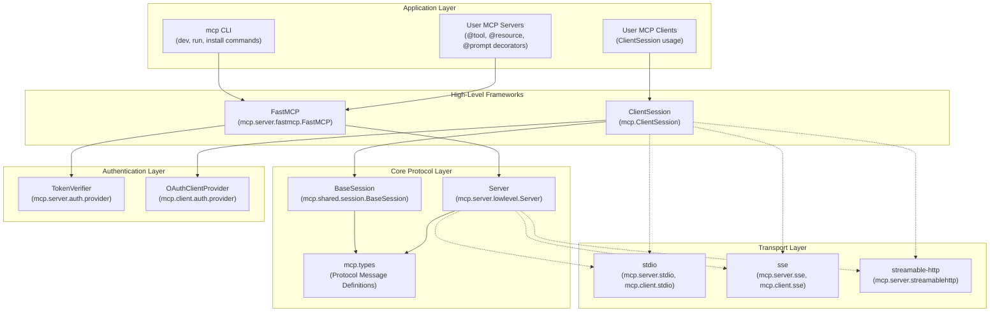
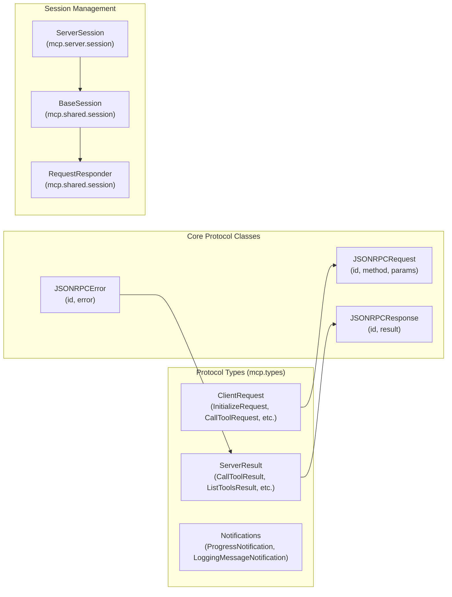
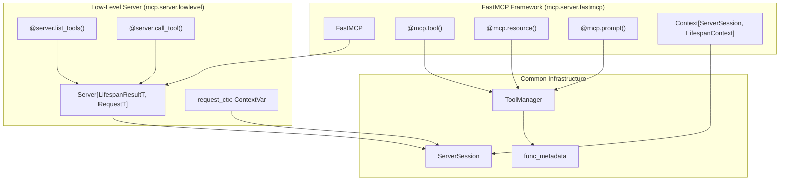
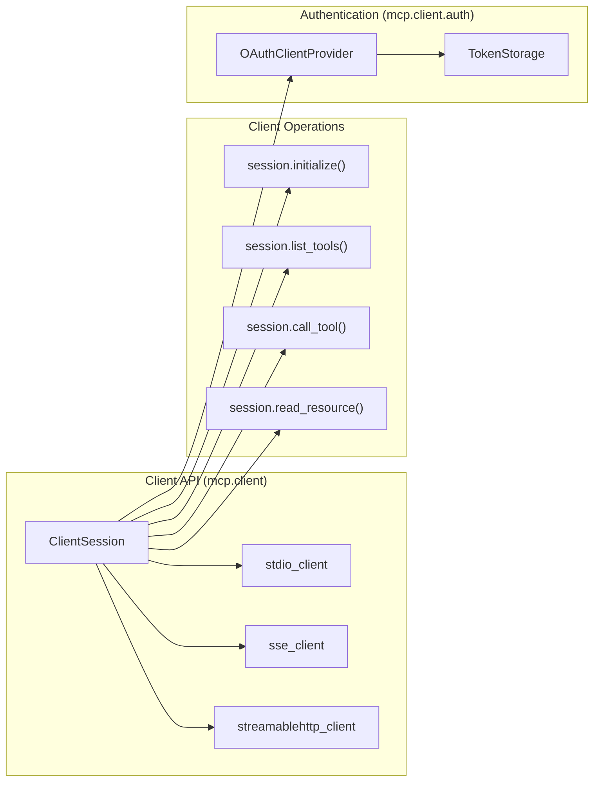
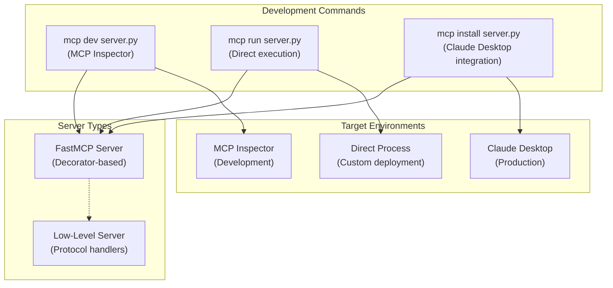

The Model Context Protocol (MCP) Python SDK is a comprehensive framework for building servers and clients that enable Large Language Models to access external tools, data, and services in a standardized way. This SDK implements the complete MCP specification, providing both high-level developer-friendly APIs and low-level protocol implementations.

The SDK enables developers to create MCP servers that expose resources (data), tools (functions), and prompts (templates) to LLM applications, as well as MCP clients that can discover and interact with these servers. For detailed implementation guidance on building servers, see [FastMCP Server Framework](#2). For client development, see [Client Framework](#3). For protocol-level details, see [Protocol & Message System](#4).

## System Architecture

The MCP Python SDK is organized into several distinct layers, each serving specific roles in the protocol implementation:

**Sources:** [README.md:1-1770](), [src/mcp/server/lowlevel/server.py:1-727](), [src/mcp/types.py:1-1349]()

## Core Components

### Protocol Foundation

The MCP SDK is built on JSON-RPC 2.0 messaging with well-defined protocol types. The `mcp.types` module contains all protocol message definitions, including requests, responses, and notifications that flow between clients and servers.

**Sources:** [src/mcp/types.py:124-192](), [src/mcp/types.py:1248-1349]()

### Server Implementations

The SDK provides two primary approaches for building MCP servers:

**FastMCP Framework** - A decorator-based high-level framework that automatically handles protocol compliance, schema generation, and transport integration. Users define tools, resources, and prompts using Python decorators.

**Low-Level Server** - Direct protocol implementation providing full control over message handling, lifecycle management, and custom protocol extensions.

**Sources:** [README.md:138-170](), [src/mcp/server/lowlevel/server.py:133-158]()

### Client Framework

The client framework centers around `ClientSession` which provides high-level methods for discovering and interacting with MCP servers. It handles transport abstraction, authentication, and protocol message management.

**Sources:** [README.md:660-733]()

### Transport Layer

The SDK supports three transport mechanisms for MCP communication, each suited for different deployment scenarios:

| Transport | Use Case | Implementation |
|-----------|----------|----------------|
| `stdio` | Process-based servers, development | `mcp.server.stdio`, `mcp.client.stdio` |
| `sse` | Real-time web applications | `mcp.server.sse`, `mcp.client.sse` |
| `streamable-http` | Production HTTP deployments | `mcp.server.streamablehttp` |

**Sources:** [README.md:1104-1217]()

## Development Workflow

The SDK includes comprehensive development tools accessible through the `mcp` CLI:

**Sources:** [README.md:1027-1102]()

For specific implementation details on each component, refer to the dedicated sections: [FastMCP Server Framework](#2) for high-level server development, [Client Framework](#3) for client implementation, [Transport Layer](#5) for communication mechanisms, and [Development Tools & CLI](#8) for development workflow.

# Overview

The Model Context Protocol (MCP) Python SDK is a comprehensive framework for building servers and clients that enable Large Language Models to access external tools, data, and services in a standardized way. This SDK implements the complete MCP specification, providing both high-level developer-friendly APIs and low-level protocol implementations.

The SDK enables developers to create MCP servers that expose resources (data), tools (functions), and prompts (templates) to LLM applications, as well as MCP clients that can discover and interact with these servers. For detailed implementation guidance on building servers, see [FastMCP Server Framework](#2). For client development, see [Client Framework](#3). For protocol-level details, see [Protocol & Message System](#4).

## System Architecture

The MCP Python SDK is organized into several distinct layers, each serving specific roles in the protocol implementation:

**Sources:** [README.md:1-1770](), [src/mcp/server/lowlevel/server.py:1-727](), [src/mcp/types.py:1-1349]()

## Core Components

### Protocol Foundation

The MCP SDK is built on JSON-RPC 2.0 messaging with well-defined protocol types. The `mcp.types` module contains all protocol message definitions, including requests, responses, and notifications that flow between clients and servers.

**Sources:** [src/mcp/types.py:124-192](), [src/mcp/types.py:1248-1349]()

### Server Implementations

The SDK provides two primary approaches for building MCP servers:

**FastMCP Framework** - A decorator-based high-level framework that automatically handles protocol compliance, schema generation, and transport integration. Users define tools, resources, and prompts using Python decorators.

**Low-Level Server** - Direct protocol implementation providing full control over message handling, lifecycle management, and custom protocol extensions.

**Sources:** [README.md:138-170](), [src/mcp/server/lowlevel/server.py:133-158]()

### Client Framework

The client framework centers around `ClientSession` which provides high-level methods for discovering and interacting with MCP servers. It handles transport abstraction, authentication, and protocol message management.

**Sources:** [README.md:660-733]()

### Transport Layer

The SDK supports three transport mechanisms for MCP communication, each suited for different deployment scenarios:

| Transport | Use Case | Implementation |
|-----------|----------|----------------|
| `stdio` | Process-based servers, development | `mcp.server.stdio`, `mcp.client.stdio` |
| `sse` | Real-time web applications | `mcp.server.sse`, `mcp.client.sse` |
| `streamable-http` | Production HTTP deployments | `mcp.server.streamablehttp` |

**Sources:** [README.md:1104-1217]()

## Development Workflow

The SDK includes comprehensive development tools accessible through the `mcp` CLI:

**Sources:** [README.md:1027-1102]()

For specific implementation details on each component, refer to the dedicated sections: [FastMCP Server Framework](#2) for high-level server development, [Client Framework](#3) for client implementation, [Transport Layer](#5) for communication mechanisms, and [Development Tools & CLI](#8) for development workflow.