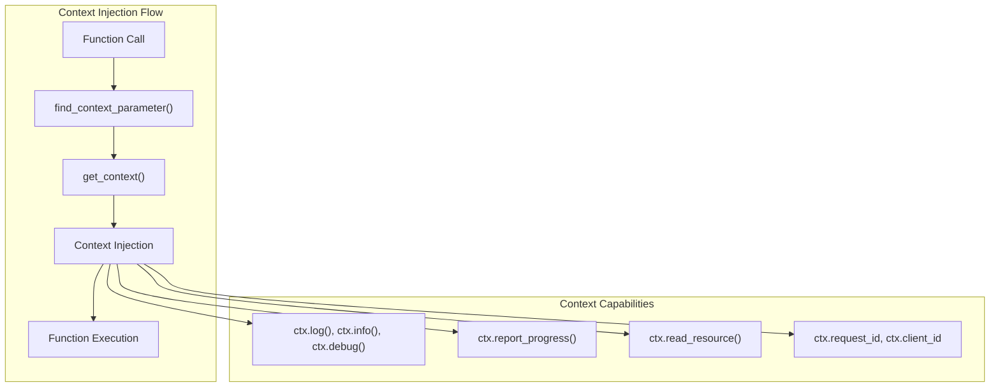
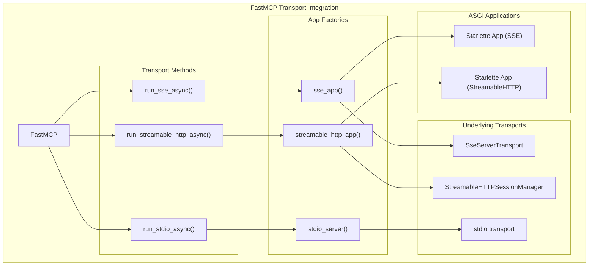
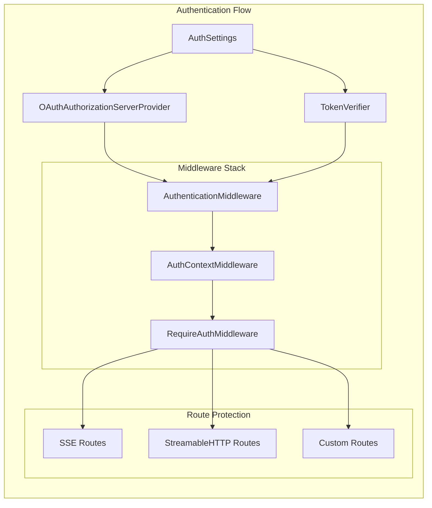

@server.resource("data://{user_id}/profile")
def get_user_profile(user_id: str) -> str:
    return f"Profile for user {user_id}"
```

The framework automatically detects whether a resource should be treated as a template based on URI parameters and function signature.

Sources: [src/mcp/server/fastmcp/server.py:479-578](), [tests/server/fastmcp/test_server.py:701-827]()

### Prompt Registration

Prompts are registered using the `@prompt()` decorator and return message structures:

```python
@server.prompt()
def analyze_data(dataset_name: str) -> str:
    """Generate analysis prompt for a dataset."""
    return f"Please analyze the dataset: {dataset_name}"
```

Sources: [src/mcp/server/fastmcp/server.py:588-641](), [tests/server/fastmcp/test_server.py:1094-1284]()

## Context System

### Context Injection

The `Context` class provides access to MCP capabilities and is automatically injected into functions that declare it as a parameter:



### Context Methods

The `Context` class provides several methods for interacting with the MCP session:

| Method | Purpose | Parameters |
|--------|---------|------------|
| `log()` | Send log messages | `level`, `message`, `logger_name` |
| `report_progress()` | Report operation progress | `progress`, `total`, `message` |
| `read_resource()` | Access other resources | `uri` |
| `elicit()` | Request user input | `message`, `schema` |

Sources: [src/mcp/server/fastmcp/server.py:1043-1223](), [tests/server/fastmcp/test_server.py:835-1092]()

## Transport Integration

FastMCP supports multiple transport protocols through dedicated application factories:

### Transport Applications



### Transport-Specific Features

Each transport provides specific capabilities:

| Transport | Use Case | Key Features |
|-----------|----------|--------------|
| **stdio** | Process-based communication | Simple stdin/stdout JSON-RPC |
| **SSE** | Web-based real-time communication | Server-sent events with HTTP POST |
| **StreamableHTTP** | Resumable sessions | Bidirectional streaming, session persistence |

Sources: [src/mcp/server/fastmcp/server.py:687-724](), [src/mcp/server/fastmcp/server.py:752-990]()

## Configuration and Settings

### Settings Management

The `Settings` class provides comprehensive configuration management with environment variable support:

```python
class Settings(BaseSettings):
    # Server settings
    debug: bool
    log_level: Literal["DEBUG", "INFO", "WARNING", "ERROR", "CRITICAL"]
    
    # HTTP settings
    host: str = "127.0.0.1"
    port: int = 8000
    mount_path: str = "/"
    
    # Authentication
    auth: AuthSettings | None = None
    
    # Transport security
    transport_security: TransportSecuritySettings | None = None
```

Settings can be configured via:
- Environment variables with `FASTMCP_` prefix
- `.env` files
- Direct parameter passing

### Authentication Integration

FastMCP supports OAuth 2.0 authentication through integrated middleware:



Sources: [src/mcp/server/fastmcp/server.py:56-108](), [src/mcp/server/fastmcp/server.py:152-170](), [src/mcp/server/fastmcp/server.py:792-982]()