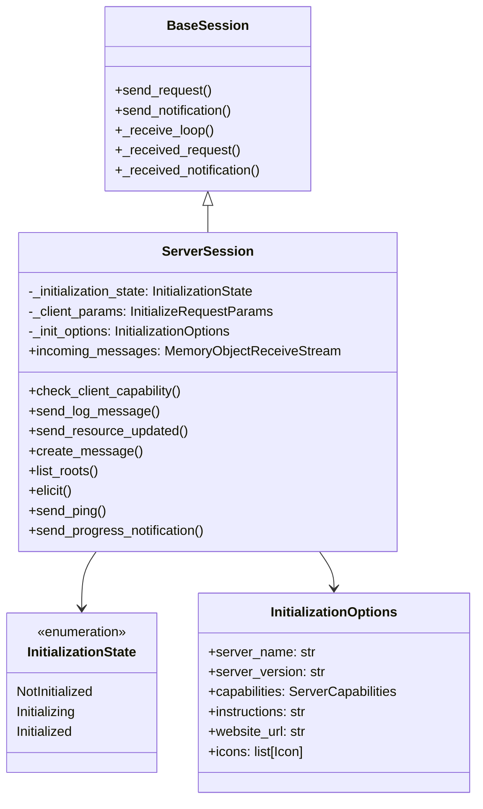
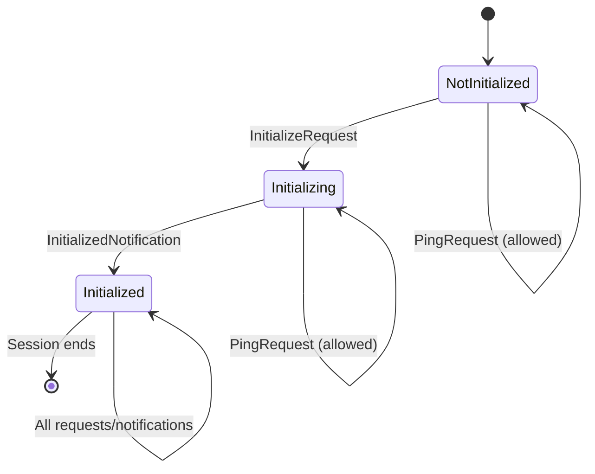
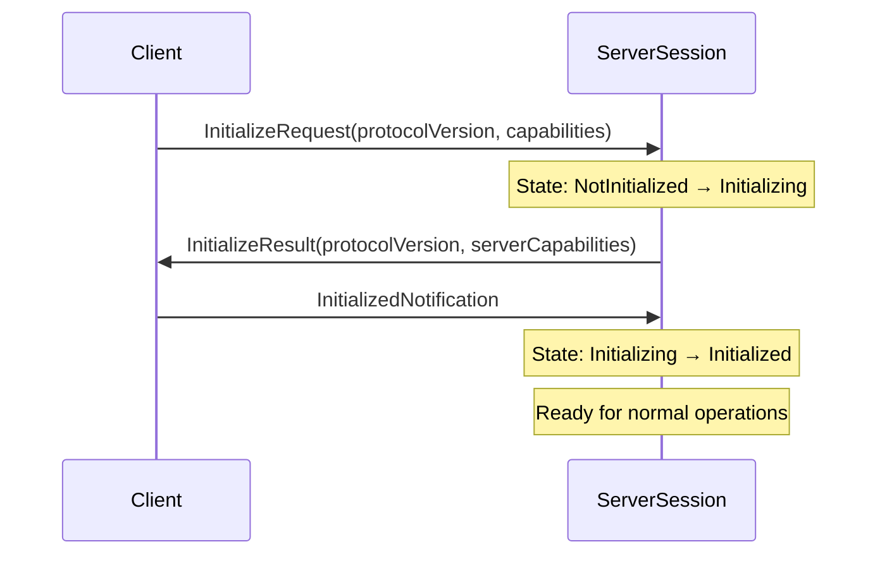
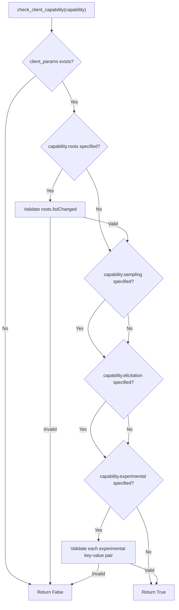
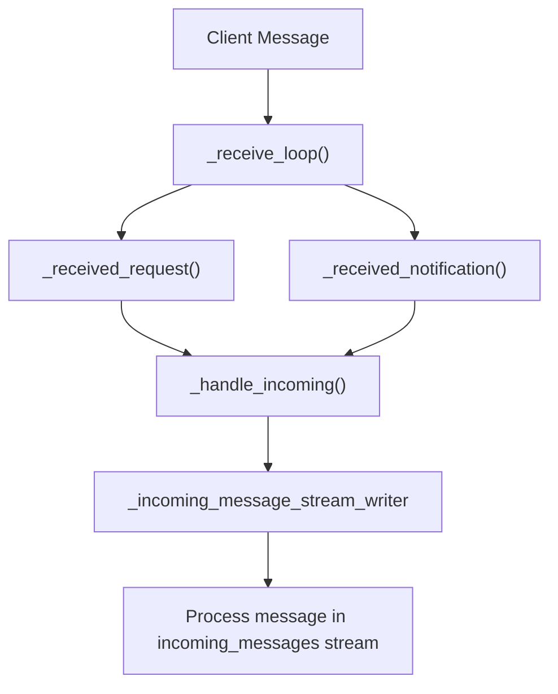
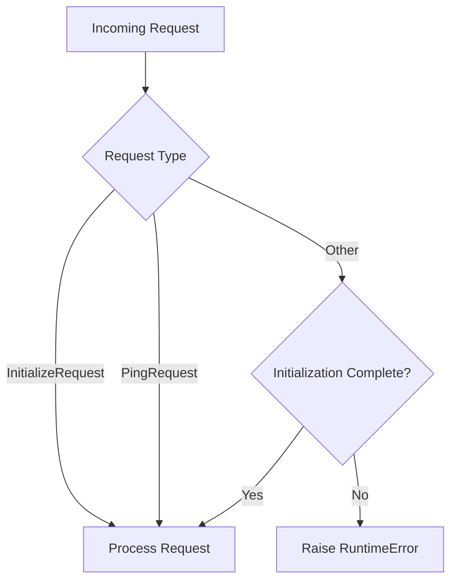
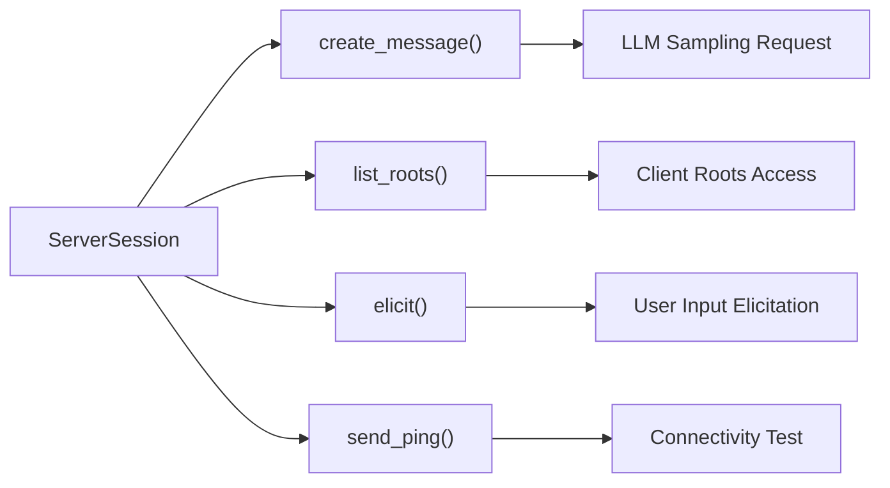
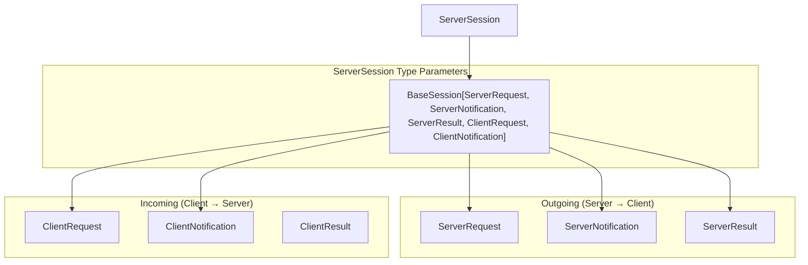

The ServerSession class provides the core session management functionality for MCP servers, handling individual client connections and managing bidirectional communication between servers and clients. It serves as the low-level foundation that higher-level server frameworks like FastMCP build upon for managing protocol-compliant client interactions.

For information about the high-level FastMCP framework that uses ServerSession internally, see [FastMCP Server Framework](#2). For details about the underlying BaseSession architecture, see [Session Management](#4.2).

## Architecture Overview

ServerSession extends the BaseSession class with server-specific functionality, implementing the server side of the MCP protocol communication pattern.



Sources: [src/mcp/server/session.py:71-79](), [src/mcp/server/session.py:58-62](), [src/mcp/server/models.py:14-21]()

## Session Lifecycle and Initialization

ServerSession manages a strict initialization protocol that ensures proper MCP handshake before allowing most operations.

### Initialization States

The session progresses through three distinct states during its lifecycle:

| State | Description | Allowed Operations |
|-------|-------------|-------------------|
| `NotInitialized` | Initial state before any client communication | Ping requests only |
| `Initializing` | During initialization handshake | Ping requests only |
| `Initialized` | Ready for full MCP protocol operations | All requests and notifications |



Sources: [src/mcp/server/session.py:58-62](), [src/mcp/server/session.py:142-171](), [src/mcp/server/session.py:173-181]()

### Initialization Protocol

The initialization process follows the MCP specification:

1. **Client sends InitializeRequest**: Contains protocol version, capabilities, and client info
2. **Server responds with InitializeResult**: Confirms protocol version and advertises server capabilities  
3. **Client sends InitializedNotification**: Signals readiness to begin normal operations



Sources: [src/mcp/server/session.py:144-165](), [src/mcp/server/session.py:177-178]()

## Client Capability Management

ServerSession provides capability checking to ensure servers only use features supported by the connected client.

### Capability Checking Logic

The `check_client_capability()` method validates whether a client supports specific MCP capabilities:



Sources: [src/mcp/server/session.py:105-136]()

## Message Processing Architecture

ServerSession handles both incoming messages from clients and outgoing messages to clients through dedicated processing pipelines.

### Incoming Message Flow



Sources: [src/mcp/server/session.py:138-140](), [src/mcp/server/session.py:326-327](), [src/mcp/server/session.py:329-333]()

### Request Validation

All incoming requests except ping are validated against the initialization state:



Sources: [src/mcp/server/session.py:169-171]()

## Server-to-Client Communication Methods

ServerSession provides a comprehensive set of methods for servers to communicate with clients, covering all major MCP protocol operations.

### Notification Methods

| Method | Purpose | MCP Notification Type |
|--------|---------|----------------------|
| `send_log_message()` | Send log entries to client | `LoggingMessageNotification` |
| `send_resource_updated()` | Notify resource changes | `ResourceUpdatedNotification` |
| `send_progress_notification()` | Report operation progress | `ProgressNotification` |
| `send_resource_list_changed()` | Signal resource list updates | `ResourceListChangedNotification` |
| `send_tool_list_changed()` | Signal tool list updates | `ToolListChangedNotification` |
| `send_prompt_list_changed()` | Signal prompt list updates | `PromptListChangedNotification` |

Sources: [src/mcp/server/session.py:183-202](), [src/mcp/server/session.py:204-212](), [src/mcp/server/session.py:291-312](), [src/mcp/server/session.py:314-324]()

### Request Methods

ServerSession can initiate requests to clients for advanced MCP operations:



Sources: [src/mcp/server/session.py:214-247](), [src/mcp/server/session.py:249-254](), [src/mcp/server/session.py:256-282](), [src/mcp/server/session.py:284-289]()

## Integration with MCP Protocol

ServerSession implements the server side of the complete MCP protocol specification, handling message routing and protocol compliance.

### Protocol Message Types



Sources: [src/mcp/server/session.py:71-79]()

### Stateless Mode Support

ServerSession supports stateless operation for scenarios where session persistence is not required:

```python