This document provides comprehensive examples of MCP server implementations using both the low-level `Server` class and the high-level `FastMCP` framework. These examples demonstrate various MCP capabilities including tools, resources, prompts, progress reporting, and different transport mechanisms.

For client-side examples and integration patterns, see [Client Examples](#9.2). For detailed FastMCP framework documentation, see [FastMCP Server Framework](#2).

## Server Implementation Approaches

The MCP Python SDK provides two primary approaches for building servers, each suited for different use cases and complexity levels.

### Server Implementation Architecture

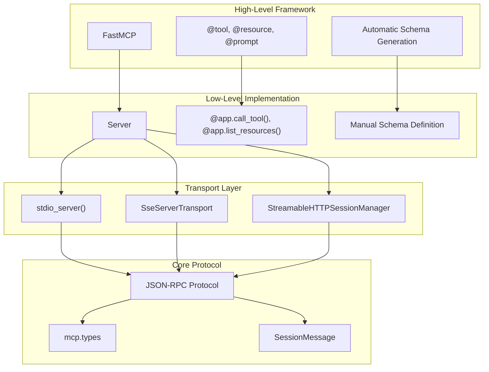

Sources: [examples/servers/simple-resource/mcp_simple_resource/server.py:1-94](), [examples/servers/simple-tool/mcp_simple_tool/server.py:1-94](), [examples/snippets/servers/structured_output.py:1-98]()

## Low-Level Server Examples

The low-level `Server` class provides direct control over MCP protocol handling and is suitable for complex server implementations requiring fine-grained control.

### Basic Resource Server

The simple resource server demonstrates fundamental resource serving capabilities using the low-level `Server` class.

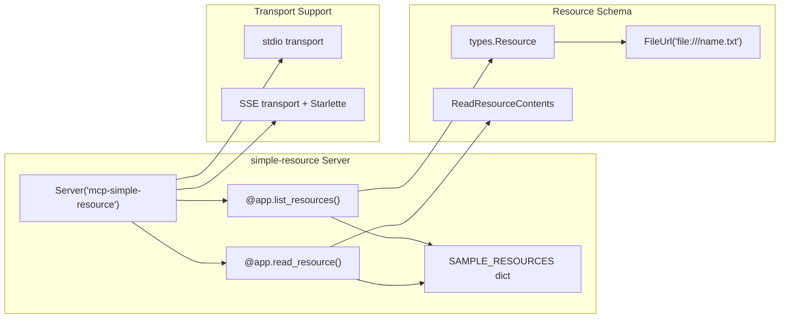

Sources: [examples/servers/simple-resource/mcp_simple_resource/server.py:34-58]()

### Basic Tool Server  

The simple tool server shows HTTP client functionality and tool execution patterns.

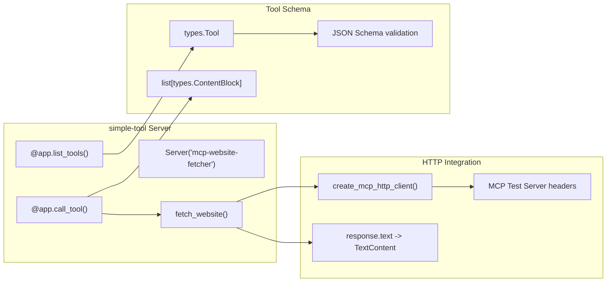

Sources: [examples/servers/simple-tool/mcp_simple_tool/server.py:32-58]()

### Basic Prompt Server

The simple prompt server demonstrates template-based prompt generation.

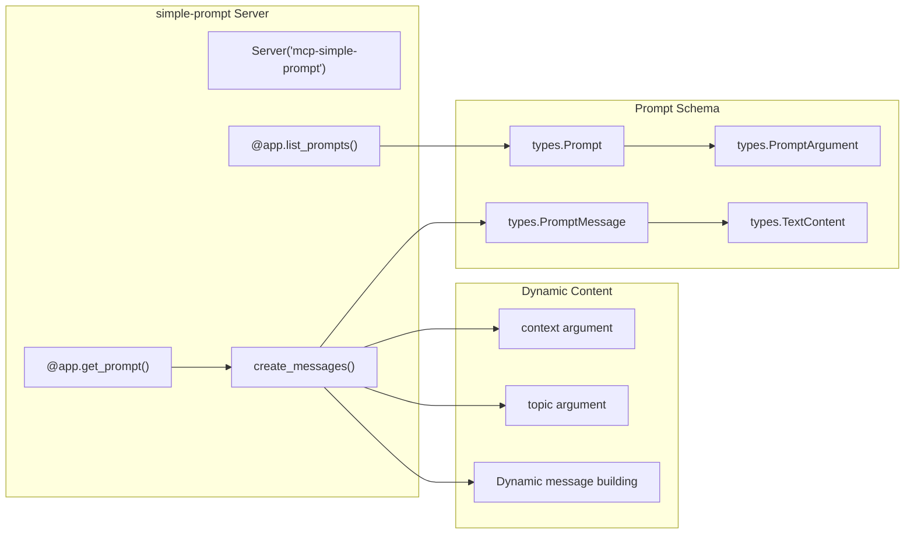

Sources: [examples/servers/simple-prompt/mcp_simple_prompt/server.py:44-77]()

## StreamableHTTP Transport Examples

StreamableHTTP transport enables bidirectional communication with session management and resumability features.

### StreamableHTTP with Event Store

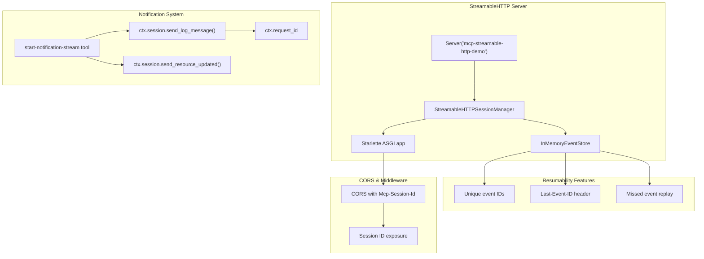

Sources: [examples/servers/simple-streamablehttp/mcp_simple_streamablehttp/server.py:47-165]()

### Stateless StreamableHTTP

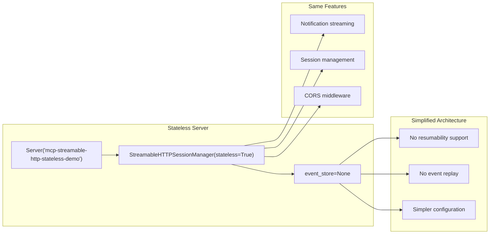

Sources: [examples/servers/simple-streamablehttp-stateless/mcp_simple_streamablehttp_stateless/server.py:97-140]()

## FastMCP Framework Examples

FastMCP provides a decorator-based approach for rapid server development with automatic schema generation and simplified setup.

### Structured Output Example

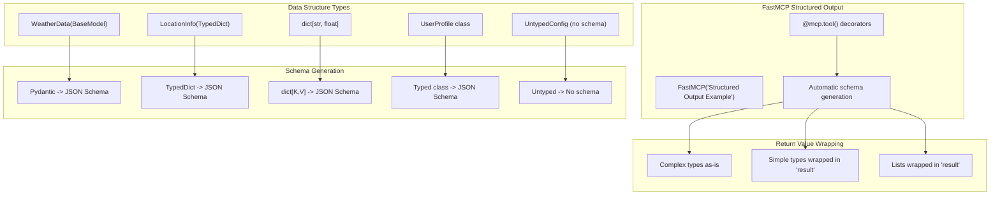

Sources: [examples/snippets/servers/structured_output.py:9-98]()

### Direct Execution Example

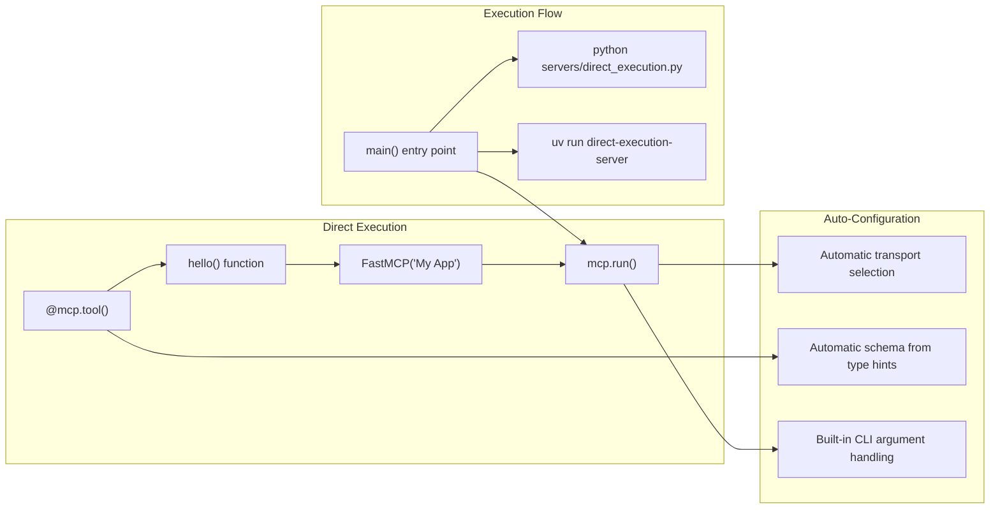

Sources: [examples/snippets/servers/direct_execution.py:10-27]()

## Feature-Specific Examples

The integration tests demonstrate various MCP features through focused example servers.

### Progress Reporting

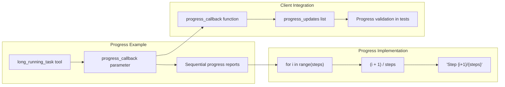

Sources: [tests/server/fastmcp/test_integration.py:392-440]()

### Notification System

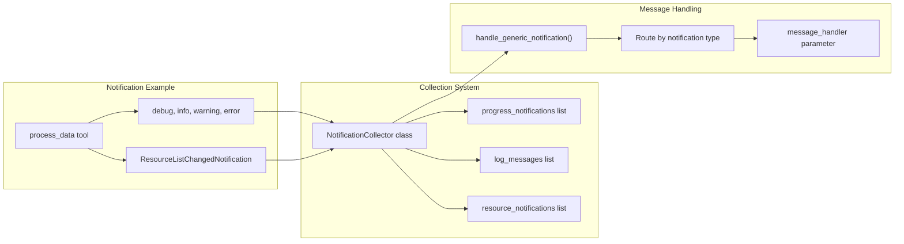

Sources: [tests/server/fastmcp/test_integration.py:524-569]()

### Sampling and Elicitation

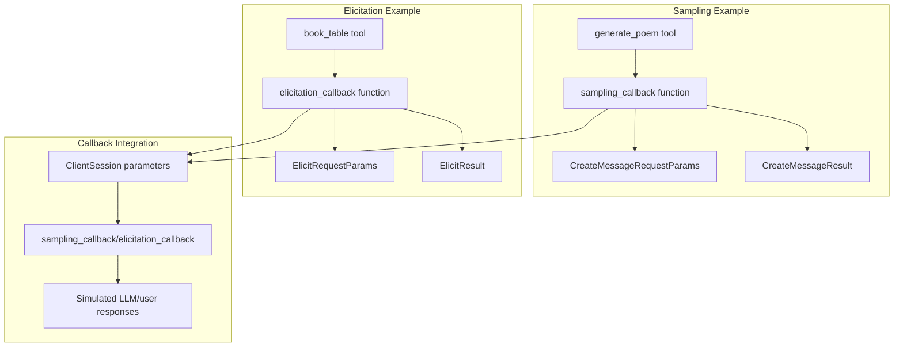

Sources: [tests/server/fastmcp/test_integration.py:442-521]()

## Transport Configuration Patterns

All server examples support multiple transport configurations, allowing flexible deployment options.

### Universal Transport Pattern

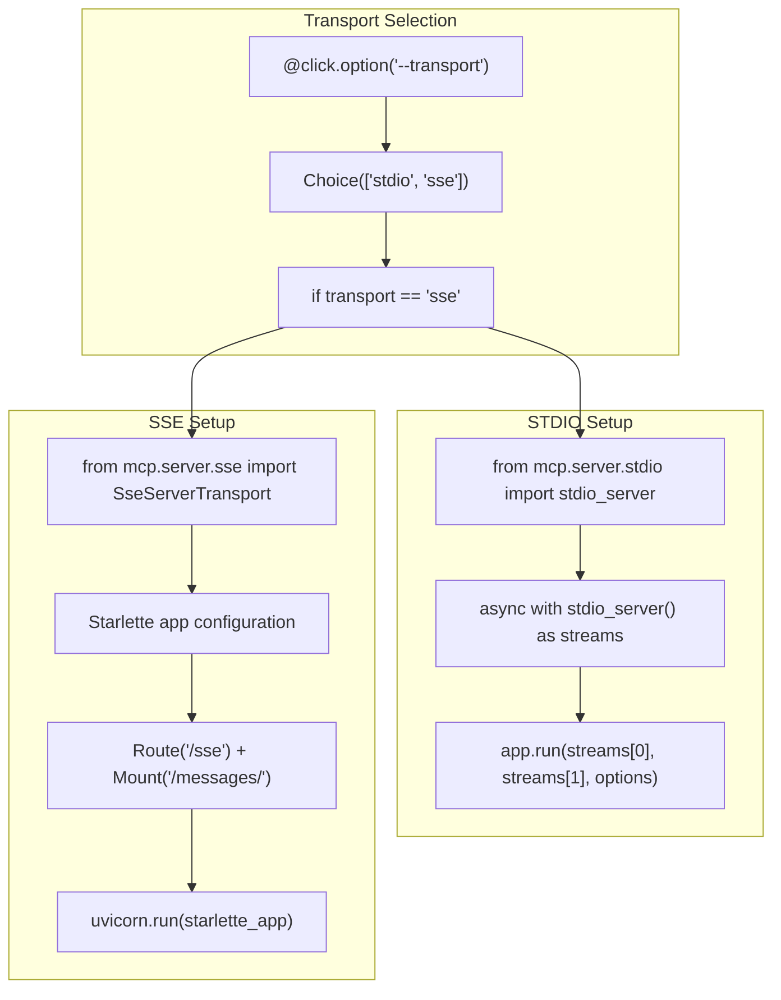

Sources: [examples/servers/simple-resource/mcp_simple_resource/server.py:60-93](), [examples/servers/simple-tool/mcp_simple_tool/server.py:60-93](), [examples/servers/simple-prompt/mcp_simple_prompt/server.py:79-112]()