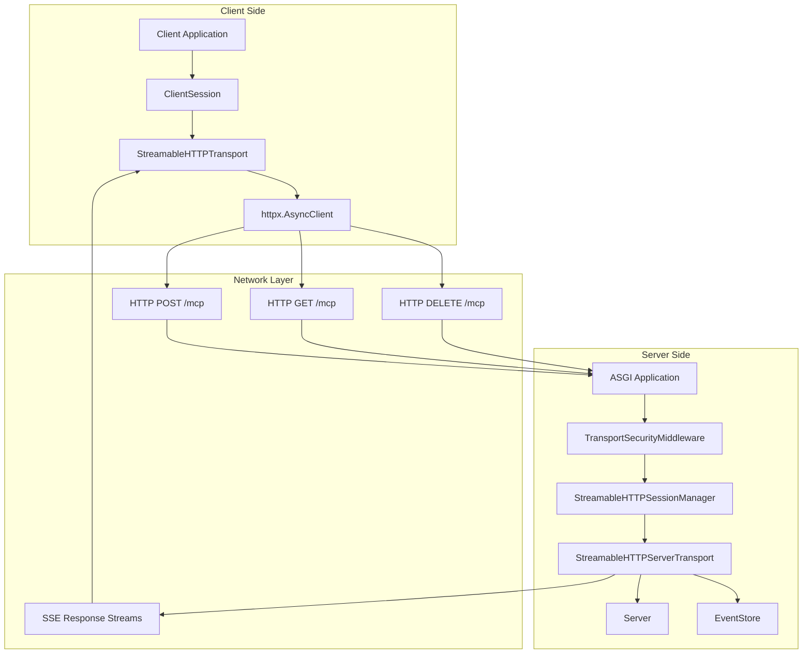
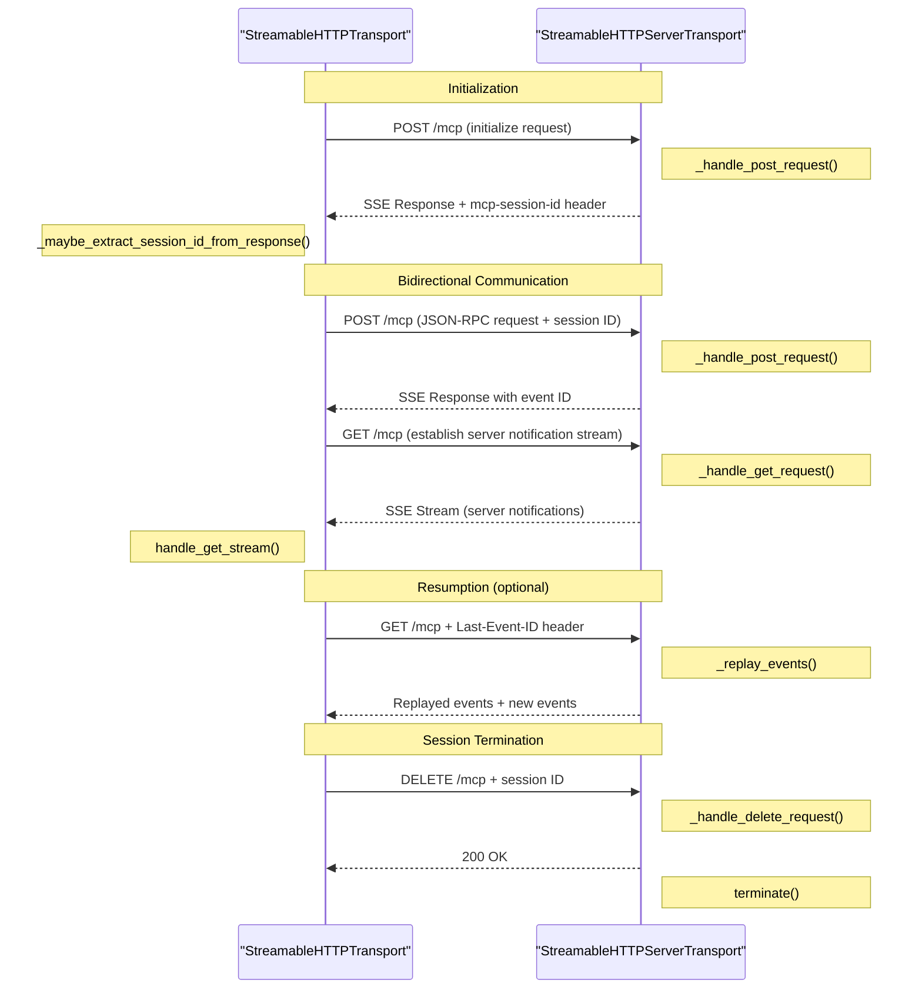
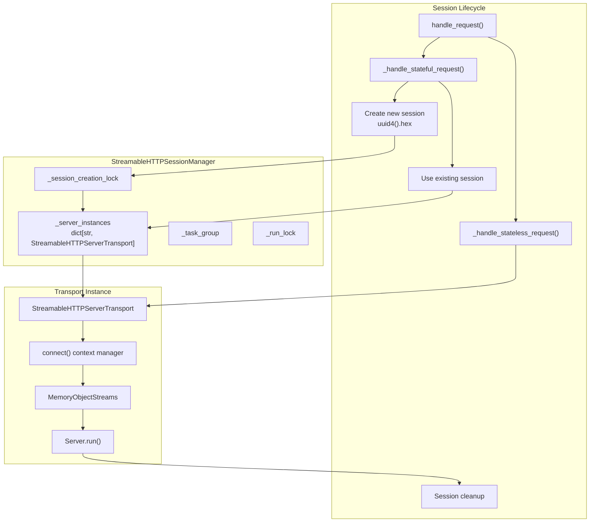
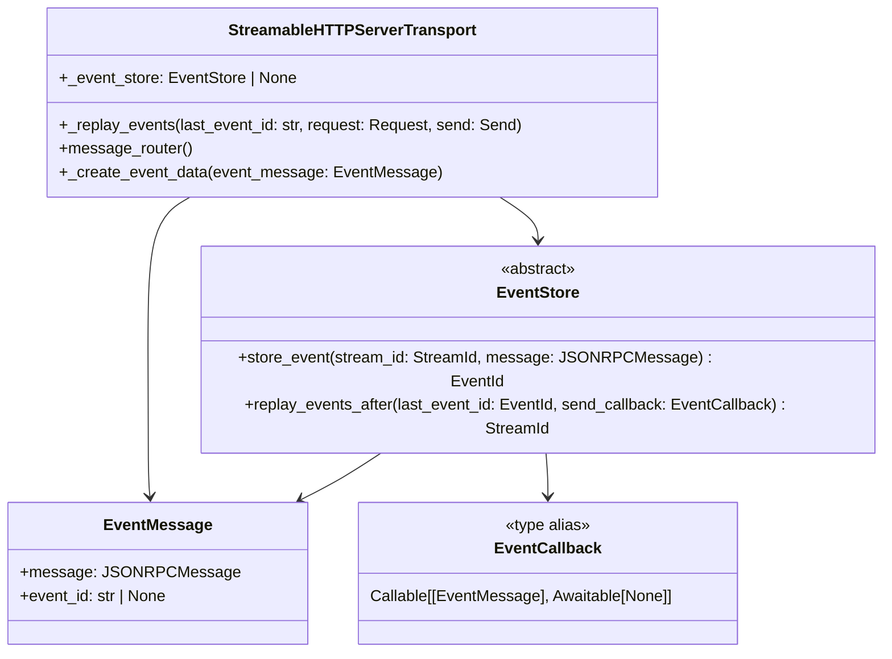
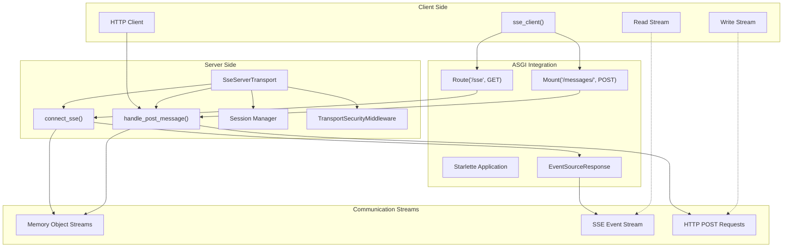
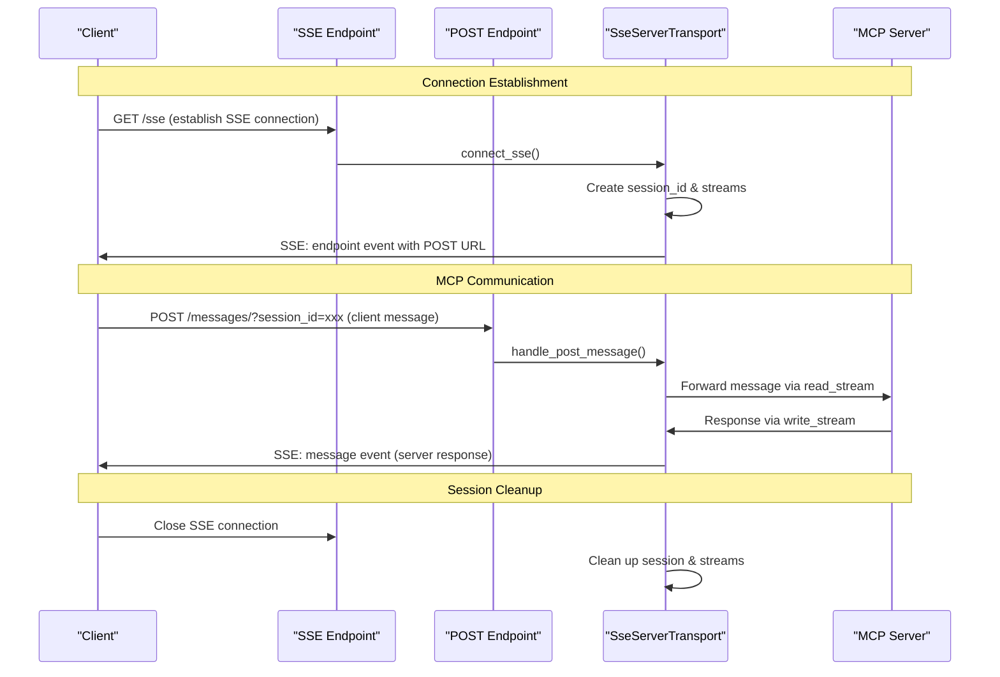
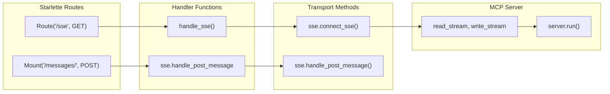
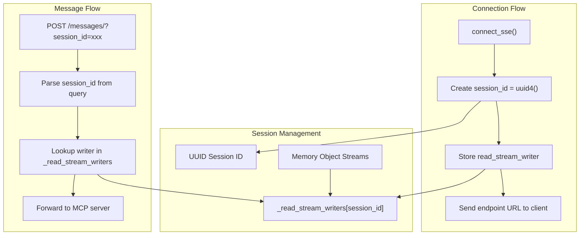
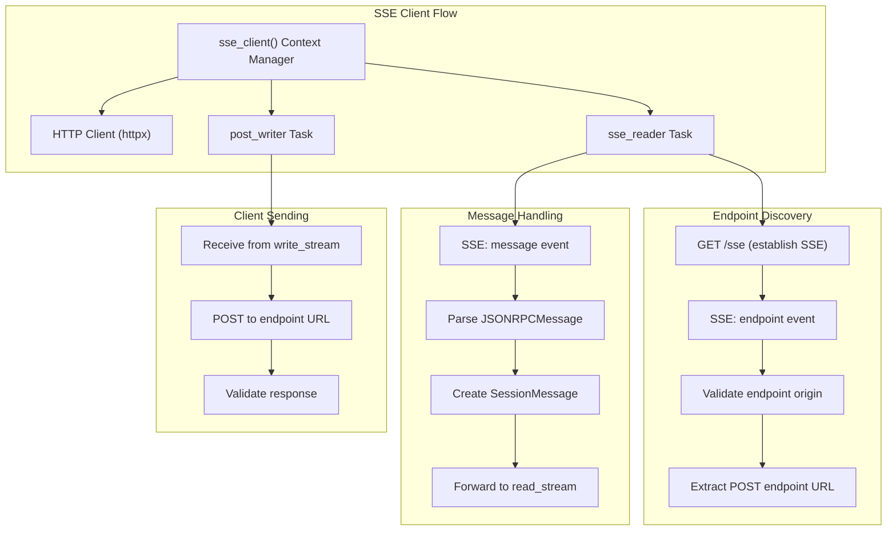

The StreamableHTTP Transport provides HTTP-based bidirectional communication for MCP using POST requests and Server-Sent Events (SSE) streaming. This transport enables stateful session management, optional resumability, and authentication support for both clients and servers.

For SSE-only transport functionality, see [Server-Sent Events (SSE) Transport](#5.2). For stdio-based process communication, see [STDIO Transport](#5.3). For WebSocket communication, see [WebSocket Transport](#5.4).

## Overview

StreamableHTTP transport implements the MCP protocol over HTTP using a hybrid approach: clients send messages via HTTP POST requests, while servers respond using either JSON responses or SSE streams. The transport supports both stateful sessions with resumability and stateless request-response patterns.

**Key Features:**
- HTTP POST requests for client-to-server communication  
- SSE streaming for server-to-client communication
- Session management with unique session IDs
- Optional resumability via `EventStore` interface
- Authentication support through `httpx.Auth`
- DNS rebinding protection via `TransportSecurityMiddleware`
- Both stateful and stateless operation modes

Sources: [src/mcp/client/streamable_http.py:1-8](), [src/mcp/server/streamable_http.py:1-8]()

## Architecture Overview



**StreamableHTTP Transport Architecture**

Sources: [src/mcp/client/streamable_http.py:74-108](), [src/mcp/server/streamable_http.py:122-175](), [src/mcp/server/streamable_http_manager.py:29-79]()

## Client-Side Implementation

The client-side implementation centers around the `StreamableHTTPTransport` class and the `streamablehttp_client` async context manager.

### StreamableHTTPTransport Class

The `StreamableHTTPTransport` class handles the client-side HTTP communication with session management and protocol negotiation:

| Component | Responsibility |
|-----------|----------------|
| Session Management | Tracks session ID and protocol version |
| Request Handling | Manages POST requests and SSE responses |
| Authentication | Integrates with `httpx.Auth` for authentication |
| Resumption | Supports request resumption with event IDs |

**Key Methods:**
- `post_writer()` - Handles outgoing requests via HTTP POST
- `handle_get_stream()` - Manages incoming SSE streams from server  
- `terminate_session()` - Explicitly terminates session via DELETE request
- `_handle_post_request()` - Processes individual POST requests
- `_handle_resumption_request()` - Handles resumption with `Last-Event-ID`

**Key Attributes:**
- `session_id` - Current session identifier
- `protocol_version` - Negotiated protocol version
- `request_headers` - Base headers for all requests

### Message Flow Patterns



**StreamableHTTP Message Flow**

Sources: [src/mcp/client/streamable_http.py:366-422](), [src/mcp/client/streamable_http.py:192-218](), [src/mcp/client/streamable_http.py:423-438](), [src/mcp/server/streamable_http.py:309-507](), [src/mcp/server/streamable_http.py:508-599](), [src/mcp/server/streamable_http.py:600-622]()

### Client Context Manager Usage

The primary client interface is the `streamablehttp_client` async context manager:

```python
async with streamablehttp_client(
    url="http://localhost:8000/mcp",
    auth=oauth_provider,  # Optional authentication
    timeout=30.0,
    sse_read_timeout=300.0
) as (read_stream, write_stream, get_session_id):
    async with ClientSession(read_stream, write_stream) as session:
        await session.initialize()
        # Use session...
```

Sources: [src/mcp/client/streamable_http.py:444-514]()

## Server-Side Implementation

The server-side implementation provides two main components: `StreamableHTTPServerTransport` for individual connections and `StreamableHTTPSessionManager` for managing multiple sessions.

### StreamableHTTPServerTransport

The `StreamableHTTPServerTransport` class handles individual HTTP connections with support for both SSE streaming and JSON responses:

**Operating Modes:**
- **SSE Mode** (default): Responses are streamed via Server-Sent Events
- **JSON Mode**: Single JSON responses for each request (controlled by `is_json_response_enabled`)

**HTTP Method Handling:**
- `POST` - Processes JSON-RPC messages via `_handle_post_request()`
- `GET` - Establishes SSE streams for server-initiated messages via `_handle_get_request()`  
- `DELETE` - Terminates sessions explicitly via `_handle_delete_request()`

**Key Features:**
- Session ID validation using `SESSION_ID_PATTERN`
- Request stream management with `_request_streams` dictionary
- Event storage integration via `EventStore` interface
- Security validation through `TransportSecurityMiddleware`
- Memory stream cleanup with `_clean_up_memory_streams()`

### Session Management Architecture



**Session Management Components**

Sources: [src/mcp/server/streamable_http_manager.py:70-79](), [src/mcp/server/streamable_http_manager.py:146-194](), [src/mcp/server/streamable_http_manager.py:195-280]()

### Stateful vs Stateless Modes

The session manager supports two operation modes:

| Mode | Session Tracking | State Persistence | Use Case |
|------|-----------------|-------------------|----------|
| Stateful | Yes | Between requests | Long-lived connections |
| Stateless | No | None | Serverless/stateless deployments |

**Stateful Mode:** Sessions are tracked with UUIDs, allowing resumption and persistent state.
**Stateless Mode:** Each request creates a fresh transport instance with no state retention.

Sources: [src/mcp/server/streamable_http_manager.py:54-68]()

## Event Storage and Resumability

StreamableHTTP transport supports optional resumability through the `EventStore` interface, allowing clients to reconnect and receive missed events.

### EventStore Interface



**Event Storage Architecture**

**Resumption Flow:**
1. Client includes `Last-Event-ID` header in GET request via `LAST_EVENT_ID_HEADER`
2. Server calls `EventStore.replay_events_after()` in `_replay_events()`
3. Missed events are replayed via SSE using `_create_event_data()`
4. New events continue from current point with automatic event ID generation

**Stream Management:**
- Events are stored per `StreamId` (either request ID or `GET_STREAM_KEY`)
- Message router distributes events to appropriate streams based on request correlation
- Event IDs are generated by the `EventStore` implementation

Sources: [src/mcp/server/streamable_http.py:84-120](), [src/mcp/server/streamable_http.py:728-798](), [src/mcp/server/streamable_http.py:829-880]()

## Security Features

StreamableHTTP transport includes DNS rebinding protection through the `TransportSecurityMiddleware`.

### Security Validation

The transport validates incoming requests against security policies via `TransportSecurityMiddleware`:

| Validation | Scope | Purpose |
|------------|-------|---------|
| Host Header | All requests | Prevent DNS rebinding attacks |
| Origin Header | CORS requests | Validate request origin |
| Content-Type | POST requests | Ensure proper JSON content |
| Accept Headers | POST requests | Validate client accepts required media types |

**Security Integration:**
- `TransportSecurityMiddleware` is instantiated in `StreamableHTTPServerTransport.__init__()`
- Validation occurs in `handle_request()` via `_security.validate_request()`
- Failed validation returns error responses before processing

**Configuration Example:**
```python
security_settings = TransportSecuritySettings(
    allowed_hosts=["localhost:*", "127.0.0.1:*"], 
    allowed_origins=["http://localhost:*", "http://127.0.0.1:*"]
)
```

Sources: [src/mcp/server/streamable_http.py:27-30](), [src/mcp/server/streamable_http.py:166](), [src/mcp/server/streamable_http.py:268-272]()

## Protocol Implementation Details

### Session ID Management

Session IDs are validated against a strict pattern to ensure security:

- **Pattern:** Visible ASCII characters (0x21-0x7E)
- **Generation:** UUID hex format (32 characters)
- **Validation:** `SESSION_ID_PATTERN.fullmatch()` check

### Protocol Version Negotiation

The transport negotiates protocol versions during initialization:

1. Client sends `initialize` request
2. Server responds with `InitializeResult` containing `protocolVersion`
3. Subsequent requests include `mcp-protocol-version` header

### Headers and Content Types

| Header | Constant | Purpose | Example |
|--------|----------|---------|---------|
| `mcp-session-id` | `MCP_SESSION_ID_HEADER` | Session identification | `abc123def456...` |
| `mcp-protocol-version` | `MCP_PROTOCOL_VERSION_HEADER` | Protocol version | `2025-03-26` |
| `last-event-id` | `LAST_EVENT_ID_HEADER` | Resumption token | `event-123` |
| `content-type` | `CONTENT_TYPE` | Request format | `application/json` |
| `accept` | `ACCEPT` | Response formats | `application/json, text/event-stream` |

**Content Type Constants:**
- `CONTENT_TYPE_JSON` = `"application/json"`
- `CONTENT_TYPE_SSE` = `"text/event-stream"`
- `JSON` = `"application/json"` (client)
- `SSE` = `"text/event-stream"` (client)

**Session ID Validation:**
- Pattern: `SESSION_ID_PATTERN` validates visible ASCII characters (0x21-0x7E)
- Generated using `uuid4().hex` for new sessions
- Validated on transport initialization and request processing

Sources: [src/mcp/server/streamable_http.py:50-64](), [src/mcp/client/streamable_http.py:42-51](), [src/mcp/server/streamable_http.py:62-64]()

## Integration with ASGI

StreamableHTTP transport integrates with ASGI applications through the session manager:

```python
from starlette.applications import Starlette
from starlette.routing import Mount

session_manager = StreamableHTTPSessionManager(
    app=mcp_server,
    event_store=event_store,
    security_settings=security_settings
)

app = Starlette(
    routes=[Mount("/mcp", app=session_manager.handle_request)],
    lifespan=lambda app: session_manager.run()
)
```

The session manager's `run()` method provides lifecycle management for all sessions and can only be called once per instance.

Sources: [src/mcp/server/streamable_http_manager.py:80-120](), [src/mcp/server/streamable_http_manager.py:121-145]()

# Server-Sent Events (SSE) Transport


This document covers the Server-Sent Events (SSE) transport implementation for MCP servers, which enables real-time bidirectional communication through a combination of SSE streaming for server-to-client messages and HTTP POST requests for client-to-server messages. 

For information about the client-side SSE implementation, see [Client Transports](#3.2). For HTTP-based transports with session management, see [StreamableHTTP Transport](#5.1). For security features across all transports, see [Transport Security](#5.4).

## Architecture Overview

The SSE transport provides a hybrid communication model that combines the real-time capabilities of Server-Sent Events with the reliability of HTTP POST requests for bidirectional MCP communication.

### SSE Transport Architecture



Sources: [src/mcp/server/sse.py:64-250](), [tests/shared/test_sse.py:83-104]()

### Message Flow Architecture



Sources: [src/mcp/server/sse.py:121-249](), [tests/shared/test_sse.py:183-195]()

## SSE Server Transport Implementation

The `SseServerTransport` class provides the core SSE transport functionality through two main ASGI applications.

### Core Components

| Component | Purpose | Implementation |
|-----------|---------|----------------|
| `SseServerTransport` | Main transport class | [src/mcp/server/sse.py:64-79]() |
| `connect_sse()` | Handles SSE connection setup | [src/mcp/server/sse.py:122-199]() |
| `handle_post_message()` | Processes client POST requests | [src/mcp/server/sse.py:201-249]() |
| Memory Streams | Internal message passing | [src/mcp/server/sse.py:135-142]() |
| Security Middleware | Request validation | [src/mcp/server/sse.py:118]() |

### Transport Initialization

The transport requires an endpoint configuration and optional security settings:

```python
# Basic initialization
sse = SseServerTransport("/messages/")

# With security settings
security_settings = TransportSecuritySettings(
    allowed_hosts=["127.0.0.1:*", "localhost:*"],
    allowed_origins=["http://127.0.0.1:*"]
)
sse = SseServerTransport("/messages/", security_settings=security_settings)
```

The endpoint validation ensures only relative paths are accepted to prevent security issues [src/mcp/server/sse.py:105-115]().

Sources: [src/mcp/server/sse.py:80-120](), [tests/shared/test_sse.py:86-89]()

### ASGI Integration Pattern



Sources: [src/mcp/server/sse.py:6-37](), [tests/shared/test_sse.py:97-104]()

## Session Management

The SSE transport implements session-based communication using UUID session identifiers and memory streams for message routing.

### Session Lifecycle

1. **Session Creation**: Generated during `connect_sse()` call [src/mcp/server/sse.py:144-146]()
2. **Stream Setup**: Memory object streams created for bidirectional communication [src/mcp/server/sse.py:135-142]()
3. **Endpoint Communication**: Client receives POST endpoint via initial SSE event [src/mcp/server/sse.py:161-168]()
4. **Message Routing**: POST requests routed to correct session via session_id [src/mcp/server/sse.py:216-228]()
5. **Cleanup**: Streams closed when SSE connection terminates [src/mcp/server/sse.py:191-193]()

### Session Storage and Routing



Sources: [src/mcp/server/sse.py:77](), [src/mcp/server/sse.py:144-146](), [src/mcp/server/sse.py:216-228]()

## Security Features

The SSE transport includes built-in security measures to prevent common web vulnerabilities.

### Request Validation

The transport uses `TransportSecurityMiddleware` for DNS rebinding protection and origin validation:

- **Host Header Validation**: Ensures requests target allowed hosts [src/mcp/server/sse.py:129]()
- **Origin Header Checking**: Validates request origins for POST requests [src/mcp/server/sse.py:206]()
- **Relative Path Enforcement**: Prevents absolute URLs in endpoint configuration [src/mcp/server/sse.py:106-110]()

### Error Handling

The transport provides comprehensive error responses with specific HTTP status codes and messages:

| Error Type | Status Code | Response Message | Scenario |
|------------|-------------|------------------|----------|
| Missing session_id | 400 | "session_id is required" | POST without session parameter [src/mcp/server/sse.py:213]() |
| Invalid session_id | 400 | "Invalid session ID" | Malformed UUID in request [src/mcp/server/sse.py:221]() |
| Session not found | 404 | "Could not find session" | Request for non-existent session [src/mcp/server/sse.py:227]() |
| Parse error | 400 | "Could not parse message" | Invalid JSON in message body [src/mcp/server/sse.py:238]() |
| Validation failure | Variable | Security middleware response | DNS rebinding protection [src/mcp/server/sse.py:129-132]() |

### Client-Side Error Handling

The SSE client implements robust error handling for various failure scenarios:

- **Origin Mismatch**: Raises `ValueError` when endpoint origin doesn't match connection origin [src/mcp/client/sse.py:85-89]()
- **Message Parsing**: Catches exceptions during JSON parsing and forwards to error stream [src/mcp/client/sse.py:99-102]()
- **Connection Failures**: Automatically propagates HTTP connection errors through the read stream [src/mcp/client/sse.py:108-110]()
- **Timeout Handling**: Configurable `sse_read_timeout` for SSE event reading [src/mcp/client/sse.py:28]()

Sources: [src/mcp/server/sse.py:210-241](), [src/mcp/client/sse.py:85-110]()

## Client Integration

The SSE transport integrates with the client-side `sse_client` function to provide seamless MCP communication through a sophisticated endpoint discovery and validation process.

### SSE Client Architecture



Sources: [src/mcp/client/sse.py:24-144](), [src/mcp/client/sse.py:68-112]()

### Endpoint Discovery and Security

The SSE client implements a secure endpoint discovery process to prevent cross-origin attacks:

1. **Initial Connection**: Client establishes SSE connection to server endpoint [src/mcp/client/sse.py:60-66]()
2. **Endpoint Event**: Server sends `endpoint` event with POST URL [src/mcp/client/sse.py:75-76]()
3. **Origin Validation**: Client validates endpoint origin matches connection origin [src/mcp/client/sse.py:79-89]()
4. **URL Construction**: Client constructs POST endpoint using `urljoin` for proper path resolution [src/mcp/client/sse.py:76]()

### Client Connection Pattern

```python
# Basic client connection
async with sse_client(server_url + "/sse") as streams:
    async with ClientSession(*streams) as session:
        result = await session.initialize()
        # Use MCP session...

# With custom headers and timeout
async with sse_client(
    server_url + "/sse", 
    headers={"Authorization": "Bearer token"},
    sse_read_timeout=5.0
) as streams:
    async with ClientSession(*streams) as session:
        # Authenticated session usage...
```

### Task Management

The `sse_client` function creates two concurrent tasks for bidirectional communication:

| Task | Purpose | Implementation |
|------|---------|----------------|
| `sse_reader` | Handles SSE events and endpoint discovery | [src/mcp/client/sse.py:68-112]() |
| `post_writer` | Sends client messages via POST requests | [src/mcp/client/sse.py:114-132]() |

The reader task processes different SSE event types:
- `endpoint`: Establishes POST endpoint URL with security validation
- `message`: Forwards server messages to the client session
- Unknown events: Logged as warnings for debugging

Sources: [src/mcp/client/sse.py:74-107]()

### Request Context Propagation

The transport preserves request context from the initial SSE connection and makes it available to MCP handlers:

```python