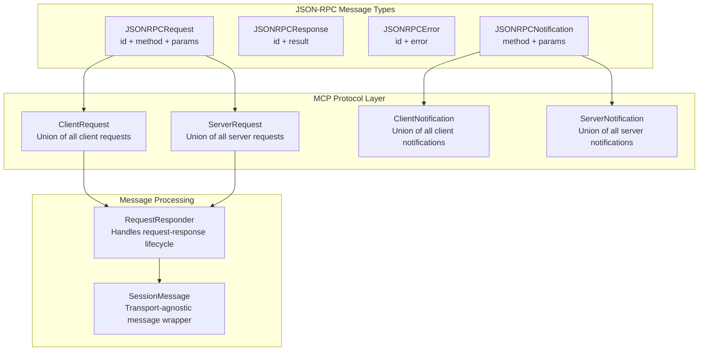
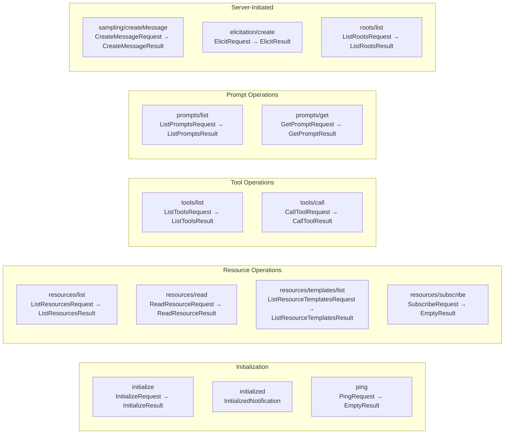
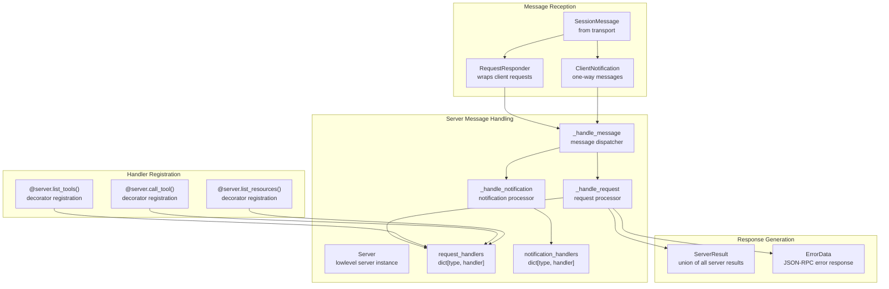
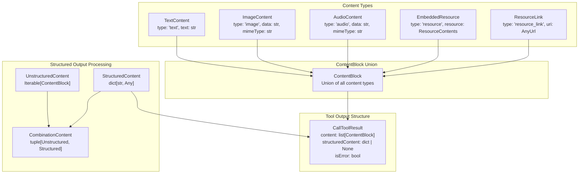
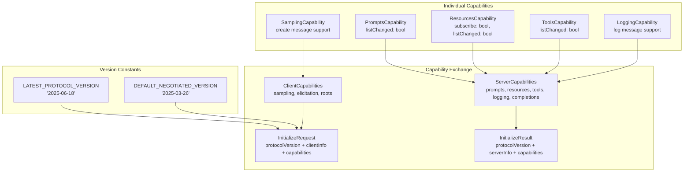
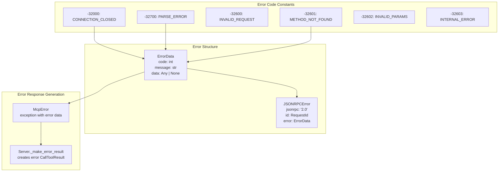

async with httpx.AsyncClient(auth=auth_provider) as client:
    response = await client.get("https://api.example.com/v1/mcp/tools/list")
```

### Transport Integration

The authentication provider integrates seamlessly with all MCP transports:

- **StreamableHTTP**: Built-in OAuth support via `httpx.AsyncClient`
- **SSE**: Authentication headers added to SSE connections  
- **WebSocket**: OAuth tokens passed in connection headers
- **stdio**: Not applicable (local process communication)

Sources: [examples/clients/simple-auth-client/](), [src/mcp/client/auth.py:485-552]()

# Protocol & Message System


This page documents the core Model Context Protocol (MCP) message system, JSON-RPC foundation, and type system that enables communication between MCP clients and servers. This covers the fundamental protocol layer that underlies all MCP interactions.

For high-level server development using decorators and simplified APIs, see [FastMCP Server Framework](#2). For transport-specific implementations like stdio, SSE, and StreamableHTTP, see [Transport Layer](#5). For client-side message handling, see [Client Framework](#3).

## JSON-RPC Foundation

MCP is built on JSON-RPC 2.0, providing a standardized request-response and notification messaging pattern. The protocol defines four core message types that form the foundation of all MCP communication.



**Sources:** [src/mcp/types.py:124-193](), [src/mcp/shared/message.py]()

The base JSON-RPC types define the message structure:

- `JSONRPCRequest`: Request expecting a response, includes `id`, `method`, and `params`
- `JSONRPCResponse`: Successful response with `id` and `result`
- `JSONRPCError`: Error response with `id` and `error` containing code, message, and optional data
- `JSONRPCNotification`: One-way message with `method` and `params`, no response expected

## Protocol Message Hierarchy

MCP defines a structured hierarchy of message types that inherit from the JSON-RPC foundation, creating type-safe request and response patterns.

```mermaid
graph TB
    subgraph "Base Protocol Types"
        Request["Request[ParamsT, MethodT]<br/>Generic request base"]
        Notification["Notification[ParamsT, MethodT]<br/>Generic notification base"]
        Result["Result<br/>Generic result base"]
        RequestParams["RequestParams<br/>Base for all request parameters"]
        NotificationParams["NotificationParams<br/>Base for all notification parameters"]
    end
    
    subgraph "Specialized Request Types"
        PaginatedRequest["PaginatedRequest<br/>cursor-based pagination"]
        InitializeRequest["InitializeRequest<br/>initialize method"]
        ListToolsRequest["ListToolsRequest<br/>tools/list method"]
        CallToolRequest["CallToolRequest<br/>tools/call method"]
        ReadResourceRequest["ReadResourceRequest<br/>resources/read method"]
    end
    
    subgraph "Specialized Result Types"
        PaginatedResult["PaginatedResult<br/>nextCursor support"]
        InitializeResult["InitializeResult<br/>capabilities exchange"]
        ListToolsResult["ListToolsResult<br/>tools array"]
        CallToolResult["CallToolResult<br/>content + structuredContent"]
        ReadResourceResult["ReadResourceResult<br/>resource contents"]
    end
    
    Request --> InitializeRequest
    Request --> ListToolsRequest
    Request --> CallToolRequest
    Request --> ReadResourceRequest
    
    PaginatedRequest --> ListToolsRequest
    
    Result --> InitializeResult
    Result --> ListToolsResult
    Result --> CallToolResult
    Result --> ReadResourceResult
    
    PaginatedResult --> ListToolsResult
```



**Sources:** [src/mcp/types.py:82-122](), [src/mcp/types.py:335-365](), [src/mcp/types.py:815-922]()

Each protocol operation follows this pattern:
1. **Request class**: Defines the method name and parameter structure
2. **Parameter class**: Strongly-typed parameters extending `RequestParams`
3. **Result class**: Response structure extending `Result`
4. **Specialized handling**: Pagination, metadata, and protocol-specific features

## Core Protocol Operations

MCP defines several categories of protocol operations, each with specific request-response patterns and capabilities.



**Sources:** [src/mcp/types.py:345-365](), [src/mcp/types.py:419-554](), [src/mcp/types.py:815-922](), [src/mcp/types.py:630-802](), [src/mcp/types.py:1061-1081]()

## Message Processing Architecture

The server processes incoming messages through a structured handler system that maps message types to handler functions and manages the request lifecycle.



**Sources:** [src/mcp/server/lowlevel/server.py:625-723](), [src/mcp/server/lowlevel/server.py:152-155](), [src/mcp/server/lowlevel/server.py:238-259]()

The `Server` class maintains handler registries that map message types to handler functions:
- `request_handlers`: Maps request types to async handler functions
- `notification_handlers`: Maps notification types to async handler functions
- Decorator pattern for handler registration (e.g., `@server.list_tools()`)

## Content and Structured Output System

MCP supports both unstructured content and structured data in responses, enabling rich tool outputs and backward compatibility.



**Sources:** [src/mcp/types.py:688-782](), [src/mcp/types.py:914-922](), [src/mcp/server/lowlevel/server.py:100-102]()

The content system supports:
- **Unstructured content**: Human-readable content blocks (text, images, audio, resources)
- **Structured content**: Machine-readable JSON data with optional schema validation
- **Combination output**: Both structured and unstructured content in the same response
- **Schema validation**: Optional `outputSchema` validation for structured content

## Protocol Versioning and Capabilities

MCP uses semantic versioning and capability negotiation to ensure compatibility between clients and servers with different feature sets.



**Sources:** [src/mcp/types.py:26-34](), [src/mcp/types.py:265-332](), [src/mcp/types.py:335-365]()

Capability negotiation enables:
- **Protocol versioning**: Semantic version strings for compatibility checking
- **Feature detection**: Clients and servers declare supported capabilities
- **Graceful degradation**: Optional features can be disabled if not supported
- **Extension points**: Experimental capabilities for new features

## Error Handling and Status Codes

MCP defines standardized error codes and error handling patterns based on JSON-RPC 2.0 specifications.



**Sources:** [src/mcp/types.py:149-179](), [src/mcp/server/lowlevel/server.py:440-447](), [src/mcp/shared/exceptions.py]()

Error handling includes:
- **Standard JSON-RPC codes**: Parse, request, method, and parameter errors
- **MCP-specific codes**: Connection and transport-related errors  
- **Structured error data**: Code, message, and optional additional data
- **Exception mapping**: Python exceptions converted to MCP error responses